iHealth PT9L

Infrared No-Touch Forehead Thermometer

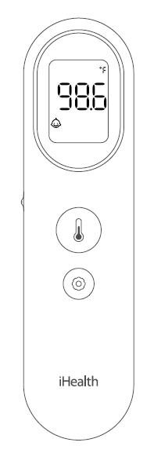

User's Manual

Version 1.0

**iHealth****®**

**Infrared No-Touch Forehead Thermometer (PT9L)**

**USER’S MANUAL**

**Table of Contents**

Introduction	3

Intended use	3

Box contents	4

Safety precautions	4

Overall description	8

Product specifications	11

Expected use and scope of applications	12

Contraindications	12

Setup and operating procedures	12

Product errors and troubleshooting	20

Temperature-taking hints	21

Maintenance	21

Disposal	23

Standard icons	24

Calibration	24

Other standards and compliances	24

Electromagnetic compatibility information	25

Warranty	27

# **Introduction**

Thank you for choosing our product.

This product is a high-tech infra-red (IR) thermometer designed to take human body temperature by measuring the energy of IR emitted from the forehead. The product will help you to assess you and your family members’ health conditions easily and quickly.

Product Name: Infrared No-Touch Forehead Thermometer

Product Model: PT9L

# **Intended use**

The Infrared No-Touch Forehead Thermometer is intended for the intermittent measurement of body temperature from the forehead skin surface on people of all ages. It can be used by consumers in the household environment and by healthcare providers.

# **Box contents**

Use only accessories provided by the original manufacturer, and check for any missing accessories.

<table><tr><td>
1 IR Thermometer
</td><td>
2 AAA Batteries
</td></tr><tr><td>
1 User’s Manual
</td><td></td></tr></table>

# **Safety precautions**

Warning

- Use of this thermometer is not intended as a substitute for consultation with your physician. Please consult your doctor if you have any doubt about the temperature reading.
- Keep the thermometer out of reach of children. For accidental swallowing of the battery or other components, please contact emergency services immediately.
- Batteries must not be thrown into an open fire or short circuited.

Caution

1. Measurements

1. Thermometer readings should be regarded as a reference. Do not attempt self-diagnostics or self-treatment using the temperature readings. Please seek professional medical advice when necessary.
2. There is no absolute standard for human body temperature. Knowing your own normal body temperature range is important to accurately determine if you have a fever.
3. Make sure that the forehead of the subject is free from sweat, cosmetics, dirt, or grease before measuring.
4. After showering, bathing, exercising, and eating, wait for 30 minutes before taking a measurement. Temperature readings taken when a body is in a state of stable equilibrium is more accurate and useful as a reference.

(5) Do not take temperature measurement over scar tissue, open sores or abrasions as such tissues will affect temperature conduction of the body.

(6) If there is a temperature difference between the thermometer storage area and the ambient environment around the subject, please let the thermometer sit within the subject’s ambient environment for 30 minutes before taking the measurement.

(7) Do not measure body temperature immediately after taking a medication that raises body temperature. Temperature readings taken at this time will not be accurate.

(8) It is normal for readings taken from continuous measurements to fluctuate within a small range. During continuous measurements, the subject’s body temperature may be transmitted to the thermometer, affecting measurement accuracy. We recommend taking only up to 3 continuous readings within a short period.

(9) Do not directly face the sun, an air outlet of an air conditioner or radiator device during the measurement as this will cause changes to the forehead temperature. Measurements should be taken in a stable environment where possible.

(10) Do not measure body temperature in an environment with strong electromagnetic (EM) interference (examples include places close to a working microwave, induction cooker, or cellphone in-use) as EM interference may cause errors in the reading or even device failure.

(11) This product should be considered a personal device. Clean and sanitize the product properly to prevent cross contamination. 

(12) If one or more of the following occur, the performance of the thermometer may be adversely affected:

- Operation outside of the manufacturer-specified subject temperature range.
- Operation outside of the manufacturer-specified operating temperature and humidity ranges.
- Storage outside of the manufacturer-specified ambient temperature and humidity ranges.
- Mechanical shock.
- Soiled or damaged infrared optical components.

(13) To clean a dirty thermometer probe, gently swipe the probe using a cotton swab dipped in 70% isopropyl alcohol. Let the cleaned thermometer sit for at least 15 minutes before taking more measurements.

(14) This infrared thermometer meets requirements established in ISO 80601-2-56:2017+A1:2018 and ASTM Standard(E1965-98) except of clause 5.2.2. It displays subject’s temperature over a range of 89.6℉\~109.2℉(32℃\~42.9℃). Full responsibility for the conformance of this product to the standard is assumed.

(15) ASTM laboratory accuracy requirements in the display range of 37 to 39°C (98 to 102°F) for IR thermometers is ±0.2 °C (±0.4°F), whereas for mercury-in-glass and electronic thermometers, the requirement per ASTM Standards E667-86 and E1112-86 is ±0.1 °C (±0.2°F).

(16) Patient is an intended operator.

(17) The probe belongs to the applied part.

(18) It takes 6 hours for the thermometer to warm from the minimum storage temperature between uses until the thermometer is ready for its intended use when the ambient temperature is 20℃.

(19) It takes 6 hours for the thermometer to cool from the maximum storage temperature between uses until the thermometer is ready for its intended use when the ambient temperature is 20℃.

(20)The device is not intended for use in an oxygen-rich environment.

1.  About the product

(1) This product is a precision device. Return the product to its original packaging for proper storage after use. To ensure accurate measurements, avoid the device or probe contacting any liquid or droplets. Avoid tiny particles (such as dust or powder) falling into the probe.

(2) Avoid dropping or subjecting the product to external forces. Do not disassemble or re-assemble the product on your own.

(3) Do not directly touch the probe with your fingers or blow on it. Measurements taken using a damaged or dirty IR probe may be inaccurate.

(4) Keep the product at a place inaccessible to children to prevent children from swallowing the batteries or small parts.

(5) Do not throw the thermometer or batteries into fire to prevent explosions.

(6) Remove the batteries from the thermometer if the device will not be used for more than one month.

(7) If you are allergic to plastic/rubber, please don’t use this device.

(8) The materials (ABS, TPU, PMMA, PC) of expect contact with patient have passed the ISO 10993-5 and ISO 10993-10 standards test, no toxicity, allergy and irritation reaction. Based on the current science and technology, other potential allergic reactions are unknown.

(9) The product shall not be serviced or maintained while in use with a patient.

# **Overall description**

The thermometer is mainly comprised of a plastic casing, IR temperature sensor, MCU, LCD display screen，buzzer and batteries.

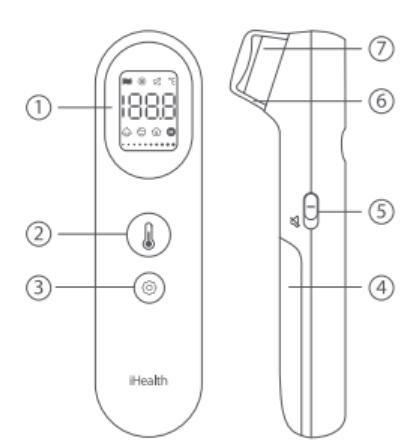

- LCD display
- Measurement button
- Settings button
- Battery cover
- Mute switch
- Protective cap
- Probe

LCD screen instructions

The thermometer is mainly comprised of a plastic 

casing, IR temperature sensor, MCU, LCD display 

screen，buzzer and batteries.

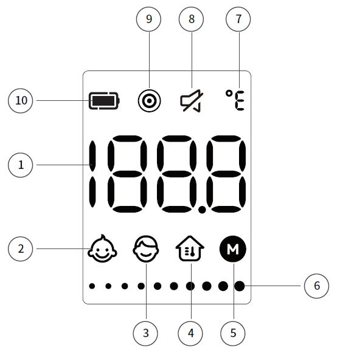

- Temperature display area
- Baby temperature mode symbol
- Adult temperature mode symbol
- Object temperature mode symbol
- Memory symbol
- Progress bar symbol
- Temperature unit symbol
- Mute symbol 
- Dynamic measurement mode symbol
- Battery symbol 

Device dimensions: 5.15 in x 1.37 in x 1.49 in(131 mm x 35 mm x 38 mm)

Screen dimensions: 0.98 in x 0.7 in (25 mm x 18 mm)

Product weight: 79g(include batteries)

# **Product specifications**

1. Measurement position: Centre of the forehead surface

2. Measurement distance: ≤1.18 in (3 cm)

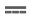

3. Power source: DC 2 x 1.5VSIZE AAA batteries

4. Measurement range: 89.6℉-109.2℉(32℃-42.9℃)

5. Measurement precision: ±0.4℉/0.2℃ within 95℉-107.6℉(35℃-42℃),

and±0.5℉/0.3℃ for other temperature ranges.

6. Resolution: 0.1℉/0.1℃

7. Clinical reproducibility: Within ±0.5℉/0.3℃

8. Operating conditions:

Temperature: 50℉-104℉(10℃-40℃)

Humidity: 15-95%RH, non-condensing

Atmospheric Pressure: 70\~106kPa

9. Transportation and storage conditions

Temperature: -4℉-131℉（-20℃- 55℃）

Humidity: 15-95%RH, non-condensing

Atmospheric Pressure: 70kPa\~106kPa

10. Operation mode: Adjusted mode

11. Expected service life: 5 years

12. Reference Body Site: Oral

13. Software version: V1.0

# **Expected use and scope of applications**

This product mainly uses IR temperature sensing of the forehead to measure human body temperature. It can be used for babies, children, and adults. Babies and children should not operate the thermometer on their own. Body temperature readings for babies and children should be taken by an adult.

Reminder: Temperature readings may differ according to skin tone and measurement distance.

# **Contraindications**

It is not recommended for people whose forehead has local lesions, such as inflammation, trauma, recent surgery, etc.

# **Setup and operating procedures**

The patient is an intended operator. The patient can measure and change battery.

1.  Installing batteries

Insert the 2 batteries included in the package into the battery compartment at the back of the device. The product will perform a self-check then enter the standby mode (if the device indicates low battery power, replace the batteries to ensure ample power supply).

2. Temperature measurement process

1. Remove protective cap

Make sure to remove the protective cap before taking a measurement.

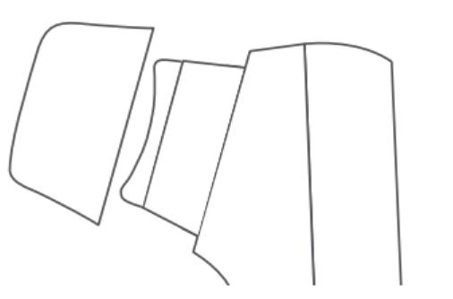

1. Position

A. To measure a body's temperature, aim the thermometer probe at the center of the forehead and keep the probe 1.18 inch away from the forehead (About the same length as the first joint of your index finger). Do not touch the forehead with the probe and the thermometer should be held perpendicular to the forehead and the subject should remain steady.

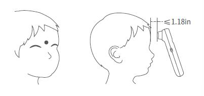

B. To measure an object's temperature, aim the thermometer probe at the object to be measured.  Do not touch the object with the probe.

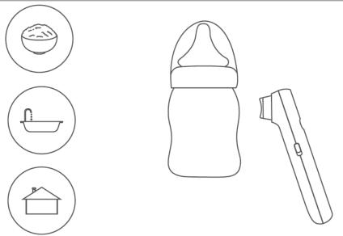

(3) Take temperature

A. Normal measurement mode

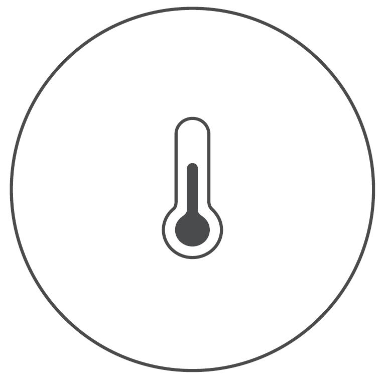

Gently press the measurement button [] to start the measurement. 

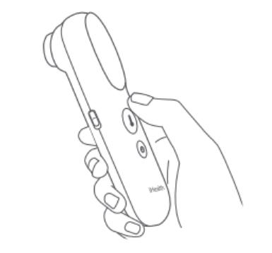

B.Dynamic measurement mode

Press and hold the button for 2 seconds to activate the dynamic measurement mode. This mode takes multiple measurements and processes them to provide accurate temperature readings, particularly useful for moving subjects like infants. A progress bar will be displayed on the screen throughout the measurement process. If you release the button before the process is complete, the result will not be displayed.

<table><tr><td>
Press and hold [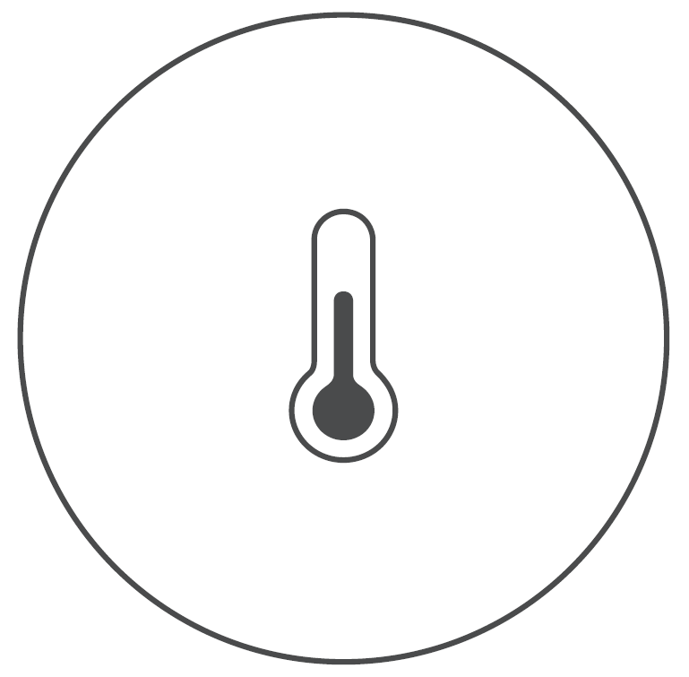]
</td><td>
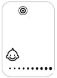
</td></tr><tr><td>
2 seconds later
</td><td>
 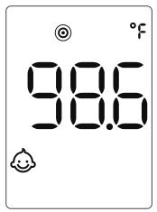
</td></tr></table>

(4) Read temperature

The confirmation beep indicates a temperature measurement has been taken. The result will be shown on the screen.

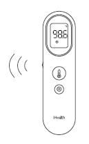

The chart below illustrates how display colors and confirmation beeps vary in response to different temperature results:

Baby temperature mode

<table><tr><td>
Result
</td><td>
89.6℉-100.3℉

(32℃-37.9℃)
</td><td>
100.4℉-109.2℉

(38.0℃-42.9℃)
</td></tr><tr><td>
Display color
</td><td>
White
</td><td>
Red
</td></tr><tr><td>
Confirmation beep
</td><td>
1 long beep
</td><td>
4 short beeps
</td></tr></table>

Adult temperature mode

<table><tr><td>
Result
</td><td>
89.6℉-99.4℉

(32℃-37.4℃)
</td><td>
99.5℉-100.3℉

(37.5℃-37.9℃)
</td><td>
100.4℉-109.2℉

(38.0℃-42.9℃)
</td></tr><tr><td>
Display color
</td><td>
White
</td><td>
Orange
</td><td>
Red
</td></tr><tr><td>
Confirmation beep
</td><td>
1 long beep
</td><td>
4 short beeps
</td><td>
4 short beeps
</td></tr></table>

When a measurement fails, possible reasons for measurement errors include:

- Make sure to remove protective cap before taking a measurement;
- The environment temperature exceeding the operational range of 50℉-104℉(10℃-40℃) or being unstable, causing the screen to display ‘Err’;
- The target temperature being outside the measurement range of 89.6℉-109.2℉(32 ℃-42.9℃), causing the screen to display ‘---', the temperature unit symbol, and the measurement mode symbol;
- Press and hold the measurement button no more than 2 seconds in dynamic measurement mode, causing the screen to display ‘---’, the dynamic measurement mode symbol ‘’, the temperature unit symbol, and the measurement mode symbol.

1. Selecting modes

The default mode is baby temperature mode. To switch between the three modes, please follow the steps below:

(1)  In the measurement state, press the settings button briefly to enter the mode switching state

(2) Press the settings button briefly to cycle through the baby mode, adult mode, and object temperature mode, with corresponding icons displayed on the LCD screen.

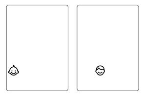

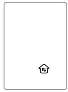

(3) Press the measurement button to save the current settings and initiate a measurement process.

*Note:* The thermometer turns off automatically after 15 seconds of inaction.

1. Switching units

(1) Press and hold the measurement button for 8 seconds to enter the unit switching mode.

(2) The screen flashes the current unit. Press the measurement button to toggle between ℃ and ℉, then selected unit will flash, accompanied by a short beep.

(3) Press and hold the measurement button for 2 seconds to confirm the setting, the current unit ℃ or ℉ will light up for 3 seconds, accompanied by a short beep. And then the thermometer turns off automatically.

*Note:* The thermometer will automatically turn off after 15 seconds of inactivity, and the selected unit will also be saved automatically even if without pressing the measurement button for confirmation.

5. Memory Mode

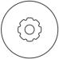

Press and hold the settings button [] for 3 seconds to enter the memory mode, and the memory icon "M" will flash simultaneously. Release and use the settings button to toggle between the different memories, and latest memory will be shown as the first memory. If you want to view more memories of other modes, please choose your desired mode at first. 

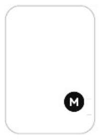

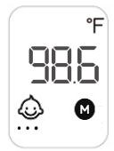

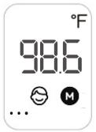

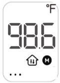

*Note:* The thermometer turns off automatically after 15 seconds of inaction.

1. Memory Deletion Mode

In the power-off state, press and hold the measurement button and the settings button simultaneously for 8 seconds until the icon of “dEL” and “M” flash on screen. After 2 seconds, all memories will be deleted, and only the "dEL" icon shows up on screen. And the thermometer will turn off automatically after 3 seconds.

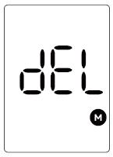

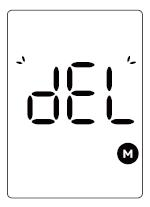

1. Mute setting

Toggle the mute switch on the side of the thermometer to mute or unmute the device.

8. Low battery alert

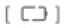

Once switched ON for use, the thermometer will automatically detect remaining battery capacity. If battery capacity is low but adequate for measurements, the low power symbol [] will be displayed with the measurement results. However, if the battery capacity is too low for measurements, the screen will display a flashing [] icon and automatically switch OFF after 15 seconds. To continue using the device, batteries must be replaced.

1. Power off

The thermometer turns off automatically after 15 seconds of inaction.

10. Replacing batteries

(1) Press down the battery cover and slide the cover to open the battery compartment.

(2) Remove the old batteries and install new batteries.

(3) Refer to the battery polarity symbols to orient the batteries properly during installation. Make sure that the new batteries are tightly inserted into the battery compartment and the polarity is not reversed during installation.

(4)  Reinstall the battery cover to close the battery compartment.

- Comply with relevant state and local laws and regulations when disposing of the used batteries.
- For environmental safety, please do not discard batteries in the trash. 
- Remove the batteries if the device will not be used more than one month.
- When using, shall not touch battery and the patient simultaneously.
- Do not throw batteries into fire.
- The typical service life of the new and unused batteries is approximately 1,000 measurements, and the service life may vary among different brands of batteries.

# **Product errors and troubleshooting**

<table><tr><td>
Problem
</td><td>
Possible issues
</td><td>
Solution
</td></tr><tr><td rowspan="2">
 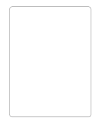
</td><td>
Battery depleted
</td><td>
Replace old batteries with new ones
</td></tr><tr><td>
Batteries have been installed with the wrong polarity

Batteries are not installed properly
</td><td>
Take out the batteries and re-install them correctly
</td></tr><tr><td>
 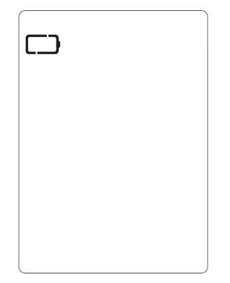
</td><td>
Unable to carry out measurement as current battery capacity is too low.
</td><td>
Replace the batteries
</td></tr><tr><td>
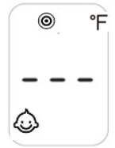

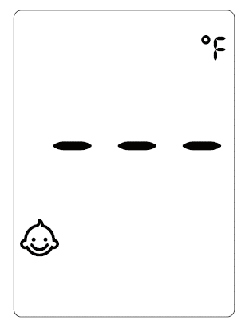
</td><td>
Dynamic measurement failed

Target temperature is outside the range of measurements. 89.6℉-109.2℉(32℃-42.9℃)
</td><td>
Press and hold the measurement button to restart the dynamic measurement until the result displayed on screen, and make sure to remove protective cap before taking a measurement

Follow the User’s Manual and repeat the measurements, and make sure to remove protective cap before taking a measurement
</td></tr><tr><td>
 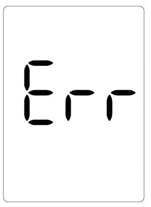
</td><td>
Environment temperature either exceeds the operational range 50℉-104℉(10℃-40℃) or is unstable
</td><td>
Please use the thermometer within the designed ambient temperature range 
</td></tr><tr><td>
 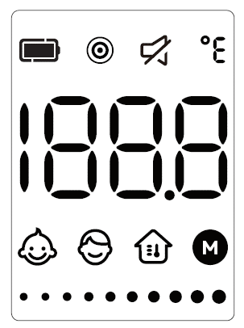
</td><td>
Current state: All. symbols are flashing on the screen. The product is not usable.
</td><td>
Please contact Customer Services.
</td></tr><tr><td>
 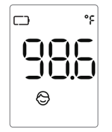
</td><td>
Current battery capacity is too low.
</td><td>
Replace the battery as soon as possible
</td></tr></table>

# **Temperature-taking hints**

- Body temperature varies from person to person and fluctuates during the course of the day. For this reason, it is suggested to know one's normal, healthy forehead temperature to correctly determine the temperature.
- Body temperature runs approximately from 95.9℉ to 99.5℉(35.5℃-37.5℃). To determine if one has a fever, compare the temperature detected with the person's normal temperature. A rise over the reference body temperature of 1℉ or more is generally an indication of a fever.
- Different measurement sites will give different readings. Therefore, it is not advised to compare the measurement taken from different sites.

# **Maintenance**

The thermometer is designed for home use. If there are multiple users, please clean the device in between uses with the following steps: 

- Use an alcohol swab or tissue moistened with alcohol (70% Isopropyl) to clean. the thermometer casing thoroughly, ideally for more than 15 seconds.

② Allow the thermometer to dry for at least 5 minutes before taking a temperature.

- After cleaning, if the device is not visually clean when observed with magnification and adequate lighting, please repeat the clean steps above.

Note 1. The cleaning steps above has been validated according to the FDA Guidance, “Reprocessing Medical Devices in Health Care Settings: Validation Methods and Labeling”.

Note 2: The product is not waterproof. Ensure that no liquid enters the interior of the device. Never use abrasive cleaning agents, thinners or benzene for cleaning and never immerse the device in water or other cleaning liquids.

The probe is the most intricate part of the thermometer, and should be kept clean and intact to acquire accurate readings. Gently clean the surface of the probe using a cotton swab soaked in 70% Isopropyl. If the probe (sensor) is broken, please contact customer services.

iHealth Labs, Inc. has not authorized any agency or individual to carry out product repairs or maintenance. Do not attempt to disassemble or modify the thermometer if you suspect functional issues with the device.

The IR thermometer is an extremely precise instrument. Any improper maintenance, disassembly, or modification may lead to measurement inaccuracies.

Do not put the thermometer under direct sunlight, high temperature, or moist environments. Do not allow it to come into contact with fire or harsh vibrations.

Take out the battery if the device is not used for a month or more.

# **Disposal**

Dispose of batteries in accordance with the regulation applicable at the place of operation. Dispose of batteries at public collection point in the EU countries – 2012/19/EU WEEE Directive.

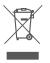

If you have any queries, please refer to the local authorities responsible for waste disposal.

Notes

• Please act according to local laws for disposal of used batteries.

• Take out the batteries if the device will not be used for more than one month. 

To protect the environment, dispose of empty batteries at appropriate collection sites according to national or local regulations.

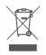

Dispose of batteries at public collection point in the EU countries – REGULATION (EU) 2023/1542 Directive.

# **Standard icons**

 The operation guide must be read (The background color is blue. The graphical sign symbol is white.)

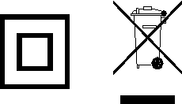

The batteries and electronic instruments must be disposed of in accordance with the locally applicable regulation, not with domestic waste.

	Manufacturer

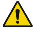

Warning

Batch Code

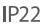

IP code of the device: this device’s grade of against ingress of solid foreign objects -- ≥12.5mm diameter (and the against access to hazardous parts with finger); the grade of waterproof is dripping (15° tilted).

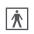

 Type BF Applied Parts  Symbol for “EUROPEAN REPRESENTATIVE”

# **Calibration**

The thermometer is initially calibrated at the time of manufacture. If this thermometer is used according to the use instruction, periodic re-adjustment is not required. If any time your question the accuracy of measurement, please contact customer support of the distributor. The contact information is on the last page of the User’s Manual.

# **Other standards and compliances**

The Infrared No-Touch Forehead Thermometer corresponds to the following standards:  

IEC 60601-1:2005+A1:2012+A2:2020/ EN 60601-1:2006/A2:2021 (Medical electrical equipment - Part 1: General requirements for basic safety and essential performance).

IEC 60601-1-2:2014+A1:2020 (Medical electrical equipment - Part 1-2: General requirements for basic safety and essential performance - Collateral Standard: Electromagnetic disturbances - Requirements and tests).

IEC 60601-1-11:2015+A1:2020(Medical electrical equipment – Part 1-11: General requirements for basic safety and essential performance – Collateral Standard: Requirements for medical electrical equipment and medical electrical systems used in the home healthcare environment).

ISO 80601-2-56:2017+A1:2018/ EN ISO 80601-2-56:2017/A1:2020 (Medical Electrical Equipment -- Part 2-56: Particular Requirements For The Basic Safety And Essential Performance Of clinical thermometers for body temperature measurement).

ASTM E1965-98(2023) (Standard Specification for Infrared Thermometers for Intermittent Determination of Patient Temperature).

# **Electromagnetic compatibility information**

- The essential performance: accuracy of the clinical thermometer
- When electromagnetic interference affects the above performance, please stop using this device.
- Use of this equipment adjacent to or stacked with other equipment should be avoided because it could result in improper operation.If such use is necessary,this equipment and the other equipment should be observed to verify that they are operating normally.
- Use of accessories,transducers and cables other than those specified or provided by the manufacturer of this equipment could result in increased electromagnetic emissions or decreased electromagnetic immunity of this equipment and result in improper operation.
- Portable RF communications equipment (including peripherals such as antenna cables and external antennas)should be used no closer than 30 cm(12 inches)to any part of the PT9L, including cables specified by the manufacturer.Otherwise,degradation of the performance of this equipment could result.

**Table 1 - Emission**

<table><tr><td>
Phenomenon
</td><td>
Compliance
</td><td>
Electromagnetic environment
</td></tr><tr><td>
RF emissions
</td><td>
CISPR 11

Group 1, Class B
</td><td>
The device is intended to be used in home healthcare environment.
</td></tr><tr><td>
Harmonic distortion
</td><td>
IEC 61000-3-2

NA
</td><td>
The device is powered by battery.
</td></tr><tr><td>
Voltage fluctuations and flicker
</td><td>
IEC 61000-3-3

NA
</td><td>
The device is powered by battery.
</td></tr></table>

**Table 2 - Enclosure Port**

<table><tr><td rowspan="2">
Phenomenon
</td><td rowspan="2">
Basic EMC standard
</td><td>
Immunity test levels
</td></tr><tr><td>
Home Healthcare Environment
</td></tr><tr><td>
Electrostatic

Discharge
</td><td>
IEC 61000-4-2
</td><td>
±8 kV contact

±2kV, ±4kV, ±8kV, ±15kV air
</td></tr><tr><td>
Radiated RF EM field
</td><td>
IEC 61000-4-3
</td><td>
10V/m

80MHz-2.7GHz

80% AM at 1kHz
</td></tr><tr><td>
Proximity fields from RF wireless communications equipment
</td><td>
IEC 61000-4-3
</td><td>
Refer to table 3
</td></tr><tr><td>
Rated power frequency magnetic fields 
</td><td>
IEC 61000-4-8
</td><td>
Exempted
</td></tr><tr><td>
Proximity magnetic fields
</td><td>
IEC 61000-4-39
</td><td>
Exempted
</td></tr></table>

**Table 3 –  Proximity fields from RF wireless communications equipment**

<table><tr><td rowspan="2">
Test frequency 

(MHz)
</td><td rowspan="2">
Band

(MHz)
</td><td>
Immunity test levels
</td></tr><tr><td>
Professional healthcare facility environment
</td></tr><tr><td>
385
</td><td>
380-390
</td><td>
Pulse modulation 18Hz, 27V/m
</td></tr><tr><td>
450
</td><td>
430-470
</td><td>
FM, ±5kHz deviation, 1kHz sine, 28V/m
</td></tr><tr><td>
710
</td><td rowspan="3">
704-787
</td><td rowspan="3">
Pulse modulation 217Hz, 9V/m
</td></tr><tr><td>
745
</td></tr><tr><td>
780
</td></tr><tr><td>
810
</td><td rowspan="3">
800-960
</td><td rowspan="3">
Pulse modulation 18Hz, 28V/m
</td></tr><tr><td>
870
</td></tr><tr><td>
930
</td></tr><tr><td>
1720
</td><td rowspan="3">
1700-1990
</td><td rowspan="3">
Pulse modulation 217Hz, 28V/m
</td></tr><tr><td>
1845
</td></tr><tr><td>
1970
</td></tr><tr><td>
2450
</td><td>
2400-2570
</td><td>
Pulse modulation 217Hz, 28V/m
</td></tr><tr><td>
5240
</td><td rowspan="3">
5100-5800
</td><td rowspan="3">
Pulse modulation 217Hz, 9V/m
</td></tr><tr><td>
5500
</td></tr><tr><td>
5785
</td></tr></table>

# **Warranty**

Please contact the distributor in case of a claim under the warranty. If you have to send in the unit, enclose a copy of your receipt with clear statement of defect description.

The warranty terms as below:

1. The warranty period for device is one year from date of delivery. In case of a warranty claim, the date of delivery has to be proven by means of the sales receipt or invoice.

2. Repairs under warranty do not extend the warranty period.

3. The following cases are excluded under the warranty

- All damage which has arisen due to improper treatment, e.g. nonobservance of the user instruction.
- All damage which is due to repairs or tampering by the customer or unauthorized third parties.
- Damage which has arisen during transport from the manufacturer to the consumer or during transport to the service center.
- Accessories which are subject to normal wear and tear.

4. Liability for direct or indirect consequential losses caused by the unit is excluded even if the damage to the unit is accepted as a warranty claim.

5. If you encounter any product issues during the warranty period, please contact customer services for assistance.

Manufacturer for：

USA：

iHealth Labs Inc.

880 W Maude Ave, Sunnyvale, CA 94085, USA

+1-855-816-7705

www.ihealthlabs.com

Europe：

iHealthLabs Europe SAS

[www.ihealthlabs.eu](http://www.ihealthlabs.com)

36 Rue de Ponthieu, 75008, Paris, France

Andon Health Co., LTD.

No. 3 Jinping Street, Yaan Road, Nankai District, Tianjin 300190, China

Tel: 86-22-60526161

Made in China

Date of issue: Mar.11, 2024