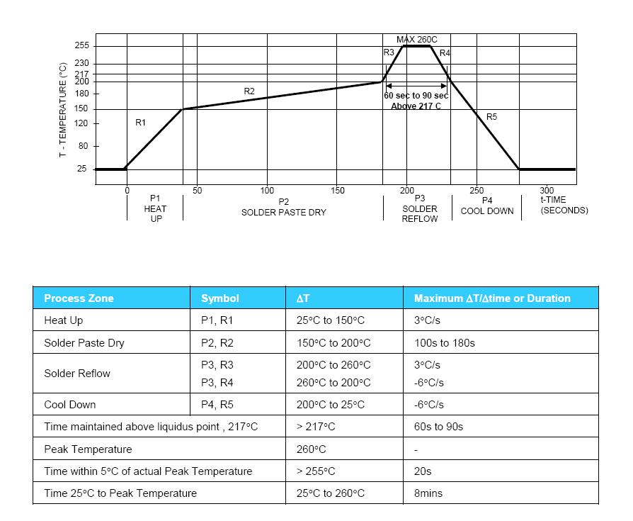

**SMT加工说明--- PT9L V1.0**

**PCB板信息：**

1、PCB：PT9L-HFMP01 V1.0拼板；

       2、尺寸：1拼10；拼板尺寸：179.4mm×128mm；

          板厚：1mm ；喷锡工艺；

**加工说明：** 

1、按无铅工艺加工

2、SMT

 2.1  钢网不开孔：

<table><tr><td>
<strong>序号</strong>
</td><td>
<strong>元 件 位 号</strong>
</td><td>
<strong>说 明</strong>
</td></tr><tr><td>
1
</td><td>
LCD
</td><td>
外接导电条
</td></tr><tr><td>
2
</td><td>
BUZZER
</td><td>
蜂鸣器焊接处
</td></tr><tr><td>
3
</td><td>
BAT
</td><td>
电池簧焊接处
</td></tr></table>

**加工说明：** 依如下温度曲线进行

设 计 <u>&nbsp;&nbsp;&nbsp;&nbsp;&nbsp;&nbsp;&nbsp;&nbsp;&nbsp;&nbsp;&nbsp;&nbsp;&nbsp;&nbsp;&nbsp;&nbsp;&nbsp;&nbsp;&nbsp;</u>日 期  <u>&nbsp;&nbsp;&nbsp;&nbsp;&nbsp;&nbsp;&nbsp;&nbsp;&nbsp;&nbsp;&nbsp;&nbsp;&nbsp;&nbsp;</u>

审 核 <u>&nbsp;&nbsp;&nbsp;&nbsp;&nbsp;&nbsp;&nbsp;&nbsp;&nbsp;&nbsp;&nbsp;&nbsp;&nbsp;&nbsp;&nbsp;&nbsp;&nbsp;&nbsp;&nbsp;</u>日 期  <u>&nbsp;&nbsp;&nbsp;&nbsp;&nbsp;&nbsp;&nbsp;&nbsp;&nbsp;&nbsp;&nbsp;&nbsp;&nbsp;</u>

批 准 <u>&nbsp;&nbsp;&nbsp;&nbsp;&nbsp;&nbsp;&nbsp;&nbsp;&nbsp;&nbsp;&nbsp;&nbsp;&nbsp;&nbsp;&nbsp;&nbsp;&nbsp;&nbsp;&nbsp;</u>日 期  <u>&nbsp;&nbsp;&nbsp;&nbsp;&nbsp;&nbsp;&nbsp;&nbsp;&nbsp;&nbsp;&nbsp;&nbsp;&nbsp;</u>