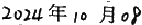
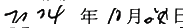
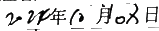
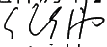
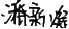

<table>
  <tr>
    <th colspan="16">
andon文件编号：PT9L-P BOM01 V1 . 0      PT9L包装BOM(美版)【组件清单】      章节               版本         拟制(专业工程师) :               审核(项目负责人                    批准(产品线主管):
</th>
  </tr>
  <tr>
    <td colspan="4">
包装类                V1.0      潘新凝
</td>
    <td colspan="3">

</td>
    <td colspan="5">

</td>
    <td colspan="4">

</td>
  </tr>
  <tr>
    <td>
序号
</td>
    <td>
品  名
</td>
    <td>
物料编码
</td>
    <td colspan="2">
材质
</td>
    <td colspan="3">
规格
</td>
    <td colspan="2">
型号
</td>
    <td>
配比
</td>
    <td>
设计名称 (简要说明)
</td>
    <td>
符合 ROHS
</td>
    <td>
重要度 等级
</td>
    <td>
替代型号
</td>
    <td>
备注
</td>
  </tr>
  <tr>
    <td>
1
</td>
    <td>
彩包装
</td>
    <td>
K040200021397620814
</td>
    <td colspan="2">
350g白卡纸 覆哑膜
</td>
    <td colspan="3">
PT9L-CBZP01
</td>
    <td colspan="2">
PT9L
</td>
    <td>
1
</td>
    <td>

</td>
    <td>
√
</td>
    <td>
A
</td>
    <td>

</td>
    <td>

</td>
  </tr>
  <tr>
    <td>
2
</td>
    <td>
纸托
</td>
    <td>
K040500002717620814
</td>
    <td colspan="2">
350g白卡纸 覆哑膜
</td>
    <td colspan="3">
PT9L-F04
</td>
    <td colspan="2">
PT9L
</td>
    <td>
1
</td>
    <td>

</td>
    <td>
√
</td>
    <td>
C
</td>
    <td>

</td>
    <td>

</td>
  </tr>
  <tr>
    <td>
3
</td>
    <td>
说明书
</td>
    <td>
K040700022027620814
</td>
    <td colspan="2">
70g双胶纸
</td>
    <td colspan="3">
PT9L-SMSPO1
</td>
    <td colspan="2">
PT9L
</td>
    <td>
1
</td>
    <td>

</td>
    <td>
√
</td>
    <td>
A
</td>
    <td>

</td>
    <td>

</td>
  </tr>
  <tr>
    <td>
4
</td>
    <td>
保护膜
</td>
    <td>
K030200025221070216
</td>
    <td colspan="2">
PE
</td>
    <td colspan="3">
PT9L-P10
</td>
    <td colspan="2">
PT9L
</td>
    <td>
1
</td>
    <td>

</td>
    <td>
√
</td>
    <td>
C
</td>
    <td>

</td>
    <td>

</td>
  </tr>
  <tr>
    <td>
5
</td>
    <td>
铭牌
</td>
    <td>
K040800025021030093
</td>
    <td colspan="2">
25μ透明PET
</td>
    <td colspan="3">
PT9L-F02
</td>
    <td colspan="2">
PT9L
</td>
    <td>
1
</td>
    <td>

</td>
    <td>
√
</td>
    <td>
B
</td>
    <td>

</td>
    <td>

</td>
  </tr>
  <tr>
    <td>
6
</td>
    <td>
防拆签
</td>
    <td>
T040800073941030093
</td>
    <td colspan="2">
PET
</td>
    <td colspan="3">
PT3-F21
</td>
    <td colspan="2">
PT3
</td>
    <td>
2
</td>
    <td>

</td>
    <td>
√
</td>
    <td>
C
</td>
    <td>

</td>
    <td>

</td>
  </tr>
  <tr>
    <td>
7
</td>
    <td>
标签
</td>
    <td>
K040800025031030093
</td>
    <td colspan="2">
80g白色不干胶铜版纸
</td>
    <td colspan="3">
PT9L-F03
</td>
    <td colspan="2">
PT9L
</td>
    <td>
1
</td>
    <td>
二维码标签
</td>
    <td>
√
</td>
    <td>
C
</td>
    <td>

</td>
    <td>

</td>
  </tr>
  <tr>
    <td>
8
</td>
    <td>
外箱
</td>
    <td>
K040100014357620814
</td>
    <td colspan="2">
190g牛皮面纸+170g(A)楞 +80g芯纸+130g(B)楞+200g牛 皮里纸
</td>
    <td colspan="3">
PT9L-F01
</td>
    <td colspan="2">
PT9L
</td>
    <td>
1960-01-01 00:00:00
</td>
    <td>

</td>
    <td>
√
</td>
    <td>
C
</td>
    <td>

</td>
    <td>

</td>
  </tr>
  <tr>
    <td>
9
</td>
    <td>
标签
</td>
    <td>
K040800021487620814
</td>
    <td colspan="2">
80g不干胶铜版纸
</td>
    <td colspan="3">
PT1-F07
</td>
    <td colspan="2">
PT1
</td>
    <td>
1960-01-01 00:00:00
</td>
    <td>
外箱条码标签
</td>
    <td>
√
</td>
    <td>
C
</td>
    <td>

</td>
    <td>

</td>
  </tr>
  <tr>
    <td>
10
</td>
    <td>
电池
</td>
    <td>
K020400000757680820
</td>
    <td colspan="2">

</td>
    <td colspan="3">
7号碱性 1.5V/1200mAh
</td>
    <td colspan="2">
LR03
</td>
    <td>
2
</td>
    <td>

</td>
    <td>
√
</td>
    <td>
C
</td>
    <td>

</td>
    <td>

</td>
  </tr>
  <tr>
    <td>
11
</td>
    <td>
垫板
</td>
    <td>
K040500002727620814
</td>
    <td colspan="2">
160g牛皮面纸+120g(E)楞 +160g牛皮里纸
</td>
    <td colspan="3">
PT1-F05
</td>
    <td colspan="2">
PT9L
</td>
    <td>
2024-01-30 00:00:00
</td>
    <td>

</td>
    <td>
√
</td>
    <td>
C
</td>
    <td>

</td>
    <td>

</td>
  </tr>
  <tr>
    <td>
12
</td>
    <td>
托盘
</td>
    <td>
K141300000154110371
</td>
    <td colspan="2">
胶合板
</td>
    <td colspan="3">
KD-931D-F01
</td>
    <td colspan="2">
KD-931D
</td>
    <td>
1/4500
</td>
    <td>

</td>
    <td>
√
</td>
    <td>
C
</td>
    <td>

</td>
    <td>

</td>
  </tr>
  <tr>
    <td>

</td>
    <td colspan="13">
修               订          内              容
</td>
    <td>
修订日期
</td>
    <td>
备注
</td>
  </tr>
  <tr>
    <td rowspan="4">
修订摘要
</td>
    <td colspan="13">

</td>
    <td>

</td>
    <td>

</td>
  </tr>
  <tr>
    <td colspan="13">

</td>
    <td>

</td>
    <td>

</td>
  </tr>
  <tr>
    <td colspan="13">

</td>
    <td>

</td>
    <td>

</td>
  </tr>
  <tr>
    <td colspan="13">

</td>
    <td>

</td>
    <td>

</td>
  </tr>
  <tr>
    <td colspan="16">
第1页，共1页
</td>
  </tr>
</table>

