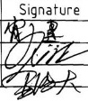

<table><tr><td></td><td></td><td></td><td></td><td></td><td></td><td></td><td></td><td></td><td></td><td rowspan=1 colspan=1>4</td><td rowspan=1 colspan=1>底铺板</td><td rowspan=1 colspan=2>胶合板</td><td rowspan=1 colspan=1></td></tr><tr><td></td><td></td><td></td><td></td><td></td><td></td><td></td><td></td><td></td><td></td><td rowspan=1 colspan=1>3</td><td rowspan=1 colspan=1>垫块</td><td rowspan=1 colspan=2>创花板</td><td rowspan=1 colspan=1></td></tr><tr><td></td><td></td><td></td><td></td><td></td><td></td><td></td><td></td><td></td><td></td><td rowspan=1 colspan=1>2</td><td rowspan=1 colspan=1>纵梁板</td><td rowspan=1 colspan=2>胶合板</td><td rowspan=1 colspan=1></td></tr><tr><td></td><td></td><td></td><td></td><td></td><td></td><td></td><td></td><td></td><td></td><td rowspan=1 colspan=1>1</td><td rowspan=1 colspan=1>顶铺板</td><td rowspan=1 colspan=2>胶合板</td><td rowspan=1 colspan=1></td></tr><tr><td></td><td></td><td></td><td></td><td></td><td></td><td></td><td></td><td></td><td></td><td rowspan=1 colspan=1>序号</td><td rowspan=1 colspan=1>构件名称</td><td rowspan=1 colspan=2>材料</td><td rowspan=1 colspan=1>备注</td></tr><tr><td rowspan=1 colspan=1>3</td><td rowspan=1 colspan=1></td><td rowspan=1 colspan=1></td><td rowspan=1 colspan=1></td><td rowspan=1 colspan=1>Siqnature</td><td rowspan=1 colspan=1>Date</td><td rowspan=1 colspan=2>Tolerance</td><td rowspan=1 colspan=1>Pro material</td><td rowspan=1 colspan=2></td><td rowspan=1 colspan=2>Model NO.</td><td rowspan=1 colspan=2>KD-931D</td></tr><tr><td rowspan=1 colspan=1>2</td><td rowspan=1 colspan=1></td><td rowspan=1 colspan=1></td><td rowspan=1 colspan=1>Design</td><td rowspan=1 colspan=1></td><td rowspan=1 colspan=1>2010.7.5</td><td rowspan=1 colspan=1>.X</td><td rowspan=1 colspan=1></td><td rowspan=1 colspan=1>Surf dispose</td><td rowspan=1 colspan=2></td><td rowspan=1 colspan=2>Part name</td><td rowspan=1 colspan=2>托盘</td></tr><tr><td rowspan=1 colspan=1>1</td><td rowspan=1 colspan=1></td><td rowspan=1 colspan=1></td><td rowspan=1 colspan=1>Checkup</td><td rowspan=1 colspan=1></td><td rowspan=1 colspan=1>f0.2.5</td><td rowspan=1 colspan=1>.××</td><td rowspan=1 colspan=1></td><td rowspan=1 colspan=1>Scale</td><td rowspan=1 colspan=2>1:20</td><td rowspan=1 colspan=2>Drawing NO.</td><td rowspan=1 colspan=2>KD-931D-F01</td></tr><tr><td rowspan=1 colspan=1>No.</td><td rowspan=1 colspan=1>更改记录</td><td rowspan=1 colspan=1>更改时间</td><td rowspan=1 colspan=1>Approve</td><td rowspan=1 colspan=1></td><td rowspan=1 colspan=1>2.5</td><td rowspan=1 colspan=1>x°$</td><td rowspan=1 colspan=1></td><td rowspan=1 colspan=1>Units</td><td rowspan=1 colspan=2>mm</td><td rowspan=1 colspan=2></td><td rowspan=1 colspan=1>Edition</td><td rowspan=1 colspan=1>V1.0</td></tr></table>