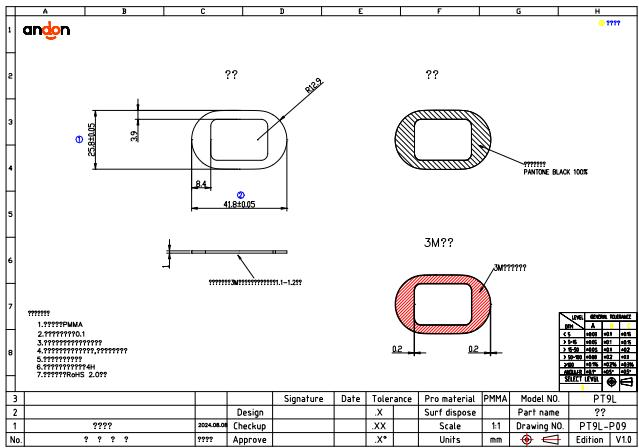
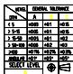
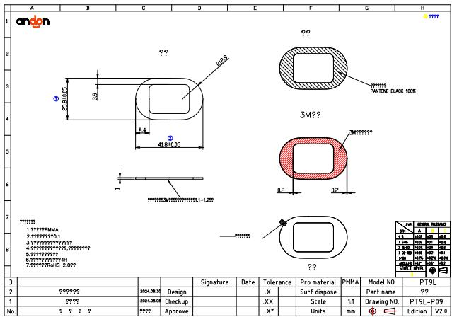

<table><tr><td></td><td></td><td></td><td></td><td></td><td></td><td></td><td></td><td></td><td></td><td></td><td></td><td></td></tr><tr><td>3</td><td></td><td></td><td></td><td>Signature</td><td>Date</td><td></td><td>Tolerance</td><td>Pro material</td><td>PMMA</td><td>Model NO.</td><td></td><td>PT9L</td></tr><tr><td>2</td><td></td><td></td><td>Design</td><td></td><td></td><td>.X</td><td></td><td>Surf dispose</td><td></td><td>Part name</td><td></td><td>??</td></tr><tr><td>1</td><td>????</td><td>2024.08.08</td><td>Checkup</td><td></td><td></td><td>.XX</td><td></td><td>Scale</td><td>11</td><td>Drawing NO.</td><td></td><td>PT9L-P09</td></tr><tr><td>No.</td><td>????</td><td>???</td><td>Approve</td><td></td><td></td><td>.X*</td><td></td><td>Units</td><td>mm</td><td>中</td><td>1 Edition</td><td>V1.0</td></tr></table>

