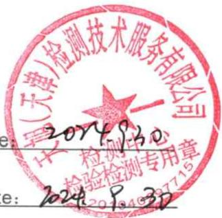
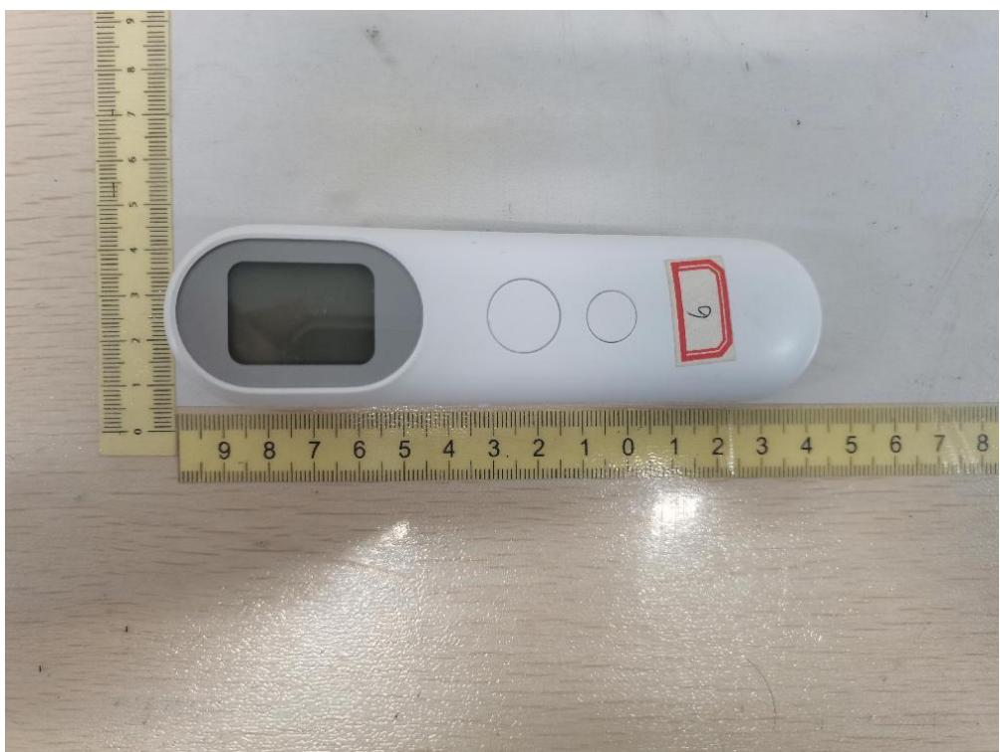
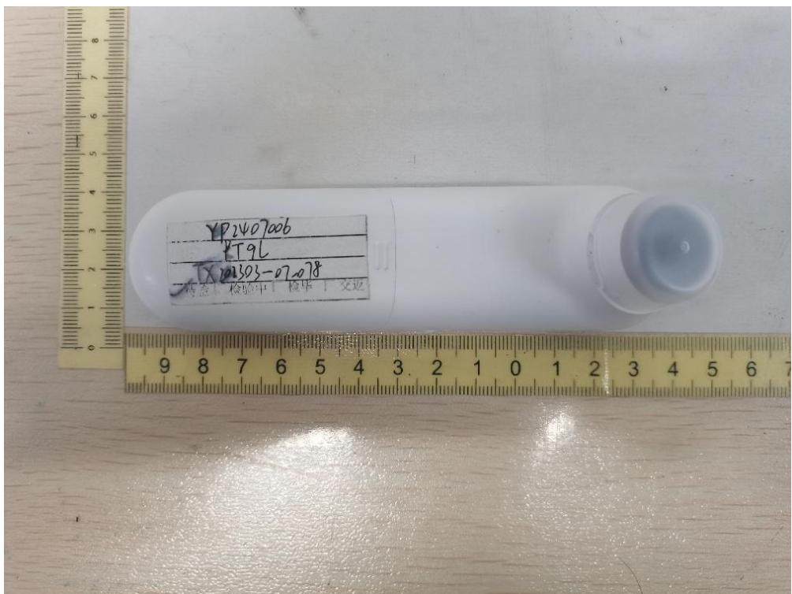
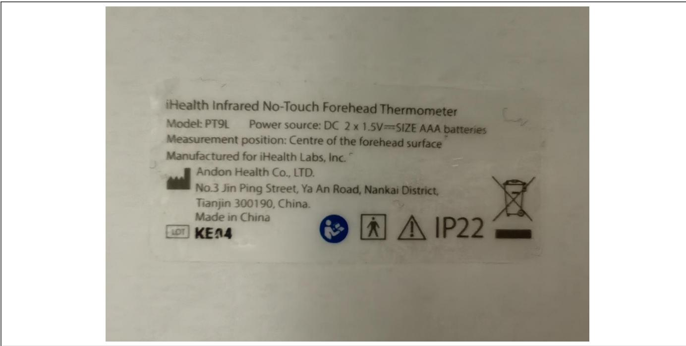

<table><tr><td rowspan=1 colspan=2>TEST REPORTISO80601-2-56Medical electrical equipmentPart2-56: Particular requirements for basic safety and essential performance of clinicalthermometers for body temperature measurement</td></tr><tr><td rowspan=1 colspan=1>Date ofiss</td><td rowspan=1 colspan=1>2024-09-30</td></tr><tr><td rowspan=1 colspan=1>Standard..</td><td rowspan=1 colspan=1>ENISO80601-2-56:2017/A1:2020/ISO 80601-2-56:2017+A1:2018</td></tr><tr><td rowspan=1 colspan=1>Procedure deviation..</td><td rowspan=1 colspan=1>N/A</td></tr><tr><td rowspan=1 colspan=1>Non-standard test method...</td><td rowspan=1 colspan=1>N/A</td></tr><tr><td rowspan=1 colspan=1>Type of test object.</td><td rowspan=1 colspan=1>Infrared No-Touch Forehead Thermometer</td></tr><tr><td rowspan=1 colspan=1>Trademark..</td><td rowspan=1 colspan=1>N/A</td></tr><tr><td rowspan=1 colspan=1>Model/type reference.</td><td rowspan=1 colspan=1>PT9L</td></tr><tr><td rowspan=1 colspan=1>Report No</td><td rowspan=1 colspan=1>ETX202303-07-078-03</td></tr><tr><td rowspan=1 colspan=1>Testing period.</td><td rowspan=1 colspan=1>2024.07.09-2024.09.07</td></tr><tr><td rowspan=1 colspan=1>Manufacturer..</td><td rowspan=1 colspan=1>ANDONHEALTHCO., LTD.</td></tr><tr><td rowspan=1 colspan=1>Address.</td><td rowspan=1 colspan=1>No.3 JinPing Street, YaAn Road, Nankai District, Tianjin, China</td></tr><tr><td rowspan=1 colspan=1>Test laboratory.Address...</td><td rowspan=1 colspan=1>Tianxu(Tianjin)Testing Technology Service Co.,LTD101, First floor, Building L,No.3 JinPing Street,Ya An Road,Nankai District,Tianjin,China</td></tr></table>

Date

  
天旭（天津）检测技术服务有限公司

<table><tr><td colspan="2">GENERAL INFORMATION</td></tr><tr><td colspan="2">Test item particulars (see also Clause 6):</td></tr><tr><td>Classification of installation and use Device type (component/sub-assembly/ equipment/</td><td>Hand-held ME equipment</td></tr><tr><td>system) …</td><td>Equipment</td></tr><tr><td> Intended use (Including type of patient, application</td><td>The Infrared No-Touch Forehead</td></tr><tr><td>location)..</td><td>Thermometer is intended for the</td></tr><tr><td></td><td>intermittent measurement of body</td></tr><tr><td></td><td>temperature from the forehead skin</td></tr><tr><td></td><td>surface on people of all ages. It can be</td></tr><tr><td></td><td>used by consumers in the household</td></tr><tr><td></td><td>environment and by healthcare</td></tr><tr><td></td><td>providers.</td></tr><tr><td></td><td></td></tr><tr><td>Mode of operation . Supply connection .</td><td>Continuous</td></tr><tr><td>Accessories and detachable parts included</td><td>internally powered</td></tr><tr><td>Other options include .</td><td>N/A NIA</td></tr><tr><td>Possible test case verdicts:</td><td></td></tr><tr><td>- test case does not apply to the test object</td><td>NIA</td></tr><tr><td>- test object does meet the requirement .</td><td>Pass (P)</td></tr><tr><td>- test object was not evaluated for the requirement..</td><td>NE</td></tr><tr><td colspan="2">Abbreviations used in the report:</td></tr><tr><td colspan="2">General remarks:</td></tr><tr><td colspan="2">&quot;(see Attachment #)&quot; refers to additional information appended to the report.</td></tr><tr><td colspan="2">&quot;(see appended table)&quot; refers to a table appended to the report.</td></tr><tr><td colspan="2">The tests results presented in this report relate only to the object tested.</td></tr><tr><td colspan="2">This report shall not be reproduced except in full without the written approval of the testing laboratory.</td></tr><tr><td colspan="2">List of test equipment must be kept on file and available for review.</td></tr><tr><td colspan="2">This Test Report Form is intended for the investigation of clinical thermometers for body temperature</td></tr><tr><td colspan="2">measurement in accordance with EN ISO 80601-2-56:2017/A1:2020/SO 80601-2-56:2017+A1:2018. It can</td></tr><tr><td colspan="2">only be used together with IEC 60601-1:2005.</td></tr><tr><td colspan="2">Additional test data and/or information provided in the attachments to this report.</td></tr><tr><td colspan="2">Throughout this report a comma/ ć point is used as the decimal separator.</td></tr></table>

## General product information:

The Infrared No-Touch Forehead Thermometer is intended for the intermittent measurement of body temperature from the forehead skin surface on people of all ages. It can be used by consumers in the household environment and by healthcare providers.

## Tests performed (name of test and test clause):

All the requirements of EN ISO 80601-2-56:2017/A1:2020/ISO 80601-2-56:2017+A1:2018 were evaluated

in this test report except the following clauses:

\- 201.11.7 Biocompatibility of ME EQUIPMENT and ME is not evaluated in this report.

\- 201.17 Electromagnetic compatibility of ME EQUIPMENT and ME SYSTEMS is not evaluated in this report.

\- 201.102 CLINICAL ACCURACY VALIDATION is not evaluated in this report.

\- 202 Electromagnetic disturbances - Requirements and tests is not evaluated in this report.

\- 206 Usability is not evaluated in this report.

## Test result:

The test item passed the test specification(s). All apply to the test object does meet the requirement.

## General disclaimer：

The test results presented in this report relate only to the object tested.

Without permission of the Report department this test report is not permitted to be duplicated in extracts.

## Condition of acceptability:

1) 201.11.7 Biocompatibility of ME EQUIPMENT and ME is not evaluated in this report.

2) 201.17 Electromagnetic compatibility of ME EQUIPMENT and ME SYSTEMS is not evaluated in this report.

3) 201.102 CLINICAL ACCURACY VALIDATION is not evaluated in this report.

4) 202 Electromagnetic disturbances - Requirements and tests is not evaluated in this report.

5) 206 Usability is not evaluated in this report.

## Copy of marking plate

The artwork below may be only a draft. The use of certification marks on a product must be authorized by the respective NCBs that own these marks.

iHealth Infrared No-Touch Forehead Thermometer Measurement position:Centre of the forehead surface KE04

<table><tr><td colspan="4" rowspan="1">EN ISO 80601-2-56:2017/A1:2020/ISO 80601-2-56:2017+A1:2018</td></tr><tr><td colspan="1" rowspan="1">Clause</td><td colspan="1" rowspan="1">Requirement + Test</td><td colspan="1" rowspan="1">Result - Remark</td><td colspan="1" rowspan="1">Verdict</td></tr><tr><td></td><td></td><td></td><td></td></tr><tr><td colspan="1" rowspan="1">201.4</td><td colspan="2" rowspan="1">GENERAL REQUIREMENTS</td><td colspan="1" rowspan="1">P</td></tr><tr><td colspan="1" rowspan="1">201.4.2</td><td colspan="1" rowspan="1">RISK MANAGEMENT PROCESS for MEEQUIPMENT or ME SYSTEMS</td><td colspan="1" rowspan="1"></td><td colspan="1" rowspan="1">P</td></tr><tr><td colspan="1" rowspan="1">201.4.2.101</td><td colspan="2" rowspan="1">Additional requirements for RISK MANAGEMENT PROCESS for ME EQUIPMENT orME SYSTEMS</td><td colspan="1" rowspan="1">P</td></tr><tr><td colspan="1" rowspan="1"></td><td colspan="1" rowspan="1">The RisKS of changing environmental conditionsfor the CLINICAL THERMOMETER are considered inRISK MANAGEMENT PROCESS</td><td colspan="1" rowspan="1">See RISK MANAGEMENTPROCESS PROVIDED BY thelmanufacture</td><td colspan="1" rowspan="1">P</td></tr><tr><td colspan="1" rowspan="1"></td><td colspan="1" rowspan="1">Guidance regarding the RESIDUAL RISKS isprovided in the instruction for use</td><td colspan="1" rowspan="1">Refer to Operation Guide.</td><td colspan="1" rowspan="1">P</td></tr><tr><td colspan="1" rowspan="1">201.4.3</td><td colspan="2" rowspan="1">ESSENTIAL PERFORMANCE</td><td colspan="1" rowspan="1">P</td></tr><tr><td colspan="1" rowspan="1">201.4.3.101</td><td colspan="1" rowspan="1">Additional requirements for ESSENTIALPERFORMANCE</td><td colspan="1" rowspan="1"></td><td colspan="1" rowspan="1">P</td></tr><tr><td colspan="1" rowspan="1"></td><td colspan="1" rowspan="1">At least one of the following functions is identifiedas ESSENTIAL PERFORMANCE in RISKMANAGEMENT FILE:</td><td colspan="1" rowspan="1">See RISK MANAGEMENTFILE</td><td colspan="1" rowspan="1">P</td></tr><tr><td colspan="1" rowspan="1"></td><td colspan="1" rowspan="1"> accuracy of the CLINICAL THERMOMETER ,</td><td colspan="1" rowspan="1"></td><td colspan="1" rowspan="1">P</td></tr><tr><td colspan="1" rowspan="1"></td><td colspan="1" rowspan="1">- generation of a TECHNICAL ALARM CONDITION,</td><td colspan="1" rowspan="1"></td><td colspan="1" rowspan="1">P</td></tr><tr><td colspan="1" rowspan="1"></td><td colspan="1" rowspan="1">- not providing an OUTPUT TEMPERATURE, or</td><td colspan="1" rowspan="1"></td><td colspan="1" rowspan="1">P</td></tr><tr><td colspan="1" rowspan="1">201.5</td><td colspan="1" rowspan="1">General requirements for testing of ME EQUlPMENT</td><td colspan="1" rowspan="1"></td><td colspan="1" rowspan="1">N/A</td></tr><tr><td colspan="1" rowspan="1"></td><td colspan="1" rowspan="1">IEC 60601-1:2005, Clause 5 applies.</td><td colspan="1" rowspan="1"></td><td colspan="1" rowspan="1">NA</td></tr><tr><td colspan="1" rowspan="1">201.6</td><td colspan="1" rowspan="1">Classification of ME EQUIPMENT and ME SYSTEMS</td><td colspan="1" rowspan="1"></td><td colspan="1" rowspan="1">NA</td></tr><tr><td colspan="1" rowspan="1"></td><td colspan="1" rowspan="1">IEC 60601-1:2005, Clause 6 applies</td><td colspan="1" rowspan="1"></td><td colspan="1" rowspan="1">N/A</td></tr><tr><td colspan="1" rowspan="1">201.7</td><td colspan="2" rowspan="1">ME EQUIPMENT IDENTIFICATION, MARKING AND DOCUMENTS</td><td colspan="1" rowspan="1">P</td></tr><tr><td colspan="1" rowspan="1"></td><td colspan="2" rowspan="1">IEC 60601-1:2005+A1:2012, Clause 7 applies, except as follows:</td><td colspan="1" rowspan="1">P</td></tr><tr><td colspan="1" rowspan="1">201.7.2.1</td><td colspan="2" rowspan="1">Minimum requirements for marking on ME EQUIPMENT and interchangeable parts</td><td colspan="1" rowspan="1">P</td></tr><tr><td colspan="1" rowspan="1">1</td><td colspan="2" rowspan="1">201.7.2.1.10| Additional requirements for minimum requirements for marking on ME EQUIPMENTand interchangeable parts, marking of the packaging</td><td colspan="1" rowspan="1">P</td></tr><tr><td colspan="1" rowspan="1"></td><td colspan="1" rowspan="1">The packaging of the CLINICAL THERMOMETERand PROBE is marked as following:</td><td colspan="1" rowspan="1"></td><td colspan="1" rowspan="1">P</td></tr><tr><td colspan="1" rowspan="1"></td><td colspan="1" rowspan="1">a) MEASURING SITE and REFERENCE BODYSITE</td><td colspan="1" rowspan="1"></td><td colspan="1" rowspan="1">N/A</td></tr><tr><td colspan="1" rowspan="1"></td><td colspan="1" rowspan="1">b) mode of operation of the CLINICALTHERMOMETER ; and</td><td colspan="1" rowspan="1"></td><td colspan="1" rowspan="1">P</td></tr><tr><td colspan="1" rowspan="1"></td><td colspan="1" rowspan="1">— the contents of the packaging</td><td colspan="1" rowspan="1"></td><td colspan="1" rowspan="1">P</td></tr><tr><td colspan="1" rowspan="1"></td><td colspan="1" rowspan="1">c) appropriate symbol from IS0 15223-1:2016 usedfor sterile packaging (See Table 201.D.2.101, symbols3-8)..</td><td colspan="1" rowspan="1"></td><td colspan="1" rowspan="1">P</td></tr><tr><td colspan="1" rowspan="1"></td><td colspan="1" rowspan="1">d) Symbol 5.1.4 of ISO 15233-1:2016 used forCLINICAL THERMOMETER or PROBE withexpiration date (see Table 201.D.2.101, symbol 2) .</td><td colspan="1" rowspan="1"></td><td colspan="1" rowspan="1">P</td></tr><tr><td colspan="1" rowspan="1"></td><td colspan="1" rowspan="1">e) Packaging marked with special storage and/orhandling instructions.</td><td colspan="1" rowspan="1"></td><td colspan="1" rowspan="1">P</td></tr><tr><td colspan="1" rowspan="1"></td><td colspan="1" rowspan="1">For a specific MODEL OR TYPE REFERENCE, theindication of single use shall be consistent.</td><td colspan="1" rowspan="1">No single use:</td><td colspan="1" rowspan="1">P</td></tr><tr><td colspan="1" rowspan="1">201.7.2.2</td><td colspan="2" rowspan="1">Marking on the outside of ME EQUIPMENT or ME EQUIPMENT parts</td><td colspan="1" rowspan="1">P</td></tr><tr><td colspan="1" rowspan="1">201.7.2.101</td><td colspan="2" rowspan="1">Additional requirements for marking on the outside of ME EQUIPMENT or MEEQUIPMENT parts</td><td colspan="1" rowspan="1">P</td></tr><tr><td colspan="1" rowspan="1"></td><td colspan="1" rowspan="1">The following markings provided on the CLINICALTHERMOMETER are CLEARLY LEGIBLE:</td><td colspan="1" rowspan="1">See Copy of marking plate</td><td colspan="1" rowspan="1">P</td></tr><tr><td colspan="1" rowspan="1"></td><td colspan="1" rowspan="1">a) symbol “C" or “"F" marked adjacent to theOUTPUT TEMPERATURE or indicated at thedisplay :</td><td colspan="1" rowspan="1">Indicated at the display</td><td colspan="1" rowspan="1">P</td></tr><tr><td colspan="1" rowspan="1"></td><td colspan="1" rowspan="1">—if switching between units is possible, therespective displayed unit is indicated</td><td colspan="1" rowspan="1"></td><td colspan="1" rowspan="1">P</td></tr><tr><td colspan="1" rowspan="1"></td><td colspan="1" rowspan="1">b) the intended MEASURING SITE is marked</td><td colspan="1" rowspan="1">See Copy of marking plate</td><td colspan="1" rowspan="1">NA</td></tr><tr><td colspan="1" rowspan="1"></td><td colspan="1" rowspan="1">c) if necessary to maintain ESSENTIALPERFORMANCE, it is indicated to use a newPROBE</td><td colspan="1" rowspan="1"></td><td colspan="1" rowspan="1">N/A</td></tr><tr><td colspan="1" rowspan="1">201.7.4.3</td><td colspan="2" rowspan="1">Unit of measure</td><td colspan="1" rowspan="1"></td></tr><tr><td colspan="1" rowspan="1">1</td><td colspan="2" rowspan="1">201.7.4.3.10| Additional requirements for unit of measure</td><td colspan="1" rowspan="1">P</td></tr><tr><td colspan="1" rowspan="1"></td><td colspan="1" rowspan="1">OUTPUT TEMPERATURE expressed in degreesCelsius. C or dearees Fahrenheit. °F</td><td colspan="1" rowspan="1">Expressed optionally in *C or °F</td><td colspan="1" rowspan="1">P</td></tr><tr><td colspan="1" rowspan="1"></td><td colspan="1" rowspan="1">Unit of measure clearly indicated.</td><td colspan="1" rowspan="1"></td><td colspan="1" rowspan="1">P</td></tr><tr><td colspan="1" rowspan="1">201.7.9</td><td colspan="1" rowspan="1">ACCOMPANYING DOCUMENT</td><td colspan="1" rowspan="1"></td><td colspan="1" rowspan="1">P</td></tr><tr><td colspan="1" rowspan="1"></td><td colspan="1" rowspan="1">— the ACCOMPANYING DOCUMENT containsname or trade name and address of--the MANUFACTURER, and--where the manufacturer does not have anaddress within the locale, an authorizedrepresentative within the locale,to which the RESPONSIBLE ORGANIZATIONcan refer .</td><td colspan="1" rowspan="1">See chapter "Warranty" of usermanual</td><td colspan="1" rowspan="1">P</td></tr><tr><td colspan="1" rowspan="1">201.7.9.2</td><td colspan="2" rowspan="1">Additional requirements for instructions for use</td><td colspan="1" rowspan="1"></td></tr><tr><td colspan="1" rowspan="1">1</td><td colspan="2" rowspan="1">201.7.9.2.10 Instructions for use</td><td colspan="1" rowspan="1"></td></tr><tr><td colspan="1" rowspan="1"></td><td colspan="1" rowspan="1">a) a summary of the USE SPECIFICATION asdetermined for IEC 62366-1:2015;</td><td colspan="1" rowspan="1"></td><td colspan="1" rowspan="1">P</td></tr><tr><td colspan="1" rowspan="1"></td><td colspan="1" rowspan="1">b) MEASURING SITE and REFERENCE BODY ofCLINICAL THERMOMETER specified</td><td colspan="1" rowspan="1">See chapter "Intended use" ofuser manual</td><td colspan="1" rowspan="1">P</td></tr><tr><td colspan="1" rowspan="1"></td><td colspan="1" rowspan="1">c) recommended minimum measuring time andminimum time between measurements for eachintended MEASURING SITE, ifapplicable</td><td colspan="1" rowspan="1"></td><td colspan="1" rowspan="1">P</td></tr><tr><td colspan="1" rowspan="1"></td><td colspan="1" rowspan="1">d) RATED OUTPUT RANGE for each intendedREFERENCE BODY SITEspecified .</td><td colspan="1" rowspan="1">See chapter "SafetyPrecaution" ofuser manual</td><td colspan="1" rowspan="1">P</td></tr><tr><td colspan="1" rowspan="1"></td><td colspan="1" rowspan="1">e) the LABORATORY ACCURACY in the RATEDOUTPUT RANGE and, if equipped, theLABORATORY</td><td colspan="1" rowspan="1">See chapter "Productperformance" ofuser manual</td><td colspan="1" rowspan="1">P</td></tr><tr><td colspan="1" rowspan="1"></td><td colspan="1" rowspan="1">f) for CLINICAL THERMOMETERS for use withPROBE COVER:</td><td colspan="1" rowspan="1">No PROBE COVER used</td><td colspan="1" rowspan="1">P</td></tr><tr><td colspan="1" rowspan="1"></td><td colspan="1" rowspan="1">1) instruction how to apply PROBE COVER</td><td colspan="1" rowspan="1"></td><td colspan="1" rowspan="1">P</td></tr><tr><td colspan="1" rowspan="1"></td><td colspan="1" rowspan="1">2) information about the behaviour of the CLINICALTHERMOMETER when used without PROBECOVER</td><td colspan="1" rowspan="1"></td><td colspan="1" rowspan="1">P</td></tr><tr><td colspan="1" rowspan="1"></td><td colspan="1" rowspan="1">g) mode of operation of the CLINICALTHERMOMETER (DIRECT MODE or ADJUSTEDMODE).</td><td colspan="1" rowspan="1">See chapter "Productspecifications" of user manual</td><td colspan="1" rowspan="1">P</td></tr><tr><td colspan="1" rowspan="1"></td><td colspan="1" rowspan="1">h) instructions for selection and replacement ofINTERNAL ELECTRICAL POWER SOURCES, ifapplicable</td><td colspan="1" rowspan="1">See chapter "Setup andoperating procedures" inuser manual</td><td colspan="1" rowspan="1">P</td></tr><tr><td colspan="1" rowspan="1"></td><td colspan="1" rowspan="1">i) Instructions provided on nature of maintenanceand/or calibration needed to ensure proper functionand its frequency</td><td colspan="1" rowspan="1"></td><td colspan="1" rowspan="1">P</td></tr><tr><td colspan="1" rowspan="1"></td><td colspan="1" rowspan="1">j) information about disposal of the clinicalthermometer and its components .</td><td colspan="1" rowspan="1">See chapter“Maintenance"in user manual</td><td colspan="1" rowspan="1">P</td></tr><tr><td colspan="1" rowspan="1"></td><td colspan="1" rowspan="1">k) if the CLINICAL THERMOMETER and/or itscomponents are intended for single use only,information on characteristics and technical factorsthat could pose a RIsK is provided in instructionsfor use</td><td colspan="1" rowspan="1"></td><td colspan="1" rowspan="1">N/A</td></tr><tr><td colspan="1" rowspan="1">201.7.9.101</td><td colspan="1" rowspan="1">The ACCOMPANYING DOCUMENT includes adescription of the correction method to deriveunadjusted temperatures from OUTPUTTEMPERATURE measured in the ADJUSTEDMODE, except when the CLINICALTHERMOMETER is equipped with a TEST MODEor DIRECT MODE</td><td colspan="1" rowspan="1"></td><td colspan="1" rowspan="1">P</td></tr><tr><td colspan="1" rowspan="1">201.8</td><td colspan="2" rowspan="1">Protection against electrical HAZARDS from ME EQUIPMENT</td><td colspan="1" rowspan="1">P</td></tr><tr><td colspan="1" rowspan="1"></td><td colspan="1" rowspan="1">IEC 60601-1:2005+A1:2012, Clause 8 applies</td><td colspan="1" rowspan="1"></td><td colspan="1" rowspan="1">P</td></tr><tr><td colspan="1" rowspan="1">201.9</td><td colspan="2" rowspan="1">Protection against mechanical HAZARDS of ME EQUIPMENT and ME SYSTEMS</td><td colspan="1" rowspan="1">P</td></tr><tr><td colspan="1" rowspan="1"></td><td colspan="1" rowspan="1">IEC 60601-1:2005+A1:2012, Clause 9 applies</td><td colspan="1" rowspan="1"></td><td colspan="1" rowspan="1">P</td></tr><tr><td colspan="1" rowspan="1">201.10</td><td colspan="2" rowspan="1">Protection against unwanted and excessive radiation HAZARDS</td><td colspan="1" rowspan="1">NA</td></tr><tr><td colspan="1" rowspan="1"></td><td colspan="1" rowspan="1">IEC 60601-1:2005+A1:2012, Clause 10 applies</td><td colspan="1" rowspan="1"></td><td colspan="1" rowspan="1">NIA</td></tr><tr><td colspan="1" rowspan="1">201.11</td><td colspan="2" rowspan="1">Protection against excessive temperatures and other HAZARDS</td><td colspan="1" rowspan="1">P</td></tr><tr><td colspan="1" rowspan="1"></td><td colspan="1" rowspan="1">IEC 60601-1:2005+A1:2012, Clause 11 appliesexcept as follows:</td><td colspan="1" rowspan="1"></td><td colspan="1" rowspan="1">P</td></tr><tr><td colspan="1" rowspan="1">201.11.6.6</td><td colspan="1" rowspan="1">Cleaning and disinfection of ME EQUIPMENT andME SYSTEM</td><td colspan="1" rowspan="1"></td><td colspan="1" rowspan="1">P</td></tr><tr><td colspan="1" rowspan="3"></td><td colspan="1" rowspan="1">The surfaces of the CLINICAL THERMOMETER,PROBE and ACCESSORIES that can becomecontaminated with body fluids during NORMALCONDITION or SINGLE FAULT CONDITION shallbe designed to allow for cleaning and disinfection orcleaning and sterilization (additional requirementsarc found in IEC 60601-1:2005+A1:2012, 11.6.7and IEC 60601-1-11:2015, Clause B).</td><td colspan="1" rowspan="1">See“Caution" of theOperation Guide.</td><td colspan="1" rowspan="1">P</td></tr><tr><td colspan="1" rowspan="1">The CLINICAL THERMOMETER may bedismantled during the decontamination PROCESS,</td><td colspan="1" rowspan="1"></td><td colspan="1" rowspan="1">P</td></tr><tr><td colspan="1" rowspan="1">ACCESSORIES not intended for re-use areexempfrom this requirement.</td><td colspan="1" rowspan="1"></td><td colspan="1" rowspan="1">N/A</td></tr><tr><td colspan="1" rowspan="1"></td><td colspan="1" rowspan="1">CLINICAL THERMOMETER and PROBEENCLOSURES shall be designed to allow forsurface cleaning and disinfection to reduce toacceptable levels the RISK of infection ofOPERATORS, bystanders, or the PATiENT</td><td colspan="1" rowspan="1">See“Caution”of theOperation Guide.</td><td colspan="1" rowspan="1">P</td></tr><tr><td colspan="1" rowspan="1"></td><td colspan="1" rowspan="1">Instructions for processing and REPROCESSINGthe CLINICAL THERMOMETER, PROBE andACC:ESSORIES shall comply with ISO17664:2004 and IS0 14937:2009 and shall bedisclosed in the instructions for use.</td><td colspan="1" rowspan="1">See“Caution”of theOperation Guide.</td><td colspan="1" rowspan="1">P</td></tr><tr><td colspan="1" rowspan="1"></td><td colspan="1" rowspan="1">Check compliance by inspection of the RISKMANAGEMENT FILE. When compliance with thisdocument could be affected by the cleaning or thedisinfecting of the CLINICAL TIlERMOMETER,PROBE or its parts or ACCESSORIES, clean anddisinfect them 100 times in accordance with themethods indicated in the instruction for use,including any cooling or drying period. After thesePROCEDURES, confirm that BASIC SAFETY andESSENTIAL PERFORMANCE are maintained.Confirm that the MANUFACTURER has evaluatedthe effects of multiple PROCESS cycles and theeffectiveness of those cycles.</td><td colspan="1" rowspan="1">See appended Table201.11.6.6</td><td colspan="1" rowspan="1">P</td></tr><tr><td colspan="1" rowspan="1">201.11.7</td><td colspan="1" rowspan="1">Biocompatibility of ME EQUIPMENT and ME</td><td colspan="1" rowspan="1"></td><td colspan="1" rowspan="1">N/E</td></tr><tr><td colspan="1" rowspan="1"></td><td colspan="1" rowspan="1">The ACCESSIBLE PARTS of a CUNICALTHERMOMETER, PROBE, its parts orACCESSORiES that contain phthalateswhich are classified as carcinogenic, mutagenic ortoxic to reproduction shall be marked as containingphthalates on the device itself or on the packaging.</td><td colspan="1" rowspan="1"></td><td colspan="1" rowspan="1">NE</td></tr><tr><td colspan="1" rowspan="1"></td><td colspan="1" rowspan="1">If the INTENDED USE of a CLINICALTHERMOMETER, PROBE, its parts orACCESSORES includes treatment of children ortreatment of pregnant or nursing women, a specificjustification for the use of these phthalates shalt beincluded in the RISK MANAGEMENT FILE. Theinstructions for use of a CUNICALTHERMOMETER, PROBE, its parts orACCESSORIES that contain such phthalates shallcontain information on RESIDUAL RISKS for thesePATiENT groups and, if applicable, on appropriateprecautionary measures.</td><td colspan="1" rowspan="1"></td><td colspan="1" rowspan="1">N/E</td></tr><tr><td colspan="1" rowspan="1"></td><td colspan="1" rowspan="1">Check compliance by inspection of the instructionsfor use and inspection of the information providedby the MANUFACTURER for identification of thepresence of substances which are carcinogenic,mutagenic or toxic to reproduction and justificationfor their use.</td><td colspan="1" rowspan="1"></td><td colspan="1" rowspan="1">NE</td></tr><tr><td colspan="1" rowspan="1">201.12</td><td colspan="2" rowspan="1">ACCURACY OF CONTROLS AND INSTRUMENTS AND PROTECTION AGAINSTHAZARDOUS OUTPUTS</td><td colspan="1" rowspan="1">P</td></tr><tr><td colspan="1" rowspan="1">201.12.1</td><td colspan="2" rowspan="1">Accuracy of controls and instruments</td><td colspan="1" rowspan="1">P</td></tr><tr><td colspan="1" rowspan="1">201.12.1.101</td><td colspan="2" rowspan="1">Additional requirements for accuracy of controls and instruments</td><td colspan="1" rowspan="1">P</td></tr><tr><td colspan="1" rowspan="1"></td><td colspan="1" rowspan="1">If the CLINICAL THERMOMETER cannot indicate atemperature within the LABORATORY ACCURACY,it</td><td colspan="1" rowspan="1"></td><td colspan="1" rowspan="1">P</td></tr><tr><td colspan="1" rowspan="1"></td><td colspan="1" rowspan="1">— either it provides a TECHNICAL ALARMCONDITION</td><td colspan="1" rowspan="1"></td><td colspan="1" rowspan="1">P</td></tr><tr><td colspan="1" rowspan="1"></td><td colspan="1" rowspan="1">- or i does not provide an OUTPUTTEMPERATURE;</td><td colspan="1" rowspan="1"></td><td colspan="1" rowspan="1">P</td></tr><tr><td colspan="1" rowspan="1"></td><td colspan="1" rowspan="1">Minimum RATED OUTPUT RANGE of theCLINICAL THERMOMETER is from $3 4 ^ { \circ } \mathsf { C }$ to $4 2 ^ { \circ } \mathsf { C } .$ </td><td colspan="1" rowspan="1">32.0℃ to 42.9℃</td><td colspan="1" rowspan="1">P</td></tr><tr><td colspan="1" rowspan="1">201.12.2</td><td colspan="2" rowspan="1">USABILITY</td><td colspan="1" rowspan="1">P</td></tr><tr><td colspan="1" rowspan="1">201.12.2.101</td><td colspan="2" rowspan="1">Additional requirements for USABILITY</td><td colspan="1" rowspan="1">P</td></tr><tr><td colspan="1" rowspan="1"></td><td colspan="1" rowspan="1">CLINICAL THERMOMETERS intended for homehealthcare use require the display of OUTPUTTEMPERATURE of at least 4mm or the value isoptically magnified to this height. This is indicated inUSABILITY ENGINEERING PROCESS.</td><td colspan="1" rowspan="1">10mm</td><td colspan="1" rowspan="1">P</td></tr><tr><td colspan="1" rowspan="1"></td><td colspan="1" rowspan="1">CLINICAL THERMOMETERS with a segmentedindication display perform a functional test of allsegments after activation</td><td colspan="1" rowspan="1"></td><td colspan="1" rowspan="1">N/A</td></tr><tr><td colspan="1" rowspan="1">201.13</td><td colspan="2" rowspan="1">HAZARDOUS SITUATIONS and fault conditions</td><td colspan="1" rowspan="1">P</td></tr><tr><td colspan="1" rowspan="1"></td><td colspan="1" rowspan="1">IEC 60601-1 :2005+A 1 :2012, Clause 13 applies.</td><td colspan="1" rowspan="1"></td><td colspan="1" rowspan="1">P</td></tr><tr><td colspan="1" rowspan="1">201.14</td><td colspan="2" rowspan="1">201.14 PROGRAMMABLE ELECTRICAL MEDICAL SYSTEMS (PEMS)</td><td colspan="1" rowspan="1">P</td></tr><tr><td colspan="1" rowspan="1"></td><td colspan="1" rowspan="1">IEC 60601-1:2005+A1:2012. Clause 14 applies.</td><td colspan="1" rowspan="1"></td><td colspan="1" rowspan="1">P</td></tr><tr><td colspan="1" rowspan="1">201.15</td><td colspan="2" rowspan="1">201.15 Construction of ME EQUIPMENT</td><td colspan="1" rowspan="1">P</td></tr><tr><td colspan="1" rowspan="1"></td><td colspan="1" rowspan="1">IEC 6060 1-1 :2005+A 1:20 12, Clause 15 applies.</td><td colspan="1" rowspan="1"></td><td colspan="1" rowspan="1">P</td></tr><tr><td colspan="1" rowspan="1">201.16</td><td colspan="2" rowspan="1">ME SYSTEMS</td><td colspan="1" rowspan="1"></td></tr><tr><td colspan="1" rowspan="1"></td><td colspan="1" rowspan="1">IEC 60601-1 :2005+A1:2012, Clause 16 applies.</td><td colspan="1" rowspan="1">Not ME systems</td><td colspan="1" rowspan="1">NA</td></tr><tr><td colspan="1" rowspan="1">201.17</td><td colspan="2" rowspan="1">Electromagnetic compatibility of ME EQUIPMENT and ME SYSTEMS</td><td colspan="1" rowspan="1">NE</td></tr><tr><td colspan="1" rowspan="1"></td><td colspan="1" rowspan="1">IEC 60601-1:2005, Clause 17 applies.</td><td colspan="1" rowspan="1">Not evaluate in this report</td><td colspan="1" rowspan="1">NE</td></tr><tr><td colspan="1" rowspan="1">201.101</td><td colspan="2" rowspan="1">LABORATY PERFORMANCE REQUIREMENTS</td><td colspan="1" rowspan="1"></td></tr><tr><td colspan="1" rowspan="1">201.101.1</td><td colspan="2" rowspan="1">General test requirements</td><td colspan="1" rowspan="1"></td></tr><tr><td colspan="1" rowspan="1"></td><td colspan="1" rowspan="1">Laboratory performance is assessed in DIRECTMODE or in TEST MODE under the sameconditions</td><td colspan="1" rowspan="1">In test mode</td><td colspan="1" rowspan="1">P</td></tr><tr><td colspan="1" rowspan="1"></td><td colspan="1" rowspan="1">Alternatively correction method is used to deriveunadjusted temperatures from OUTPUTTEMPERATURE in accordance with theACCOMPANYING DOCUMENT</td><td colspan="1" rowspan="1"></td><td colspan="1" rowspan="1">P</td></tr><tr><td colspan="1" rowspan="1"></td><td colspan="1" rowspan="1">If the CLINICAL THERMOMETER is intended foruse with a PROBE COVER as indicated in theinstructions for use, a new PROBE COVER is usedfor each OUTPUT TEMPERATURE measurement</td><td colspan="1" rowspan="1">No PROBE COVER used</td><td colspan="1" rowspan="1">N/A</td></tr><tr><td colspan="1" rowspan="1">201.101.2</td><td colspan="2" rowspan="1">LABORATORY ACCURACY</td><td colspan="1" rowspan="1">P</td></tr><tr><td colspan="1" rowspan="1"></td><td colspan="1" rowspan="1">The LABORATORY ACCURACY within the RATEDOUTPUT RANGE in NORMAL USE shall be within±0,3℃</td><td colspan="1" rowspan="1">0,3℃</td><td colspan="1" rowspan="1">P</td></tr><tr><td colspan="1" rowspan="1"></td><td colspan="1" rowspan="1">The LABORATORY ACCURACY, within the RATEDEXTENDED OUTPUT RANGE in NORMAL USE,shall be within 0,4°C unless CLINICALTHERMOMETER indicates that the measuredtemperature is outside of the RATED OUTPUTRANGE.</td><td colspan="1" rowspan="1">0,3℃</td><td colspan="1" rowspan="1">P</td></tr><tr><td colspan="1" rowspan="1"></td><td colspan="1" rowspan="1">If the PROBE is separable from the CLINICALTHERMOMETER, they may be tested separately</td><td colspan="1" rowspan="1"></td><td colspan="1" rowspan="1">N/A</td></tr><tr><td colspan="1" rowspan="1"></td><td colspan="1" rowspan="1">Calculated equation for CLINICALTHERMOMETER …</td><td colspan="1" rowspan="1">See Appended Table201.101.2</td><td colspan="1" rowspan="1">P</td></tr><tr><td colspan="1" rowspan="1">201.101.3</td><td colspan="2" rowspan="1">Time response for a continuous CLINICAL THERMOMETER</td><td colspan="1" rowspan="1">P</td></tr><tr><td colspan="1" rowspan="1"></td><td colspan="1" rowspan="1">The transient response for a DIRECT MODECLINICAL THERMOMETER that is not anADJUSTED MODE CLINICAL THERMOMETERshall be characterized and disclosed in theinstructions for use.</td><td colspan="1" rowspan="1">Not a DIRECT MODECLINICAL THERMOMETER</td><td colspan="1" rowspan="1">P</td></tr><tr><td colspan="1" rowspan="1"></td><td colspan="1" rowspan="1">Transient time lower than recommended minimummeasuring time indicated in ACCOMPANYINGDOCUMENT.</td><td colspan="1" rowspan="1"></td><td colspan="1" rowspan="1">N/A</td></tr><tr><td colspan="1" rowspan="1">201.102</td><td colspan="2" rowspan="1">CLINICAL ACCURACY VALIDATION</td><td colspan="1" rowspan="1">NE</td></tr><tr><td colspan="1" rowspan="1">201.102.1</td><td colspan="2" rowspan="1">Method</td><td colspan="1" rowspan="1">NE</td></tr><tr><td colspan="1" rowspan="1"></td><td colspan="1" rowspan="1">ADJUSTED MODE CLINICAL THERMOMETERare VALIDATED for CLINICAL ACCURACY in eachADJUSTED MODE in accordance with ISO14155-1:2003 and ISO 14155-2:2003.</td><td colspan="1" rowspan="1"></td><td colspan="1" rowspan="1">NE</td></tr><tr><td colspan="1" rowspan="1"></td><td colspan="1" rowspan="1">The results of CLINICAL ACCURACY VALIDATIONis disclosed in the ACCOMPANYING DOCUMENT.</td><td colspan="1" rowspan="1"></td><td colspan="1" rowspan="1">NE</td></tr><tr><td colspan="1" rowspan="1"></td><td colspan="1" rowspan="1">If the CLINICAL THERMOMETER is intended foruse with a PROBE COVER as indicated in theinstructions for use, a new PROBE COVER is usedfor each OUTPUT TEMPERATURE measurement.</td><td colspan="1" rowspan="1"></td><td colspan="1" rowspan="1">NE</td></tr><tr><td colspan="1" rowspan="1"></td><td colspan="1" rowspan="1">Requirements of clauses 201.102.2, 201.102.3,201.102.4 and 201.102.5 are fulfiled.</td><td colspan="1" rowspan="1"></td><td colspan="1" rowspan="1">NE</td></tr><tr><td colspan="1" rowspan="1"></td><td colspan="1" rowspan="1">CLINICAL ACCURACY validated.</td><td colspan="1" rowspan="1"></td><td colspan="1" rowspan="1">NE</td></tr><tr><td colspan="1" rowspan="1">201.102.2</td><td colspan="1" rowspan="1">Human subject population requirements</td><td colspan="1" rowspan="1"></td><td colspan="1" rowspan="1">NE</td></tr><tr><td colspan="1" rowspan="1"></td><td colspan="1" rowspan="1">Total number of febrile subjects not less than30 % and not greater than 50 % of all subjects inthe selected age group .</td><td colspan="1" rowspan="1"></td><td colspan="1" rowspan="1">NE</td></tr><tr><td colspan="1" rowspan="1"></td><td colspan="1" rowspan="1">CLINICAL ACCURACY VALIDATION carried out onall age groups indicated in the instructions for use.</td><td colspan="1" rowspan="1"></td><td colspan="1" rowspan="1">NE</td></tr><tr><td colspan="1" rowspan="1"></td><td colspan="1" rowspan="1">Number of subjects in each age group issufficiently large to minimize the effect of randomcomponents of measurement error (minimum ofall roups is 105; minimum in age group is 35;minimum 15 subjects in A1 or A2 if subgroup A isnot excluded ).</td><td colspan="1" rowspan="1"></td><td colspan="1" rowspan="1">NE</td></tr><tr><td colspan="1" rowspan="1"></td><td colspan="1" rowspan="1">- age group A1 (0-3 months)</td><td colspan="1" rowspan="1"></td><td colspan="1" rowspan="1">NE</td></tr><tr><td colspan="1" rowspan="1"></td><td colspan="1" rowspan="1">— age group A2 (3-12 months)</td><td colspan="1" rowspan="1"></td><td colspan="1" rowspan="1">NE</td></tr><tr><td colspan="1" rowspan="1"></td><td colspan="1" rowspan="1">— age group B (&gt;1 and &lt;5 years)</td><td colspan="1" rowspan="1"></td><td colspan="1" rowspan="1">NE</td></tr><tr><td colspan="1" rowspan="1"></td><td colspan="1" rowspan="1">- age group C (&gt;5 years)</td><td colspan="1" rowspan="1"></td><td colspan="1" rowspan="1">NE</td></tr><tr><td colspan="1" rowspan="1">201.102.3</td><td colspan="1" rowspan="1">Calculated CLINICAL BIAS for the OPERATINGMODE being evaluated (∆cb)</td><td colspan="1" rowspan="1"></td><td colspan="1" rowspan="1">NE</td></tr><tr><td colspan="1" rowspan="1">201.102.4</td><td colspan="1" rowspan="1">Calculated LIMITS OF AGREEMENT (LA)</td><td colspan="1" rowspan="1"></td><td colspan="1" rowspan="1">NE</td></tr><tr><td colspan="1" rowspan="1">201.102.5</td><td colspan="1" rowspan="1">Calculated CLINICAL REPEATABILITY for particularOPERATING MODE (σr)</td><td colspan="1" rowspan="1"></td><td colspan="1" rowspan="1">NE</td></tr><tr><td colspan="1" rowspan="1"></td><td colspan="1" rowspan="1">An ADJUSTED MODE CLINICAL THERMOMETERthat makes continuous estimates of theREFERENCE BODY SITE temperature is exemptfrom the requirements of this subclause</td><td colspan="1" rowspan="1"></td><td colspan="1" rowspan="1">N/E</td></tr><tr><td colspan="1" rowspan="1">201.103</td><td colspan="2" rowspan="1">PROBES, PROBE CABLE EXTENDERS AND PROBE COVERS</td><td colspan="1" rowspan="1">P</td></tr><tr><td colspan="1" rowspan="1">201.103.1</td><td colspan="2" rowspan="1">General</td><td colspan="1" rowspan="1">P</td></tr><tr><td colspan="1" rowspan="1"></td><td colspan="1" rowspan="1">PROBES, PROBE CABLE EXTENDERS andPROBE COVERS comply with the requirements ofthis particular standard</td><td colspan="1" rowspan="1">No such parts used</td><td colspan="1" rowspan="1">P</td></tr><tr><td colspan="1" rowspan="1"></td><td colspan="1" rowspan="1">MANUFACTURERS of PROBES, PROBE CABLEEXTENDERS and PROBE COVERS conduct teststo ensure that all CLINICAL THERMOMETERspecifications are met with each MODEL OR TYPEREFERENCE of CLINICAL THERMOMETER withwhich they are intended to be used</td><td colspan="1" rowspan="1"></td><td colspan="1" rowspan="1">P</td></tr><tr><td colspan="1" rowspan="1"></td><td colspan="1" rowspan="1">AIl CLINICAL THERMOMETERS with whichcompatibility to the PROBES, PROBE CABLEEXTENDERS and PROBE COVERS is claimed arelisted in the ACCOMPANYING UMENT</td><td colspan="1" rowspan="1"></td><td colspan="1" rowspan="1">P</td></tr><tr><td colspan="1" rowspan="1"></td><td colspan="1" rowspan="1">It is the responsibiity of the MANUFACTURER of aPROBE, PROBE CABLE EXTENDER and PROBECOVER, including a REPROCESSED PROBE,PROBE CABLE EXTENDER and PROBE COVER,to have their PROCESSES VALIDATED to ensurethat any new or REPROCESSED product complieswith the requirements of this particular standard</td><td colspan="1" rowspan="1"></td><td colspan="1" rowspan="1">P</td></tr><tr><td colspan="1" rowspan="1">201.103.2</td><td colspan="2" rowspan="1">Labelling</td><td colspan="1" rowspan="1">P</td></tr><tr><td colspan="1" rowspan="1"></td><td colspan="1" rowspan="1">At least one MODEL OR TYPE REFERENCE ofCLINICAL THERMOMETER is included in theACCOMPANYING DOCUMENT provided with eachPROBE, PROBE CABLE EXTENDER and PROBECOVER, compliant with 201.103.1</td><td colspan="1" rowspan="1"></td><td colspan="1" rowspan="1">P</td></tr><tr><td colspan="1" rowspan="1"></td><td colspan="1" rowspan="1">The following statements can be found in theACCOMPANYING DOCUMENT of each PROBE,PROBE CABLE EXTENDER and PROBE COVER:</td><td colspan="1" rowspan="1"></td><td colspan="1" rowspan="1">P</td></tr><tr><td colspan="1" rowspan="1"></td><td colspan="1" rowspan="1">a) Designed for use with specific thermometer ormonitoring equipment;</td><td colspan="1" rowspan="1"></td><td colspan="1" rowspan="1">P</td></tr><tr><td colspan="1" rowspan="1"></td><td colspan="1" rowspan="1">b) The OPERATOR is responsible for checking thecompatibility of the thermometer or monitoringequipment, PROBE, PROBE CABLE EXTENDERAND PROBE COVER before use; and</td><td colspan="1" rowspan="1"></td><td colspan="1" rowspan="1">P</td></tr><tr><td colspan="1" rowspan="1"></td><td colspan="1" rowspan="1">c) Incompatible components can result indeqraded performance.</td><td colspan="1" rowspan="1"></td><td colspan="1" rowspan="1">P</td></tr><tr><td colspan="1" rowspan="1">202</td><td colspan="2" rowspan="1">Electromagnetic disturbances - Requirements and tests</td><td colspan="1" rowspan="1">NE</td></tr><tr><td colspan="1" rowspan="1"></td><td colspan="2" rowspan="1">IEC 60601-1-2:2014 applies except as follows:</td><td colspan="1" rowspan="1">NE</td></tr><tr><td colspan="1" rowspan="1">202.4.3.1</td><td colspan="1" rowspan="1">Configurations</td><td colspan="1" rowspan="1"></td><td colspan="1" rowspan="1">NE</td></tr><tr><td colspan="1" rowspan="1"></td><td colspan="1" rowspan="1">Amendment (add after the last dash of 4.3.1):--if applicable, attachment of ACCESSORiES asnecessary to achieve the BASIC SAFETY andESSENTIAL PERFORMANCE of the CLINICALTHERMOMETER;</td><td colspan="1" rowspan="1"></td><td colspan="1" rowspan="1">NE</td></tr><tr><td colspan="1" rowspan="1">202.5.2.2.1</td><td colspan="1" rowspan="1">Requirements applicable to all ME Equipment andME systems</td><td colspan="1" rowspan="1"></td><td colspan="1" rowspan="1">NE</td></tr><tr><td colspan="1" rowspan="1"></td><td colspan="1" rowspan="1">Amendment [add note to list element b]:INOTE: the requirements of this document are notconsidered deviations or allowances</td><td colspan="1" rowspan="1"></td><td colspan="1" rowspan="1">NE</td></tr><tr><td colspan="1" rowspan="1">202.8.1.101</td><td colspan="1" rowspan="1">Additional general requirements</td><td colspan="1" rowspan="1"></td><td colspan="1" rowspan="1">NE</td></tr><tr><td colspan="1" rowspan="1"></td><td colspan="1" rowspan="1">The following degradations, if assiciated with BASICSAFETY or ESSENTIAL PERFORMANCE, shall notbe allowed:</td><td colspan="1" rowspan="1"></td><td colspan="1" rowspan="1">NE</td></tr><tr><td colspan="1" rowspan="1"></td><td colspan="1" rowspan="1">--component failures</td><td colspan="1" rowspan="1"></td><td colspan="1" rowspan="1">NE</td></tr><tr><td colspan="1" rowspan="1"></td><td colspan="1" rowspan="1">--changes in programmable parameters or settings</td><td colspan="1" rowspan="1"></td><td colspan="1" rowspan="1">NE</td></tr><tr><td colspan="1" rowspan="1"></td><td colspan="1" rowspan="1">--reset to default settings</td><td colspan="1" rowspan="1"></td><td colspan="1" rowspan="1">NE</td></tr><tr><td colspan="1" rowspan="1"></td><td colspan="1" rowspan="1">--change of operating mode</td><td colspan="1" rowspan="1"></td><td colspan="1" rowspan="1">NE</td></tr><tr><td colspan="1" rowspan="1"></td><td colspan="1" rowspan="1">--change in LABORATORY ACCURACY at anypoint in the RATED OUTPUT RANGE and in theRATED EXTENDED OUTPUT RANGE greater thanpermitted in 201.101.2 without the generation ofeither a TECHNICAL ALARM CONDITION or anindication of abnormal operation.</td><td colspan="1" rowspan="1"></td><td colspan="1" rowspan="1">NE</td></tr><tr><td colspan="1" rowspan="1"></td><td colspan="1" rowspan="1">The CLINICAL THERMOMETER may exhibittemporary degradation of performance (e.g.deviation from the performance indicated in theinstructions for use dUring IMMUNiTY testing),which does not require OPERATOR interventionand that does not affect BASIC SAFETY orESSENTIAL PERFORMANCE.</td><td colspan="1" rowspan="1"></td><td colspan="1" rowspan="1">NE</td></tr><tr><td colspan="1" rowspan="1"></td><td colspan="1" rowspan="1">In the event of disruption during IMMUNITY tests.the CLINICAL THERMOMETER shall recover fromany disruption within 30 s</td><td colspan="1" rowspan="1"></td><td colspan="1" rowspan="1">NE</td></tr><tr><td colspan="1" rowspan="1">206</td><td colspan="1" rowspan="1">Usability</td><td colspan="1" rowspan="1"></td><td colspan="1" rowspan="1">NE</td></tr><tr><td colspan="1" rowspan="1"></td><td colspan="1" rowspan="1">EC 60601-1-6:2010+A1:2013 applies except asfollows:For a CLINICAL THERMOMETER, the followingshall be considered PRIMARY OPERATINGFUNCTIONS;</td><td colspan="1" rowspan="1"></td><td colspan="1" rowspan="1">NE</td></tr><tr><td colspan="1" rowspan="1"></td><td colspan="1" rowspan="1">a) observing the OUTPUT TEMPERATURE;</td><td colspan="1" rowspan="1"></td><td colspan="1" rowspan="1">NE</td></tr><tr><td colspan="1" rowspan="1"></td><td colspan="1" rowspan="1">b) properly positioning CLINICAL THERMOMETERr PROBE at the MEASURING SITE;</td><td colspan="1" rowspan="1"></td><td colspan="1" rowspan="1">NE</td></tr><tr><td colspan="1" rowspan="1"></td><td colspan="1" rowspan="1">c) starting the CLINICAL THERMOMETER frompower off;</td><td colspan="1" rowspan="1"></td><td colspan="1" rowspan="1">NE</td></tr><tr><td colspan="1" rowspan="1"></td><td colspan="1" rowspan="1">|d) turning of the CLINICAL THERMOMETER;</td><td colspan="1" rowspan="1"></td><td colspan="1" rowspan="1">NE</td></tr><tr><td colspan="1" rowspan="1"></td><td colspan="1" rowspan="1">e) performing a basic pre-use functional check of theCLINICALTHERMOMETER.</td><td colspan="1" rowspan="1"></td><td colspan="1" rowspan="1">NE</td></tr><tr><td colspan="1" rowspan="1"></td><td colspan="1" rowspan="1">The folloWing functions, if available, also shall beConsidered PRIMARY OPERATING FUNCTIONS:</td><td colspan="1" rowspan="1"></td><td colspan="1" rowspan="1">NE</td></tr><tr><td colspan="1" rowspan="1"></td><td colspan="1" rowspan="1">f) performing a basic pre-use functional check of theALARM SIGNALS;</td><td colspan="1" rowspan="1"></td><td colspan="1" rowspan="1">NE</td></tr><tr><td colspan="1" rowspan="1"></td><td colspan="1" rowspan="1">g) configuring the ACCESSORIES includingconnection of the detachable parts to the CLINICALTHERMOMETER;</td><td colspan="1" rowspan="1"></td><td colspan="1" rowspan="1">NE</td></tr><tr><td colspan="1" rowspan="1"></td><td colspan="1" rowspan="1">h) REPROCESSING the ACCESSORIES;</td><td colspan="1" rowspan="1"></td><td colspan="1" rowspan="1">NE</td></tr><tr><td colspan="1" rowspan="1"></td><td colspan="1" rowspan="1">[i) setting the OPERATOR-adjustable controls:</td><td colspan="1" rowspan="1"></td><td colspan="1" rowspan="1">NE</td></tr><tr><td colspan="1" rowspan="1"></td><td colspan="1" rowspan="1">--switching between MEASURING SITES;--setting CLINICAL THERMOMETER controlparameters;--setting ALARM LIMITS;--inactivating ALARM SIGNALS</td><td colspan="1" rowspan="1"></td><td colspan="1" rowspan="1">NE</td></tr><tr><td colspan="1" rowspan="1">208</td><td colspan="1" rowspan="1">General requirements, tests and guidance for alarmsystems in medical electrical equipment and medicalelectrical systems</td><td colspan="1" rowspan="1"></td><td colspan="1" rowspan="1">N/A</td></tr><tr><td colspan="1" rowspan="1"></td><td colspan="1" rowspan="1">|EC 60601-1-8:2006+A 1:2012 applies except asfollows:</td><td colspan="1" rowspan="1"></td><td colspan="1" rowspan="1">N/A</td></tr><tr><td colspan="1" rowspan="1">208.6.1.2</td><td colspan="1" rowspan="1">Determination of ALARM CONDITIONS andassignment of priority</td><td colspan="1" rowspan="1"></td><td colspan="1" rowspan="1">N/A</td></tr><tr><td colspan="1" rowspan="1"></td><td colspan="1" rowspan="1">Amendment (add prior to the compliancecheck):A CLINICAL THERMOMETER need not have aPHYSIOLOGICAL ALARM CONDITION.</td><td colspan="1" rowspan="1"></td><td colspan="1" rowspan="1">N/A</td></tr><tr><td colspan="1" rowspan="1">211</td><td colspan="1" rowspan="1">Requirements for medical electrical equipment andmedical electrical systems used in the homehealthcare environment</td><td colspan="1" rowspan="1"></td><td colspan="1" rowspan="1">P</td></tr><tr><td colspan="1" rowspan="1"></td><td colspan="1" rowspan="1">IEC 60601-1-11 : 2015 applies except as follows:</td><td colspan="1" rowspan="1"></td><td colspan="1" rowspan="1">P</td></tr><tr><td colspan="1" rowspan="1">211.4.2.3.1</td><td colspan="1" rowspan="1">Continuous operating conditions</td><td colspan="1" rowspan="1"></td><td colspan="1" rowspan="1">P</td></tr><tr><td colspan="1" rowspan="1"></td><td colspan="1" rowspan="1">Amendment (replace the first dash with):- a temperature range of at least +15 °C to +40 C;</td><td colspan="1" rowspan="1">See electrical safety reportETX202303-07-003-04</td><td colspan="1" rowspan="1">P</td></tr><tr><td colspan="1" rowspan="1">211.10.1.1</td><td colspan="1" rowspan="1">General requirements for mechanical strength</td><td colspan="1" rowspan="1"></td><td colspan="1" rowspan="1">P</td></tr><tr><td colspan="1" rowspan="1"></td><td colspan="1" rowspan="1">The tests of IEC 60601-1-11:2015, Clause 10 and IEC 60601-1 :2005+A1:2012, 15.3 shall be performedon the same sample of the CLINICALTHERMOMETER after the cleaning and disinfectionPROCEDURES of</td><td colspan="1" rowspan="1">See appended Table211.10.1.1</td><td colspan="1" rowspan="1">P</td></tr><tr><td colspan="1" rowspan="1">212</td><td colspan="1" rowspan="1">Requirements for medical electrical equipment andmedical electrical systems intended for use in theemergency medical services environment</td><td colspan="1" rowspan="1"></td><td colspan="1" rowspan="1">N/A</td></tr><tr><td colspan="1" rowspan="1"></td><td colspan="1" rowspan="1">|EC 60601-1-12:2014 applies except as follows:</td><td colspan="1" rowspan="1"></td><td colspan="1" rowspan="1">N/A</td></tr><tr><td colspan="1" rowspan="1">212.10.1.1</td><td colspan="1" rowspan="1">General requirements for mechanical strength</td><td colspan="1" rowspan="1"></td><td colspan="1" rowspan="1">N/A</td></tr><tr><td colspan="1" rowspan="1"></td><td colspan="1" rowspan="1">Amendment (add as the first paragraph):</td><td colspan="1" rowspan="1"></td><td colspan="1" rowspan="1">N/A</td></tr><tr><td></td><td>The tests of IEC 60601-1-12:2014, Clause 10 and |EC 60601-1:2005+Al:2012, 15.3 shall be performed on the same sample of the CLINICAL THERMOMETER after the cleaning and disinfection PROCEOURES of 201.11.6.6 of this document have been performed unless there arc no cleaning and disinfection PROf.EDURES specified in the instructions for use. If more than one PROf.EDURE is specified in the Iinstructions for use, each PROCEDURE shall be so tested. A separate sample of the f.UNICAL THERMOMETER</td><td></td><td>N/A</td></tr></table>

Appended Table
<table><tr><td rowspan=1 colspan=1>201.101.2</td><td rowspan=1 colspan=6>TABLE: Laboratory accuracy</td><td rowspan=1 colspan=1>P</td></tr><tr><td rowspan=1 colspan=1></td><td rowspan=1 colspan=4>Rated output range (°C)</td><td rowspan=1 colspan=2>32.0C to 42.9℃</td><td rowspan=1 colspan=1></td></tr><tr><td rowspan=1 colspan=1></td><td rowspan=1 colspan=4>RATED EXTENDED OUTPUT RANGE (°C)</td><td rowspan=1 colspan=2>NA</td><td rowspan=1 colspan=1></td></tr><tr><td rowspan=1 colspan=1></td><td rowspan=1 colspan=4>Ambient conditions of CLINICAL THERMOMETER (°C1 %rH).</td><td rowspan=1 colspan=2>10°℃ to 40°℃,15%-95%</td><td rowspan=1 colspan=1>--</td></tr><tr><td rowspan=1 colspan=1></td><td rowspan=1 colspan=4>Total uncertainty of REFERENCE TEMPERATURESOURCE (C)</td><td rowspan=1 colspan=2></td><td rowspan=1 colspan=1></td></tr><tr><td rowspan=1 colspan=1></td><td rowspan=1 colspan=2>Combinationof ambient</td><td rowspan=1 colspan=1>TRTS (℃)</td><td rowspan=1 colspan=2>TTUT (C)</td><td rowspan=1 colspan=1>TRCT (C)</td><td rowspan=1 colspan=1>Equation (℃)</td></tr><tr><td rowspan=5 colspan=1>Midpoint ofRATEDOUTPUTRANGE</td><td rowspan=1 colspan=1>1</td><td rowspan=1 colspan=1>25℃,55%RH</td><td rowspan=1 colspan=1>37.0</td><td rowspan=1 colspan=2>36.8</td><td rowspan=1 colspan=1>36.90</td><td rowspan=1 colspan=1>-0.1</td></tr><tr><td rowspan=1 colspan=1>2</td><td rowspan=1 colspan=1>39.5℃,90%RH</td><td rowspan=1 colspan=1>37.0</td><td rowspan=1 colspan=2>37.2</td><td rowspan=1 colspan=1>37.11</td><td rowspan=1 colspan=1>0.1</td></tr><tr><td rowspan=1 colspan=1>3</td><td rowspan=1 colspan=1>10.5℃,90%RH</td><td rowspan=1 colspan=1>37.0</td><td rowspan=1 colspan=2>37.0</td><td rowspan=1 colspan=1>36.96</td><td rowspan=1 colspan=1>0.0</td></tr><tr><td rowspan=1 colspan=1>4</td><td rowspan=1 colspan=1>39.5℃,20%RH</td><td rowspan=1 colspan=1>37.0</td><td rowspan=1 colspan=2>36.9</td><td rowspan=1 colspan=1>36.90</td><td rowspan=1 colspan=1>0.0</td></tr><tr><td rowspan=1 colspan=1>5</td><td rowspan=1 colspan=1>10.5℃,20%RH</td><td rowspan=1 colspan=1>37.0</td><td rowspan=1 colspan=2>36.9</td><td rowspan=1 colspan=1>36.90</td><td rowspan=1 colspan=1>0.0</td></tr><tr><td rowspan=2 colspan=1>Upper limit of</td><td rowspan=1 colspan=1>1</td><td rowspan=1 colspan=1>25℃,55%RH</td><td rowspan=1 colspan=1>42.0</td><td rowspan=1 colspan=2>41.8</td><td rowspan=1 colspan=1>41.88</td><td rowspan=1 colspan=1>-0.1</td></tr><tr><td rowspan=1 colspan=1>2</td><td rowspan=1 colspan=1>39.5℃,90%RH</td><td rowspan=1 colspan=1>42.0</td><td rowspan=1 colspan=2>42.0</td><td rowspan=1 colspan=1>42.04</td><td rowspan=1 colspan=1>-0.0</td></tr><tr><td rowspan=3 colspan=1>RATEDOUTPUTRANGE</td><td rowspan=1 colspan=1>3</td><td rowspan=1 colspan=1>10.5℃C,90%RH</td><td rowspan=1 colspan=1>42.0</td><td rowspan=1 colspan=2>42.0</td><td rowspan=1 colspan=1>41.95</td><td rowspan=1 colspan=1>0.1</td></tr><tr><td rowspan=1 colspan=1>4</td><td rowspan=1 colspan=1>39.5℃,20%RH</td><td rowspan=1 colspan=1>42.0</td><td rowspan=1 colspan=2>41.8</td><td rowspan=1 colspan=1>41.86</td><td rowspan=1 colspan=1>-0.1</td></tr><tr><td rowspan=1 colspan=1>5</td><td rowspan=1 colspan=1>10.5℃,20%RH</td><td rowspan=1 colspan=1>42.0</td><td rowspan=1 colspan=2>41.8</td><td rowspan=1 colspan=1>41.95</td><td rowspan=1 colspan=1>-0.2</td></tr><tr><td rowspan=5 colspan=1>lower limit ofRATEDOUTPUTRANGE</td><td rowspan=1 colspan=1>1</td><td rowspan=1 colspan=1>25℃,55%RH</td><td rowspan=1 colspan=1>33.0</td><td rowspan=1 colspan=2>32.9</td><td rowspan=1 colspan=1>32.90</td><td rowspan=1 colspan=1>0.0</td></tr><tr><td rowspan=1 colspan=1>2</td><td rowspan=1 colspan=1>39.5℃,90%RH</td><td rowspan=1 colspan=1>33.0</td><td rowspan=1 colspan=2>32.9</td><td rowspan=1 colspan=1>34.82</td><td rowspan=1 colspan=1>0.1</td></tr><tr><td rowspan=1 colspan=1>3</td><td rowspan=1 colspan=1>10.5℃,90%RH</td><td rowspan=1 colspan=1>33.0</td><td rowspan=1 colspan=2>32.9</td><td rowspan=1 colspan=1>32.88</td><td rowspan=1 colspan=1>0.0</td></tr><tr><td rowspan=1 colspan=1>4</td><td rowspan=1 colspan=1>39.5℃,20%RH</td><td rowspan=1 colspan=1>33.0</td><td rowspan=1 colspan=2>33.0</td><td rowspan=1 colspan=1>32.91</td><td rowspan=1 colspan=1>0.1</td></tr><tr><td rowspan=1 colspan=1>5</td><td rowspan=1 colspan=1>10.5℃,20%RH</td><td rowspan=1 colspan=1>33.0</td><td rowspan=1 colspan=2>32.9</td><td rowspan=1 colspan=1>32.89</td><td rowspan=1 colspan=1>0.0</td></tr><tr><td rowspan=5 colspan=1>Upper limit ofRATEDEXTENDEDOUTPUTRANGE</td><td rowspan=1 colspan=1>1</td><td rowspan=1 colspan=1>25℃,55%RH</td><td rowspan=1 colspan=1>NIA</td><td rowspan=1 colspan=2>NA</td><td rowspan=1 colspan=1>N/A</td><td rowspan=1 colspan=1>N/A</td></tr><tr><td rowspan=1 colspan=1>2</td><td rowspan=1 colspan=1>39.5℃,90%RH</td><td rowspan=1 colspan=1>N/A</td><td rowspan=1 colspan=2>N/A</td><td rowspan=1 colspan=1>N/A</td><td rowspan=1 colspan=1>N/A</td></tr><tr><td rowspan=1 colspan=1>3</td><td rowspan=1 colspan=1>10.5℃,90%RH</td><td rowspan=1 colspan=1>NIA</td><td rowspan=1 colspan=2>N/A</td><td rowspan=1 colspan=1>N/A</td><td rowspan=1 colspan=1>N/A</td></tr><tr><td rowspan=1 colspan=1>4</td><td rowspan=1 colspan=1>39.5℃C,20%RH</td><td rowspan=1 colspan=1>N/A</td><td rowspan=1 colspan=2>N/A</td><td rowspan=1 colspan=1>N/A</td><td rowspan=1 colspan=1>N/A</td></tr><tr><td rowspan=1 colspan=1>5</td><td rowspan=1 colspan=1>10.5℃,20%RH</td><td rowspan=1 colspan=1>NA</td><td rowspan=1 colspan=2>N/A</td><td rowspan=1 colspan=1>N/A</td><td rowspan=1 colspan=1>N/A</td></tr><tr><td rowspan=5 colspan=1>lower limit ofRATEDEXTENDEDOUTPUTRANGE</td><td rowspan=1 colspan=1>1</td><td rowspan=1 colspan=1>25℃,55%RH</td><td rowspan=1 colspan=1>NA</td><td rowspan=1 colspan=2>NA</td><td rowspan=1 colspan=1>N/A</td><td rowspan=1 colspan=1>N/A</td></tr><tr><td rowspan=1 colspan=1>2</td><td rowspan=1 colspan=1>39.5℃,90%RH</td><td rowspan=1 colspan=1>N/A</td><td rowspan=1 colspan=2>N/A</td><td rowspan=1 colspan=1>N/A</td><td rowspan=1 colspan=1>N/A</td></tr><tr><td rowspan=1 colspan=1>3</td><td rowspan=1 colspan=1>10.5℃,90%RH</td><td rowspan=1 colspan=1>N/A</td><td rowspan=1 colspan=2>N/A</td><td rowspan=1 colspan=1>N/A</td><td rowspan=1 colspan=1>N/A</td></tr><tr><td rowspan=1 colspan=1>4</td><td rowspan=1 colspan=1>39.5℃,20%RH</td><td rowspan=1 colspan=1>N/A</td><td rowspan=1 colspan=2>N/A</td><td rowspan=1 colspan=1>N/A</td><td rowspan=1 colspan=1>NA</td></tr><tr><td rowspan=1 colspan=1>5</td><td rowspan=1 colspan=1>10.5℃,20%RH</td><td rowspan=1 colspan=1>N/A</td><td rowspan=1 colspan=2>N/A</td><td rowspan=1 colspan=1>N/A</td><td rowspan=1 colspan=1>N/A</td></tr></table>

<table><tr><td>Supplementary information:</td></tr><tr><td></td></tr><tr><td>1) Combination of upper and lower limits of environmental temperature and humidity ranges:</td></tr><tr><td>1. Midpoint of humidity and ambient temperature</td></tr><tr><td>2. Upper limit of humidity + upper limit of ambient temperature</td></tr><tr><td>3. Upper limit of humidity + lower limit of ambient temperature</td></tr><tr><td>4. Lower limit of humidity + upper limit of ambient temperature</td></tr><tr><td>5. Lower limit of humidity + lower limit of ambient temperature</td></tr><tr><td>TRTS – Measured temperature of REFERENCE TEMPERATURE SOURCE</td></tr><tr><td>TTUT – Measured temperature of CLINICAL THERMOMETER under test</td></tr><tr><td>TRCT – Measured temperature of REFERENCE CLINICAL THERMOMETER</td></tr><tr><td>Note: reference temperature source and reference clinical thermometer are same one thermometer</td></tr></table>

<table><tr><td rowspan=1 colspan=1>201.11.6.6</td><td rowspan=1 colspan=2>RM RESULTS TABLE:Cleaning and disinfection of ME EQUIPMENT and ME SYSTEM</td><td rowspan=1 colspan=1>P</td></tr><tr><td rowspan=1 colspan=1>Clause ofISO 14971</td><td rowspan=1 colspan=1>Document Ref. in RMF (DocumentNo. &amp; paragraph)</td><td rowspan=1 colspan=1>Result - Remarks</td><td rowspan=1 colspan=1>Verdict</td></tr><tr><td rowspan=1 colspan=1>4.2</td><td rowspan=1 colspan=1>Risk Management Report ( fileNo.: PT9C-FXGB01 V1.0)</td><td rowspan=1 colspan=1>Intended use and identification ofcharacteristics related to cleaning analyzedand recorded</td><td rowspan=1 colspan=1>P</td></tr><tr><td rowspan=1 colspan=1>4.3</td><td rowspan=1 colspan=1>Risk Management Report ( fileNo.: PT9C-FXGB01 V1.0 )</td><td rowspan=1 colspan=1>Hazard analysis recorded</td><td rowspan=1 colspan=1>△</td></tr><tr><td rowspan=1 colspan=1>4.4</td><td rowspan=1 colspan=1>Risk Management Report (fileNo.: PT9C-FXGB01 V1.0)</td><td rowspan=1 colspan=1>Risk estimation recorded</td><td rowspan=1 colspan=1>P</td></tr><tr><td rowspan=1 colspan=1>5</td><td rowspan=1 colspan=1>Risk Management Report (fileNo.: PT9C-FXGB01 V1.0)</td><td rowspan=1 colspan=1>Risk evaluation recorded</td><td rowspan=1 colspan=1>P</td></tr><tr><td rowspan=1 colspan=1>6.4</td><td rowspan=1 colspan=1>Risk Management Report (fileNo.: PT9C-FXGB01 V1.0)</td><td rowspan=1 colspan=1>Residual risk evaluated.</td><td rowspan=1 colspan=1>P</td></tr><tr><td rowspan=1 colspan=4>Supplementary information:</td></tr></table>

<table><tr><td rowspan=1 colspan=1>201.11.6.6</td><td rowspan=1 colspan=2>TABLE:Cleaning and disinfection of ME EQUIPMENT and ME SYSTEM</td><td rowspan=1 colspan=1>P</td></tr><tr><td rowspan=1 colspan=1>ClauseNo.</td><td rowspan=1 colspan=1>Characteristics of the Marking Label tested:</td><td rowspan=1 colspan=1>Results observed</td><td rowspan=1 colspan=1>Remarks(Yes/No)</td></tr><tr><td rowspan=1 colspan=1>201.12.1.101</td><td rowspan=1 colspan=1>When the CLINICAL THERMOMETER is not capableof indicating a temperature within the LABORATORVACCURACV, it shall provide a TECHNICAL ALARM</td><td rowspan=1 colspan=1>The CLINICALTHERMOMETER show“LOW POWERREMINDER&quot;symbol when low</td><td rowspan=1 colspan=1>Y</td></tr></table>

Report No.: ETX202303-07-078-03
<table><tr><td rowspan=2 colspan=1></td><td rowspan=2 colspan=1>CONDITION or it shall not provide anOUTPUTTEMPERATURE</td><td rowspan=1 colspan=1>voltage of the internalelectrical power source</td><td rowspan=2 colspan=1></td></tr><tr><td rowspan=1 colspan=1>The CLINICALTHERMOMETER show “- --F&quot;or“--C&quot;Whenoutput temperature outside therated extended output range</td></tr><tr><td rowspan=1 colspan=1>211.10.1.1</td><td rowspan=1 colspan=2>TABLE:General requirements for mechanical strength</td><td rowspan=1 colspan=1>P</td></tr><tr><td rowspan=1 colspan=1>ClauseNo.</td><td rowspan=1 colspan=1>Characteristics of the Marking Label tested:</td><td rowspan=1 colspan=1>Results observed</td><td rowspan=1 colspan=1>Remarks(Yes/No)</td></tr><tr><td rowspan=2 colspan=1>201.12.1.101</td><td rowspan=2 colspan=1>When the CLINICAL THERMOMETER is not capableof indicating a temperature within the LABORATORVACCURACV, it shallprovide a TECHNICAL ALARMCONDITION or it shall not provide anOUTPUTTEMPERATURE</td><td rowspan=1 colspan=1>The CLINICALTHERMOMETER show“LOW POWERREMINDER&quot;symbol when lowvoltage of the internalelectrical power source</td><td rowspan=2 colspan=1>Y</td></tr><tr><td rowspan=1 colspan=1>The CLINICALTHERMOMETER show“- --F &quot;or“- --C&quot;Whenoutput temperature outside therated extended output range</td></tr></table>

ATTACHMENT FILE 1 photos of the DUT  

  
--- End of Test Report ---