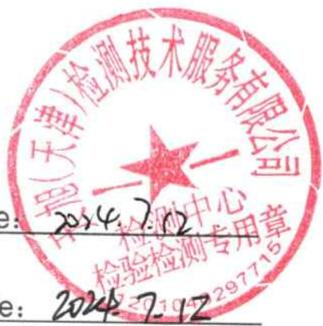
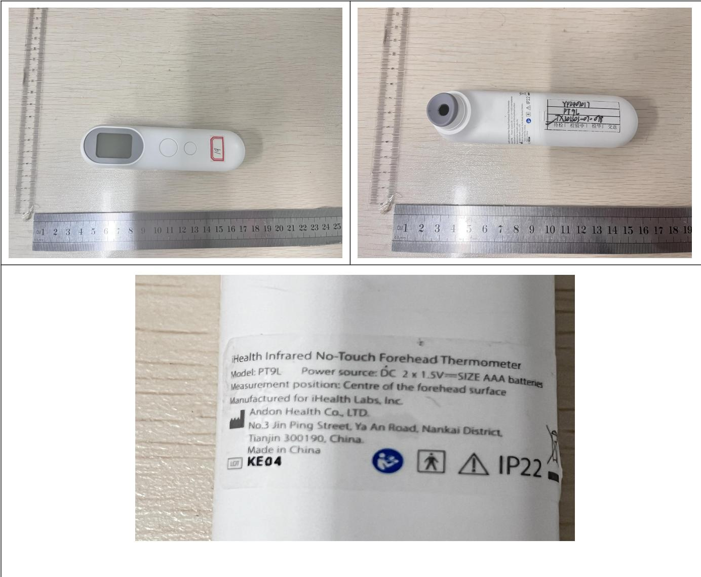

<table><tr><td rowspan=1 colspan=2>TESTREPORTIEC 60068-2-78:2012: Damp heat, steadystate</td></tr><tr><td rowspan=1 colspan=1>Date ofissue…</td><td rowspan=1 colspan=1>2024-07-12</td></tr><tr><td rowspan=1 colspan=1></td><td rowspan=1 colspan=1>IEC60068-2-78:2012:Damp heat,steady state</td></tr><tr><td rowspan=1 colspan=1>Proceduredeviation.:</td><td rowspan=1 colspan=1>NIA</td></tr><tr><td rowspan=1 colspan=1>Non-standard test method...</td><td rowspan=1 colspan=1>N/A</td></tr><tr><td rowspan=1 colspan=1>Type of test object.</td><td rowspan=1 colspan=1>Infrared No-Touch Forehead Thermometer</td></tr><tr><td rowspan=1 colspan=1>Trademark..    </td><td rowspan=1 colspan=1>N/A</td></tr><tr><td rowspan=1 colspan=1>Model/typereference.</td><td rowspan=1 colspan=1>PT9L</td></tr><tr><td rowspan=1 colspan=1>Report No   .</td><td rowspan=1 colspan=1>ETX202303-07-078-05</td></tr><tr><td rowspan=1 colspan=1>Testing period….</td><td rowspan=1 colspan=1>2024.07.10-2024.07.11</td></tr><tr><td rowspan=1 colspan=1>Manufactrer</td><td rowspan=1 colspan=1>ANDONHEALTH CO.,LTD.</td></tr><tr><td rowspan=1 colspan=1>Address..</td><td rowspan=1 colspan=1>No.3 JinPing Street, YaAn Road, Nankai District, Tianjin, China</td></tr><tr><td rowspan=1 colspan=1>Test laboratoryAddress...</td><td rowspan=1 colspan=1>Tianxu(Tianjin)Testing Technology Service Co.,LTD101, First floor, Building L,No.3 JinPing Street,Ya An Road,Nankai District, Tianjin,China</td></tr></table>

Complied by:之(Kang Yanli) Date.

  
爱旭（天津）检测技术服务有限公司

<table><tr><td>Clause</td><td>Requirement + Test</td><td>Result - Remark</td><td>Verdict</td></tr></table>

<table><tr><td>Damp heat test</td><td>The sample is in normal working condition and put into the programmable constant temperature and humidity test chamber. The temperature and</td></tr></table>

ATTACHMENT FILE 1 photos of the EUT  
  
--- End of Test Report ---