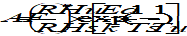
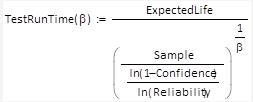
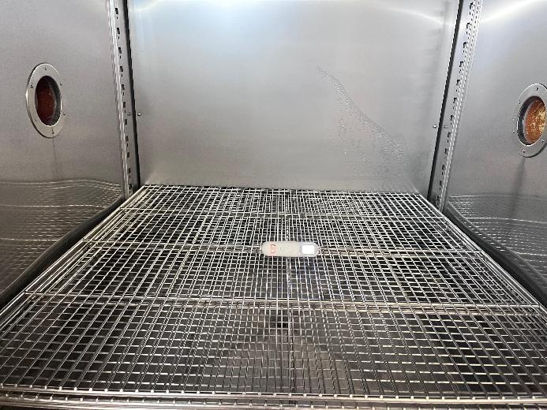
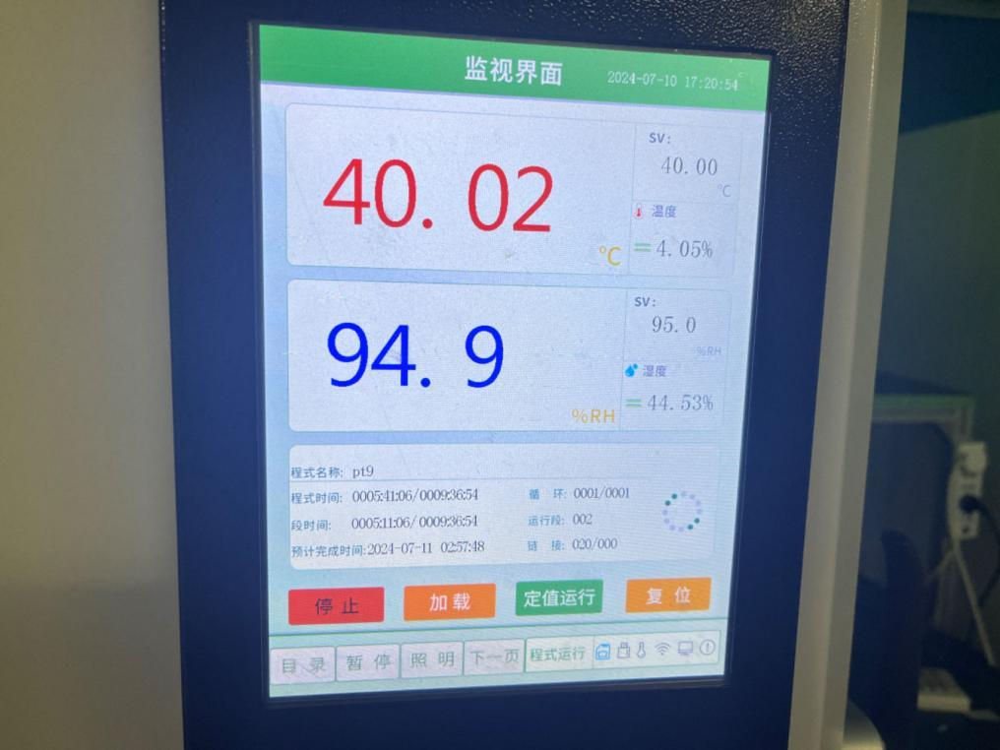

# **Analysis and Evaluation Report on the Expected Life of the Infrared  No-Touch Forehead Thermometer**

Product Name: Infrared No-Touch Forehead Thermometer 

Model : PT9L 

Signature of the completion unit and personnel:

ANDON HEALTH CO., LTD.

Research and Development Department:

Completion Date: July 12,2024

**1. Purpose:**

This report, formulated according to the Guiding Principles for Technical Review of the Expected Life Registration of Active Medical Devices and IEC 62506: 2013 Methods for product accelerated testing, aims to verify the Expected Life of the the Infrared No-Touch Forehead Thermometer model PT9L.

**2. Evaluation Method:**

The Expected Life of the the Infrared No-Touch Forehead Thermometer model PT9L is preset to 5 years. Verification of the aforementioned content is done through testing and analysis.

**3. Evaluation Path**

The product mainly uses the environment for the home environment, which is the high-tech the Infrared No-Touch Forehead Thermometer to measure the human body temperature by receiving the infrared energy of the human body forehead. The Expected Life is 5 years. The product mainly consists of a plastic casing, IR temperature sensor, MCU, LCD display screen，buzzer and batteries. The host is a critical factor influencing the overall product expected life. The product lifespan is confirmed through accelerated life testing of the entire unit. The evaluation follows the path of direct verification on the product.

**4. Analysis of the influence factors**

4.1 Operating frequency

Based on the assumption of 365 working days per year,3 times per day, 1095 times a year. When validating the Expected Life, the standard is 1095 times per year.

4.2 Service time

The Infrared No-Touch Forehead Thermometer should be verified according to the normal use time, from startup, measurement to automatic shutdown, each operation takes 20 seconds. When validating the Expected Life, the verification is carried out based on each operation taking 20s.

4.3 Operating conditions and Transportation and storage conditions

<table><tr><td>
Operating conditions
</td><td>
Transportation and storage conditions
</td></tr><tr><td>
1) Temperature: 10℃ ~40℃.

2) Relative humidity:15%RH-95%RH,

non-condensing. 

3) Atm. pressure: 70 kPa ~ 106 kPa.
</td><td>
1) Temperature: -20℃ ~55℃.

2) Relative humidity: 15%RH-95%RH, non-condensing.

3) Atm. pressure: 70 kPa ~ 106 kPa.
</td></tr></table>

Considering the actual usage of the Infrared No-Touch Forehead Thermometer, the expected use environment is an indoor room temperature environment. When verifying the Expected Life, the application environment adopts the temperature 25℃ and relative humidity 50%, and the accelerated environment adopts the temperature 40℃ and relative humidity 95%.

4.4 Cleaning and Disinfection

 The thermometer is designed for home use. If there are multiple users, please clean the device in between uses with the following steps: 

1. Use an alcohol swab or tissue moistened with alcohol (70% Isopropyl) to clean. the thermometer casing thoroughly, ideally for more than 15 seconds.
2. Allow the thermometer to dry for at least 5 minutes before taking a temperature.
3. After cleaning, if the device is not visually clean when observed with magnification and adequate lighting, please repeat the clean steps above.

**5. Evaluation Method Overview**

Referring to the influence factor analysis, design the following analysis and evaluation method.

<table><tr><td>
Item (system) / subsystem / part name
</td><td>
Influencing factor
</td><td>
Model
</td><td>
Attribute
</td><td>
Decomposition relation type
</td><td>
During the Expected Life / failure rate
</td><td>
evaluation methodology
</td><td>
Evaluation completion unit
</td><td>
Whether an unacceptable risk occurs during the Expected Life
</td></tr><tr><td>
 Infrared  No-Touch Forehead Thermometer
</td><td>
Frequency, use time, ambient temperature and humidity
</td><td>
PT9L
</td><td>
independent research and development
</td><td>
No replaceable parts
</td><td>
5 years
</td><td>
Accelerated life testing report, see Annex I
</td><td>
ANDON HEALTH CO., LTD.
</td><td>
No

(See Risk Analysis Report for details)
</td></tr></table>

5.1 Test samples

Sample name: the Infrared No-Touch Forehead Thermometer.

Model Specification: PT9L.

Lot No.: KE04

Demand quantity: 1 unit.

5.2 Evaluation method 

 In this accelerated testing, using temperature and humidity as the acceleration stress and using the Arrhenius model for acceleration, the reliability target is 90% reliability at the 90% confidence level.

Annual use time calculation: according to the work of 365 days per year, work 3 times per day, each work of 20s, so that the annual use time is about 365 x 3x 20/3600=6.1h.

Five years of use time is 30.5h.

5.2.1 Acceleration factor

For electronic products, Ea usually chooses 0.8. The specific formula is as follows:

Ts: room temperature (25℃) + constant 273=298K.

Tu: high temperature (40℃) + constant 273=313K.

k: Boltzmann constant, equal to 8.62 \* 10-5ev/k.

RHs: Relative humidity under normal use conditions, (50% RH).

RHu: relative humidity under accelerated stress, (95% RH).

n: acceleration rate constant of humidity between 2-3, n=2 in this test.

Calculated by the substitution formula: AF=16.058.

5.2.2 Test time

The acceleration life formula adopts the Weibull Distribution and Binomial Distribution Synthesis formula:

<table><tr><td>
β
</td><td>
1.5
</td></tr><tr><td>
Sample (Number of samples)
</td><td>
1
</td></tr><tr><td>
Confidence (confidence level)
</td><td>
90%
</td></tr><tr><td>
Reliability (Reliability)
</td><td>
90%
</td></tr><tr><td>
Expected Life (5 years expected life)
</td><td>
30.5 h
</td></tr></table>

After the calculation that TestRunTime =238.410h,

Then accelerated testing time of 5 years =TestRunTime / AF=14.8h.

5.2.3 Test method

5.2.3.1 Before the test, the basic performance of the Infrared No-Touch Forehead Thermometer is tested, and the test results are qualified.

5.2.3.2 Place the Infrared No-Touch Forehead Thermometer in the temperature alternating chamber. Allow the Infrared No-Touch Forehead Thermometer to continuously measure in normal measurement mode.

5.2.3.3 According to IEC 60068-2-78:2012 Environmental Testing-Part 2: Test Method Test Cab: Damp heat , steady state, the temperature of the temperature alternating chamber is adjusted to 40℃ and 95% RH, and the test time is recorded after the temperature and humidity are stable.

 Test time: 12:10, July 10,2024 to 02:58, July 11,2024.

 Total test duration: 14.8h.

5.2.3.4 After the acceleration time from the normal work to the fifth year, test the basic performance of the prototype, and all the test results are qualified, see Annex II.

 **6. Conclusion**

In summary, considering the influencing factors of use frequency, use time, environmental temperature and humidity, and the temperature and humidity as accelerated stress, the Arrhenius model is used for accelerated aging test method. After risk analysis, the Expected Life of this product can reach 5 years under the operating conditions in the user manual. The expected life is reflected in the device label and user manual.

Annex:

Annex I: ETX202303-07-078-05 Test Report.

Annex II: the Infrared No-Touch Forehead Thermometer performance test report.

Annex III: Risk Analysis Report.