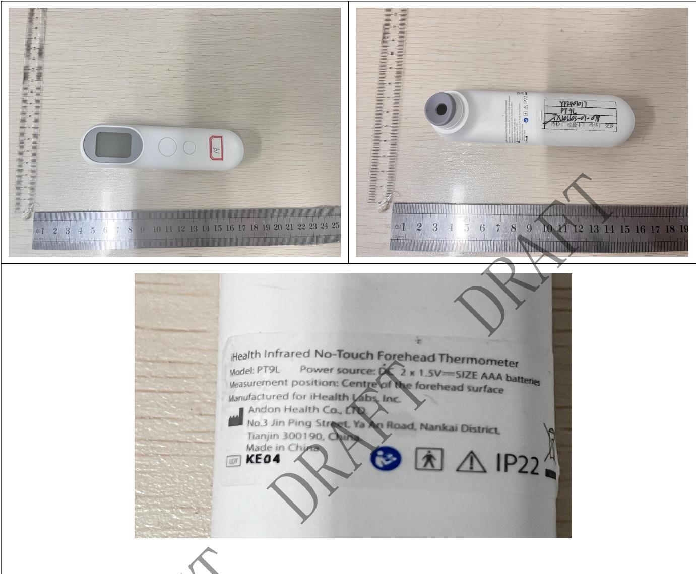

<table><tr><td rowspan=1 colspan=2>TEST REPORTIEC 60068-2-78:2012: Damp heat , steady state</td></tr><tr><td rowspan=1 colspan=1>Date of issue.</td><td rowspan=1 colspan=1>2024-07-12</td></tr><tr><td rowspan=1 colspan=1>Standard..</td><td rowspan=1 colspan=1>IEC 60068-2-78:2012: Damp heat , steady state</td></tr><tr><td rowspan=1 colspan=1>Procedure deviation.</td><td rowspan=1 colspan=1>N/A</td></tr><tr><td rowspan=1 colspan=1>Non-standard test method..</td><td rowspan=1 colspan=1>N/A</td></tr><tr><td rowspan=1 colspan=1>Type of test object.</td><td rowspan=1 colspan=1>Infrared No-Touch Forehead Thermometer</td></tr><tr><td rowspan=1 colspan=1>Trademark..</td><td rowspan=1 colspan=1>N/A</td></tr><tr><td rowspan=1 colspan=1>Model/type reference.</td><td rowspan=1 colspan=1>PT9L</td></tr><tr><td rowspan=1 colspan=1>Report No</td><td rowspan=1 colspan=1>ETX202303-07-078-05</td></tr><tr><td rowspan=1 colspan=1>Testing period..</td><td rowspan=1 colspan=1>2024.07.10-2024.07.11</td></tr><tr><td rowspan=1 colspan=1>Manufacturer.</td><td rowspan=1 colspan=1>ANDON HEALTH CO., LTD.</td></tr><tr><td rowspan=1 colspan=1>Address.</td><td rowspan=1 colspan=1>No.3 JinPing Street, YaAn Road, Nankai District, Tianjin, China</td></tr><tr><td rowspan=1 colspan=1>Test laboratory.Address..</td><td rowspan=1 colspan=1>Tianxu(Tianjin)Testing Technology Service Co., LTD101, First floor, Building L,No.3 JinPing Street, Ya An Road,Nankai District, Tianjin,China</td></tr></table>

Complied by: （Kang Yanli） Date：

Reviewed by: （Guan Qingxiang） Date：

<table><tr><td>Clause</td><td>Requirement + Test</td><td>Result - Remark</td><td>Verdict</td></tr><tr><td colspan="4"></td></tr><tr><td>Damp heat test</td><td colspan="2">The sample is in normal working condition and put into the programmable constant temperature and humidity test chamber. The temperature and humidity of the test box are adjusted to 40 ° C and 95% RH. After the temperature and humidity are stable, it is maintained for 14.8 hours.</td><td>/</td></tr></table>

