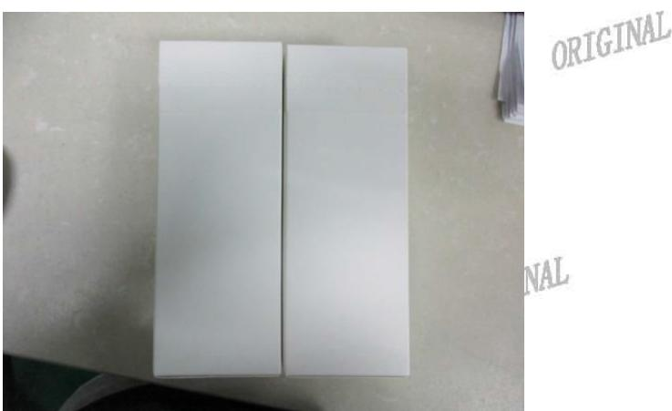

# 旺盈彩盒纸品有限公司

# GLORY COLOUR BOXES& PAPER LIMITED

报告日期：2017.06.08

Test Report

Report No:2017060821

## 送检公司：东莞市上合旺盈印刷有限公司营业七部高志

送检公司地址：东莞市东城区主山振兴路329号旺盈工业园

样品编号 :NA

批RIGINAL :NA

GINAL 订单/工程单号 :NA三

ORIGINAL

ORIGINAL

送检数量 ORIGI2PCS

客户名称/代码 :A1939

ORIGINAL 样品接收日期 :2017.06.05

ORIGINAL

测试周期 :2017.06.05-2017.06.08

测试方法 ：请参见下贵

ORIGINAL

RIGI

ORTGINAL

<table><tr><td rowspan=1 colspan=4>R0</td></tr><tr><td rowspan=1 colspan=3>测试要求</td><td rowspan=2 colspan=1>结果</td></tr><tr><td rowspan=1 colspan=2>参考标准        ORIGINAL</td><td rowspan=1 colspan=1>测试项目</td></tr><tr><td rowspan=1 colspan=1>1</td><td rowspan=1 colspan=1>TOTNAL         客户要求</td><td rowspan=1 colspan=1>冷热循环</td><td rowspan=1 colspan=1>合格</td></tr></table>

ORIGINAL

## 更多测试细节请参考以下页面

\*\*\*\*\*\*\*\*\*\*\*\*\*\*\*\*\*\*\*\*\*\*\*\*\*\*\*

旺盈彩盒纸品有限公实验室授权以下人员测试并签核本报告

ORIC

ORIGINAL

测试：段礼鹏

ORIGINAL

  
旺盈彩盒纸品有限公司 物理实验室

ORIGINAL

# 旺盈彩盒纸品有限公司GLORY COLOUR BOXES& PAPER LIMITED

ORIGINAL

## ORICI检热循环测试

ORIGINAL

将测试产品放置恒温恒湿试验机两，温度56℃，湿度85%RH测试48小测试方法：时，然后温度为-30℃，测试24小时，测试完毕后的样品取出置于室温25C五5C，湿度50-85%中回温4H后评估产品。 NRTGI

SINAI

L m判定标准：测试后样品表面无起泡、无假粘、无开胶、无变形或其它不良。

ORIGINAL

样品数量：2PCS

结果描述：按照标准测试后样品芜开胶、无假粘现象、测试结果判定为合格。

## 测试图片

ORIGINAL

RIGINAL

ORIGINAL

\*\*\*\*\*\*\*\*\*\*\*\*\*\*\*\*\*\*\*\*\*\*\*\*\*\*\*\*\*\* …\*\*\*\*\*\*\*\*\*\*\*\*\*\*\*\*\*\*\*\*\*\*\*\*\*\*\*\*\*\*\*\* ORIGINA\*

ORIGINAL

ORIC

ORIGINAL

ORIGINAL

ORIGINAL

ORIGINAL