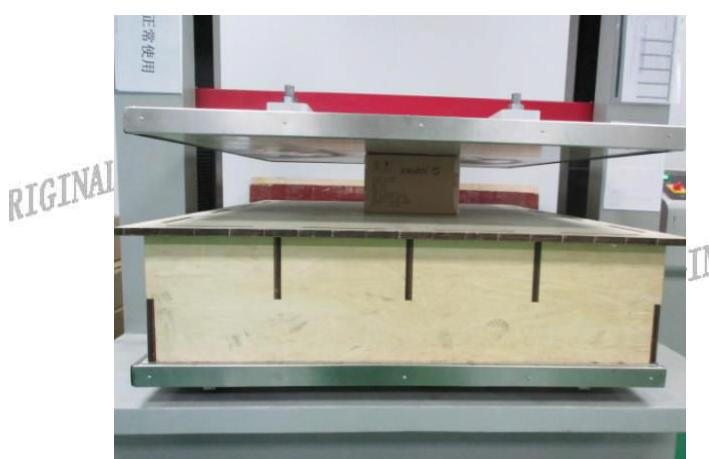
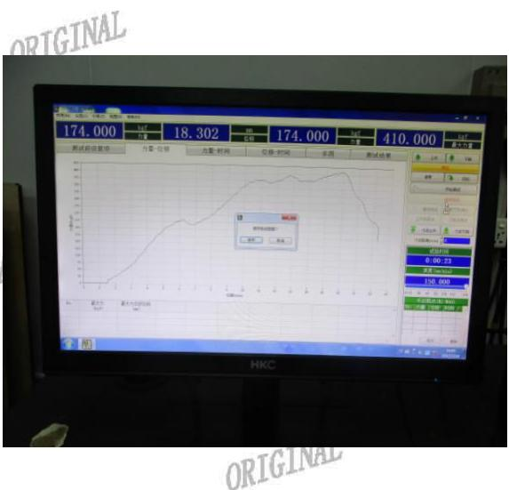

# 旺盈彩盒纸品有限公司

ORIGINAL

报告日期：2017.07.18

Test ReporIGINAL

Report No:VQA2017071822

ORIGINAL

送检公司：东莞市上合旺盈印刷有限公司营业七部付汉清INAL

ORIGINAL

送检公司地址：东莞市东城区主山振兴路329号旺盈工业园

ORIGINAL

ORIGINAL

ORIGINAL

样品接收日期 :2017.07018GINAL

RIGINAL

ORIGINAL

ARIGINAL

<table><tr><td rowspan=1 colspan=3>测试要求</td><td rowspan=2 colspan=1>结果</td></tr><tr><td rowspan=1 colspan=2>ORIGINAL 参考标准</td><td rowspan=1 colspan=1>测试项目</td></tr><tr><td rowspan=1 colspan=1>1</td><td rowspan=1 colspan=1>客户要求</td><td rowspan=1 colspan=1>抗压TNA</td><td rowspan=1 colspan=1>合格</td></tr></table>

更多测试细节请参考以下页面

旺盈彩盒纸品有限公笥实验室授权以下人员测试并签核本报告 ORIC

ORIGINAL

测试： 蔡建川

ORIGINAL

ORIGINAL

ORIGINAL

  
旺盈彩盒纸品有限公司 物理实验室

## 旺盈彩盒纸品有限公司

## GLORY COLOUR BOXES& PAPER LIMITED

ORIGINAL

报告日期：2017.07.18

Test ReporIGINAL

Report No:VQA2017071822

## 1、抗压测试：

ORIGINAL

参数：

ORIGINAL

试验设备 ：微电脑抗压试验仪;型号:HD-A505S-1500

压力方向 ：顶面—底面 CADTGINAL

速度

试验环境INAL ：25±5℃；65±15%RH

ORIGINAL

TNA测试结果：

<table><tr><td colspan="5">测试给果：</td></tr><tr><td>样品编号</td><td>标准值(KGF)</td><td>测试值(KGF) ATNAL</td><td>判定</td><td>JRIGINAL</td></tr><tr><td>1</td><td>130</td><td>ORIGL 410</td><td>合格</td><td></td></tr></table>

ORIGINAL

测试图片：

ORIGINAL

\*\*\*\*\*\*\*\*\*\*\*\*\*\*\*\*\*\*\*\*\*\*\*\*\*\* \*\*\*\*\*\*\*\*\*\*\*\*\*\*\*\*\*\*\*\*\*\*\* ORIGINAL

ORIGINAL

ORIC

ORIGINAL

ORIGINAL

ORIGINAL