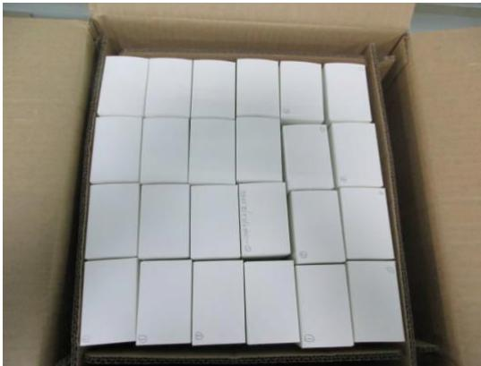
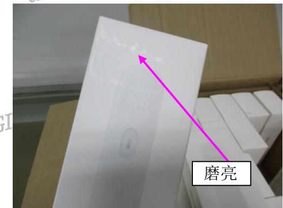

# 旺盈彩盒纸品有限公司

# GLORY COLOUR BOXES& PAPER LIMITED

报告日期：2017.06.27

Test Report

ORIGINAL

Report No:2017062725

<table><tr><td colspan="2"></td><td colspan="2">送检公司：东莞市上合旺盈印刷有限公司营业七部付汉清 送检公司地址：东莞市东城区主山振兴路329号旺盈工业园AL</td><td rowspan="6">ORIGI</td></tr><tr><td colspan="2">ORIGINAL</td><td colspan="2">以下测试样品是由申请者提供及确认：红外体温计 ORIGINAL</td></tr><tr><td rowspan="6">GINAL</td><td>样品编号</td><td>:NA</td><td></td></tr><tr><td>批号RIGINAL</td><td>:NA</td><td>ORIGINAL</td></tr><tr><td>订单/工程单号</td><td>:NA</td><td>ORIGINAL</td></tr><tr><td>供应商</td><td>：NA</td><td></td></tr><tr><td>送检数量</td><td>ORIGTN</td><td></td></tr><tr><td>ORIGI鑫户名称/代码</td><td>:A1939</td><td></td></tr><tr><td></td><td>样品接收日期</td><td>:2017.06.27</td><td>ORIGINAL</td></tr><tr><td></td><td>测试周期</td><td>:2017.06.2712017106.27</td><td></td></tr><tr><td colspan="2">测试方法 ORIGINAL</td><td>:请参见下一页</td><td></td></tr></table>

RIGINAL

ORIGINAL

<table><tr><td rowspan=1 colspan=3>测试要求TCINAL</td><td rowspan=2 colspan=1>结果</td></tr><tr><td rowspan=1 colspan=2>ORIU1参考标准</td><td rowspan=1 colspan=1>测试项目</td></tr><tr><td rowspan=1 colspan=1>1</td><td rowspan=1 colspan=1>RIGINAL          客户要求</td><td rowspan=1 colspan=1>模拟运输</td><td rowspan=1 colspan=1>供参考</td></tr></table>

## 更多测试细节请参考以下页面

ORIC

ORIGINAL

测试：杨汝圭

ORIGINAL

  
旺盈彩盒纸品有限公司 物理实验室

ORIGINAL

# 旺盈彩盒纸品有限公司

GLORY COLOUR BOXES& PAPER LIMITED

ORIGINAL

报告日期：2017.06.27

Test Report

Report No:2017062725

ORIGINAL

## 1、模拟运输测试：

ADTGINAL

<table><tr><td rowspan=1 colspan=2>GINAL测试条件</td><td rowspan=1 colspan=1>0K重量</td><td rowspan=1 colspan=1>备注</td></tr><tr><td rowspan=1 colspan=1>环境</td><td rowspan=1 colspan=1>25±5℃；65±15%RHORIGINL</td><td rowspan=3 colspan=1>NA</td><td rowspan=3 colspan=1>/ORI</td></tr><tr><td rowspan=1 colspan=1>频率</td><td rowspan=1 colspan=1>ORIGINAL200cycles</td></tr><tr><td rowspan=1 colspan=1>时间</td><td rowspan=1 colspan=1>3个面每个面测试1小时。</td></tr></table>

判定标准：测试后包装表面无擦花、掉色现象，产品无破损现象。

ORIGINAL

样品数量：1箱

ORIGINAR 按照标准测试后箱内样品出现磨花现象，测试结果仅供参都IGINAL结果描述：

测试图片：

RIGINAL

ORIGINAL

\*\*\*\*\*\*\*\*\*\*\*\*\*\*\*\*\*\*\*\*\*\*\*\*\*\*\*\*\*…\*\*\*\*\*\*\*\*\*\*\*\*\*\*\*\*\*\*\*\*\*\*\*\*\*\*\*\*\* ORIGINAL

ORIGINAL

ORIC

ORIGINAL

ORIGINAL

ORIGINAL