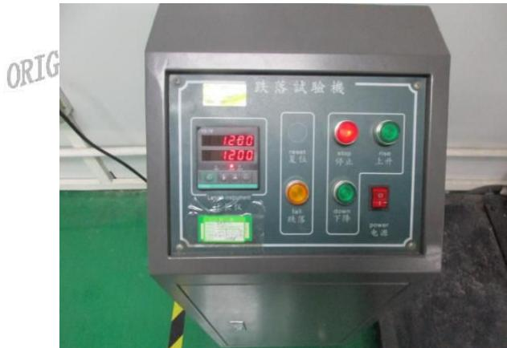
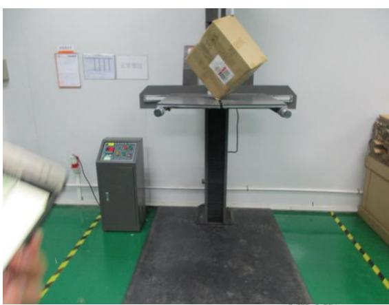
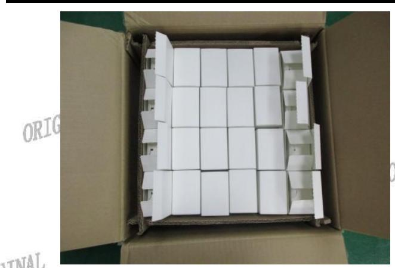
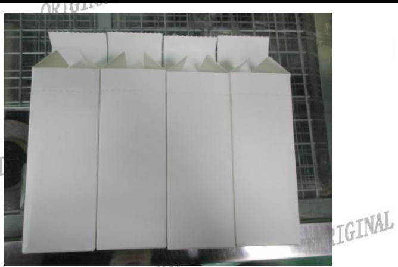
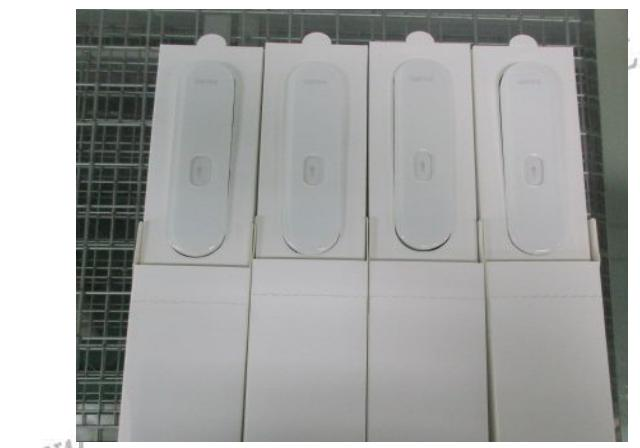
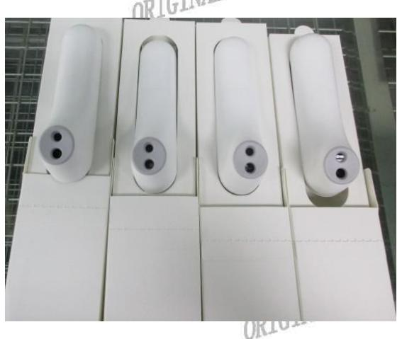

# 旺盈彩盒纸品有限公司

# GLORY COLOUR BOXES& PAPER LIMITED

报告日期：2017.06.13

Test Report

Report No:2017061324

ORIUL

送检公司地址：东莞市东城区主山振兴路329号旺盈工业园

样品编号 :NA

ORIGINAL

批号RIGINAL :NA

ORIGINAL

ORIGINAL

客户名称/代码 :A1939

ORIGI释品接收日期 :2017.06.13

ORIGINAL

测试周期 :2017.06.13-2017:06.13

测试方法 :请参见下货

ORIGINAL

ORIGINAL

<table><tr><td></td><td></td><td></td><td rowspan=1 colspan=1>ORTO</td></tr><tr><td rowspan=1 colspan=3>0测试要求</td><td rowspan=2 colspan=1>结果</td></tr><tr><td rowspan=1 colspan=2>参考标准      ORIGINAL</td><td rowspan=1 colspan=1>测试项目</td></tr><tr><td rowspan=1 colspan=1>1</td><td rowspan=1 colspan=1>DTGINAL           客户要求</td><td rowspan=1 colspan=1>跌落</td><td rowspan=1 colspan=1>合格</td></tr></table>

## 更多测试细节请参考以下页面

\*\*\*\*\*\*\*\*\*\*\*\*\*\*\*\*\*\*\*\*\*\*\*\*\*\*\*\*\*\*\*\*\*\*\*\*\*\*\*\*\*

旺盈彩盒纸品有限公司实验室授权以下人员测试并签核本报告

ORIGINAL

ORIGINAL 测试：杨汝圭

ORIC

ORIGINAL

  
旺盈彩盒纸品有限公司 物理实验室

ORIGINAL

ORIGINAL

Report No:2017061324

ORIGINAL

ORIGINAL

ORIfH跌落测试：

将样品放置跌落测试仪卫，"粮据产品毛重选择所需高度，依次测试方法：顺序测试。测试结束后检查产纸箱及内卡、客户产品。

<table><tr><td rowspan=12 colspan=1>GINALRIGIAL</td><td></td><td></td><td></td><td></td></tr><tr><td rowspan=1 colspan=1>测试顺序</td><td rowspan=1 colspan=1>ORI01高度</td><td rowspan=1 colspan=1>重量</td><td rowspan=1 colspan=1>ORIC测试部位描述ORIGINAL</td></tr><tr><td rowspan=1 colspan=1>角</td><td rowspan=1 colspan=1>1200MM</td><td rowspan=10 colspan=1>ORIGINALNAORIQ</td><td rowspan=10 colspan=1>1棱1-224制造厂接缝角2-3.53</td></tr><tr><td rowspan=1 colspan=1>棱1</td><td rowspan=1 colspan=1>1200MM</td></tr><tr><td rowspan=1 colspan=1>棱2TGI</td><td rowspan=1 colspan=1>NAL1200MM</td></tr><tr><td rowspan=1 colspan=1>棱3</td><td rowspan=1 colspan=1>1200MM</td></tr><tr><td rowspan=1 colspan=1>面1</td><td rowspan=1 colspan=1>1200MM</td></tr><tr><td rowspan=1 colspan=1>面2</td><td rowspan=1 colspan=1>1200MM</td></tr><tr><td rowspan=1 colspan=1>面3</td><td rowspan=1 colspan=1>1200MM1U</td></tr><tr><td rowspan=1 colspan=1>面4</td><td rowspan=1 colspan=1>1200MM</td></tr><tr><td rowspan=1 colspan=1>面5</td><td rowspan=1 colspan=1>1200MM</td></tr><tr><td rowspan=1 colspan=1>面6</td><td rowspan=1 colspan=1>1200MM</td></tr></table>

判定标准： 测试样品包装不存在破损现象，产品结构功能无损坏。

样品数量： 1箱

结果描述： 按照标准测试后箱内样品无破损现象，测试结果判定为合格。

测试图片：

ORIGINAL

# 旺盈彩盒纸品有限公司GLORY COLOUR BOXES& PAPER LIMITED

报告日期：02017.06.13

Test Report

Report No:2017061324

ORIGINAL

ORIGINAL

ORIGINAL

ORIC

ORIGINAL

ORIGINAL

ORIGINAL

