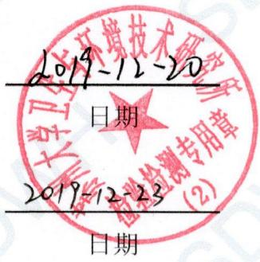
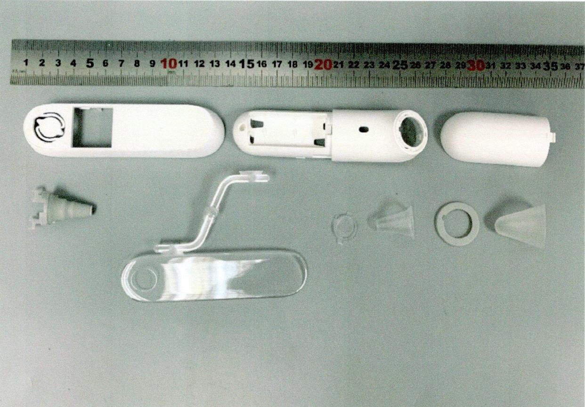

最终报告

报告编号：SDWH-M201905262-1

红外耳温计

细胞毒性试验

## 含10%胎牛血清的MEM浸提

# 委托单位：天津九安医疗电子股份有限公司

地址：天津市南开区雅安道金平路3号

苏州大学卫生与环境技术研究所

地址：中国江苏苏州工业园区仁爱路199号

网址：www.sudatest.com

直线：+8651265880038

## 目录

检测告说… 3  
日期确认..  
报告摘要. .5  
检测报告正文 .6  
1 目的…. 6  
2 参考标准 ..6  
3 执行规范 .6  
4 试验和对照样品确定 ..6  
4.1试验样品. ….6  
4.2 对照样品. ….6  
4.2.1阴性对照样品. .6  
4.2.2 阳性对照样品… .7  
4.2.3空白对照. .7  
5仪器和试剂.. ..7  
5.1仪器设备.  
5.2 试剂 7  
6 试验系统鉴别. 7  
7 试验系统和给药途径确认. .8  
8 试验设计 .8  
8.1浸提液制备. 8  
8.1.1样品前处理 .8  
8.1.2样品浸提 .8  
8.2试验步骤. .8  
8.3结果. ….8  
8.4质量检查. .9  
8.5数据分析. .9  
8.6评价标准.. 9  
9 结论… 9  
10记录存储. 9  
11保密协议. .9  
12试验偏离声明 ..9  
附录一结果. ..10  
附录二 试验样品照片 .11  
附录三客户提供的资料 12

## 检测报告说明

、对本报告有异议者，请于收到报告之起五天内提出复核申请。

二、检测报告涂改或无检验检测专用章无效。

三、检测报告编制、审核及检测报告签发签字效。

四、送样委托检验，本检验检测机构仅对来样负责。

五、未经本检验检测机构同意，不得部分复制本报告。

## 日期确认

<table><tr><td>接样日期</td><td>2019-12-04</td></tr><tr><td>试验计划书生效日期</td><td>2019-12-06</td></tr><tr><td>试验操作开始日期</td><td>2019-12-06</td></tr><tr><td>试验操作结束日期</td><td>2019-12-13</td></tr><tr><td>报告完成日期</td><td>2019-12-20</td></tr></table>

编制： 韩

审核： 李佳

签发：

授权签字人

  
苏州大学卫与环境技研究所 检验检测专用章 2

2019-12-3

日期

苏州大学卫生与环境技术研究所

## 报告摘要

## 1试验样品

<table><tr><td>样品名称</td><td>红外耳温计</td></tr><tr><td>制造商</td><td>柯顿(天津)电子医疗器械有限公司</td></tr><tr><td>地址</td><td>天津自贸试验区（空港经济区）航宇路26号</td></tr><tr><td>型号</td><td>PT5</td></tr><tr><td>批号</td><td>未提供</td></tr></table>

## 2主要参考标准

GB/T16886.5—2017医疗器械的物学评价第5部分：细胞毒性测试-体外法

## 3试验方法

依据GB/T16886.5—2017医疗器械的生物学评价第5部分：细胞毒性测试-体外法，采用MTT法，评价样品潜在的细胞毒性。

试验计划书编号：SDWH-PROTOCOL-M201905262-1。

## 4结论

在本次试验条件下，样品红外温计的浸提液对L929细胞无潜在毒性影响。

## 检测报告正文

## 1目的

该试验的是为了评价试验样品对L929哺乳动物成纤维细胞的物学反应。该测试是根据样品浸提液而设计的。

## 2参考标准

GB/T16886.5—2017医疗器械的物学评价第5部分：细胞毒性测试-体外法GB/T16886.12—2017医疗器械的物学评价第12部分：样品制备与参照材料

## 3执行规范

ISO/IEC17025:2005检测和校准实验室能的通要求（CNASCL01《检测和校准实验室能力认可准则》）中国合格评定国家认可委员会实验室认可注册号：CNASL2954。

RB/T2142017《检验检测机构资质认定能评价检验检测机构通要求》中国国家认证认可监督管理委员会检验检测机构资质认定证书编号：CMA180015144061。

## 4试验和对照样品确定

## 4.1试验样品

<table><tr><td>样品名称 制造商</td><td>红外耳温计 柯顿（天津）电子医疗器械有限公司</td></tr><tr><td>制造商地址</td><td>天津自贸试验区（空港经济区）航宇路26号</td></tr><tr><td>来样原始状态</td><td>未灭菌</td></tr><tr><td>CAS编号</td><td>未提供</td></tr><tr><td>型号</td><td>PT5</td></tr><tr><td>规格</td><td>未提供</td></tr><tr><td>批号</td><td>未提供</td></tr><tr><td>样品材料</td><td>ABS,TPU,PMMA,PP</td></tr><tr><td>包装材质 性状</td><td>塑料袋</td></tr><tr><td>颜色</td><td>固体</td></tr><tr><td>密度</td><td>白色，灰色，透明</td></tr><tr><td>稳定性</td><td>未提供</td></tr><tr><td></td><td>未提供</td></tr><tr><td>溶解度</td><td>不溶于水</td></tr><tr><td>保存条件</td><td>室温</td></tr><tr><td>预期临床用途</td><td>体温测量</td></tr></table>

试验样品信息是由样品委托单位提供。

## 4.2对照样品

## 4.2.1阴性对照样品

名称：高密度聚乙烯

制造商：美国药典委员会

规格：3片装

批号：K0M357

性状：固体

颜色：白色

稳定性：室温下稳定

保存条件：室温

浸提介质：含10%胎牛血清的MEM培养液

## 4.2.2阳性对照样品

阳性对照样品名称：Zincdiethyldithiocarbamate

制造商：Sigma

规格：25g

批号：MKCB2943V

浓度：1%

溶剂：10%胎牛血清的MEM培养液

性状：固体

颜色：白色

## 4.2.3空白对照

空白对照样品名称：含10%胎清的MEM培养液

性状：液体

颜色：粉红色

保存条件： $4 \pm 2 { } ^ { \circ } \mathrm { C }$

## 5仪器和试剂

## 5.1仪器设备

<table><tr><td>仪器名称</td><td>仪器编号</td><td>校正有效期</td></tr><tr><td>高压灭菌器</td><td>SDWH2204</td><td>2020-04-16</td></tr><tr><td>恒温摇床</td><td>SDWH2109</td><td>2020-10-28</td></tr><tr><td>钢直尺</td><td>SDWH463</td><td>2020-07-29</td></tr><tr><td>电子天平</td><td>SDWH2601</td><td>2020-06-19</td></tr><tr><td>电子天平</td><td>SDWH230</td><td>2020-05-04</td></tr><tr><td> $\mathrm { C O } _ { 2 }$  培养箱</td><td>SDWH021</td><td>2020-04-16</td></tr><tr><td>倒置显微镜</td><td>SDWH037</td><td>2020-05-04</td></tr><tr><td>超净工作台</td><td>SDWH454</td><td>2020-05-06</td></tr><tr><td>酶联免疫检测仪</td><td>SDWH2386</td><td>2020-07-04</td></tr></table>

## 5.2试剂

<table><tr><td>试剂名称</td><td>供应商</td><td>批号</td></tr><tr><td>MTT(3-（4，5-二甲基噻唑-2）- 2，5-二苯基四氮唑溴盐)</td><td>SIGMA</td><td>MKCD8033</td></tr><tr><td>胎牛血清</td><td>CORNING</td><td>35081006</td></tr><tr><td>MEM</td><td>HyClone</td><td>AE29246282</td></tr><tr><td>胰酶</td><td>GiBco</td><td>2048080</td></tr><tr><td>青霉素链霉素</td><td>GiBco</td><td>2087432</td></tr><tr><td>PBS</td><td>CORNING</td><td>05418005</td></tr><tr><td>99.9%异丙醇</td><td>国药集团化学试剂有限公司</td><td>20190227</td></tr></table>

## 6试验系统鉴别

该试验鼠成纤维细胞L929,细胞系来美国菌种保存中。

## 7试验系统和给药途径确认

鼠成纤维细胞L929来检测细胞毒性试验是因为其对试验样品浸提液反应灵敏。

试验样品通过浸提液（用一种与试验系统相容的载体浸提）与试验系统接触，被认为是最佳给药途径，也是为标准推荐的。

## 8 试验设计

## 8.1浸提液制备

## 8.1.1样品前处理

## 8.1.1.1试验样品灭菌

辐照灭菌25kGy Cobalt-60。

## 8.1.1.2对照样品灭菌

与试验样品相同。

## 8.1.2样品浸提

无菌条件下取样：等数量取图中所有组件，混合浸提。使用委托方提供的样品的总表面积数据222.684cm²，并按下表的浸提比例（样品：浸提介质）在密闭的惰性容器内震荡浸提。浸提介质为含10%胎牛血清的MEM培养液。浸提完成后，记录浸提液状态和浸提介质的任何变化（提取前和提取后）。提取液立即用于测试。

<table><tr><td rowspan="2">试验阶段</td><td rowspan="2">实际取样</td><td colspan="2">浸提过程</td><td rowspan="2">最终浸 提液</td></tr><tr><td>浸提比例</td><td>浸提介质体积 浸提条件</td></tr><tr><td>试验样品</td><td>222.684cm²</td><td>3cm²: 1mL</td><td>74.2mL 37°C,24h</td><td>澄清</td></tr><tr><td>阴性对照</td><td>30cm2</td><td>3 cm²: 1 mL</td><td>10.0 mL 37℃,24 h</td><td>澄清</td></tr><tr><td>空白对照</td><td></td><td></td><td>10.0mL 37℃,24h</td><td>澄清</td></tr><tr><td>阳性对照</td><td>0.5g</td><td>1.0 g:100 mL</td><td>50.0 ml 37℃, 24h</td><td>浑浊</td></tr></table>

浸提前后浸提液状态未发改变。浸提液pH值未经调整，未经过滤、离、稀释等处理。阳性浸提液经过滤后使用

## 8.2试验步骤

## 试验过程无菌操作；

将L929细胞培养在含10%胎血清和抗素（青霉素100U/mL,链霉素100μg/mL）的MEM培养液中，置于 $3 7 ^ { \circ } \mathrm { C }$ ,5% $\mathrm { C O } _ { 2 }$ 培养箱中培养。用0.25%胰酶（含EDTA）消化细胞制备成单细胞悬液，细胞悬液离心（200G,3min），然后将细胞重新分散于培养基中，调整细胞密度为 $1 \times 1 0 ^ { 5 }$ 个/mL的细胞悬液；

接种上述细胞悬液到1个96孔培养板中，每孔 $1 0 0 ~ \mu \mathrm { L }$ ，置 $3 7 ^ { \circ } \mathrm { C }$ 培养箱中 $( 5 \% \mathrm { C O _ { 2 } }$ 37°℃，>90%湿度）培养24h；

待细胞长成单层后，吸出原来的培养液，分别加入 $1 0 0 ~ \mu \mathrm { L }$ 不同浓度的试验样品浸提液（100%、75%、50%、25%）、空白对照液、阳性对照（100%）和阴性对照液（100%），37°C，5%CO2培养24h。每组做5个平行样；

培养24h后，取出96孔板先做细胞形态学观察，然后吸出原来的培养液，每孔加50μLMTT（1mg/mL），置于 $3 7 ^ { \circ } \mathrm { ~ C ~ }$ $5 \% \mathrm { C O } _ { 2 }$ 培养箱中培养2h，吸弃上清，加100μL99.9%纯度的异丙醇溶解结晶；

在酶标仪上以570nm为主吸收波长，650nm为参考波长测定吸光度值。

## 8.3结果

样品红外耳温计的100%浸提液组细胞活力值为80.1%，具体结果详见附录一，表1，表2。

## 8.4质量检查

阴性对照无细胞毒性影响，阳性对照造成细胞毒性影响。

在两天的试验过程中，未经处理的空白对照的光密度绝对值 $\mathrm { O D } _ { 5 7 0 }$ 表明了每个孔接种的$1 \times 1 0 ^ { 4 }$ 个细胞以正常倍增时间成指数增长。

空白对照的 $\mathrm { O D } _ { 5 7 0 }$ 平均值不能小于0.2。

检查系统的细胞接种误差，96孔板的左侧（第2列）和右侧（第11列）作为空对照（第1列和第12列不作空白对照）。左右两侧空白对照的平均值不能与所有空白的平均值相差超过15%。

## 8.5数据分析

使SPSS16.0计算各组测定的光密度值的均数±标准差(Mean±SD)。

$$
\begin{array} { r l } { \mathcal { Z } [ [ \boldsymbol { \mathfrak { H } } \underbrace { \mathbf { p } _ { \mathsf { U } } \vec { \mathbf { y } } _ { \mathsf { F } } \vec { \mathbf { z } } } _ { \mathsf { H } } \mathcal { \bar { F } } ] ] } & { ( \boldsymbol { \mathfrak { q } } _ { 0 } ) \ = 1 0 0 \times \bigg ( \overline { { O D _ { 5 7 0 } - O D _ { 6 5 0 } } } \bigg ) _ { \sharp \sharp \overline { { \operatorname { m a x } } } } \bigg / \bigg ( \overline { { O D _ { 5 7 0 } - O D _ { 6 5 0 } } } \bigg ) _ { \sharp \overline { { \mathbb { x } } } } | _ { \sharp } | _ { \sharp } \mathbb { X } | } \end{array}
$$

50%浓度的样品浸提液与100%浓度的样品浸提液相，细胞活%应少相同或更，否则应重复试验。

细胞活%越低，表明受试样品潜在的细胞毒性越。

## 8.6评价标准

50%的样品浸提液少和100%的细胞活相同或者100%的细胞活更，否则应该重复试验。

细胞活力%越低，潜在的细胞毒性越大；

细胞活力<空白组70%，说明样品具有潜在的细胞毒性；

100%试验样品浸提液的细胞活%为最终结果。

## 9结论

在本试验条件下，样品红外温计的浸提液对L929细胞潜在毒性影响。

## 10记录存储

所有与本次试验有关的原始数据和记录都被保存在指定的SDWH档案件中。

## 11保密协议

签订检测委托合同即认为双方接受保密协议。

## 12试验偏离声明

本次试验严格按照计划书执，未发影响实验数据有效性的偏离。

## 附录 结果

表1细胞形态学观察
<table><tr><td>组别</td><td>接种细 胞后</td><td>加浸提 液前</td><td>加浸提液24h后</td></tr><tr><td>空白对照</td><td>个别细</td><td>个别细</td><td>个别细胞有颗粒，细胞无裂解，生长状态良好。</td></tr><tr><td>阴性对照</td><td>胞有颗</td><td>胞有颗</td><td>个别细胞有颗粒，细胞无裂解，生长状态良好。</td></tr><tr><td>阳性对照</td><td>粒，细</td><td>粒，细</td><td>细胞裂解死亡。</td></tr><tr><td>100%样品浸提液</td><td>胞无裂</td><td>胞无裂</td><td>个别细胞有颗粒，细胞无裂解，生长状态良好。</td></tr><tr><td>75%样品浸提液</td><td>解，生</td><td>解，生</td><td>个别细胞有颗粒，细胞无裂解，生长状态良好。</td></tr><tr><td>50%样品浸提液</td><td>长状态</td><td>长状态</td><td>个别细胞有颗粒，细胞无裂解，生长状态良好。</td></tr><tr><td>25%样品浸提液</td><td>良好。</td><td>良好。</td><td>个别细胞有颗粒，细胞无裂解，生长状态良好。</td></tr></table>

表2细胞活力%
<table><tr><td>组别</td><td>吸光度值 Mean±SD</td><td>细胞活力%</td></tr><tr><td>空白对照</td><td>0.6142±0.053</td><td>100.0%</td></tr><tr><td>阴性对照</td><td>0.6624±0.051</td><td>107.8%</td></tr><tr><td>阳性对照</td><td>0.1292±0.016</td><td>21.0%</td></tr><tr><td>100%样品浸提液</td><td>0.4922±0.057</td><td>80.1%</td></tr><tr><td>75%样品浸提液</td><td>0.5020±0.042</td><td>81.7%</td></tr><tr><td>50%样品浸提液</td><td>0.5084±0.070</td><td>82.8%</td></tr><tr><td>25%样品浸提液</td><td>0.498±0.034</td><td>81.1%</td></tr></table>

## 附录二 试验样品照片

## 附录三 客户提供的资料

1工艺流程未提供。

## 2其他信息

未提供。

以下空白