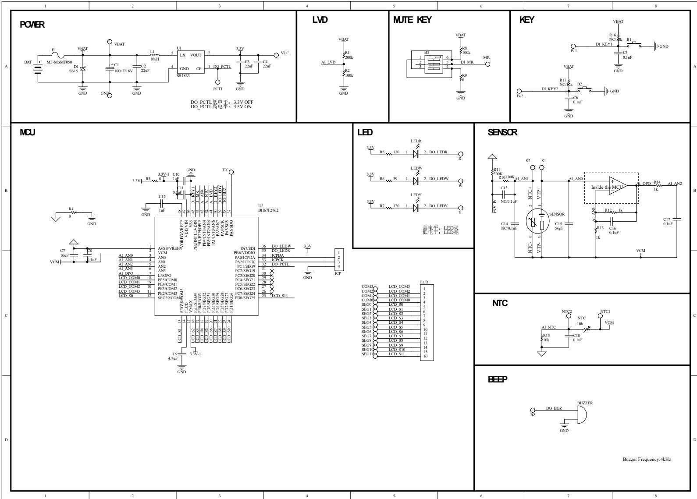
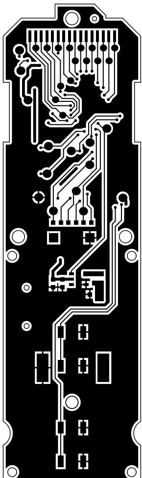
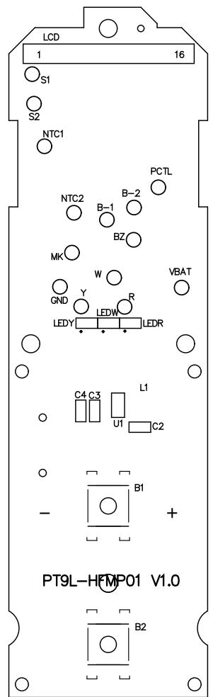
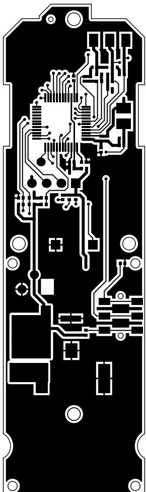
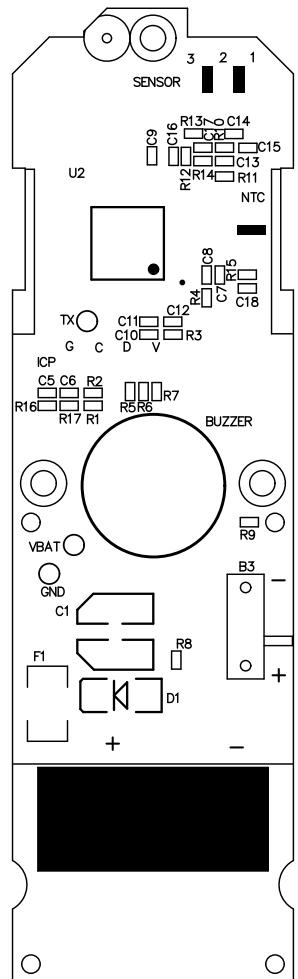
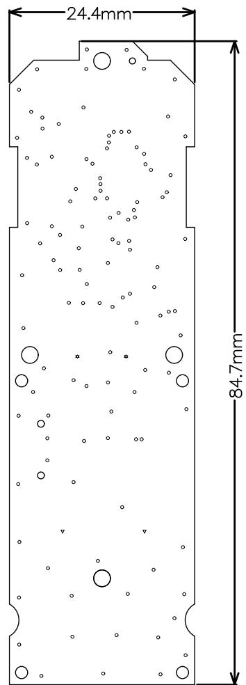
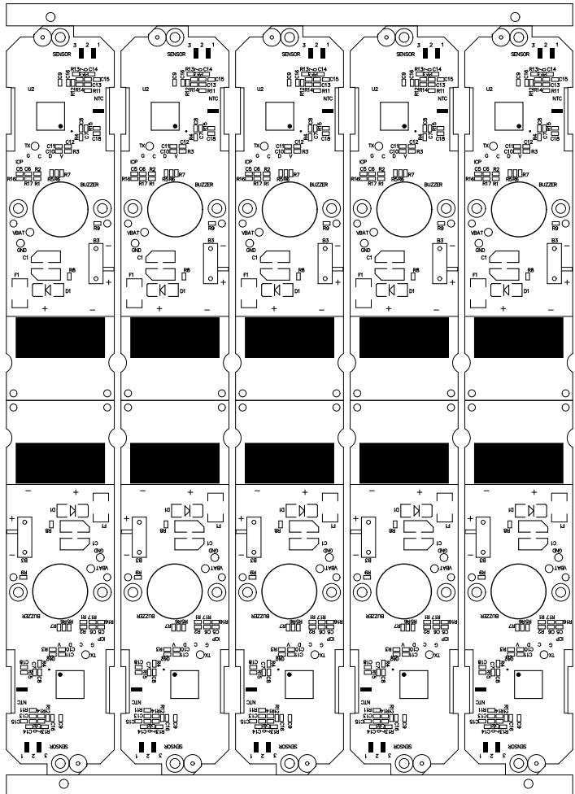

<table><tr><td rowspan=1 colspan=4>文档清单</td></tr><tr><td rowspan=1 colspan=4>产品型号：PT9L</td></tr><tr><td rowspan=1 colspan=4>提交：                     审核：                           批准：</td></tr><tr><td rowspan=1 colspan=1>版本</td><td rowspan=1 colspan=1>图纸号</td><td rowspan=1 colspan=1>板层</td><td rowspan=1 colspan=1>版本</td></tr><tr><td rowspan=1 colspan=1>V1.0</td><td rowspan=1 colspan=1>PT9L-HFXS01 V1.0</td><td rowspan=1 colspan=1></td><td rowspan=1 colspan=1>V1.0</td></tr><tr><td rowspan=8 colspan=1>V1.0</td><td rowspan=8 colspan=1>PT9L-HFMP01 V1.0</td><td rowspan=1 colspan=1>Top Layer 层</td><td rowspan=8 colspan=1>V1.0</td></tr><tr><td rowspan=1 colspan=1>Top Overlay层</td></tr><tr><td rowspan=1 colspan=1>Bottom Layer 层</td></tr><tr><td rowspan=1 colspan=1>Bottom Overlay层</td></tr><tr><td rowspan=1 colspan=1>Drill Layer 层</td></tr><tr><td rowspan=1 colspan=1>拼板示意图(顶层)</td></tr><tr><td rowspan=1 colspan=1>拼板示意图 (底层)</td></tr><tr><td rowspan=1 colspan=1>尺寸图</td></tr></table>

<table><tr><td rowspan=2 colspan=1>32</td><td rowspan=2 colspan=1></td><td rowspan=1 colspan=1></td><td rowspan=1 colspan=1>产品名称  红外体温计</td><td rowspan=1 colspan=2>产品型号PT9L</td><td rowspan=2 colspan=1>版本 V1.0</td></tr><tr><td rowspan=1 colspan=1></td><td rowspan=1 colspan=1>原理图编号 PT9L-HFXS01 V1.0</td><td rowspan=1 colspan=2></td></tr><tr><td rowspan=1 colspan=1>1</td><td rowspan=1 colspan=1></td><td rowspan=1 colspan=1></td><td rowspan=1 colspan=1>设计</td><td rowspan=1 colspan=1>审核</td><td rowspan=1 colspan=1>批准</td><td rowspan=1 colspan=1>第1页 共1页</td></tr><tr><td rowspan=1 colspan=1>NO.</td><td rowspan=1 colspan=1>更改记录</td><td rowspan=1 colspan=1>更改时间</td><td rowspan=1 colspan=1>日期</td><td rowspan=1 colspan=1>旧期</td><td rowspan=1 colspan=1>日期</td><td rowspan=1 colspan=1></td></tr></table>

<table><tr><td rowspan=2 colspan=1>32</td><td rowspan=2 colspan=1></td><td rowspan=1 colspan=1></td><td rowspan=1 colspan=1>产品名称红外体温计</td><td rowspan=1 colspan=2>产品型号PT9L</td><td rowspan=2 colspan=1>版本  V1.0Top Layer      层</td></tr><tr><td rowspan=1 colspan=1></td><td rowspan=1 colspan=1>PCB编号  PT9L-HFMP01 V1.0</td><td rowspan=1 colspan=2></td></tr><tr><td rowspan=1 colspan=1>1</td><td></td><td rowspan=1 colspan=1></td><td rowspan=1 colspan=1>设计</td><td rowspan=1 colspan=1>审核</td><td rowspan=1 colspan=1>批准</td><td rowspan=1 colspan=1>第1页共7页</td></tr><tr><td rowspan=1 colspan=1>NO.</td><td rowspan=1 colspan=1>更改记录</td><td rowspan=1 colspan=1>更改时间</td><td rowspan=1 colspan=1>日期</td><td rowspan=1 colspan=1>日期</td><td rowspan=1 colspan=1>日期</td><td rowspan=1 colspan=1></td></tr></table>

<table><tr><td rowspan=2 colspan=1>32</td><td rowspan=2 colspan=1></td><td rowspan=1 colspan=1></td><td rowspan=1 colspan=3>产品名称红外体温计             产品型号PT9L</td><td rowspan=2 colspan=1>版本V1.0Top Overlay   层</td></tr><tr><td rowspan=1 colspan=1></td><td rowspan=1 colspan=3>PCB编号PT9L-HFMP01 V1.0</td></tr><tr><td rowspan=1 colspan=1></td><td></td><td rowspan=1 colspan=1></td><td rowspan=1 colspan=1>设计</td><td rowspan=1 colspan=1>审核</td><td rowspan=1 colspan=1>批准</td><td rowspan=1 colspan=1>第2页共7页</td></tr><tr><td rowspan=1 colspan=1>NO.</td><td rowspan=1 colspan=1>更改记录</td><td rowspan=1 colspan=1>更改时间</td><td rowspan=1 colspan=1>日期</td><td rowspan=1 colspan=1>日期</td><td rowspan=1 colspan=1>日期</td><td rowspan=1 colspan=1></td></tr></table>

<table><tr><td rowspan=2 colspan=1>32</td><td rowspan=2 colspan=1></td><td rowspan=1 colspan=1></td><td rowspan=1 colspan=1>产品名称红外体温计</td><td rowspan=1 colspan=2>产品型号PT9L</td><td rowspan=2 colspan=1>版本V1.0Bottom layer  层</td></tr><tr><td rowspan=1 colspan=1></td><td rowspan=1 colspan=3>PCB编号PT9L-HFMP01 V1.0</td></tr><tr><td rowspan=1 colspan=1>1</td><td></td><td rowspan=1 colspan=1></td><td rowspan=1 colspan=2>设计                          审核</td><td rowspan=1 colspan=1>批准</td><td rowspan=1 colspan=1>第3页共7页</td></tr><tr><td rowspan=1 colspan=1>NO.</td><td rowspan=1 colspan=1>更改记录</td><td rowspan=1 colspan=1>更改时间</td><td rowspan=1 colspan=2>日期</td><td rowspan=1 colspan=1>日期</td><td rowspan=1 colspan=1></td></tr></table>

<table><tr><td rowspan=2 colspan=1>3}$</td><td rowspan=2 colspan=1></td><td rowspan=1 colspan=1></td><td rowspan=2 colspan=3>产品名称红外体温计             产品型号   PT9LPCB编号PT9L-HFMP01V1.0</td><td rowspan=2 colspan=1>版本V1.0Bottom Overlay 层</td></tr><tr><td rowspan=1 colspan=1></td></tr><tr><td rowspan=1 colspan=1></td><td></td><td rowspan=1 colspan=1></td><td rowspan=1 colspan=1>设计</td><td rowspan=1 colspan=1>审核</td><td rowspan=1 colspan=1>批准</td><td rowspan=1 colspan=1>第4页共7页</td></tr><tr><td rowspan=1 colspan=1>NO.</td><td rowspan=1 colspan=1>更改记录</td><td rowspan=1 colspan=1>更改时间</td><td rowspan=1 colspan=1>日期</td><td rowspan=1 colspan=1>日期</td><td rowspan=1 colspan=1>日期</td><td rowspan=1 colspan=1></td></tr></table>

: 0.38±0.1mm

: 1.2±0.1mm

: 1.1±0.1mm

: 2.1±0.1mm

:3.1±0.1mm

:0.8±0.1mm

双面板

材质：FR4

颜色：绿油

表面处理：喷锡

所有过孔不开窗

<table><tr><td rowspan=2 colspan=1>32</td><td rowspan=2 colspan=2></td><td rowspan=1 colspan=2>产品名称红外体温计</td><td rowspan=1 colspan=1>产品型号PT9L</td><td rowspan=2 colspan=1>版本V1.0Dril1 Layer</td></tr><tr><td rowspan=1 colspan=1></td><td rowspan=1 colspan=3>PCB编号PT9L-HFMP01 V1.0</td></tr><tr><td rowspan=1 colspan=1>1</td><td></td><td></td><td rowspan=1 colspan=1>设计</td><td rowspan=1 colspan=2>审核              批准</td><td rowspan=1 colspan=1>第5页共7页</td></tr><tr><td rowspan=1 colspan=1>NO.</td><td rowspan=1 colspan=2>更改记录                            更改时间</td><td rowspan=1 colspan=1>日期</td><td rowspan=1 colspan=2>日期               日期</td><td rowspan=1 colspan=1></td></tr></table>

<table><tr><td colspan="6">-128.0mm</td></tr><tr><td colspan="6"></td></tr><tr><td colspan="6">O O 。 O 2 。 。</td></tr><tr><td>LCD 1 16</td><td>LCD Os1 1 16</td><td>L O 2 Os1 1</td><td>。 LCD 1</td><td>LCD 16</td></tr><tr><td>Os1</td><td></td><td>16</td><td></td><td>1</td></tr><tr><td>D</td><td></td><td></td><td>s1</td><td></td></tr><tr><td></td><td></td><td></td><td></td><td>O</td></tr><tr><td>0 0 0 0</td><td>0 B</td><td>0</td><td></td><td></td></tr><tr><td></td><td></td><td></td><td>0</td><td>0</td></tr><tr><td></td><td>0 0</td><td>B 0</td><td>8</td><td>0</td></tr><tr><td></td><td>品</td><td></td><td>m</td><td>0</td></tr><tr><td>O</td><td>MO</td><td>MO</td><td>O </td><td>MO </td></tr><tr><td>&quot; </td><td>&quot; </td><td>8 &quot; </td><td>8 &quot; </td><td>&quot;</td></tr><tr><td>8 LEDR</td><td>8 ǒ 4</td><td>ǒ A</td><td></td><td>8 ǒ</td></tr><tr><td>O</td><td>Y LEDR O</td><td>LEDR</td><td>LETR</td><td>EY LEDR</td></tr><tr><td>O 。 O</td><td>O</td><td>O</td><td>O O O</td><td>O</td></tr><tr><td>u</td><td>0 u</td><td>O u</td><td>u</td><td>0</td></tr><tr><td>。</td><td>8 。</td><td>。 E</td><td>。 E</td><td>u</td></tr><tr><td></td><td></td><td></td><td></td><td>c2</td></tr><tr><td>o O +</td><td>。 1 1 d</td><td>。 1 O E</td><td>。 1 O BI</td><td>。 1 1</td></tr><tr><td>L</td><td>+ L L</td><td>+ L L</td><td>+ L L</td><td>O + L L</td></tr><tr><td>PT9L-HOP01 V1.0</td><td>PT9L-HP01 V.0</td><td>PT9L-HDP01 V1.0</td><td>PT9L-HP01 V.0</td><td>PT9L-HP01 V.0</td></tr><tr><td>1 1 O 股</td><td>1 O 股</td><td>1 1 股</td><td>1 B2</td><td>1 1 B2</td></tr><tr><td>HL</td><td>L L</td><td>O O</td><td>O</td><td>O</td></tr><tr><td>0</td><td>O</td><td>O L L</td><td>O L L</td><td>0 LL</td></tr><tr><td>O</td><td>。 1</td><td>O O</td><td>O O</td><td>O</td></tr><tr><td></td><td></td><td>回</td><td>0</td><td></td></tr><tr><td>I</td><td>码 LL</td><td>L L</td><td></td><td>回</td></tr><tr><td>0110-761d</td><td>0110H-761d</td><td></td><td>L L</td><td>L</td></tr><tr><td></td><td></td><td>01100H-76Ld</td><td>01100H-76Ld</td><td>010H-761</td></tr><tr><td>Od -</td><td>1 1 +</td><td>1 1</td><td>1 1</td><td>1 1</td></tr><tr><td>L L 。</td><td>。</td><td>+ d -</td><td>+ O -</td><td>+ o ✓</td></tr><tr><td>g</td><td>L L 。</td><td>1 o</td><td>L 。</td><td></td></tr><tr><td>o n 58 O O</td><td>品 o 口</td><td>g o</td><td>g o</td><td>g 品</td></tr><tr><td>。 O O O n An O</td><td>O O</td><td>58 O O</td><td>口 O</td><td>O 口</td></tr><tr><td>0</td><td>An</td><td>O </td><td>O O</td><td>O</td></tr><tr><td>O </td><td>0</td><td>0</td><td>μn</td><td>an 0</td></tr><tr><td>Q</td><td></td><td>0 0</td><td>O 0 0 o</td><td>0 0</td></tr><tr><td></td><td>O Q&quot;</td><td>Q&quot;</td><td>Q&quot;</td><td>Q</td></tr><tr><td>品 0 0</td><td>0</td><td>O</td><td></td><td></td></tr><tr><td></td><td>2-日</td><td>O 品 </td><td>品 </td><td>0</td></tr><tr><td></td><td></td><td>2-8 。</td><td>00</td><td>00</td></tr><tr><td></td><td></td><td></td><td></td><td></td></tr><tr><td></td><td></td><td></td><td></td><td></td></tr><tr><td></td><td></td><td>8</td><td></td><td></td></tr><tr><td>150</td><td></td><td></td><td>50</td><td>$50</td></tr><tr><td></td><td>150</td><td>150</td><td></td><td></td></tr><tr><td>9</td><td>-</td><td>9 -</td><td>9</td><td>9</td></tr><tr><td>a O</td><td>0 。 O</td><td>051 。 O</td><td>01</td><td>0</td></tr><tr><td>。</td><td></td><td></td><td>O</td><td>O</td></tr><tr><td>O</td><td></td><td></td><td></td><td>O</td></tr></table>

<table><tr><td rowspan=1 colspan=1>3</td><td></td><td rowspan=1 colspan=3>产品名称红外体温计</td><td rowspan=1 colspan=2>产品型号PT9L         版本V1.0</td></tr><tr><td rowspan=1 colspan=1>2</td><td></td><td rowspan=1 colspan=4>PCB编号 PT9L-HFMP01 V1.0</td><td rowspan=1 colspan=1>拼板示意图（顶层)</td></tr><tr><td rowspan=1 colspan=1>1</td><td></td><td rowspan=1 colspan=1>设计</td><td rowspan=1 colspan=1>审核</td><td rowspan=1 colspan=2>批准</td><td rowspan=1 colspan=1>第6页共7页</td></tr><tr><td rowspan=1 colspan=1>NO.</td><td rowspan=1 colspan=1>更改记录</td><td rowspan=1 colspan=1>更改时间  旧期</td><td rowspan=1 colspan=1>日期</td><td rowspan=1 colspan=2>日期</td><td rowspan=1 colspan=1></td></tr></table>

<table><tr><td rowspan=2 colspan=1>m2-</td><td rowspan=2 colspan=1></td><td rowspan=1 colspan=1></td><td rowspan=1 colspan=2>产品名称红外体温计</td><td rowspan=2 colspan=3>产品名称红外体温计           产品型号PT9L        版本  V1.0PCB编号 PT9L-HFMP01 V1.0                      拼板示意图(底层)</td></tr><tr><td rowspan=1 colspan=1></td><td></td><td></td></tr><tr><td rowspan=1 colspan=1>1d:</td><td></td><td rowspan=1 colspan=1></td><td rowspan=1 colspan=2>设计            审核</td><td rowspan=1 colspan=1>批准</td><td rowspan=1 colspan=1>第7页共7页</td><td></td></tr><tr><td rowspan=1 colspan=1>NO.</td><td rowspan=1 colspan=1>更改记录</td><td rowspan=1 colspan=1>更改时间</td><td rowspan=1 colspan=1>旧期</td><td rowspan=1 colspan=1>日期</td><td rowspan=1 colspan=1>日期</td><td rowspan=1 colspan=1></td><td rowspan=1 colspan=1></td></tr></table>

<table><tr><td rowspan=1 colspan=1></td><td rowspan=1 colspan=2>A</td><td rowspan=1 colspan=1>B</td><td rowspan=1 colspan=3>C</td><td rowspan=1 colspan=2>D</td><td rowspan=1 colspan=4>E</td><td rowspan=1 colspan=2>F</td><td rowspan=1 colspan=2>G</td><td rowspan=1 colspan=5>H</td></tr><tr><td rowspan=1 colspan=1></td><td></td><td></td><td></td><td></td><td></td><td></td><td></td><td></td><td></td><td></td><td></td><td></td><td></td><td></td><td></td><td></td><td></td><td></td><td></td><td></td><td></td></tr><tr><td rowspan=1 colspan=1></td><td></td><td></td><td></td><td></td><td></td><td></td><td></td><td></td><td></td><td></td><td></td><td></td><td></td><td></td><td></td><td></td><td></td><td></td><td></td><td></td><td></td></tr><tr><td rowspan=1 colspan=1>3</td><td></td><td></td><td></td><td></td><td></td><td></td><td></td><td></td><td></td><td></td><td></td><td></td><td></td><td></td><td></td><td></td><td></td><td></td><td></td><td></td><td></td></tr><tr><td rowspan=11 colspan=1>568</td><td></td><td></td><td></td><td></td><td></td><td></td><td></td><td></td><td></td><td></td><td></td><td></td><td></td><td></td><td></td><td></td><td></td><td></td><td></td><td></td><td></td></tr><tr><td></td><td></td><td></td><td></td><td></td><td></td><td></td><td></td><td></td><td></td><td></td><td></td><td></td><td></td><td></td><td></td><td rowspan=2 colspan=2>LEVELDTM</td><td rowspan=1 colspan=3>GENERAL TOLERANCE</td></tr><tr><td></td><td></td><td></td><td></td><td></td><td></td><td></td><td></td><td></td><td></td><td></td><td></td><td></td><td></td><td></td><td></td><td rowspan=1 colspan=1>A</td><td rowspan=1 colspan=1>B</td><td rowspan=1 colspan=1>C</td></tr><tr><td></td><td></td><td></td><td></td><td></td><td></td><td></td><td></td><td></td><td></td><td></td><td></td><td></td><td></td><td></td><td></td><td rowspan=1 colspan=2>&lt;5</td><td rowspan=1 colspan=1>±0.03</td><td rowspan=1 colspan=1>±0.1</td><td rowspan=1 colspan=1>±0.15</td></tr><tr><td></td><td></td><td></td><td></td><td></td><td></td><td></td><td></td><td></td><td></td><td></td><td></td><td></td><td></td><td></td><td></td><td rowspan=1 colspan=2>&gt;5~-15</td><td rowspan=1 colspan=1>±0.05</td><td rowspan=1 colspan=1>±0.1</td><td rowspan=1 colspan=1>±0.15</td></tr><tr><td></td><td></td><td></td><td></td><td></td><td></td><td></td><td></td><td></td><td></td><td></td><td></td><td></td><td></td><td></td><td></td><td rowspan=1 colspan=2>&gt;15~50</td><td rowspan=1 colspan=1>±0.05</td><td rowspan=1 colspan=1>±0.1</td><td rowspan=1 colspan=1>±0.2</td></tr><tr><td></td><td></td><td></td><td></td><td></td><td></td><td></td><td></td><td></td><td></td><td></td><td></td><td></td><td></td><td></td><td></td><td rowspan=1 colspan=2>&gt;50~100</td><td rowspan=1 colspan=1>±0.08</td><td rowspan=1 colspan=1>±0.2</td><td rowspan=1 colspan=1>±0.3</td></tr><tr><td></td><td></td><td></td><td></td><td></td><td></td><td></td><td></td><td></td><td></td><td></td><td></td><td></td><td></td><td></td><td></td><td rowspan=1 colspan=2>&gt;100</td><td rowspan=1 colspan=1>±0.1%</td><td rowspan=1 colspan=1>±0.2%</td><td rowspan=1 colspan=1>±0.3%</td></tr><tr><td></td><td></td><td></td><td></td><td></td><td></td><td></td><td></td><td></td><td></td><td></td><td></td><td></td><td></td><td></td><td></td><td rowspan=1 colspan=2>ANGUL/R</td><td rowspan=1 colspan=1>±0.1°</td><td rowspan=1 colspan=1>±0.5$</td><td rowspan=1 colspan=1>±0.5°$</td></tr><tr><td></td><td></td><td></td><td></td><td></td><td></td><td></td><td></td><td></td><td></td><td></td><td></td><td></td><td></td><td></td><td></td><td rowspan=1 colspan=3>SELECT LEVEL</td><td rowspan=2 colspan=1></td><td rowspan=2 colspan=1>□</td></tr><tr><td></td><td></td><td></td><td></td><td></td><td></td><td></td><td></td><td></td><td></td><td></td><td></td><td></td><td></td><td></td><td></td><td rowspan=1 colspan=3>B</td></tr><tr><td rowspan=1 colspan=2>3</td><td rowspan=1 colspan=3></td><td rowspan=1 colspan=1></td><td rowspan=1 colspan=2></td><td rowspan=1 colspan=2>Signature</td><td rowspan=1 colspan=1>Date</td><td rowspan=1 colspan=3>Tolerance</td><td rowspan=1 colspan=1>Pro material</td><td rowspan=1 colspan=1>环氧树脂板</td><td rowspan=1 colspan=2>Model NO.</td><td rowspan=1 colspan=4>T-Z1</td></tr><tr><td rowspan=1 colspan=2>2</td><td rowspan=1 colspan=3></td><td rowspan=1 colspan=1></td><td rowspan=1 colspan=2>Design</td><td rowspan=1 colspan=2></td><td rowspan=1 colspan=1></td><td rowspan=1 colspan=1>.×</td><td rowspan=1 colspan=2></td><td rowspan=1 colspan=1>Surf dispose</td><td rowspan=1 colspan=1></td><td rowspan=1 colspan=2>Part name</td><td rowspan=1 colspan=4>PCB</td></tr><tr><td rowspan=1 colspan=2>1</td><td rowspan=1 colspan=3></td><td rowspan=1 colspan=1></td><td rowspan=1 colspan=2>Checkup</td><td rowspan=1 colspan=2></td><td rowspan=1 colspan=1></td><td rowspan=1 colspan=1>.X×</td><td rowspan=1 colspan=2></td><td rowspan=1 colspan=1>Scale</td><td rowspan=1 colspan=1>1:1</td><td rowspan=1 colspan=2>Drawing NO.</td><td rowspan=1 colspan=4>T-Z1-P13</td></tr><tr><td rowspan=1 colspan=2>No.</td><td rowspan=1 colspan=3>更改记录</td><td rowspan=1 colspan=1>更改时间</td><td rowspan=1 colspan=2>Approve</td><td rowspan=1 colspan=2></td><td rowspan=1 colspan=1></td><td rowspan=1 colspan=1>.×°</td><td rowspan=1 colspan=2></td><td rowspan=1 colspan=1>Units</td><td rowspan=1 colspan=1>mm</td><td rowspan=1 colspan=2></td><td rowspan=1 colspan=3>Edition</td><td rowspan=1 colspan=1>V1.0</td></tr></table>