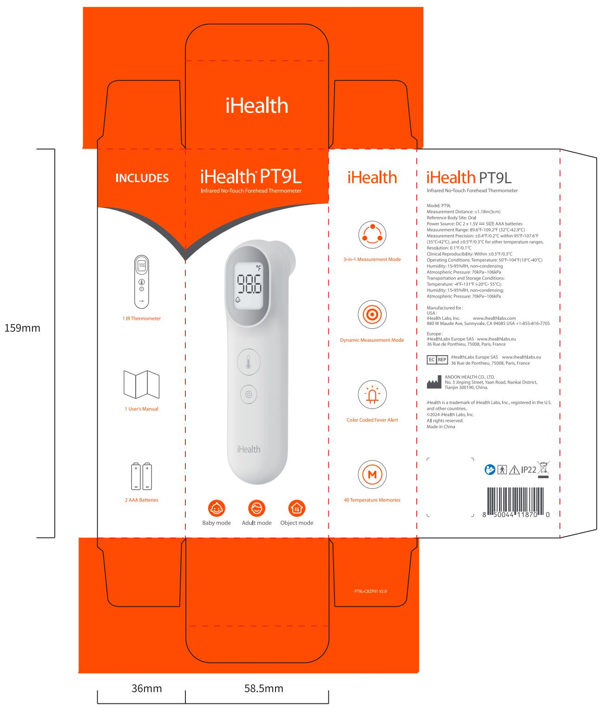

本件要求通过RoHS测试

说明：材质为：350g白卡,覆哑膜

尺寸：58.5X36X159mm，公差：±1mm

印刷颜色：4色+2专色印刷:PANTONE 1655C+PANToNE Cool Gray 11C

<table><tr><td rowspan=1 colspan=1>3</td><td rowspan=1 colspan=1></td><td rowspan=1 colspan=1></td><td rowspan=1 colspan=1>K04020002139</td><td rowspan=1 colspan=1>Signature</td><td rowspan=1 colspan=1>Date</td><td rowspan=1 colspan=2>Tolerance</td><td rowspan=1 colspan=1>Pro material</td><td rowspan=1 colspan=1></td><td rowspan=1 colspan=1>Model NO.</td><td rowspan=1 colspan=2>PT9L</td></tr><tr><td rowspan=1 colspan=1>2</td><td rowspan=1 colspan=1></td><td rowspan=1 colspan=1></td><td rowspan=1 colspan=1>Design</td><td rowspan=1 colspan=1></td><td rowspan=1 colspan=1></td><td rowspan=1 colspan=1>.×</td><td rowspan=1 colspan=1></td><td rowspan=1 colspan=1>Surf dispose</td><td rowspan=1 colspan=1></td><td rowspan=1 colspan=1>Part name</td><td rowspan=1 colspan=2>彩包装</td></tr><tr><td rowspan=1 colspan=1>1</td><td rowspan=1 colspan=1>更改版本号</td><td rowspan=1 colspan=1>2024.09.24</td><td rowspan=1 colspan=1>Checkup</td><td rowspan=1 colspan=1></td><td rowspan=1 colspan=1></td><td rowspan=1 colspan=1>.××</td><td rowspan=1 colspan=1></td><td rowspan=1 colspan=1>Scale</td><td rowspan=1 colspan=1>1:1</td><td rowspan=1 colspan=1>Drawing NO.</td><td rowspan=1 colspan=2>PT9L-CBZP01 V2.0</td></tr><tr><td rowspan=1 colspan=1>No.</td><td rowspan=1 colspan=1>更改记录</td><td rowspan=1 colspan=1>更改时间</td><td rowspan=1 colspan=1>Approve</td><td rowspan=1 colspan=1></td><td rowspan=1 colspan=1></td><td rowspan=1 colspan=1>.×°</td><td rowspan=1 colspan=1></td><td rowspan=1 colspan=1>Units</td><td rowspan=1 colspan=1>mm</td><td rowspan=1 colspan=1>? 广</td><td rowspan=1 colspan=1>Edition</td><td rowspan=1 colspan=1>V2.0</td></tr></table>