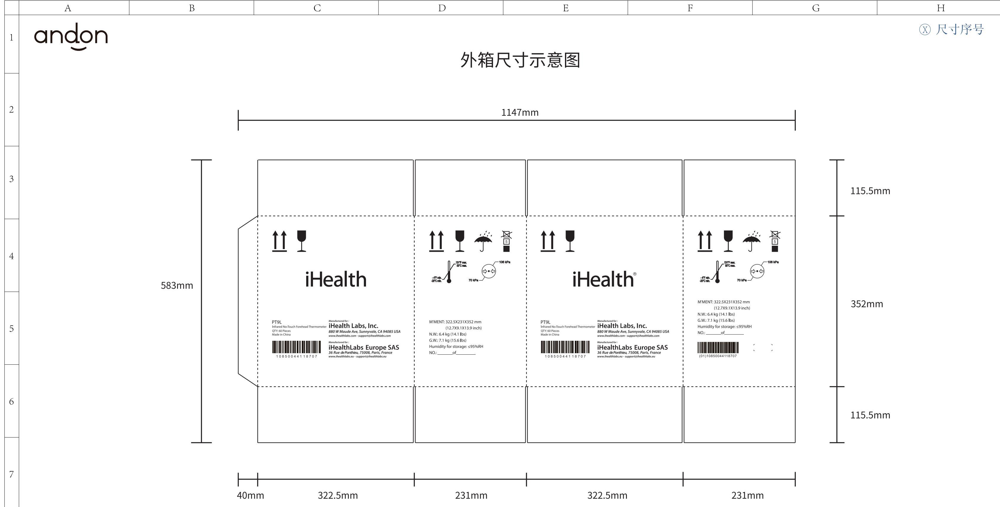

  
1.标注尺寸为外径尺寸：322.5X231X352 mm 公差：±5mm  
2.箱型代号：0201(GB/T6543-2008)，上下摇盖  
3.材质:190g牛皮面纸+170g(A)楞+80g芯纸+130g(B)楞+200g牛皮里纸  
4.箱体连接使用粘合剂，不得使用金属钉线  
5.印刷颜色为黑色  
6.本件要求通过RoHS测试

<table><tr><td rowspan=1 colspan=1>3</td><td rowspan=1 colspan=1></td><td rowspan=1 colspan=1>K04010001435</td><td rowspan=1 colspan=1>Signature</td><td rowspan=1 colspan=3>Date  Tolerance  Pro material</td><td rowspan=1 colspan=1></td><td rowspan=1 colspan=1>Model NO.             PT9L</td></tr><tr><td rowspan=1 colspan=1>2</td><td rowspan=1 colspan=1></td><td rowspan=1 colspan=1>Design</td><td rowspan=1 colspan=1></td><td rowspan=1 colspan=1>×</td><td rowspan=1 colspan=2>Surf dispose</td><td rowspan=1 colspan=1></td><td rowspan=1 colspan=1>Part name            外箱</td></tr><tr><td rowspan=1 colspan=1>1</td><td rowspan=1 colspan=1></td><td rowspan=1 colspan=1>Checkup</td><td rowspan=1 colspan=1></td><td rowspan=1 colspan=1>××</td><td rowspan=1 colspan=1></td><td rowspan=1 colspan=1>Scale</td><td rowspan=1 colspan=1>1:1</td><td rowspan=1 colspan=1>Drawing NO.       PT9L-F01</td></tr><tr><td rowspan=1 colspan=1>No.</td><td rowspan=1 colspan=1>更改记录                          更改时间</td><td rowspan=1 colspan=1>Approve</td><td rowspan=1 colspan=1></td><td rowspan=1 colspan=1>x°</td><td rowspan=1 colspan=2>Units</td><td rowspan=1 colspan=1>mm</td><td rowspan=1 colspan=1>  +         Edition v1.0</td></tr></table>