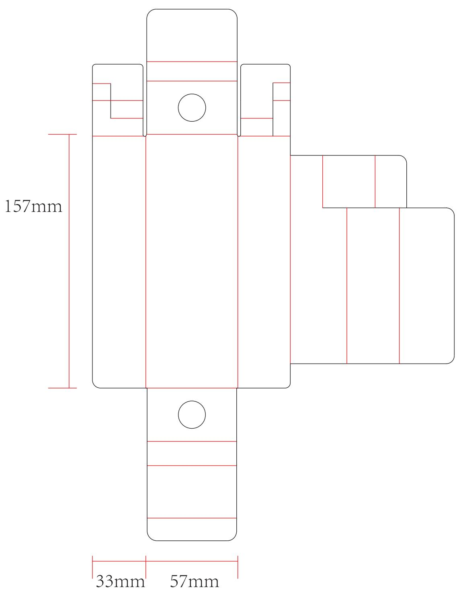

⊗尺寸序号

  
本件要求通过RoHS测试  
说明：材质为：350g白卡纸，覆哑膜  
尺寸:57\*33\*157mm，公差：+1-1

<table><tr><td rowspan=1 colspan=1>3</td><td rowspan=1 colspan=1></td><td rowspan=1 colspan=1></td><td rowspan=1 colspan=1>K04050000271</td><td rowspan=1 colspan=1>Signature</td><td rowspan=1 colspan=1>Date</td><td rowspan=1 colspan=2>Tolerance</td><td rowspan=1 colspan=1>Pro material</td><td rowspan=1 colspan=1></td><td rowspan=1 colspan=1>Model NO.</td><td rowspan=1 colspan=1>PT9L</td></tr><tr><td rowspan=1 colspan=1>2</td><td rowspan=1 colspan=1></td><td rowspan=1 colspan=1></td><td rowspan=1 colspan=1>Design</td><td rowspan=1 colspan=1></td><td rowspan=1 colspan=1></td><td rowspan=1 colspan=1>.×</td><td rowspan=1 colspan=1></td><td rowspan=1 colspan=1>Surf dispose</td><td rowspan=1 colspan=1></td><td rowspan=1 colspan=1>Part name</td><td rowspan=1 colspan=1>纸托</td></tr><tr><td rowspan=2 colspan=1>1No.</td><td rowspan=2 colspan=1>更改记录</td><td rowspan=2 colspan=1>更改时间</td><td rowspan=2 colspan=1>CheckupApprove</td><td rowspan=2 colspan=1></td><td rowspan=2 colspan=1></td><td rowspan=2 colspan=1>.××.×°</td><td rowspan=2 colspan=1></td><td rowspan=2 colspan=1>ScaleUnits</td><td rowspan=1 colspan=1>1:1</td><td rowspan=2 colspan=1>Drawing NO.① +</td><td rowspan=2 colspan=1>PT9L-F04Edition V1.0</td></tr><tr><td rowspan=1 colspan=1>mm</td></tr></table>