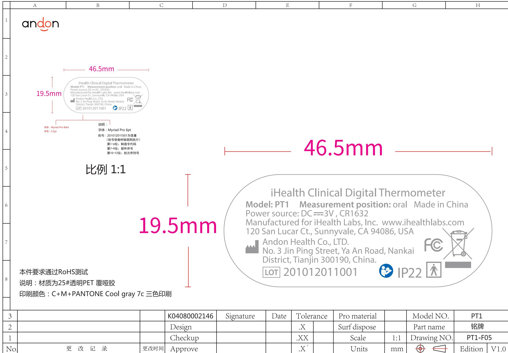

<table><tr><td rowspan=1 colspan=1>3</td><td rowspan=1 colspan=1></td><td rowspan=1 colspan=1></td><td rowspan=1 colspan=1>K04080002146</td><td rowspan=1 colspan=1>Signature</td><td rowspan=1 colspan=1>Date</td><td rowspan=1 colspan=2>Tolerance</td><td rowspan=1 colspan=1>Pro material</td><td rowspan=1 colspan=1></td><td rowspan=1 colspan=1>Model NO.</td><td rowspan=1 colspan=2>PT1</td></tr><tr><td rowspan=1 colspan=1>2</td><td rowspan=1 colspan=1></td><td rowspan=1 colspan=1></td><td rowspan=1 colspan=1>Design</td><td rowspan=1 colspan=1></td><td rowspan=1 colspan=1></td><td rowspan=1 colspan=1>.X</td><td rowspan=1 colspan=1></td><td rowspan=1 colspan=1>Surf dispose</td><td rowspan=1 colspan=1></td><td rowspan=1 colspan=1>Part name</td><td rowspan=1 colspan=2>铭牌</td></tr><tr><td rowspan=1 colspan=1>1</td><td rowspan=1 colspan=1></td><td rowspan=1 colspan=1></td><td rowspan=1 colspan=1>Checkup</td><td rowspan=1 colspan=1></td><td rowspan=1 colspan=1></td><td rowspan=1 colspan=1>.XX</td><td rowspan=1 colspan=1></td><td rowspan=1 colspan=1>Scale</td><td rowspan=1 colspan=1>1:1</td><td rowspan=1 colspan=1>Drawing NO.</td><td rowspan=1 colspan=2>PT1-F05</td></tr><tr><td rowspan=1 colspan=1>No</td><td rowspan=1 colspan=1>更改记录</td><td rowspan=1 colspan=1>更改时间</td><td rowspan=1 colspan=1>Approve</td><td rowspan=1 colspan=1>[</td><td rowspan=1 colspan=1></td><td rowspan=1 colspan=1>.x°$</td><td rowspan=1 colspan=1></td><td rowspan=1 colspan=1>Units</td><td rowspan=1 colspan=1>mm</td><td rowspan=1 colspan=1></td><td rowspan=1 colspan=1>Edition</td><td rowspan=1 colspan=1>V1.0</td></tr></table>