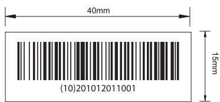
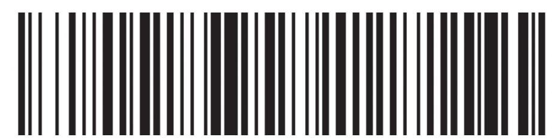

## andon

比例：1:1

说明：  
字体：Myriad Pro 6pt  
(10)批号：201012011001为变量（批号依据柯顿规则执行）第1-6位：制造令代码第7-9位：部件序号第10-12位：批次序列号

(10)201012011001

本件要求通过RoHS测试

说明：80g不干胶铜版纸覆膜

印刷颜色：单黑

<table><tr><td rowspan=1 colspan=1>3</td><td rowspan=1 colspan=1></td><td rowspan=1 colspan=1></td><td rowspan=1 colspan=1>K04080002148</td><td rowspan=1 colspan=1>Signature</td><td rowspan=1 colspan=1>Date</td><td rowspan=1 colspan=2>Tolerance</td><td rowspan=1 colspan=1>Pro material</td><td rowspan=1 colspan=1></td><td rowspan=1 colspan=1>Model NO.</td><td rowspan=1 colspan=2>PT1</td></tr><tr><td rowspan=1 colspan=1>2</td><td rowspan=1 colspan=1></td><td rowspan=1 colspan=1></td><td rowspan=1 colspan=1>Design</td><td rowspan=1 colspan=1></td><td rowspan=1 colspan=1></td><td rowspan=1 colspan=1>.X</td><td rowspan=1 colspan=1>±0.3</td><td rowspan=1 colspan=1>Surf dispose</td><td rowspan=1 colspan=1></td><td rowspan=1 colspan=1>Part name</td><td rowspan=1 colspan=2>条码标签</td></tr><tr><td rowspan=1 colspan=1>1</td><td rowspan=1 colspan=1></td><td rowspan=1 colspan=1></td><td rowspan=1 colspan=1>Checkup</td><td rowspan=1 colspan=1></td><td rowspan=1 colspan=1></td><td rowspan=1 colspan=1>.xX</td><td rowspan=1 colspan=1></td><td rowspan=1 colspan=1>Scale</td><td rowspan=1 colspan=1>1:1</td><td rowspan=1 colspan=1>Drawing NO.</td><td rowspan=1 colspan=2>PT1-F07</td></tr><tr><td rowspan=1 colspan=1>No.</td><td rowspan=1 colspan=1>更改记录</td><td rowspan=1 colspan=1>更改时间</td><td rowspan=1 colspan=1>Approve</td><td rowspan=1 colspan=1></td><td rowspan=1 colspan=1></td><td rowspan=1 colspan=1>.x$</td><td rowspan=1 colspan=1></td><td rowspan=1 colspan=1>Units</td><td rowspan=1 colspan=1>mm</td><td rowspan=1 colspan=1>④</td><td rowspan=1 colspan=1>Edition</td><td rowspan=1 colspan=1>V1.0</td></tr></table>