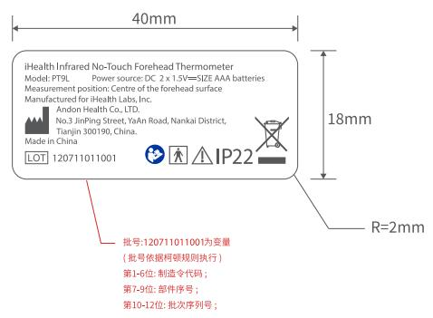

## andon

  
比例1:1

本件要求通过RoHS测试

说明：材质为：25#透明PET覆哑胶

尺寸：40X18mm

iHealth Infrared No-Touch Forehead Thermometer Model: PT9L Power source: DC 2 × 1.5V=SIZE AAA batteries Measurement position: Centre of the forehead surface Manufactured for iHealth Labs, Inc.

Made in China

LOT120711011001

批号:120711011001为变量(批号依据柯顿规则执行)第1-6位:制造令代码；第7-9位: 部件序号；第10-12位: 批次序列号；

<table><tr><td rowspan=1 colspan=1>3</td><td rowspan=1 colspan=1></td><td rowspan=1 colspan=1></td><td rowspan=1 colspan=1>K04080002502</td><td rowspan=1 colspan=1>Signature</td><td rowspan=1 colspan=1>Date</td><td rowspan=1 colspan=2>Tolerance</td><td rowspan=1 colspan=1>Pro material</td><td rowspan=1 colspan=1></td><td rowspan=1 colspan=1>Model NO.</td><td rowspan=1 colspan=2>PT9L</td></tr><tr><td rowspan=1 colspan=1>2</td><td rowspan=1 colspan=1></td><td rowspan=1 colspan=1></td><td rowspan=1 colspan=1>Design</td><td rowspan=1 colspan=1></td><td rowspan=1 colspan=1></td><td rowspan=1 colspan=1>.X</td><td rowspan=1 colspan=1></td><td rowspan=1 colspan=1>Surf dispose</td><td rowspan=1 colspan=1></td><td rowspan=1 colspan=1>Part name</td><td rowspan=1 colspan=2>铭牌</td></tr><tr><td rowspan=1 colspan=1>1</td><td rowspan=1 colspan=1></td><td rowspan=1 colspan=1></td><td rowspan=1 colspan=1>Checkup</td><td rowspan=1 colspan=1></td><td rowspan=1 colspan=1></td><td rowspan=1 colspan=1>.XX</td><td rowspan=1 colspan=1></td><td rowspan=1 colspan=1>Scale</td><td rowspan=1 colspan=1>1:1</td><td rowspan=1 colspan=1>Drawing NO.</td><td rowspan=1 colspan=2>PT9L-F02</td></tr><tr><td rowspan=1 colspan=1>No</td><td rowspan=1 colspan=1>更改记录</td><td rowspan=1 colspan=1>更改时间</td><td rowspan=1 colspan=1>Approve</td><td rowspan=1 colspan=1></td><td rowspan=1 colspan=1></td><td rowspan=1 colspan=1>.X$</td><td rowspan=1 colspan=1></td><td rowspan=1 colspan=1>Units</td><td rowspan=1 colspan=1>mm</td><td rowspan=1 colspan=1>事</td><td rowspan=1 colspan=1>Edition</td><td rowspan=1 colspan=1>V1.0</td></tr></table>