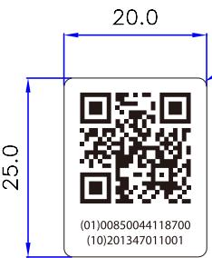

#

二维码图案根据数字的变更相应变更

字体：Myriad Pro 字高：4.5pt  
第二行编码为批号：201347011001为变量（批号依据柯顿规则执行）第1-6位：制造令代码第7-9位：部件序号第10-12位：批次序列号  
(01)00850044118700（10)批号(11)生产日期(17)有效期  
批号、生产日期和有效期的信息内容按照生产现有规则执行  
并根据评审要求以上内容生成二维码

## 技术要求

## (01)00850044118700 (10)201347011001

1.材质：80g白色不干胶铜版纸

2.印刷颜色：单黑印刷

3.表面覆亮膜

4.本件要求通过RoHS测试

<table><tr><td rowspan=1 colspan=1>3</td><td rowspan=1 colspan=1></td><td rowspan=1 colspan=1></td><td rowspan=1 colspan=1>K04080002503</td><td rowspan=1 colspan=1>Signature</td><td rowspan=1 colspan=1>Date</td><td rowspan=1 colspan=2>Tolerance</td><td rowspan=1 colspan=1>Pro material</td><td rowspan=1 colspan=1></td><td rowspan=1 colspan=1>Model NO.</td><td rowspan=1 colspan=2>PT9L</td></tr><tr><td rowspan=1 colspan=1>2</td><td rowspan=1 colspan=1></td><td rowspan=1 colspan=1></td><td rowspan=1 colspan=1>Design</td><td rowspan=1 colspan=1></td><td rowspan=1 colspan=1></td><td rowspan=1 colspan=1>.×</td><td rowspan=1 colspan=1>±0.5</td><td rowspan=1 colspan=1>Surf dispose</td><td rowspan=1 colspan=1></td><td rowspan=1 colspan=1>Part name</td><td rowspan=1 colspan=2>彩包装标签</td></tr><tr><td rowspan=1 colspan=1>1</td><td rowspan=1 colspan=1></td><td rowspan=1 colspan=1></td><td rowspan=1 colspan=1>Checkup</td><td rowspan=1 colspan=1></td><td rowspan=1 colspan=1></td><td rowspan=1 colspan=1>.××</td><td rowspan=1 colspan=1></td><td rowspan=1 colspan=1>Scale</td><td rowspan=1 colspan=1>1:1</td><td rowspan=1 colspan=1>Drawing NO.</td><td rowspan=1 colspan=2>PT9L-F03</td></tr><tr><td rowspan=1 colspan=1>No.</td><td rowspan=1 colspan=1>更改记录</td><td rowspan=1 colspan=1>更改时间</td><td rowspan=1 colspan=1>Approve</td><td rowspan=1 colspan=1>[</td><td rowspan=1 colspan=1></td><td rowspan=1 colspan=1>.×°</td><td rowspan=1 colspan=1></td><td rowspan=1 colspan=1>Units</td><td rowspan=1 colspan=1>mm</td><td rowspan=1 colspan=1> 1</td><td rowspan=1 colspan=1>Edition</td><td rowspan=1 colspan=1>V1.0</td></tr></table>