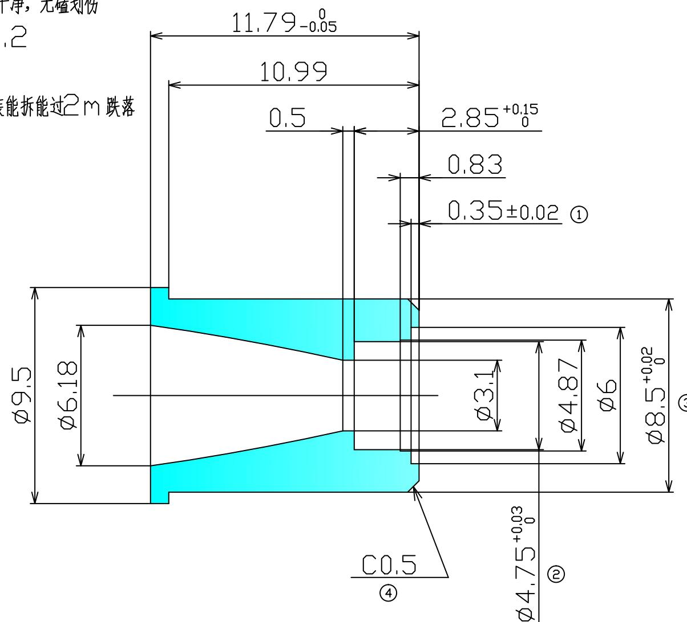

## 技术要求：

1.材质为黄铜，表面电泳高光黑色，清洗干净，无磕划伤

2.未注公差±0.1，未注倒角C0.2

3.带编号尺寸为重点检测尺寸

4.3，4号尺寸与散热器压块套配能装能拆能过2m跌落

<table><tr><td>记号</td><td>日期</td><td>更改內容</td><td>担当</td><td>记号</td><td>日期</td><td>更改內容</td><td>担当</td><td></td><td></td><td></td><td>材质</td><td>黄铜</td><td>名称</td><td>散热器金属套</td></tr><tr><td></td><td></td><td></td><td></td><td></td><td></td><td></td><td></td><td>批准</td><td>审核</td><td>编制</td><td></td><td></td><td></td><td></td></tr><tr><td>订正记录</td><td></td><td></td><td>订正记录</td><td></td><td></td><td></td><td></td><td></td><td></td><td></td><td>处理</td><td>电泳黑色</td><td></td><td></td></tr><tr><td></td><td></td><td></td><td></td><td></td><td></td><td></td><td></td><td></td><td></td><td></td><td>时间</td><td>2018.9.17</td><td>图番</td><td>5B44C</td></tr><tr><td></td><td></td><td></td><td></td><td></td><td></td><td></td><td></td><td></td><td></td><td></td><td></td><td></td><td></td><td></td></tr></table>