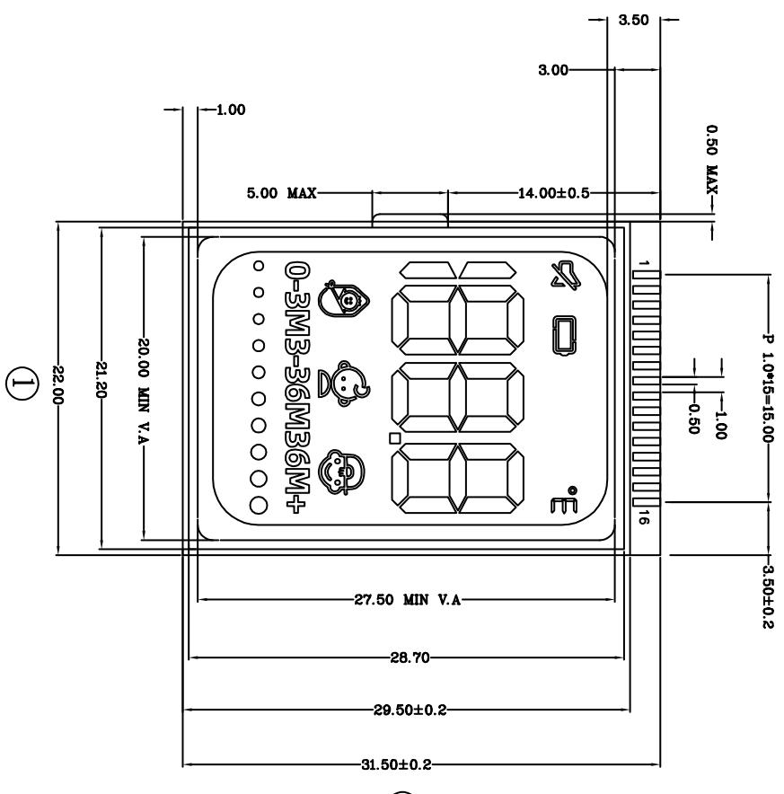
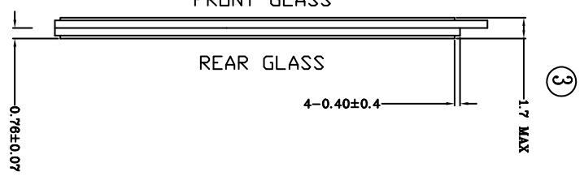
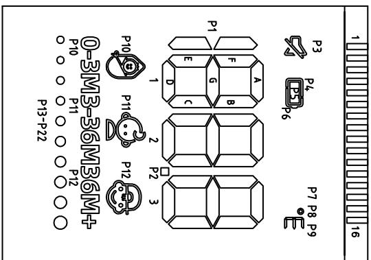

术要求 ：

产品符合roh 2.0

<table><tr><td rowspan=1 colspan=1>3</td><td rowspan=1 colspan=1></td><td rowspan=1 colspan=1></td><td rowspan=1 colspan=1></td><td rowspan=1 colspan=1>Signature</td><td rowspan=1 colspan=1>Date</td><td rowspan=1 colspan=2>Tolerance</td><td rowspan=1 colspan=1>Pro material</td><td rowspan=1 colspan=1>ITO</td><td rowspan=1 colspan=1>Model NO.</td><td rowspan=1 colspan=2>T-Z1</td></tr><tr><td rowspan=1 colspan=1>2</td><td rowspan=1 colspan=1></td><td rowspan=1 colspan=1></td><td rowspan=1 colspan=1>Design</td><td rowspan=1 colspan=1></td><td rowspan=1 colspan=1></td><td rowspan=1 colspan=1>.×</td><td rowspan=1 colspan=1></td><td rowspan=1 colspan=1>Surf dispose</td><td rowspan=1 colspan=1></td><td rowspan=1 colspan=1>Part name</td><td rowspan=1 colspan=2>液晶</td></tr><tr><td rowspan=1 colspan=1>1</td><td rowspan=1 colspan=1>初版制作</td><td rowspan=1 colspan=1>2021.07.15</td><td rowspan=1 colspan=1>Checkup</td><td rowspan=1 colspan=1></td><td rowspan=1 colspan=1></td><td rowspan=1 colspan=1>.××</td><td rowspan=1 colspan=1></td><td rowspan=1 colspan=1>Scale</td><td rowspan=1 colspan=1>2:1</td><td rowspan=1 colspan=1>Drawing NO.</td><td rowspan=1 colspan=2>T-Z1-L01</td></tr><tr><td rowspan=1 colspan=1>No.</td><td rowspan=1 colspan=1>更改记录</td><td rowspan=1 colspan=1>更改时间</td><td rowspan=1 colspan=1>Approve</td><td rowspan=1 colspan=1></td><td rowspan=1 colspan=1></td><td rowspan=1 colspan=1>.x°$</td><td rowspan=1 colspan=1></td><td rowspan=1 colspan=1>Units</td><td rowspan=1 colspan=1>mm</td><td rowspan=1 colspan=1>↓】</td><td rowspan=1 colspan=1>Edition</td><td rowspan=1 colspan=1>V1.0</td></tr></table>

<table><tr><td rowspan=1 colspan=1>PIN</td><td rowspan=1 colspan=1>1</td><td rowspan=1 colspan=1>2</td><td rowspan=1 colspan=1>3</td><td rowspan=1 colspan=1>4</td><td rowspan=1 colspan=1>5</td><td rowspan=1 colspan=1>6</td><td rowspan=1 colspan=1>7</td><td rowspan=1 colspan=1>8</td><td rowspan=1 colspan=1>9</td><td rowspan=1 colspan=1>10</td><td rowspan=1 colspan=1>11</td><td rowspan=1 colspan=1>12</td><td rowspan=1 colspan=1>13</td><td rowspan=1 colspan=1>14</td><td rowspan=1 colspan=1>15</td><td rowspan=1 colspan=1>16</td></tr><tr><td rowspan=1 colspan=1></td><td rowspan=1 colspan=1></td><td rowspan=1 colspan=1></td><td rowspan=1 colspan=1></td><td rowspan=1 colspan=1></td><td rowspan=1 colspan=1>S0</td><td rowspan=1 colspan=1>S1</td><td rowspan=1 colspan=1>S2</td><td rowspan=1 colspan=1>S3</td><td rowspan=1 colspan=1>S4</td><td rowspan=1 colspan=1>S5</td><td rowspan=1 colspan=1>S6</td><td rowspan=1 colspan=1>57</td><td rowspan=1 colspan=1>58</td><td rowspan=1 colspan=1>S9</td><td rowspan=1 colspan=1>S10</td><td rowspan=1 colspan=1>S11</td></tr><tr><td rowspan=1 colspan=1>COMO</td><td rowspan=1 colspan=1></td><td rowspan=1 colspan=1></td><td rowspan=1 colspan=1></td><td rowspan=1 colspan=1>COMO</td><td rowspan=1 colspan=1>P1</td><td rowspan=1 colspan=1>1A</td><td rowspan=1 colspan=1>P2</td><td rowspan=1 colspan=1>2A</td><td rowspan=1 colspan=1>P3</td><td rowspan=1 colspan=1>3A</td><td rowspan=1 colspan=1>P4</td><td rowspan=1 colspan=1>P8</td><td rowspan=1 colspan=1>P12</td><td rowspan=1 colspan=1>P16</td><td rowspan=1 colspan=1>P20</td><td rowspan=1 colspan=1>-</td></tr><tr><td rowspan=1 colspan=1>COM1</td><td rowspan=1 colspan=1></td><td rowspan=1 colspan=1></td><td rowspan=1 colspan=1>COM1</td><td rowspan=1 colspan=1></td><td rowspan=1 colspan=1>1F</td><td rowspan=1 colspan=1>1B</td><td rowspan=1 colspan=1>2F</td><td rowspan=1 colspan=1>2B</td><td rowspan=1 colspan=1>3F</td><td rowspan=1 colspan=1>3B</td><td rowspan=1 colspan=1>P5</td><td rowspan=1 colspan=1>P9</td><td rowspan=1 colspan=1>P13</td><td rowspan=1 colspan=1>P17</td><td rowspan=1 colspan=1>P21</td><td rowspan=1 colspan=1>-</td></tr><tr><td rowspan=1 colspan=1>C_M2</td><td rowspan=1 colspan=1></td><td rowspan=1 colspan=1>COM2</td><td rowspan=1 colspan=1></td><td rowspan=1 colspan=1></td><td rowspan=1 colspan=1>1G</td><td rowspan=1 colspan=1>1C</td><td rowspan=1 colspan=1>2G</td><td rowspan=1 colspan=1>2c$</td><td rowspan=1 colspan=1>3G</td><td rowspan=1 colspan=1>3C</td><td rowspan=1 colspan=1>P6</td><td rowspan=1 colspan=1>P10</td><td rowspan=1 colspan=1>P14</td><td rowspan=1 colspan=1>P18</td><td rowspan=1 colspan=1>P22</td><td rowspan=1 colspan=1>-</td></tr><tr><td rowspan=1 colspan=1>COM3</td><td rowspan=1 colspan=1>COM3</td><td rowspan=1 colspan=1></td><td rowspan=1 colspan=1></td><td rowspan=1 colspan=1></td><td rowspan=1 colspan=1>1E</td><td rowspan=1 colspan=1>1D</td><td rowspan=1 colspan=1>2E</td><td rowspan=1 colspan=1>2D</td><td rowspan=1 colspan=1>3E</td><td rowspan=1 colspan=1>3D</td><td rowspan=1 colspan=1>P7</td><td rowspan=1 colspan=1>P11</td><td rowspan=1 colspan=1>P15</td><td rowspan=1 colspan=1>P19</td><td rowspan=1 colspan=1>-</td><td rowspan=1 colspan=1>-</td></tr></table>

分段代码图  
