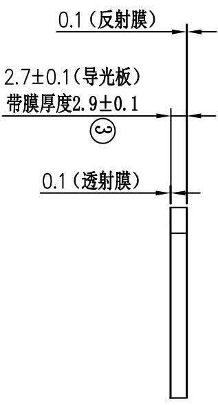
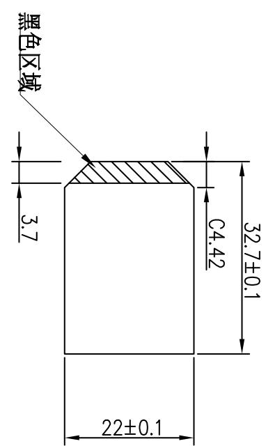
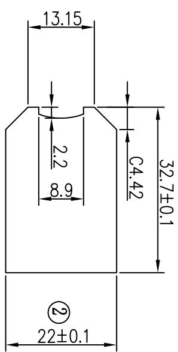
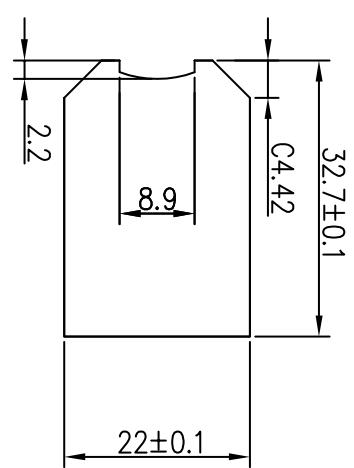

<table><tr><td rowspan=1 colspan=1>3</td><td rowspan=1 colspan=1></td><td rowspan=1 colspan=1></td><td rowspan=1 colspan=1></td><td rowspan=1 colspan=1>Signature</td><td rowspan=1 colspan=1>Date</td><td rowspan=1 colspan=2>Tolerance</td><td rowspan=1 colspan=1>Pro material</td><td rowspan=1 colspan=1>PMMA</td><td rowspan=1 colspan=1>Model NO.</td><td rowspan=1 colspan=2>T-Z1</td></tr><tr><td rowspan=1 colspan=1>2</td><td rowspan=1 colspan=1></td><td rowspan=1 colspan=1></td><td rowspan=1 colspan=1>Design</td><td rowspan=1 colspan=1></td><td rowspan=1 colspan=1></td><td rowspan=1 colspan=1>.×</td><td rowspan=1 colspan=1></td><td rowspan=1 colspan=1>Surf dispose</td><td rowspan=1 colspan=1></td><td rowspan=1 colspan=1>Part name</td><td rowspan=1 colspan=2>导光板</td></tr><tr><td rowspan=1 colspan=1>1</td><td rowspan=1 colspan=1></td><td rowspan=1 colspan=1></td><td rowspan=1 colspan=1>Checkup</td><td rowspan=1 colspan=1></td><td rowspan=1 colspan=1></td><td rowspan=1 colspan=1>.××</td><td rowspan=1 colspan=1></td><td rowspan=1 colspan=1>Scale</td><td rowspan=1 colspan=1>1:1</td><td rowspan=1 colspan=1>Drawing NO.</td><td rowspan=1 colspan=2>T-Z1-P10</td></tr><tr><td rowspan=1 colspan=1>No.</td><td rowspan=1 colspan=1>更改记录</td><td rowspan=1 colspan=1>更改时间</td><td rowspan=1 colspan=1>Approve</td><td rowspan=1 colspan=1></td><td rowspan=1 colspan=1></td><td rowspan=1 colspan=1>.x°$</td><td rowspan=1 colspan=1></td><td rowspan=1 colspan=1>Units</td><td rowspan=1 colspan=1>mm</td><td rowspan=1 colspan=1></td><td rowspan=1 colspan=1>Edition</td><td rowspan=1 colspan=1>V1.0</td></tr></table>

透射膜

  
导光板

<table><tr><td rowspan=2 colspan=1>日</td><td rowspan=2 colspan=1>SELECT LEVEL</td><td rowspan=1 colspan=1>ANGULAR</td><td rowspan=1 colspan=1>&gt;100</td><td rowspan=1 colspan=1>&gt;50~100</td><td rowspan=1 colspan=1>&gt;15~50</td><td rowspan=1 colspan=1>&gt;5~15</td><td rowspan=1 colspan=1>&lt;5</td><td rowspan=1 colspan=1>DTMLEVEL</td></tr><tr><td rowspan=1 colspan=1>±0.1°</td><td rowspan=1 colspan=1>±0.1%</td><td rowspan=1 colspan=1>±0.08</td><td rowspan=1 colspan=1>±0.05</td><td rowspan=1 colspan=1>±0.05</td><td rowspan=1 colspan=1>±0.03</td><td rowspan=3 colspan=1>GENERAL TOLERANCE</td></tr><tr><td rowspan=1 colspan=2>中</td><td rowspan=1 colspan=1>±0.5°</td><td rowspan=1 colspan=1>±0.2%</td><td rowspan=1 colspan=1>±0.2</td><td rowspan=1 colspan=1></td><td rowspan=1 colspan=1>0</td><td rowspan=1 colspan=1></td><td rowspan=1 colspan=1></td></tr><tr><td rowspan=1 colspan=2></td><td rowspan=1 colspan=1>±0.5°</td><td rowspan=1 colspan=1>±0.3%</td><td rowspan=1 colspan=1>±0.3</td><td rowspan=1 colspan=1></td><td rowspan=1 colspan=1>±0.15</td><td rowspan=1 colspan=1>±0.15</td><td rowspan=1 colspan=1></td></tr></table>

反射膜  
