<table>
  <tr>
    <th colspan="10">
PT9L检验作业指导书（标准）
</th>
  </tr>
  <tr>
    <td colspan="10">
编号：QI-PT9L-EF01
</td>
  </tr>
  <tr>
    <td>
Type
</td>
    <td>
Page
</td>
    <td colspan="2">
Progress Name
</td>
    <td>
Ver.No
</td>
    <td>
Date
</td>
    <td>
Prepared
</td>
    <td>
Checked
</td>
    <td colspan="2">
Approved
</td>
  </tr>
  <tr>
    <td>
部件名称
</td>
    <td>
 页码   
</td>
    <td colspan="2">
   工序名称  
</td>
    <td>
版本
</td>
    <td>
生效期
</td>
    <td>
准备
</td>
    <td>
审核
</td>
    <td colspan="2">
批准
</td>
  </tr>
  <tr>
    <td rowspan="3">
成品
</td>
    <td rowspan="3">
1/1
</td>
    <td rowspan="3" colspan="2">
上电全显
提示音开关
</td>
    <td rowspan="3">
1.0
</td>
    <td rowspan="3">
2024.06.20
</td>
    <td>

</td>
    <td>

</td>
    <td>

</td>
    <td>

</td>
  </tr>
  <tr>
    <td>

</td>
    <td>

</td>
    <td>

</td>
    <td>

</td>
  </tr>
  <tr>
    <td>

</td>
    <td>

</td>
    <td>

</td>
    <td>

</td>
  </tr>
  <tr>
    <td>
检验项目
</td>
    <td>
检验用具
</td>
    <td colspan="5">
检验方法
</td>
    <td colspan="3">
合格标准
</td>
  </tr>
  <tr>
    <td rowspan="22">
上电全显
提示音开关
</td>
    <td rowspan="22">
漏电流表(B02ZXXXXXX)或精密智能电源(B02JXXXXXX)
调至3V
电池工装(P03PXXXXXX)
（或2节7号电池）
</td>
    <td rowspan="22" colspan="3">
将电压调整输出为3±0.1V，电池工装与电流检测仪正确连接

1.主机上电后会进入全显模式：白色背光灯点亮，LCD显示屏全显，此时检查显示内容是否正确，是否有乱显，多显，少显现象，同时蜂鸣器响，2S后进入待机模式

2.通过机器侧面静音键控制提示音，当静音键置于关时，屏幕出现静音符号，此时提示音关；当静音键置于开时，屏幕上静音符号消失，此时提示音开。
</td>
    <td rowspan="22" colspan="2">
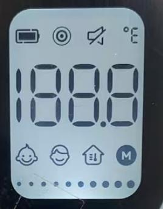
</td>
    <td rowspan="22" colspan="3">
1、注意观察全显过程液晶显示要正确,不允许有乱码;也不允许有缺段、重影、显示深浅不一致、闪烁

缺陷等级：MI

</td>
  </tr>
  <tr>
  </tr>
  <tr>
  </tr>
  <tr>
  </tr>
  <tr>
  </tr>
  <tr>
  </tr>
  <tr>
  </tr>
  <tr>
  </tr>
  <tr>
  </tr>
  <tr>
  </tr>
  <tr>
  </tr>
  <tr>
  </tr>
  <tr>
  </tr>
  <tr>
  </tr>
  <tr>
  </tr>
  <tr>
  </tr>
  <tr>
  </tr>
  <tr>
  </tr>
  <tr>
  </tr>
  <tr>
  </tr>
  <tr>
  </tr>
  <tr>
  </tr>
</table>

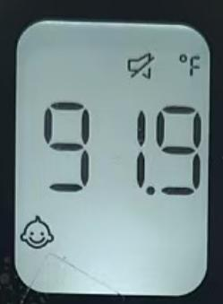

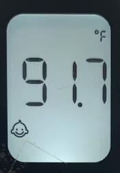

<table>
  <tr>
    <th colspan="10">
PT9L检验作业指导书（标准）
</th>
  </tr>
  <tr>
    <td colspan="10">
编号：QI-PT9L-EF02
</td>
  </tr>
  <tr>
    <td>
Type
</td>
    <td>
Page
</td>
    <td colspan="2">
Progress Name
</td>
    <td>
Ver.No.
</td>
    <td>
Date
</td>
    <td>
Prepared
</td>
    <td>
Checked
</td>
    <td colspan="2">
Approved
</td>
  </tr>
  <tr>
    <td>
部件名称
</td>
    <td>
页码
</td>
    <td colspan="2">
工序名称  
</td>
    <td>
版本
</td>
    <td>
生效期
</td>
    <td>
准备
</td>
    <td>
审核
</td>
    <td colspan="2">
批准
</td>
  </tr>
  <tr>
    <td>
成品
</td>
    <td>
1/1
</td>
    <td colspan="2">
低电检验
</td>
    <td>
1
</td>
    <td>
2024.06.20
</td>
    <td>

</td>
    <td>

</td>
    <td>

</td>
    <td>

</td>
  </tr>
  <tr>
    <td>
检验项目
</td>
    <td colspan="2">
检验用具
</td>
    <td colspan="5">
检验方法
</td>
    <td colspan="2">
合格标准
</td>
  </tr>
  <tr>
    <td rowspan="3">
低电
检验
</td>
    <td rowspan="3" colspan="2">
漏电流表(B02ZXXXXXX)或精密智能电源(B02JXXXXXX)
调至3V
电池工装(P03PXXXXXX)
</td>
    <td rowspan="3" colspan="2">
1.将供电电压调节至2.7V±0.05V之间，接入产品开机后进行一次模拟测量，测量完毕后屏幕显示低电电池符号

2.将供电电压调节至2.5V±0.05V之间，接入产品开机后产品必须显示低电压符号闪烁8S并关机。

3.测试完成后取下电池工装，记录测试结果。 
</td>
    <td rowspan="3" colspan="3">
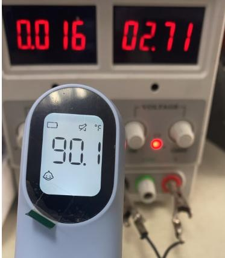
</td>
    <td rowspan="3" colspan="2">
1.供电电压在2.7V±0.05V之间，产品开机后进行一次模拟测量，测量完毕后L屏幕显示电池符号均为合格
缺陷等级：MA

2.将供电电压调节至2.5V，接入产品开机后产品必须显示低电压符号闪烁8S并关机。
缺陷等级：MA

</td>
  </tr>
  <tr>
  </tr>
  <tr>
  </tr>
</table>

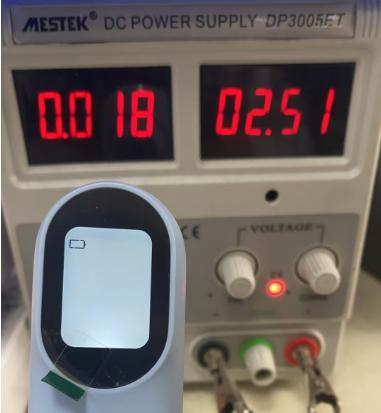

<table>
  <tr>
    <th colspan="10">
PT9L检验作业指导书（标准）
</th>
  </tr>
  <tr>
    <td colspan="10">
编号：QI-PT9L-EF03
</td>
  </tr>
  <tr>
    <td>
Type
</td>
    <td>
Page
</td>
    <td colspan="2">
Progress Name
</td>
    <td>
Ver.No.
</td>
    <td>
Date
</td>
    <td>
Prepared
</td>
    <td>
Checked
</td>
    <td colspan="2">
Approved
</td>
  </tr>
  <tr>
    <td>
部件名称
</td>
    <td>
页码
</td>
    <td colspan="2">
工序名称  
</td>
    <td>
版本
</td>
    <td>
生效期
</td>
    <td>
准备
</td>
    <td>
审核
</td>
    <td colspan="2">
批准
</td>
  </tr>
  <tr>
    <td>
成品
</td>
    <td>
1/1
</td>
    <td colspan="2">
电池反接
</td>
    <td>
1
</td>
    <td>
2024.06.20
</td>
    <td>

</td>
    <td>

</td>
    <td>

</td>
    <td>

</td>
  </tr>
  <tr>
    <td>
检验项目
</td>
    <td colspan="2">
检验用具
</td>
    <td colspan="5">
检验方法
</td>
    <td colspan="2">
合格标准
</td>
  </tr>
  <tr>
    <td rowspan="3">
电池反接（每批次5台）
</td>
    <td rowspan="3" colspan="2">
2节7号电池
</td>
    <td rowspan="3" colspan="2">
把电池用相反方向放入机器，机器应无明显反应。再次把电池按正确方法放入后，机器应能正常工作。
</td>
    <td rowspan="3" colspan="3">
  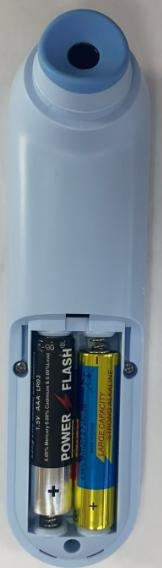
</td>
    <td rowspan="3" colspan="2">
不可有明火或冒烟现象
缺陷等级：CR
</td>
  </tr>
  <tr>
  </tr>
  <tr>
  </tr>
</table>

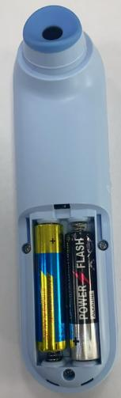

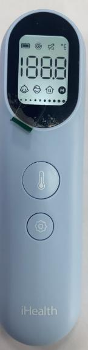

<table>
  <tr>
    <th colspan="10">
PT9L检验作业指导书（标准）
</th>
  </tr>
  <tr>
    <td colspan="10">
编号：QI-PT9L-EF04
</td>
  </tr>
  <tr>
    <td>
Type
</td>
    <td>
Page
</td>
    <td colspan="2">
Progress Name
</td>
    <td>
Ver.No.
</td>
    <td>
Date
</td>
    <td>
Prepared
</td>
    <td>
Checked
</td>
    <td colspan="2">
Approved
</td>
  </tr>
  <tr>
    <td>
部件名称
</td>
    <td>
页码
</td>
    <td colspan="2">
工序名称  
</td>
    <td>
版本
</td>
    <td>
生效期
</td>
    <td>
准备
</td>
    <td>
审核
</td>
    <td colspan="2">
批准
</td>
  </tr>
  <tr>
    <td>
成品
</td>
    <td>
1/1
</td>
    <td colspan="2">
测量模式切换
</td>
    <td>
1
</td>
    <td>
2024.06.20
</td>
    <td>

</td>
    <td>

</td>
    <td>

</td>
    <td>

</td>
  </tr>
  <tr>
    <td>
检验项目
</td>
    <td colspan="2">
检验用具
</td>
    <td colspan="5">
检验方法
</td>
    <td colspan="2">
合格标准
</td>
  </tr>
  <tr>
    <td rowspan="3">
测量模式切换
</td>
    <td rowspan="3" colspan="2">
2节7号电池
</td>
    <td rowspan="3" colspan="2">
给主机上电

测量状态下短按设置按键进入模式切换状态，
短按设置键循环切换
婴儿模式如图1，
成人模式如图2
物温模式如图3 
</td>
    <td rowspan="3" colspan="3">
  
</td>
    <td rowspan="3" colspan="2">
测量模式可成功切换
缺陷等级：MA
</td>
  </tr>
  <tr>
  </tr>
  <tr>
  </tr>
</table>

<table>
  <tr>
    <th colspan="10">
PT9L检验作业指导书（标准）
</th>
  </tr>
  <tr>
    <td colspan="10">
编号：QI-PT9L-EF05
</td>
  </tr>
  <tr>
    <td>
Type
</td>
    <td>
Page
</td>
    <td colspan="2">
Progress Name
</td>
    <td>
Ver.No.
</td>
    <td>
Date
</td>
    <td>
Prepared
</td>
    <td>
Checked
</td>
    <td colspan="2">
Approved
</td>
  </tr>
  <tr>
    <td>
部件名称
</td>
    <td>
页码
</td>
    <td colspan="2">
工序名称  
</td>
    <td>
版本
</td>
    <td>
生效期
</td>
    <td>
准备
</td>
    <td>
审核
</td>
    <td colspan="2">
批准
</td>
  </tr>
  <tr>
    <td>
成品
</td>
    <td>
1/1
</td>
    <td colspan="2">
测量单位切换
</td>
    <td>
1
</td>
    <td>
2024.06.20
</td>
    <td>

</td>
    <td>

</td>
    <td>

</td>
    <td>

</td>
  </tr>
  <tr>
    <td>
检验项目
</td>
    <td colspan="2">
检验用具
</td>
    <td colspan="5">
检验方法
</td>
    <td colspan="2">
合格标准
</td>
  </tr>
  <tr>
    <td rowspan="3">
测量单位切换
</td>
    <td rowspan="3" colspan="2">
2节7号电池
</td>
    <td rowspan="3" colspan="2">
给主机上电

1.待机状态下长按测量键8秒，进入单位切换状态；

2.短按测量键切换℃或℉单位，对应的单位符号闪烁，并伴有短蜂鸣一声；

3.长按测量键2秒以确认所选单位，对应的单位符号将常亮2秒并伴有短蜂鸣一声。之后体温计将自动关机。
</td>
    <td rowspan="3" colspan="3">
   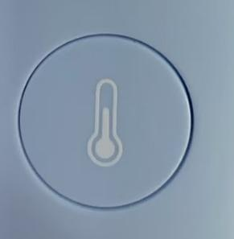
</td>
    <td rowspan="3" colspan="2">
单位可以成功切换
缺陷等级：MA
</td>
  </tr>
  <tr>
  </tr>
  <tr>
  </tr>
</table>

<table>
  <tr>
    <th colspan="10">
PT9L检验作业指导书（标准）
</th>
  </tr>
  <tr>
    <td colspan="10">
编号：QI-PT9L-EF06
</td>
  </tr>
  <tr>
    <td>
Type
</td>
    <td>
Page
</td>
    <td colspan="2">
Progress Name
</td>
    <td>
Ver.No.
</td>
    <td>
Date
</td>
    <td>
Prepared
</td>
    <td>
Checked
</td>
    <td colspan="2">
Approved
</td>
  </tr>
  <tr>
    <td>
部件名称
</td>
    <td>
页码
</td>
    <td colspan="2">
工序名称  
</td>
    <td>
版本
</td>
    <td>
生效期
</td>
    <td>
准备
</td>
    <td>
审核
</td>
    <td colspan="2">
批准
</td>
  </tr>
  <tr>
    <td>
成品
</td>
    <td>
1/1
</td>
    <td colspan="2">
背光灯检验
</td>
    <td>
1
</td>
    <td>
2024.06.20
</td>
    <td>

</td>
    <td>

</td>
    <td>

</td>
    <td>

</td>
  </tr>
  <tr>
    <td>
检验项目
</td>
    <td colspan="2">
检验用具
</td>
    <td colspan="5">
检验方法
</td>
    <td colspan="2">
合格标准
</td>
  </tr>
  <tr>
    <td rowspan="3">
背光灯检验
（每批抽5台）
</td>
    <td rowspan="3" colspan="2">
2节七号电池
</td>
    <td rowspan="3" colspan="2">
环境要求：室温：24℃-26℃ 相对湿度：30%-70%
将恒温水槽分别设定在34℃、35.7℃、37℃，待恒温水槽温度稳定后，使用体温计进行测量：

1. 体温计应处于用户模式，不要进入黑体模式；

2. 对被测水槽连续测量三次，不必关注屏幕显示的温度，只看背光颜色；

3. 要求：测试34℃水槽时背光应为白色如图1，
4.测试35.7℃水槽时背光应为橙色如图2，

5.测试37℃水槽时背光应为红色如图3，

6.对测试结果不符合规定的温度计，可复测两次，两次复测合格，亦可作合格处理。

</td>
    <td rowspan="3" colspan="3">
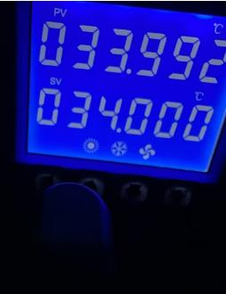 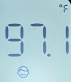
</td>
    <td rowspan="3" colspan="2">
1.测试34℃水槽时背光应为白色
2.测试35.7℃水槽时背光应为橙色
3.测试37℃水槽时背光应为红色

缺陷等级：MA

</td>
  </tr>
  <tr>
  </tr>
  <tr>
  </tr>
</table>

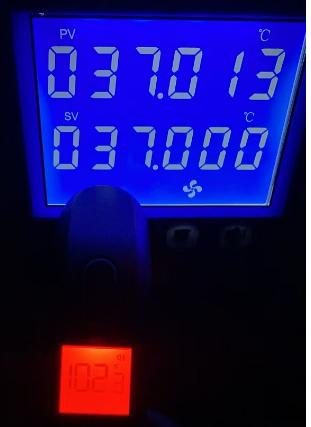

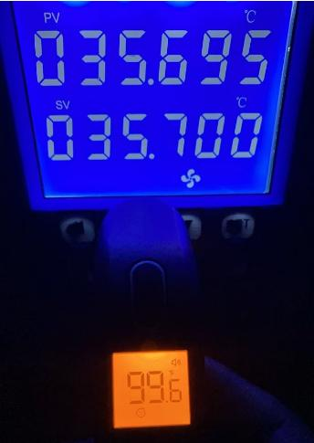

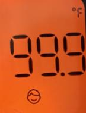

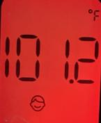

<table>
  <tr>
    <th colspan="10">
PT9L检验作业指导书（标准）
</th>
  </tr>
  <tr>
    <td colspan="10">
编号：QI-PT9L-EF07
</td>
  </tr>
  <tr>
    <td>
Type
</td>
    <td>
Page
</td>
    <td colspan="2">
Progress Name
</td>
    <td>
Ver.No.
</td>
    <td>
Date
</td>
    <td>
Prepared
</td>
    <td>
Checked
</td>
    <td colspan="2">
Approved
</td>
  </tr>
  <tr>
    <td>
部件名称
</td>
    <td>
页码
</td>
    <td colspan="2">
工序名称  
</td>
    <td>
版本
</td>
    <td>
生效期
</td>
    <td>
准备
</td>
    <td>
审核
</td>
    <td colspan="2">
批准
</td>
  </tr>
  <tr>
    <td>
成品
</td>
    <td>
1/1
</td>
    <td colspan="2">
精度测量
</td>
    <td>
1
</td>
    <td>
2024.06.20
</td>
    <td>

</td>
    <td>

</td>
    <td>

</td>
    <td>

</td>
  </tr>
  <tr>
    <td>
检验项目
</td>
    <td colspan="2">
检验用具
</td>
    <td colspan="5">
检验方法
</td>
    <td colspan="2">
合格标准
</td>
  </tr>
  <tr>
    <td rowspan="3">
精度测量
</td>
    <td rowspan="3" colspan="2">
2节7号电池
环境要求：室温：23.0±2.0℃ 相对湿度：50%RH±20%RH

高精度低温恒温槽（B067XXXXXX）（调整为 32℃、32.5℃、35℃、38.5℃、42℃、42.5℃、42.9℃，、用温度计每1小时校准一次并记录数值
黑体
(B068XXXXXX)
水银温度计
(B04KXXXXXX)
温湿度记录仪
（B04MXXXXXX）

测试条件：
测试前，调整水槽到指定温度
恒温室温湿度要求：温度：25.0±1℃，湿度：30~70%RH。
恒温水槽精度要求：
32℃水槽：32±0.05℃
32.5℃水槽：32.5±0.05℃
35℃水槽：35±0.05℃
38.5℃水槽：
38.5±0.05℃
42℃水槽：42±0.05℃
42.5℃水槽：
42.5±0.05℃
42.9℃水槽
42.9±0.05℃
</td>
    <td rowspan="3" colspan="2">
1.将主机放置在恒温室静置120分钟或以上；

2.测试员左手拿取待测主机，按住按键，右手将电池装入电池仓内，此时主机将自动开机，屏幕显示“CAL”模式；如图1

3.此时松开按键，屏幕显示CAL后显示当前环境温度值此时会有提示音；如图2 

4.测试员分别对34℃、34.5℃、35℃、38.5℃、42℃、42.5℃、43℃的黑体进行测量，每个温度连续测量3次（每次间隔不小于1秒）；测量方法如下：将主机放置在黑体工装上，确认主机放置平稳无晃动后，按下按键进行测温；

</td>
    <td rowspan="3" colspan="3">
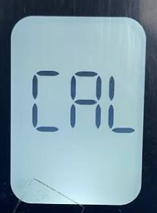
</td>
    <td rowspan="3" colspan="2">
精度要求：≥35℃且≤42℃：±0.2℃，其它：±0.3℃。

每台主机同一温度连续测量的3次温度结果不得超过测量目标温度：

摄氏度℃精度要求：
32.0℃：31.7―32.3℃；
32.5℃：32.3―32.7℃；
35.0℃：34.8―35.2℃；
38.5℃：38.3―38.7℃；
42.0℃：41.8―42.2℃；
42.5℃：42.2―42.8℃；
42.9℃：42.6―43.2℃；

华氏度℉精度要求：
89.6℉：89.1―90.1℉；
90.5℉：90.3―90.7℉；
95.0℉：94.8―95.2℉；
101.3℉：101.1―101.5℉；
107.6℉：107.4―107.8℉；
108.5℉:108.2―108.8℉；
109.2℉:108.9―109.5℉；

摄氏度与华氏度对照表：

32.0℃=89.6℉
32.5℃=90.5℉
35.0℃=95.0℉
38.5℃=101.3℉
42.0℃=107.6℉
42.5℃=108.5℉
42.9℃=109.2℉

缺陷等级：MA
</td>
  </tr>
  <tr>
  </tr>
  <tr>
  </tr>
</table>

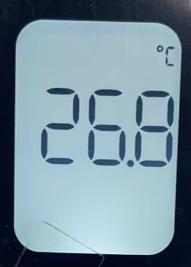

<table>
  <tr>
    <th colspan="10">
PT9L检验作业指导书（标准）
</th>
  </tr>
  <tr>
    <td colspan="10">
编号：QI-PT9L-EF08
</td>
  </tr>
  <tr>
    <td>
Type
</td>
    <td>
Page
</td>
    <td colspan="2">
Progress Name
</td>
    <td>
Ver.No.
</td>
    <td>
Date
</td>
    <td>
Prepared
</td>
    <td>
Checked
</td>
    <td colspan="2">
Approved
</td>
  </tr>
  <tr>
    <td>
部件名称
</td>
    <td>
页码
</td>
    <td colspan="2">
工序名称  
</td>
    <td>
版本
</td>
    <td>
生效期
</td>
    <td>
准备
</td>
    <td>
审核
</td>
    <td colspan="2">
批准
</td>
  </tr>
  <tr>
    <td>
成品
</td>
    <td>
1/1
</td>
    <td colspan="2">
外观检验
</td>
    <td>
1
</td>
    <td>
2024.06.20
</td>
    <td>

</td>
    <td>

</td>
    <td>

</td>
    <td>

</td>
  </tr>
  <tr>
    <td>
检验项目
</td>
    <td colspan="2">
检验用具
</td>
    <td colspan="5">
检验方法
</td>
    <td colspan="2">
合格标准
</td>
  </tr>
  <tr>
    <td rowspan="3">
清除记忆
</td>
    <td rowspan="3" colspan="2">
2节7号电池
</td>
    <td rowspan="3" colspan="2">
1.关机状态下，同时长按测量键+设置键8秒钟，屏幕显示图标M和DEL闪烁，此时可以松开按键；

2.两秒后M图标消失，此时记忆删除成功；

3.待机器黑屏后，取出电池。
</td>
    <td rowspan="3" colspan="3">
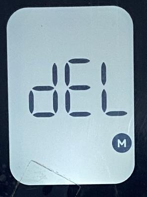
</td>
    <td rowspan="3" colspan="2">
成功清楚记忆
缺陷等级：MA
</td>
  </tr>
  <tr>
  </tr>
  <tr>
  </tr>
</table>

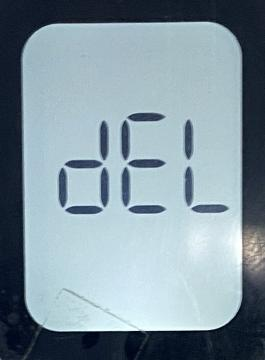

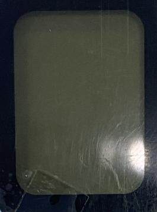

<table>
  <tr>
    <th colspan="10">
PT9L检验作业指导书（标准）
</th>
  </tr>
  <tr>
    <td colspan="10">
编号：QI-PT9L-EF09
</td>
  </tr>
  <tr>
    <td>
Type
</td>
    <td>
Page
</td>
    <td colspan="2">
Progress Name
</td>
    <td>
Ver.No.
</td>
    <td>
Date
</td>
    <td>
Prepared
</td>
    <td>
Checked
</td>
    <td colspan="2">
Approved
</td>
  </tr>
  <tr>
    <td>
部件名称
</td>
    <td>
页码
</td>
    <td colspan="2">
工序名称  
</td>
    <td>
版本
</td>
    <td>
生效期
</td>
    <td>
准备
</td>
    <td>
审核
</td>
    <td colspan="2">
批准
</td>
  </tr>
  <tr>
    <td>
成品
</td>
    <td>
1/1
</td>
    <td colspan="2">
外观检验
</td>
    <td>
1
</td>
    <td>
2024.06.20
</td>
    <td>

</td>
    <td>

</td>
    <td>

</td>
    <td>

</td>
  </tr>
  <tr>
    <td>
检验项目
</td>
    <td colspan="2">
检验用具
</td>
    <td colspan="5">
检验方法
</td>
    <td colspan="2">
合格标准
</td>
  </tr>
  <tr>
    <td rowspan="3">
外观检验

</td>
    <td rowspan="3" colspan="2">
手套

</td>
    <td rowspan="3" colspan="2">
1.检查整机外观；
2.检查整机各部分丝印内容，丝印效果良好；
3.检查整机上规定的标签；
4.包装外观检验详见PT9L制造令文件
检验标准参照
《PT9L出货检验规范》：QI-N-CH-06

5.检验完毕后，将整机下排。
</td>
    <td rowspan="3" colspan="3">

</td>
    <td rowspan="3" colspan="2">
要求:
1.整机外观无划伤、多料、少料、脏污、异物等外观不良，符合PT9L出货检验规范要求。

2.要求：不能有缺墨造成的笔画短缺；丝印效果清晰，不能有模糊不清、边缘毛刺;
3.要求机器上的铭牌、机号等齐全，位置正确；
具体标准参照
《PT9L出货检验规范》：QI-N-CH-06
</td>
  </tr>
  <tr>
  </tr>
  <tr>
  </tr>
</table>

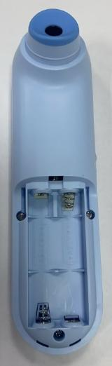

<table>
  <tr>
    <th colspan="10">
PT9L检验作业指导书（标准）
</th>
  </tr>
  <tr>
    <td colspan="10">
编号：QI-PT9L-EF10
</td>
  </tr>
  <tr>
    <td>
Type
</td>
    <td>
Page
</td>
    <td colspan="2">
Progress Name
</td>
    <td>
Ver.No.
</td>
    <td>
Date
</td>
    <td>
Prepared
</td>
    <td>
Checked
</td>
    <td colspan="2">
Approved
</td>
  </tr>
  <tr>
    <td>
部件名称
</td>
    <td>
页码
</td>
    <td colspan="2">
工序名称  
</td>
    <td>
版本
</td>
    <td>
生效期
</td>
    <td>
准备
</td>
    <td>
审核
</td>
    <td colspan="2">
批准
</td>
  </tr>
  <tr>
    <td>
成品
</td>
    <td>
1/1
</td>
    <td colspan="2">
耐压测试
</td>
    <td>
1
</td>
    <td>
2024.06.20
</td>
    <td>

</td>
    <td>

</td>
    <td>

</td>
    <td>

</td>
  </tr>
  <tr>
    <td>
检验项目
</td>
    <td colspan="2">
检验用具
</td>
    <td colspan="5">
检验方法
</td>
    <td colspan="2">
合格标准
</td>
  </tr>
  <tr>
    <td rowspan="4">
耐压测试
</td>
    <td rowspan="2" colspan="2">
耐压测试仪(B036XXXXXX)
金属箔
</td>
    <td rowspan="2" colspan="2">
将待测体温计与耐压测试仪连接，耐压测试仪预置0.5mA，，再复位至测试，时间设置在60S：按右图连接，红线连接正极簧，黑线连接金属箔，旋转电压调节旋钮使电压到1000V，观察60S内无击穿或闪络现象
</td>
    <td rowspan="2" colspan="3">
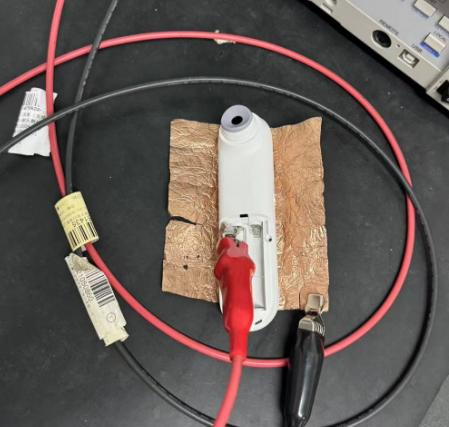
</td>
    <td rowspan="2" colspan="2">
要求：
电池正极到外壳：要求能承受DC1000V 1分钟内无绝缘击穿
每批抽3台   
测试完的机器不可出货，作为留样保存。  
 缺陷定义：MA
</td>
  </tr>
  <tr>
  </tr>
  <tr>
    <td rowspan="2" colspan="2">
耐压测试仪(B036XXXXXX)
金属箔
</td>
    <td rowspan="2" colspan="2">
按右图连接，红线连接正极簧，黑线连接金属箔，旋转电压调节旋钮使电压到1000V，观察60S内无击穿或闪络现象

注意：实验人员要站在绝缘垫上，单手操作，注意每次测试后及时复位
</td>
    <td rowspan="2" colspan="3">
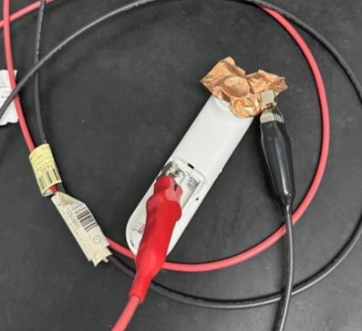
</td>
    <td rowspan="2" colspan="2">
要求：
电池正极到探头：要求能承受DC1000V 1分钟内无绝缘击穿
每批抽3台   
测试完的机器不可出货，作为留样保存。  
 缺陷定义：MA
</td>
  </tr>
  <tr>
  </tr>
</table>

<table>
  <tr>
    <th colspan="10">
PT9L检验作业指导书（标准）
</th>
  </tr>
  <tr>
    <td colspan="10">
编号：QI-PT9L-EF11
</td>
  </tr>
  <tr>
    <td>
Type
</td>
    <td>
Page
</td>
    <td colspan="2">
Progress Name
</td>
    <td>
Ver.No.
</td>
    <td>
Date
</td>
    <td>
Prepared
</td>
    <td>
Checked
</td>
    <td colspan="2">
Approved
</td>
  </tr>
  <tr>
    <td>
部件名称
</td>
    <td>
页码
</td>
    <td colspan="2">
工序名称  
</td>
    <td>
版本
</td>
    <td>
生效期
</td>
    <td>
准备
</td>
    <td>
审核
</td>
    <td colspan="2">
批准
</td>
  </tr>
  <tr>
    <td>
成品
</td>
    <td>
1/1
</td>
    <td colspan="2">
漏电流测试
</td>
    <td>
1
</td>
    <td>
2024.06.20
</td>
    <td>

</td>
    <td>

</td>
    <td>

</td>
    <td>

</td>
  </tr>
  <tr>
    <td>
检验项目
</td>
    <td colspan="2">
检验用具
</td>
    <td colspan="5">
检验方法
</td>
    <td colspan="2">
合格标准
</td>
  </tr>
  <tr>
    <td rowspan="2">
漏电流测试(接触电流)
</td>
    <td rowspan="2" colspan="2">
泄漏电流测试仪（B05OXXXXXX）
金属箔
</td>
    <td rowspan="2" colspan="2">
外壳漏电流实验：按右图将待测体温计与漏电流测试仪连接，外壳各紧贴一张金属箔(分别连接红黑线)，在工作状态下测试漏电流，记录正常状态下最大电流值；测量记录接触电流
</td>
    <td rowspan="2" colspan="3">
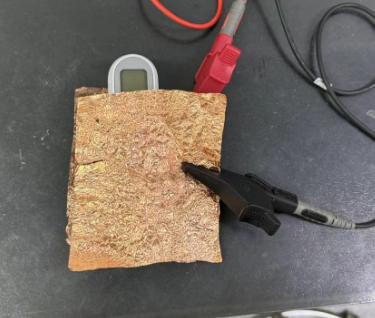
</td>
    <td rowspan="2" colspan="2">
要求接触电流：
正常状态：≤0.1mA 
每批抽3台   
测试完的机器不可出货，作为留样保存。  
 缺陷定义：MA
</td>
  </tr>
  <tr>
  </tr>
  <tr>
    <td rowspan="2">
漏电流测试
(患者漏电流F型)
</td>
    <td rowspan="2" colspan="2">
（医用）泄漏电流测试仪（B05OXXXXXX）
金属箔
铝盘
（W03GXXXXXX）
</td>
    <td rowspan="2" colspan="2">
患者漏电流实验：按右图将待测体温计与漏电流测试仪连接，外壳紧贴一张金属箔(连接红线)，黑线连接铝盘，在工作状态下测试漏电流，记录正常状态下最大电流值；测量记录患者漏电流
</td>
    <td rowspan="2" colspan="3">
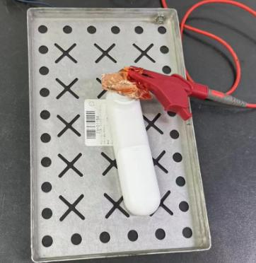
</td>
    <td rowspan="2" colspan="2">
要求患者漏电流：
正常状态：≤5mA 
每批抽3台   
测试完的机器不可出货，作为留样保存。  
 缺陷定义：MA
</td>
  </tr>
  <tr>
  </tr>
</table>