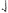
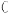

<table>
  <tr>
    <th colspan="3">
文件编号：WI-PT9L-02（标准）
</th>
    <th colspan="8">
PT9L红外体温计【组件清单】（标准）
</th>
    <th>

</th>
    <th>

</th>
  </tr>
  <tr>
    <td colspan="2">
章节
</td>
    <td>
版本
</td>
    <td colspan="10">
拟制:                                     审核:                                 批准:
</td>
  </tr>
  <tr>
    <td colspan="2">
机芯类
</td>
    <td>
1.0
</td>
    <td colspan="10">
        年     月     日                 年     月     日                年     月     日
</td>
  </tr>
  <tr>
    <td>
序号
</td>
    <td>
品  名
</td>
    <td>
物料编码
</td>
    <td>
材质
</td>
    <td>
规格
</td>
    <td>
型号
</td>
    <td>
封装形式
</td>
    <td>
配比
</td>
    <td>
设计名称
(简要说明)
</td>
    <td>
符合ROHS
</td>
    <td>
重要度等级
</td>
    <td>
替代型号
</td>
    <td>
备注
</td>
  </tr>
  <tr>
    <td colspan="12">
主板
</td>
    <td>

</td>
  </tr>
  <tr>
    <td>
1
</td>
    <td>
贴片铝电解电容
</td>
    <td>
K010300001010470460
</td>
    <td>

</td>
    <td>
100μF\±20%\16V
</td>
    <td>

</td>
    <td>
Φ6.3*5.7mm
</td>
    <td>
1
</td>
    <td>
C1
</td>
    <td>
√
</td>
    <td>
C
</td>
    <td>

</td>
    <td>

</td>
  </tr>
  <tr>
    <td>
2
</td>
    <td>
贴片陶瓷电容
</td>
    <td>
K010300001688570048
</td>
    <td>

</td>
    <td>
22μF±20%/6.3V
</td>
    <td>
CL10A226MQ8NRNC
</td>
    <td>
0603
</td>
    <td>
3
</td>
    <td>
C2,C3,C4
</td>
    <td>
√
</td>
    <td>
C
</td>
    <td>

</td>
    <td>

</td>
  </tr>
  <tr>
    <td>
2
</td>
    <td>
贴片陶瓷电容
</td>
    <td>
K010300002090470180
</td>
    <td>

</td>
    <td>
10μF±20%/10V
</td>
    <td>

</td>
    <td>
0402
</td>
    <td>
1
</td>
    <td>
C7
</td>
    <td>
√
</td>
    <td>
C
</td>
    <td>

</td>
    <td>

</td>
  </tr>
  <tr>
    <td>
3
</td>
    <td>
贴片陶瓷电容
</td>
    <td>
K010300000356710027
</td>
    <td>

</td>
    <td>
0.1μF±10%/16V
</td>
    <td>

</td>
    <td>
0402
</td>
    <td>
7
</td>
    <td>
C5, C6, C8, C11,C16,C17, C18
</td>
    <td>
√
</td>
    <td>
C
</td>
    <td>

</td>
    <td>

</td>
  </tr>
  <tr>
    <td>
5
</td>
    <td>
贴片陶瓷电容
</td>
    <td>
K010300001545050180
</td>
    <td>

</td>
    <td>
4.7μF±10%/6.3V
</td>
    <td>

</td>
    <td>
0402
</td>
    <td>
1
</td>
    <td>
C9
</td>
    <td>
√
</td>
    <td>
C
</td>
    <td>

</td>
    <td>

</td>
  </tr>
  <tr>
    <td>
4
</td>
    <td>
贴片陶瓷电容
</td>
    <td>
K010300000506710027
</td>
    <td>

</td>
    <td>
1μF±10%/10V
</td>
    <td>

</td>
    <td>
0402
</td>
    <td>
2
</td>
    <td>
C10, C12
</td>
    <td>
√
</td>
    <td>
C
</td>
    <td>

</td>
    <td>

</td>
  </tr>
  <tr>
    <td>
5
</td>
    <td>
贴片陶瓷电容
</td>
    <td>
K010300001501500027
</td>
    <td>

</td>
    <td>
56pF±5%/50V
</td>
    <td>
CC0402JRNPO9BN560
</td>
    <td>
0402
</td>
    <td>
1
</td>
    <td>
C15
</td>
    <td>
√
</td>
    <td>
B
</td>
    <td>

</td>
    <td>

</td>
  </tr>
  <tr>
    <td>
6
</td>
    <td>
肖特基二极管
</td>
    <td>
K011200001126710929
</td>
    <td>

</td>
    <td>
60V/1A
</td>
    <td>
SS16-W
</td>
    <td>
SMA
</td>
    <td>
1
</td>
    <td>
D1
</td>
    <td>
√
</td>
    <td>
B
</td>
    <td>

</td>
    <td>

</td>
  </tr>
  <tr>
    <td>
7
</td>
    <td>
自恢复保险管
</td>
    <td>
K010900000300470930
</td>
    <td>

</td>
    <td>
15V/1A
</td>
    <td>
ASMD1812-050
</td>
    <td>
4.37×3.07×0.40mm
</td>
    <td>
1
</td>
    <td>
F1
</td>
    <td>
√
</td>
    <td>
B
</td>
    <td>

</td>
    <td>

</td>
  </tr>
  <tr>
    <td>
8
</td>
    <td>
贴片电感
</td>
    <td>
K010400000536710334
</td>
    <td>

</td>
    <td>
10μH±20%/2A
</td>
    <td>
LVS252010-100M-N
</td>
    <td>
252010
</td>
    <td>
1
</td>
    <td>
L1
</td>
    <td>
√
</td>
    <td>
B
</td>
    <td>

</td>
    <td>

</td>
  </tr>
  <tr>
    <td>
9
</td>
    <td>
轻触开关
</td>
    <td>
K010700000040130013
</td>
    <td>

</td>
    <td>

</td>
    <td>
TS-1187
</td>
    <td>
5.2×5.2×1.5mm
</td>
    <td>
2
</td>
    <td>
B1,B2
</td>
    <td>
√
</td>
    <td>
C
</td>
    <td>

</td>
    <td>

</td>
  </tr>
  <tr>
    <td>
10
</td>
    <td>
微型拨动开关
</td>
    <td>
K010700000760130013
</td>
    <td>

</td>
    <td>

</td>
    <td>
MSK-22D35
</td>
    <td>
9.1×3.5×3.5mm
</td>
    <td>
1
</td>
    <td>
B3
</td>
    <td>
√
</td>
    <td>
C
</td>
    <td>

</td>
    <td>

</td>
  </tr>
  <tr>
    <td>
11
</td>
    <td>
贴片LED
</td>
    <td>
K0113000054976E1387
</td>
    <td>

</td>
    <td>
红色
</td>
    <td>
LB194R6C-C01T4
</td>
    <td>
0603
</td>
    <td>
1
</td>
    <td>
LEDR
</td>
    <td>
√
</td>
    <td>
C
</td>
    <td>

</td>
    <td>

</td>
  </tr>
  <tr>
    <td>
12
</td>
    <td>
贴片LED
</td>
    <td>
K0113000054876E1387
</td>
    <td>

</td>
    <td>
白色
</td>
    <td>
LB192XW1D-D02T4
</td>
    <td>
0603
</td>
    <td>
1
</td>
    <td>
LEDW
</td>
    <td>
√
</td>
    <td>
C
</td>
    <td>

</td>
    <td>

</td>
  </tr>
  <tr>
    <td>
13
</td>
    <td>
贴片LED
</td>
    <td>
K0113000055076E1387
</td>
    <td>

</td>
    <td>
橙色
</td>
    <td>
LB194S1C-A01T4
</td>
    <td>
0603
</td>
    <td>
1
</td>
    <td>
LEDY
</td>
    <td>
√
</td>
    <td>
C
</td>
    <td>

</td>
    <td>

</td>
  </tr>
  <tr>
    <td>
14
</td>
    <td>
电阻
</td>
    <td>
K010100001506710027
</td>
    <td>
 
</td>
    <td>
200KΩ±1%
</td>
    <td>
RC0402FR-07200KL
</td>
    <td>
0402
</td>
    <td>
1
</td>
    <td>
R1
</td>
    <td>
√
</td>
    <td>
C
</td>
    <td>

</td>
    <td>

</td>
  </tr>
</table>

<table>
  <tr>
    <th>
序号
</th>
    <th>
品  名
</th>
    <th>
物料编码
</th>
    <th>
材质
</th>
    <th>
规格
</th>
    <th>
型号
</th>
    <th>
封装形式
</th>
    <th>
配比
</th>
    <th>
设计名称
(简要说明)
</th>
    <th>
符合ROHS
</th>
    <th>
重要度等级
</th>
    <th>
替代型号
</th>
    <th>
备注
</th>
  </tr>
  <tr>
    <td>
15
</td>
    <td>
电阻
</td>
    <td>
K010100001006710027
</td>
    <td>

</td>
    <td>
100KΩ±1%
</td>
    <td>
RC0402FR-07100KL
</td>
    <td>
0402
</td>
    <td>
3
</td>
    <td>
R2, R8, R10
</td>
    <td>
√
</td>
    <td>
C
</td>
    <td>

</td>
    <td>

</td>
  </tr>
  <tr>
    <td>
16
</td>
    <td>
电阻
</td>
    <td>
K010100001561500027
</td>
    <td>

</td>
    <td>
0Ω±1%
</td>
    <td>
RC0402FR-070RL
</td>
    <td>
0402
</td>
    <td>
3
</td>
    <td>
R3, R4, R9
</td>
    <td>
√
</td>
    <td>
C
</td>
    <td>

</td>
    <td>

</td>
  </tr>
  <tr>
    <td>
17
</td>
    <td>
电阻
</td>
    <td>
K010100002486710027
</td>
    <td>

</td>
    <td>
120Ω±5%
</td>
    <td>
RC0402JR-07120RL
</td>
    <td>
0402
</td>
    <td>
2
</td>
    <td>
R5, R7
</td>
    <td>
√
</td>
    <td>
C
</td>
    <td>

</td>
    <td>

</td>
  </tr>
  <tr>
    <td>
18
</td>
    <td>
电阻
</td>
    <td>
K010100004496710027
</td>
    <td>

</td>
    <td>
39Ω±1%
</td>
    <td>
RC0402FR-0739RL
</td>
    <td>
0402
</td>
    <td>
1
</td>
    <td>
R6
</td>
    <td>
√
</td>
    <td>
C
</td>
    <td>

</td>
    <td>

</td>
  </tr>
  <tr>
    <td>
19
</td>
    <td>
电阻
</td>
    <td>
K010100001016710027
</td>
    <td>

</td>
    <td>
300KΩ±1%
</td>
    <td>
RC0402FR-07300K
</td>
    <td>
0402
</td>
    <td>
1
</td>
    <td>
R11
</td>
    <td>
√
</td>
    <td>
C
</td>
    <td>

</td>
    <td>

</td>
  </tr>
  <tr>
    <td>
20
</td>
    <td>
电阻
</td>
    <td>
K010100003046340027
</td>
    <td>

</td>
    <td>
1KΩ±1%
</td>
    <td>
RC0402FR-071KL
</td>
    <td>
0402
</td>
    <td>
3
</td>
    <td>
R12, R13, R14
</td>
    <td>
√
</td>
    <td>
C
</td>
    <td>

</td>
    <td>

</td>
  </tr>
  <tr>
    <td>
21
</td>
    <td>
电阻
</td>
    <td>
K010100001361500027
</td>
    <td>

</td>
    <td>
10KΩ±1%
</td>
    <td>
RC0402FR-0710KL
</td>
    <td>
0402
</td>
    <td>
1
</td>
    <td>
R15
</td>
    <td>
√
</td>
    <td>
C
</td>
    <td>

</td>
    <td>

</td>
  </tr>
  <tr>
    <td>
22
</td>
    <td>
升压片
</td>
    <td>
K011000007558590927
</td>
    <td>

</td>
    <td>

</td>
    <td>
SR1833B332NR-G
</td>
    <td>
SOT-23-5L
</td>
    <td>
1
</td>
    <td>
U1
</td>
    <td>
√
</td>
    <td>
B
</td>
    <td>

</td>
    <td>

</td>
  </tr>
  <tr>
    <td>
23
</td>
    <td>
MCU
</td>
    <td>
K011000005950590054
</td>
    <td>

</td>
    <td>

</td>
    <td>
BH67F2762
</td>
    <td>
LQFP48
</td>
    <td>
1
</td>
    <td>
U2
</td>
    <td>
√
</td>
    <td>
B
</td>
    <td>

</td>
    <td>

</td>
  </tr>
  <tr>
    <td>
24
</td>
    <td>
PCB
</td>
    <td>
K011800008686570696
</td>
    <td>
FR4
</td>
    <td>
PT9L-HFMP01 V1.0
</td>
    <td>

</td>
    <td>
1拼10
</td>
    <td>
1
</td>
    <td>
PCB
</td>
    <td>
√
</td>
    <td>
C
</td>
    <td>

</td>
    <td>

</td>
  </tr>
  <tr>
    <td>
25
</td>
    <td>
蜂鸣器
</td>
    <td>
K011400000306430712
</td>
    <td>

</td>
    <td>
4000Hz
</td>
    <td>
TPC-120055F-05040
</td>
    <td>
φ12.4×9mm
</td>
    <td>
1
</td>
    <td>
BUZZER
</td>
    <td>
√
</td>
    <td>
C
</td>
    <td>

</td>
    <td>

</td>
  </tr>
  <tr>
    <td colspan="13">
传感器板
</td>
  </tr>
  <tr>
    <td>
1
</td>
    <td>
温度传感器
</td>
    <td>
K0111000005176E1357
</td>
    <td>

</td>
    <td>

</td>
    <td>
TSD14
</td>
    <td>

</td>
    <td>
1
</td>
    <td>
SENSOR
</td>
    <td>
√
</td>
    <td>
A
</td>
    <td>

</td>
    <td>

</td>
  </tr>
  <tr>
    <td>
2
</td>
    <td>
PCB
</td>
    <td>
K0118000084609A1106
</td>
    <td>
FR4
</td>
    <td>
PT9C-CNTP01 V1.0
</td>
    <td>

</td>
    <td>

</td>
    <td>
1
</td>
    <td>
PCB
</td>
    <td>
√
</td>
    <td>
C
</td>
    <td>

</td>
    <td>

</td>
  </tr>
  <tr>
    <td>

</td>
    <td colspan="10">
修                   订                 内                   容 
</td>
    <td>
修订日期
</td>
    <td>
备注
</td>
  </tr>
  <tr>
    <td rowspan="4">
修
订
摘
要
</td>
    <td colspan="10">

</td>
    <td>

</td>
    <td>

</td>
  </tr>
  <tr>
    <td colspan="10">

</td>
    <td>

</td>
    <td>

</td>
  </tr>
  <tr>
    <td colspan="10">

</td>
    <td>

</td>
    <td>

</td>
  </tr>
  <tr>
    <td colspan="10">

</td>
    <td>

</td>
    <td>

</td>
  </tr>
</table>

<table>
  <tr>
    <th colspan="13">
      总装类
</th>
  </tr>
  <tr>
    <td>
序号
</td>
    <td>
品  名
</td>
    <td>
物料编码
</td>
    <td>
材质
</td>
    <td>
规格
</td>
    <td>
型号
</td>
    <td>
封装形式
</td>
    <td>
配比
</td>
    <td>
设计名称
(简要说明)
</td>
    <td>
符合ROHS
</td>
    <td>
重要度等级
</td>
    <td>
替代型号
</td>
    <td>
备注
</td>
  </tr>
  <tr>
    <td>
1
</td>
    <td>
上盖
</td>
    <td>
K030200021175120485
</td>
    <td>
ABS
</td>
    <td>
T-Z1-P01
</td>
    <td>
T-Z1
</td>
    <td>

</td>
    <td>
1
</td>
    <td>

</td>
    <td>
√
</td>
    <td>
B
</td>
    <td>

</td>
    <td>

</td>
  </tr>
  <tr>
    <td>
2
</td>
    <td>
下盖
</td>
    <td>
K030200021185120485
</td>
    <td>
ABS
</td>
    <td>
T-Z1-P02
</td>
    <td>
T-Z1
</td>
    <td>

</td>
    <td>
1
</td>
    <td>

</td>
    <td>
√
</td>
    <td>
B
</td>
    <td>

</td>
    <td>

</td>
  </tr>
  <tr>
    <td>
3
</td>
    <td>
探头
</td>
    <td>
K030200021195120485
</td>
    <td>
TPU
</td>
    <td>
T-Z1-P03
</td>
    <td>
T-Z1
</td>
    <td>

</td>
    <td>
1
</td>
    <td>

</td>
    <td>
√
</td>
    <td>
B
</td>
    <td>

</td>
    <td>

</td>
  </tr>
  <tr>
    <td>
4
</td>
    <td>
电池盖
</td>
    <td>
K030200021205120485
</td>
    <td>
ABS
</td>
    <td>
T-Z1-P04
</td>
    <td>
T-Z1
</td>
    <td>

</td>
    <td>
1
</td>
    <td>

</td>
    <td>
√
</td>
    <td>
B
</td>
    <td>

</td>
    <td>

</td>
  </tr>
  <tr>
    <td>
5
</td>
    <td>
按键
</td>
    <td>
K030200021215120485
</td>
    <td>
ABS
</td>
    <td>
T-Z1-P05
</td>
    <td>
T-Z1
</td>
    <td>

</td>
    <td>
1
</td>
    <td>

</td>
    <td>
√
</td>
    <td>
B
</td>
    <td>

</td>
    <td>

</td>
  </tr>
  <tr>
    <td>
6
</td>
    <td>
开关帽
</td>
    <td>
K030200021225120485
</td>
    <td>
ABS
</td>
    <td>
T-Z1-P06
</td>
    <td>
T-Z1
</td>
    <td>

</td>
    <td>
1
</td>
    <td>

</td>
    <td>
√
</td>
    <td>
B
</td>
    <td>

</td>
    <td>

</td>
  </tr>
  <tr>
    <td>
7
</td>
    <td>
支架
</td>
    <td>
K030200021235120485
</td>
    <td>
ABS
</td>
    <td>
T-Z1-P07
</td>
    <td>
T-Z1
</td>
    <td>

</td>
    <td>
1
</td>
    <td>

</td>
    <td>
√
</td>
    <td>
B
</td>
    <td>

</td>
    <td>

</td>
  </tr>
  <tr>
    <td>
8
</td>
    <td>
保护盖
</td>
    <td>
K030200021245120485
</td>
    <td>
PC
</td>
    <td>
T-Z1-P08
</td>
    <td>
T-Z1
</td>
    <td>

</td>
    <td>
1
</td>
    <td>

</td>
    <td>
√
</td>
    <td>
B
</td>
    <td>

</td>
    <td>

</td>
  </tr>
  <tr>
    <td>
9
</td>
    <td>
透镜
</td>
    <td>
K030200021256800730
</td>
    <td>
PMMA
</td>
    <td>
T-Z1-P09
</td>
    <td>
T-Z1
</td>
    <td>

</td>
    <td>
1
</td>
    <td>

</td>
    <td>
√
</td>
    <td>
B
</td>
    <td>

</td>
    <td>

</td>
  </tr>
  <tr>
    <td>
10
</td>
    <td>
液晶
</td>
    <td>
K011300005516560695
</td>
    <td>

</td>
    <td>
PT9L-L01
</td>
    <td>
PT9L
</td>
    <td>

</td>
    <td>
1
</td>
    <td>

</td>
    <td>
√
</td>
    <td>
B
</td>
    <td>

</td>
    <td>

</td>
  </tr>
  <tr>
    <td>
11
</td>
    <td>
导光板
</td>
    <td>
K030200021260730073
</td>
    <td>
PMMA
</td>
    <td>
T-Z1-P10
</td>
    <td>
T-Z1
</td>
    <td>

</td>
    <td>
1
</td>
    <td>

</td>
    <td>
√
</td>
    <td>
B
</td>
    <td>

</td>
    <td>

</td>
  </tr>
  <tr>
    <td>
12
</td>
    <td>
斑马条
</td>
    <td>
K010800005533360275
</td>
    <td>
导电硅胶
</td>
    <td>
T-Z1-P12
</td>
    <td>
T-Z1
</td>
    <td>

</td>
    <td>
1
</td>
    <td>

</td>
    <td>
√
</td>
    <td>
B
</td>
    <td>

</td>
    <td>

</td>
  </tr>
  <tr>
    <td>
13
</td>
    <td>
正极弹簧
</td>
    <td>
T030100000792550143
</td>
    <td>
Φ0.5mm镀镍不锈钢线,密封包装，须过盐雾浓度为5%(±0.5%)48h
</td>
    <td>
PT5-M03
</td>
    <td>
PT5
</td>
    <td>

</td>
    <td>
1
</td>
    <td>

</td>
    <td>
√
</td>
    <td>
C
</td>
    <td>

</td>
    <td>

</td>
  </tr>
  <tr>
    <td>
14
</td>
    <td>
负极弹簧
</td>
    <td>
T030100000802550143
</td>
    <td>
Φ0.5mm镀镍不锈钢线,密封包装，须过盐雾浓度为5%(±0.5%)48h
</td>
    <td>
PT5-M02
</td>
    <td>
PT5
</td>
    <td>

</td>
    <td>
1
</td>
    <td>

</td>
    <td>
√
</td>
    <td>
C
</td>
    <td>

</td>
    <td>

</td>
  </tr>
  <tr>
    <td>
15
</td>
    <td>
双联弹簧
</td>
    <td>
T030100000482550143
</td>
    <td>
0.5mm弹簧钢
</td>
    <td>
PT3-P10
</td>
    <td>
PT3
</td>
    <td>

</td>
    <td>
1
</td>
    <td>

</td>
    <td>
√
</td>
    <td>
C
</td>
    <td>

</td>
    <td>

</td>
  </tr>
  <tr>
    <td>
16
</td>
    <td>
螺丝
</td>
    <td>
K030100001143480295
</td>
    <td>
DIA:2.0X5mm PB普通圆头镀镍螺丝
</td>
    <td>
Public-M23
</td>
    <td>
PT5
</td>
    <td>

</td>
    <td>
10
</td>
    <td>

</td>
    <td>
√ 
</td>
    <td>
C
</td>
    <td>

</td>
    <td>

</td>
  </tr>
  <tr>
    <td>
17
</td>
    <td>
导线
</td>
    <td>
K0508K0305810000000
</td>
    <td>
Cu,PVC
</td>
    <td>
7芯*φ0.8mm*50mm\两端镀锡2mm
</td>
    <td>
7×Φ0.8mm×50mm 红
</td>
    <td>
7×Φ0.8mm×50mm
</td>
    <td>
1
</td>
    <td>

</td>
    <td>
√
</td>
    <td>
C
</td>
    <td>

</td>
    <td>

</td>
  </tr>
  <tr>
    <td>
18
</td>
    <td>
导线
</td>
    <td>
K0508K0301450000000
</td>
    <td>
Cu,PVC
</td>
    <td>
7芯*φ0.8mm*50mm\两端镀锡2mm
</td>
    <td>
7×Φ0.8mm×50mm 白
</td>
    <td>
7×Φ0.8mm×50mm
</td>
    <td>
1
</td>
    <td>

</td>
    <td>
√
</td>
    <td>
C
</td>
    <td>

</td>
    <td>

</td>
  </tr>
  <tr>
    <td>
19
</td>
    <td>
导线
</td>
    <td>
K0508K0305820000000
</td>
    <td>
Cu,PVC
</td>
    <td>
7芯*φ0.8mm*50mm\两端镀锡2mm
</td>
    <td>
7×Φ0.8mm×50mm 黑
</td>
    <td>
7×Φ0.8mm×50mm
</td>
    <td>
1
</td>
    <td>

</td>
    <td>
√
</td>
    <td>
C
</td>
    <td>

</td>
    <td>

</td>
  </tr>
  <tr>
    <td>
20
</td>
    <td>
支撑垫
</td>
    <td>
K030200021297750830
</td>
    <td>
聚氨酯
</td>
    <td>
T-Z1-P15
</td>
    <td>
T-Z1
</td>
    <td>

</td>
    <td>
1
</td>
    <td>

</td>
    <td>
√
</td>
    <td>
C
</td>
    <td>

</td>
    <td>

</td>
  </tr>
  <tr>
    <td>
21
</td>
    <td>
快速探温电阻
</td>
    <td>
K0101000045950B0101
</td>
    <td>

</td>
    <td>
10KΩ±1%
</td>
    <td>
MF52B6.047G3818
</td>
    <td>
Φ1.6×3.5×95mm
</td>
    <td>
1
</td>
    <td>

</td>
    <td>
√
</td>
    <td>
C
</td>
    <td>

</td>
    <td>

</td>
  </tr>
  <tr>
    <td>
22
</td>
    <td>
金属套
</td>
    <td>
T030100000507180765
</td>
    <td>
黄铜
</td>
    <td>
PT3-M02
</td>
    <td>
PT3
</td>
    <td>

</td>
    <td>
1
</td>
    <td>

</td>
    <td>
√
</td>
    <td>
B
</td>
    <td>

</td>
    <td>

</td>
  </tr>
  <tr>
    <td>
23
</td>
    <td>
压块
</td>
    <td>
T030100000497180765
</td>
    <td>
黄铜
</td>
    <td>
PT3-M01
</td>
    <td>
PT3
</td>
    <td>

</td>
    <td>
1
</td>
    <td>

</td>
    <td>
√
</td>
    <td>
B
</td>
    <td>

</td>
    <td>

</td>
  </tr>
  <tr>
    <td>
24
</td>
    <td>
导热硅脂
</td>
    <td>
K160200000587840843
</td>
    <td>

</td>
    <td>

</td>
    <td>
TZ-8030
</td>
    <td>

</td>
    <td>
1/10000
</td>
    <td>

</td>
    <td>
√
</td>
    <td>
C
</td>
    <td>

</td>
    <td>

</td>
  </tr>
  <tr>
    <td>
25
</td>
    <td>
三防漆
</td>
    <td>
K160100001736150627
</td>
    <td>

</td>
    <td>
4.5升/桶
</td>
    <td>
PU1030-40S
</td>
    <td>

</td>
    <td>
3/900000
</td>
    <td>

</td>
    <td>
√
</td>
    <td>
C
</td>
    <td>

</td>
    <td>

</td>
  </tr>
  <tr>
    <td>

</td>
    <td colspan="10">
修                   订                 内                   容 
</td>
    <td>
修订日期
</td>
    <td>
备注
</td>
  </tr>
  <tr>
    <td rowspan="4">
修
订
摘
要
</td>
    <td colspan="10">

</td>
    <td>

</td>
    <td>

</td>
  </tr>
  <tr>
    <td colspan="10">

</td>
    <td>

</td>
    <td>

</td>
  </tr>
  <tr>
    <td colspan="10">

</td>
    <td>

</td>
    <td>

</td>
  </tr>
  <tr>
    <td colspan="10">

</td>
    <td>

</td>
    <td>

</td>
  </tr>
</table>

<table>
  <tr>
    <th colspan="13">
      包装类
</th>
  </tr>
  <tr>
    <td>
序号
</td>
    <td>
品  名
</td>
    <td>
物料编码
</td>
    <td>
材质
</td>
    <td>
规格
</td>
    <td>
型号
</td>
    <td>
封装形式
</td>
    <td>
配比
</td>
    <td>
设计名称
(简要说明)
</td>
    <td>
符合ROHS
</td>
    <td>
重要度等级
</td>
    <td>
替代型号
</td>
    <td>
备注
</td>
  </tr>
  <tr>
    <td>
1
</td>
    <td>
彩包装
</td>
    <td>
K040200021397620814
</td>
    <td>
350g白卡纸 覆哑膜
</td>
    <td>
PT9L-CBZP01
</td>
    <td>
PT9L
</td>
    <td>

</td>
    <td>
1
</td>
    <td>

</td>
    <td>
√
</td>
    <td>
A
</td>
    <td>

</td>
    <td>

</td>
  </tr>
  <tr>
    <td>
2
</td>
    <td>
纸托
</td>
    <td>
K040500002717620814
</td>
    <td>
350g白卡纸 覆哑膜
</td>
    <td>
PT9L-F04
</td>
    <td>
PT9L
</td>
    <td>

</td>
    <td>
1
</td>
    <td>

</td>
    <td>
√
</td>
    <td>
C
</td>
    <td>

</td>
    <td>

</td>
  </tr>
  <tr>
    <td>
3
</td>
    <td>
说明书
</td>
    <td>
K040700022027620814
</td>
    <td>
70g双胶纸
</td>
    <td>
PT9L-SMSP01
</td>
    <td>
PT9L
</td>
    <td>

</td>
    <td>
1
</td>
    <td>

</td>
    <td>
√
</td>
    <td>
A
</td>
    <td>

</td>
    <td>

</td>
  </tr>
  <tr>
    <td>
4
</td>
    <td>
保护膜
</td>
    <td>
K030200025221070216
</td>
    <td>
PE
</td>
    <td>
PT9L-P10
</td>
    <td>
PT9L
</td>
    <td>

</td>
    <td>
1
</td>
    <td>

</td>
    <td>
√
</td>
    <td>
C
</td>
    <td>

</td>
    <td>

</td>
  </tr>
  <tr>
    <td>
5
</td>
    <td>
铭牌
</td>
    <td>
K040800025021030093
</td>
    <td>
25μ透明PET
</td>
    <td>
PT9L-F02
</td>
    <td>
PT9L
</td>
    <td>

</td>
    <td>
1
</td>
    <td>

</td>
    <td>
√
</td>
    <td>
B
</td>
    <td>

</td>
    <td>

</td>
  </tr>
  <tr>
    <td>
6
</td>
    <td>
防拆签
</td>
    <td>
T040800073941030093
</td>
    <td>
PET
</td>
    <td>
PT3-F21
</td>
    <td>
PT3
</td>
    <td>

</td>
    <td>
2
</td>
    <td>

</td>
    <td>
√
</td>
    <td>
C
</td>
    <td>

</td>
    <td>

</td>
  </tr>
  <tr>
    <td>
7
</td>
    <td>
标签
</td>
    <td>
K040800025031030093
</td>
    <td>
80g白色不干胶铜版纸
</td>
    <td>
PT9L-F03
</td>
    <td>
PT9L
</td>
    <td>

</td>
    <td>
1
</td>
    <td>
二维码标签
</td>
    <td>
√
</td>
    <td>
C
</td>
    <td>

</td>
    <td>

</td>
  </tr>
  <tr>
    <td>
8
</td>
    <td>
外箱
</td>
    <td>
K040100014357620814
</td>
    <td>
190g牛皮面纸+170g(A)楞 +80g芯纸+130g(B)楞+200g牛 皮里纸
</td>
    <td>
PT9L-F01
</td>
    <td>
PT9L
</td>
    <td>

</td>
    <td>
1/60
</td>
    <td>

</td>
    <td>
√
</td>
    <td>
C
</td>
    <td>

</td>
    <td>

</td>
  </tr>
  <tr>
    <td>
9
</td>
    <td>
标签
</td>
    <td>
K040800021487620814
</td>
    <td>
80g不干胶铜版纸
</td>
    <td>
PT1-F07
</td>
    <td>
PT1
</td>
    <td>

</td>
    <td>
1/60
</td>
    <td>
外箱条码标签
</td>
    <td>
√
</td>
    <td>
C
</td>
    <td>

</td>
    <td>

</td>
  </tr>
  <tr>
    <td>
10
</td>
    <td>
电池
</td>
    <td>
K020400000757680820
</td>
    <td>

</td>
    <td>
7号碱性 1.5V/1200mAh
</td>
    <td>
LR03
</td>
    <td>

</td>
    <td>
2
</td>
    <td>

</td>
    <td>
√
</td>
    <td>
C
</td>
    <td>

</td>
    <td>

</td>
  </tr>
  <tr>
    <td>
11
</td>
    <td>
垫板
</td>
    <td>
K040500002727620814
</td>
    <td>
160g牛皮面纸+120g(E)楞 +160g牛皮里纸
</td>
    <td>
PT9L-F05
</td>
    <td>
PT9L
</td>
    <td>

</td>
    <td>
2025-01-30 00:00:00
</td>
    <td>

</td>
    <td>
√
</td>
    <td>
C
</td>
    <td>

</td>
    <td>

</td>
  </tr>
  <tr>
    <td>
12
</td>
    <td>
托盘
</td>
    <td>
K141300000154110371
</td>
    <td>
胶合板
</td>
    <td>
KD-931D-F01
</td>
    <td>
KD-931D
</td>
    <td>

</td>
    <td>
1/4500
</td>
    <td>

</td>
    <td>
√
</td>
    <td>
C 
</td>
    <td>

</td>
    <td>

</td>
  </tr>
  <tr>
    <td rowspan="3">
修
订
摘
要
</td>
    <td colspan="10">
修                   订                 内                   容 
</td>
    <td>
修订日期
</td>
    <td>
备注
</td>
  </tr>
  <tr>
    <td colspan="10">

</td>
    <td>

</td>
    <td>

</td>
  </tr>
  <tr>
    <td colspan="10">

</td>
    <td>

</td>
    <td>

</td>
  </tr>
</table>