<table>
  <tr>
    <th colspan="10">
PT9L操作作业指导书（标准）
</th>
  </tr>
  <tr>
    <td colspan="10">
编号：WI-PT9L-EF01
</td>
  </tr>
  <tr>
    <td>
Type
</td>
    <td>
Page
</td>
    <td colspan="2">
   Progress Name
</td>
    <td>
Ver.No.
</td>
    <td>
Date
</td>
    <td>
Prepared
</td>
    <td>
Checked
</td>
    <td colspan="2">
Approved
</td>
  </tr>
  <tr>
    <td>
部件名称
</td>
    <td>
 页码   
</td>
    <td colspan="2">
   工序名称  
</td>
    <td>
版本
</td>
    <td>
生效日期
</td>
    <td>
准备
</td>
    <td>
审核
</td>
    <td colspan="2">
批准
</td>
  </tr>
  <tr>
    <td rowspan="2">
成品
</td>
    <td rowspan="2">
1/1
</td>
    <td rowspan="2" colspan="2">
整机拆防护袋
</td>
    <td rowspan="2">
1.0
</td>
    <td rowspan="2">
2024-06-20
</td>
    <td rowspan="2">

</td>
    <td rowspan="2">

</td>
    <td rowspan="2" colspan="2">

</td>
  </tr>
  <tr>
  </tr>
  <tr>
    <td>
物料名称及编码
</td>
    <td>
工序      描述
</td>
    <td colspan="3">
图象
</td>
    <td>
操作
</td>
    <td>
设备工具名称
</td>
    <td>
人员装备要求
</td>
    <td colspan="2">
要求
</td>
  </tr>
  <tr>
    <td rowspan="5">
整机
</td>
    <td rowspan="5">

</td>
    <td rowspan="5" colspan="3">

</td>
    <td rowspan="5">

</td>
    <td rowspan="41">

</td>
    <td rowspan="41">
佩戴手套
</td>
    <td rowspan="5" colspan="2">

</td>
  </tr>
  <tr>
  </tr>
  <tr>
  </tr>
  <tr>
  </tr>
  <tr>
  </tr>
  <tr>
    <td rowspan="36">

</td>
    <td rowspan="36">
查看整机内观
</td>
    <td rowspan="36" colspan="3">
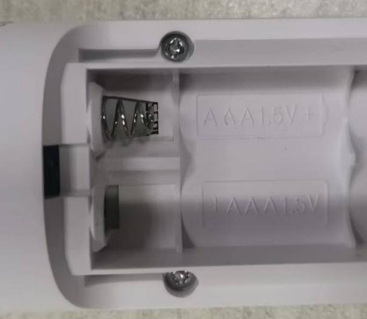
</td>
    <td rowspan="36">
检查电池仓内应洁净，正负极簧、螺钉应齐全且安装到位，不可有翘起脱落现象。正负极弹簧位置正确。
</td>
    <td rowspan="36" colspan="2">
要求:电池仓内应洁净，极簧、螺钉应齐全且安装到位，不可有翘起脱落现象。
风险:产生外观不良。

</td>
  </tr>
  <tr>
  </tr>
  <tr>
  </tr>
  <tr>
  </tr>
  <tr>
  </tr>
  <tr>
  </tr>
  <tr>
  </tr>
  <tr>
  </tr>
  <tr>
  </tr>
  <tr>
  </tr>
  <tr>
  </tr>
  <tr>
  </tr>
  <tr>
  </tr>
  <tr>
  </tr>
  <tr>
  </tr>
  <tr>
  </tr>
  <tr>
  </tr>
  <tr>
  </tr>
  <tr>
  </tr>
  <tr>
  </tr>
  <tr>
  </tr>
  <tr>
  </tr>
  <tr>
  </tr>
  <tr>
  </tr>
  <tr>
  </tr>
  <tr>
  </tr>
  <tr>
  </tr>
  <tr>
  </tr>
  <tr>
  </tr>
  <tr>
  </tr>
  <tr>
  </tr>
  <tr>
  </tr>
  <tr>
  </tr>
  <tr>
  </tr>
  <tr>
  </tr>
  <tr>
  </tr>
</table>

<table>
  <tr>
    <th colspan="10">
PT9L操作作业指导书（标准）
</th>
  </tr>
  <tr>
    <td colspan="10">
编号：WI-PT9L-EF02
</td>
  </tr>
  <tr>
    <td>
Type
</td>
    <td>
Page
</td>
    <td colspan="2">
   Progress Name
</td>
    <td>
Ver.No.
</td>
    <td>
Date
</td>
    <td>
Prepared
</td>
    <td>
Checked
</td>
    <td colspan="2">
Approved
</td>
  </tr>
  <tr>
    <td>
部件名称
</td>
    <td>
 页码   
</td>
    <td colspan="2">
   工序名称  
</td>
    <td>
版本
</td>
    <td>
生效日期
</td>
    <td>
准备
</td>
    <td>
审核
</td>
    <td colspan="2">
批准
</td>
  </tr>
  <tr>
    <td rowspan="2">
成品
</td>
    <td rowspan="2">
1/1
</td>
    <td rowspan="2" colspan="2">
整机检验
</td>
    <td rowspan="2">
1.0
</td>
    <td rowspan="2">
2024-06-20
</td>
    <td rowspan="2">

</td>
    <td rowspan="2">

</td>
    <td rowspan="2" colspan="2">

</td>
  </tr>
  <tr>
  </tr>
  <tr>
    <td>
物料名称及编码
</td>
    <td>
工序      描述
</td>
    <td colspan="3">
图象
</td>
    <td>
操作
</td>
    <td>
设备工具名称
</td>
    <td>
人员装备要求
</td>
    <td colspan="2">
要求
</td>
  </tr>
  <tr>
    <td rowspan="5">
试机电池(物料信息见订单BOM）
</td>
    <td rowspan="5">

</td>
    <td rowspan="5" colspan="3">
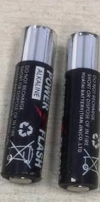
</td>
    <td rowspan="5">

</td>
    <td rowspan="35">

</td>
    <td rowspan="35">
指套
</td>
    <td rowspan="5" colspan="2">

</td>
  </tr>
  <tr>
  </tr>
  <tr>
  </tr>
  <tr>
  </tr>
  <tr>
  </tr>
  <tr>
    <td rowspan="30">

</td>
    <td rowspan="30">
检验整机全显
</td>
    <td rowspan="30" colspan="3">
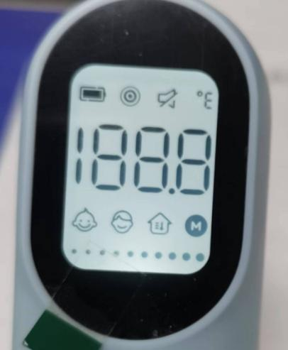
</td>
    <td rowspan="30">
1，将测试电池安装到位，检验整机全显，与图片显示完全一致，不可有多显、少显或深浅不一现象；
2，把探头放在距离手背3cm以内，按下按键，屏幕显示测试温度值，显示的温度应在97.7±2.0之间；测试完毕后，不需要将电池取出。默认单位以实际评审要求。
</td>
    <td rowspan="30" colspan="2">
要求:整机全显显示正确无误。
风险:产生性能不良。
</td>
  </tr>
  <tr>
  </tr>
  <tr>
  </tr>
  <tr>
  </tr>
  <tr>
  </tr>
  <tr>
  </tr>
  <tr>
  </tr>
  <tr>
  </tr>
  <tr>
  </tr>
  <tr>
  </tr>
  <tr>
  </tr>
  <tr>
  </tr>
  <tr>
  </tr>
  <tr>
  </tr>
  <tr>
  </tr>
  <tr>
  </tr>
  <tr>
  </tr>
  <tr>
  </tr>
  <tr>
  </tr>
  <tr>
  </tr>
  <tr>
  </tr>
  <tr>
  </tr>
  <tr>
  </tr>
  <tr>
  </tr>
  <tr>
  </tr>
  <tr>
  </tr>
  <tr>
  </tr>
  <tr>
  </tr>
  <tr>
  </tr>
  <tr>
  </tr>
</table>

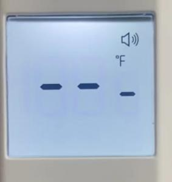

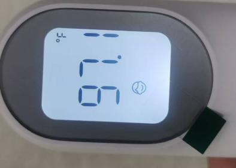

<table>
  <tr>
    <th colspan="10">
PT9L操作作业指导书（标准）
</th>
  </tr>
  <tr>
    <td colspan="10">
编号：WI-PT9L-EF03
</td>
  </tr>
  <tr>
    <td>
Type
</td>
    <td>
Page
</td>
    <td colspan="2">
   Progress Name
</td>
    <td>
Ver.No.
</td>
    <td>
Date
</td>
    <td>
Prepared
</td>
    <td>
Checked
</td>
    <td colspan="2">
Approved
</td>
  </tr>
  <tr>
    <td>
部件名称
</td>
    <td>
 页码   
</td>
    <td colspan="2">
   工序名称  
</td>
    <td>
版本
</td>
    <td>
生效日期
</td>
    <td>
准备
</td>
    <td>
审核
</td>
    <td colspan="2">
批准
</td>
  </tr>
  <tr>
    <td rowspan="2">
成品
</td>
    <td rowspan="2">
1/1
</td>
    <td rowspan="2" colspan="2">
整机清除记忆
</td>
    <td rowspan="2">
1.0
</td>
    <td rowspan="2">
2024-06-20
</td>
    <td rowspan="2">

</td>
    <td rowspan="2">

</td>
    <td rowspan="2" colspan="2">

</td>
  </tr>
  <tr>
  </tr>
  <tr>
    <td>
物料名称及编码
</td>
    <td>
工序      描述
</td>
    <td colspan="3">
图象
</td>
    <td>
操作
</td>
    <td>
设备工具名称
</td>
    <td>
人员装备要求
</td>
    <td colspan="2">
要求
</td>
  </tr>
  <tr>
    <td rowspan="30">

</td>
    <td rowspan="30">
整机清除记忆
</td>
    <td rowspan="30" colspan="3">

</td>
    <td rowspan="30">
1.关机状态下，同时长按测量键+设置键8秒钟，屏幕显示图标M和dEL闪烁，此时可以松开按键；如图一。

2.两秒后M图标消失，此时记忆删除成功；如图二。

3.待整机黑屏后，取出电池。
</td>
    <td rowspan="30">

</td>
    <td rowspan="30">

</td>
    <td rowspan="30" colspan="2">
要求:记忆清除成功。
风险:产生性能不良。
</td>
  </tr>
  <tr>
  </tr>
  <tr>
  </tr>
  <tr>
  </tr>
  <tr>
  </tr>
  <tr>
  </tr>
  <tr>
  </tr>
  <tr>
  </tr>
  <tr>
  </tr>
  <tr>
  </tr>
  <tr>
  </tr>
  <tr>
  </tr>
  <tr>
  </tr>
  <tr>
  </tr>
  <tr>
  </tr>
  <tr>
  </tr>
  <tr>
  </tr>
  <tr>
  </tr>
  <tr>
  </tr>
  <tr>
  </tr>
  <tr>
  </tr>
  <tr>
  </tr>
  <tr>
  </tr>
  <tr>
  </tr>
  <tr>
  </tr>
  <tr>
  </tr>
  <tr>
  </tr>
  <tr>
  </tr>
  <tr>
  </tr>
  <tr>
  </tr>
</table>

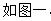

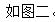

<table>
  <tr>
    <th colspan="10">
PT9L操作作业指导书（标准）
</th>
  </tr>
  <tr>
    <td colspan="10">
编号：WI-PT9L-EF04
</td>
  </tr>
  <tr>
    <td>
Type
</td>
    <td>
Page
</td>
    <td colspan="2">
   Progress Name
</td>
    <td>
Ver.No.
</td>
    <td>
Date
</td>
    <td>
Prepared
</td>
    <td>
Checked
</td>
    <td colspan="2">
Approved
</td>
  </tr>
  <tr>
    <td>
部件名称
</td>
    <td>
 页码   
</td>
    <td colspan="2">
   工序名称  
</td>
    <td>
版本
</td>
    <td>
生效日期
</td>
    <td>
准备
</td>
    <td>
审核
</td>
    <td colspan="2">
批准
</td>
  </tr>
  <tr>
    <td rowspan="2">
成品
</td>
    <td rowspan="2">
1/1
</td>
    <td rowspan="2" colspan="2">
整机装电池盖
</td>
    <td rowspan="2">
1.0
</td>
    <td rowspan="2">
2024-06-20
</td>
    <td rowspan="2">

</td>
    <td rowspan="2">

</td>
    <td rowspan="2" colspan="2">

</td>
  </tr>
  <tr>
  </tr>
  <tr>
    <td>
物料名称及编码
</td>
    <td>
工序      描述
</td>
    <td colspan="3">
图象
</td>
    <td>
操作
</td>
    <td>
设备工具名称
</td>
    <td>
人员装备要求
</td>
    <td colspan="2">
要求
</td>
  </tr>
  <tr>
    <td rowspan="5">
电池盖
(物料信息见订单BOM）
</td>
    <td rowspan="5">

</td>
    <td rowspan="5" colspan="3">

</td>
    <td rowspan="5">

</td>
    <td rowspan="31">

</td>
    <td rowspan="31">
佩戴手套
</td>
    <td rowspan="5" colspan="2">
要求：电池盖表面无破损、划伤、脏污、异物等风险:产生外观不良。
</td>
  </tr>
  <tr>
  </tr>
  <tr>
  </tr>
  <tr>
  </tr>
  <tr>
  </tr>
  <tr>
    <td rowspan="26">

</td>
    <td rowspan="26">
整机装电池盖
</td>
    <td rowspan="26" colspan="3">

</td>
    <td rowspan="26">
将电池盖舌头装入整机内如图一，最后将电池盖往上一推听到咔一声将电池盖安装到位。（电池仓内无电池）电池盖安装到位。
</td>
    <td rowspan="26" colspan="2">
要求:电池盖安装到位。
风险:产生外观不良。

</td>
  </tr>
  <tr>
  </tr>
  <tr>
  </tr>
  <tr>
  </tr>
  <tr>
  </tr>
  <tr>
  </tr>
  <tr>
  </tr>
  <tr>
  </tr>
  <tr>
  </tr>
  <tr>
  </tr>
  <tr>
  </tr>
  <tr>
  </tr>
  <tr>
  </tr>
  <tr>
  </tr>
  <tr>
  </tr>
  <tr>
  </tr>
  <tr>
  </tr>
  <tr>
  </tr>
  <tr>
  </tr>
  <tr>
  </tr>
  <tr>
  </tr>
  <tr>
  </tr>
  <tr>
  </tr>
  <tr>
  </tr>
  <tr>
  </tr>
  <tr>
  </tr>
</table>

<table>
  <tr>
    <th colspan="10">
PT9L操作作业指导书（标准）
</th>
  </tr>
  <tr>
    <td colspan="10">
编号：WI-PT9L-EF05
</td>
  </tr>
  <tr>
    <td>
Type
</td>
    <td>
Page
</td>
    <td colspan="2">
   Progress Name
</td>
    <td>
Ver.No.
</td>
    <td>
Date
</td>
    <td>
Prepared
</td>
    <td>
Checked
</td>
    <td colspan="2">
Approved
</td>
  </tr>
  <tr>
    <td>
部件名称
</td>
    <td>
 页码   
</td>
    <td colspan="2">
   工序名称  
</td>
    <td>
版本
</td>
    <td>
生效日期
</td>
    <td>
准备
</td>
    <td>
审核
</td>
    <td colspan="2">
批准
</td>
  </tr>
  <tr>
    <td rowspan="2">
成品
</td>
    <td rowspan="2">
1/1
</td>
    <td rowspan="2" colspan="2">
贴透镜保护膜
</td>
    <td rowspan="2">
1.0
</td>
    <td rowspan="2">
2024-06-20
</td>
    <td rowspan="2">

</td>
    <td rowspan="2">

</td>
    <td rowspan="2" colspan="2">

</td>
  </tr>
  <tr>
  </tr>
  <tr>
    <td>
物料名称及编码
</td>
    <td>
工序      描述
</td>
    <td colspan="3">
图象
</td>
    <td>
操作
</td>
    <td>
设备工具名称
</td>
    <td>
人员装备要求
</td>
    <td colspan="2">
要求
</td>
  </tr>
  <tr>
    <td rowspan="5">
保护膜
(物料信息见订单BOM）
</td>
    <td rowspan="5">

</td>
    <td rowspan="5" colspan="3">
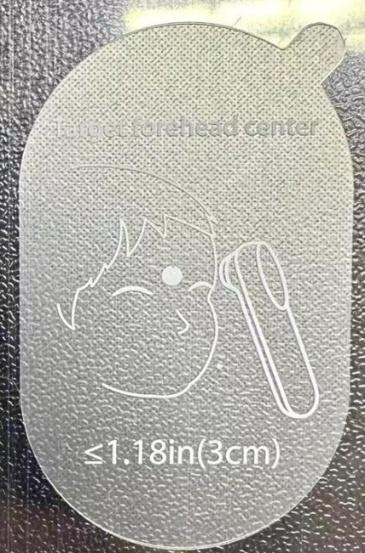
</td>
    <td rowspan="5">

</td>
    <td rowspan="39">

</td>
    <td rowspan="39">
指套
</td>
    <td rowspan="5" colspan="2">
要求：保护膜表面无破损划伤等不良现象。风险：产生外观不良。
</td>
  </tr>
  <tr>
  </tr>
  <tr>
  </tr>
  <tr>
  </tr>
  <tr>
  </tr>
  <tr>
    <td rowspan="34">

</td>
    <td rowspan="34">
贴透镜保护膜
</td>
    <td rowspan="34" colspan="3">

</td>
    <td rowspan="34">
先将整机原保护膜揭去,使用洁净布或棉签擦拭透镜表面，确保透镜表面无脏污、异物，
将出货保护膜贴到整机透镜表面，保护膜粘贴后没有歪斜、气泡、褶皱、划伤、无脏污、无异物等现象。
</td>
    <td rowspan="34" colspan="2">
要求：
保护膜粘贴后没有歪斜、气泡、褶皱、划伤、无脏污、无异物等现象。
风险:产生外观不良。

</td>
  </tr>
  <tr>
  </tr>
  <tr>
  </tr>
  <tr>
  </tr>
  <tr>
  </tr>
  <tr>
  </tr>
  <tr>
  </tr>
  <tr>
  </tr>
  <tr>
  </tr>
  <tr>
  </tr>
  <tr>
  </tr>
  <tr>
  </tr>
  <tr>
  </tr>
  <tr>
  </tr>
  <tr>
  </tr>
  <tr>
  </tr>
  <tr>
  </tr>
  <tr>
  </tr>
  <tr>
  </tr>
  <tr>
  </tr>
  <tr>
  </tr>
  <tr>
  </tr>
  <tr>
  </tr>
  <tr>
  </tr>
  <tr>
  </tr>
  <tr>
  </tr>
  <tr>
  </tr>
  <tr>
  </tr>
  <tr>
  </tr>
  <tr>
  </tr>
  <tr>
  </tr>
  <tr>
  </tr>
  <tr>
  </tr>
  <tr>
  </tr>
</table>

<table>
  <tr>
    <th colspan="10">
PT9L操作作业指导书（标准）
</th>
  </tr>
  <tr>
    <td colspan="10">
编号：WI-PT9L-EF06
</td>
  </tr>
  <tr>
    <td>
Type
</td>
    <td>
Page
</td>
    <td colspan="2">
   Progress Name
</td>
    <td>
Ver.No.
</td>
    <td>
Date
</td>
    <td>
Prepared
</td>
    <td>
Checked
</td>
    <td colspan="2">
Approved
</td>
  </tr>
  <tr>
    <td>
部件名称
</td>
    <td>
 页码   
</td>
    <td colspan="2">
   工序名称  
</td>
    <td>
版本
</td>
    <td>
生效日期
</td>
    <td>
准备
</td>
    <td>
审核
</td>
    <td colspan="2">
批准
</td>
  </tr>
  <tr>
    <td rowspan="2">
成品
</td>
    <td rowspan="2">
1/1
</td>
    <td rowspan="2" colspan="2">
整机贴铭牌
</td>
    <td rowspan="2">
1.0
</td>
    <td rowspan="2">
2024-06-20
</td>
    <td rowspan="2">

</td>
    <td rowspan="2">

</td>
    <td rowspan="2" colspan="2">

</td>
  </tr>
  <tr>
  </tr>
  <tr>
    <td>
物料名称及编码
</td>
    <td>
工序      描述
</td>
    <td colspan="3">
图象
</td>
    <td>
操作
</td>
    <td>
设备工具名称
</td>
    <td>
人员装备要求
</td>
    <td colspan="2">
要求
</td>
  </tr>
  <tr>
    <td rowspan="5">
铭牌
(物料信息见订单BOM）
</td>
    <td rowspan="5">

</td>
    <td rowspan="5" colspan="3">

</td>
    <td rowspan="5">
LOT为变量，对应实际生产订单的批号。
</td>
    <td rowspan="23">

</td>
    <td rowspan="23">
佩戴手套
</td>
    <td rowspan="5" colspan="2">
要求:铭牌不可有破损、脏污、印刷不良等缺陷，字体内容应正确。
风险:产生外观不良。
</td>
  </tr>
  <tr>
  </tr>
  <tr>
  </tr>
  <tr>
  </tr>
  <tr>
  </tr>
  <tr>
    <td rowspan="18">

</td>
    <td rowspan="18">
粘贴铭牌
</td>
    <td rowspan="18" colspan="3">

</td>
    <td rowspan="18">
操作员左手拿整机，右手从离型纸上面揭掉1pcs铭牌，目测整机中间位置，铭牌粘贴后不能有气泡、鼓起及翘边、破损、褶皱等现象，粘贴平整。
</td>
    <td rowspan="18" colspan="2">
要求：
铭牌粘贴后不能有气泡、鼓起及翘边、破损、褶皱等现象。
风险:产生外观不良。

</td>
  </tr>
  <tr>
  </tr>
  <tr>
  </tr>
  <tr>
  </tr>
  <tr>
  </tr>
  <tr>
  </tr>
  <tr>
  </tr>
  <tr>
  </tr>
  <tr>
  </tr>
  <tr>
  </tr>
  <tr>
  </tr>
  <tr>
  </tr>
  <tr>
  </tr>
  <tr>
  </tr>
  <tr>
  </tr>
  <tr>
  </tr>
  <tr>
  </tr>
  <tr>
  </tr>
</table>

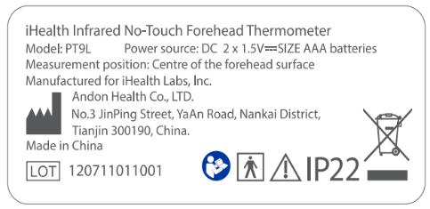

<table>
  <tr>
    <th colspan="10">
PT9L操作作业指导书（标准）
</th>
  </tr>
  <tr>
    <td colspan="10">
编号：WI-PT9L-EF07
</td>
  </tr>
  <tr>
    <td>
Type
</td>
    <td>
Page
</td>
    <td colspan="2">
   Progress Name
</td>
    <td>
Ver.No.
</td>
    <td>
Date
</td>
    <td>
Prepared
</td>
    <td>
Checked
</td>
    <td colspan="2">
Approved
</td>
  </tr>
  <tr>
    <td>
部件名称
</td>
    <td>
 页码   
</td>
    <td colspan="2">
   工序名称  
</td>
    <td>
版本
</td>
    <td>
生效日期
</td>
    <td>
准备
</td>
    <td>
审核
</td>
    <td colspan="2">
批准
</td>
  </tr>
  <tr>
    <td rowspan="2">
成品
</td>
    <td rowspan="2">
1/1
</td>
    <td rowspan="2" colspan="2">
折叠纸托
</td>
    <td rowspan="2">
1.0
</td>
    <td rowspan="2">
2024-06-20
</td>
    <td rowspan="2">

</td>
    <td rowspan="2">

</td>
    <td rowspan="2" colspan="2">

</td>
  </tr>
  <tr>
  </tr>
  <tr>
    <td>
物料名称及编码
</td>
    <td>
工序      描述
</td>
    <td colspan="3">
图象
</td>
    <td>
操作
</td>
    <td>
设备工具名称
</td>
    <td>
人员装备要求
</td>
    <td colspan="2">
要求
</td>
  </tr>
  <tr>
    <td rowspan="7">
纸托 
(物料信息见订单BOM）
</td>
    <td rowspan="7">
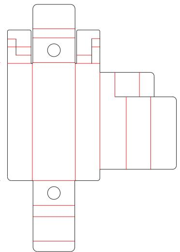
</td>
    <td rowspan="7" colspan="3">

</td>
    <td rowspan="7">

</td>
    <td rowspan="39">

</td>
    <td rowspan="39">
佩戴白手套
</td>
    <td rowspan="7" colspan="2">
要求：抚摸表面平滑、无起泡、折皱、泛黄、翘起、破损等不良现象。
风险:产生外观不良。
</td>
  </tr>
  <tr>
  </tr>
  <tr>
  </tr>
  <tr>
  </tr>
  <tr>
  </tr>
  <tr>
  </tr>
  <tr>
  </tr>
  <tr>
    <td rowspan="32">

</td>
    <td rowspan="32">
折叠纸托 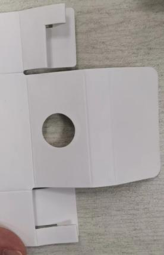
</td>
    <td rowspan="32" colspan="3">

</td>
    <td rowspan="32">
取一个纸托，纸托亮面在外，延纸托压印向里折叠，将纸托折叠成型。
</td>
    <td rowspan="32" colspan="2">
要求：
1.纸托不能有破损，褶皱，脏污等缺陷                      2.折叠时不能有撕裂，损坏                        3.纸托放置时要保持整齐
风险:产生外观不良。
</td>
  </tr>
  <tr>
  </tr>
  <tr>
  </tr>
  <tr>
  </tr>
  <tr>
  </tr>
  <tr>
  </tr>
  <tr>
  </tr>
  <tr>
  </tr>
  <tr>
  </tr>
  <tr>
  </tr>
  <tr>
  </tr>
  <tr>
  </tr>
  <tr>
  </tr>
  <tr>
  </tr>
  <tr>
  </tr>
  <tr>
  </tr>
  <tr>
  </tr>
  <tr>
  </tr>
  <tr>
  </tr>
  <tr>
  </tr>
  <tr>
  </tr>
  <tr>
  </tr>
  <tr>
  </tr>
  <tr>
  </tr>
  <tr>
  </tr>
  <tr>
  </tr>
  <tr>
  </tr>
  <tr>
  </tr>
  <tr>
  </tr>
  <tr>
  </tr>
  <tr>
  </tr>
  <tr>
  </tr>
</table>

<table>
  <tr>
    <th colspan="10">
PT9L操作作业指导书（标准）
</th>
  </tr>
  <tr>
    <td colspan="10">
编号：WI-PT9L-EF08
</td>
  </tr>
  <tr>
    <td>
Type
</td>
    <td>
Page
</td>
    <td colspan="2">
   Progress Name
</td>
    <td>
Ver.No.
</td>
    <td>
Date
</td>
    <td>
Prepared
</td>
    <td>
Checked
</td>
    <td colspan="2">
Approved
</td>
  </tr>
  <tr>
    <td>
部件名称
</td>
    <td>
 页码   
</td>
    <td colspan="2">
   工序名称  
</td>
    <td>
版本
</td>
    <td>
生效日期
</td>
    <td>
准备
</td>
    <td>
审核
</td>
    <td colspan="2">
批准
</td>
  </tr>
  <tr>
    <td rowspan="2">
成品
</td>
    <td rowspan="2">
1/1
</td>
    <td rowspan="2" colspan="2">
擦拭整机
</td>
    <td rowspan="2">
1.0
</td>
    <td rowspan="2">
2024-06-20
</td>
    <td rowspan="2">

</td>
    <td rowspan="2">

</td>
    <td rowspan="2" colspan="2">

</td>
  </tr>
  <tr>
  </tr>
  <tr>
    <td>
物料名称及编码
</td>
    <td>
工序      描述
</td>
    <td colspan="3">
图象
</td>
    <td>
操作
</td>
    <td>
设备工具名称
</td>
    <td>
人员装备要求
</td>
    <td colspan="2">
要求
</td>
  </tr>
  <tr>
    <td rowspan="8">
整机
</td>
    <td rowspan="8">

</td>
    <td rowspan="8" colspan="3">

</td>
    <td rowspan="8">

</td>
    <td rowspan="36">

</td>
    <td rowspan="36">
佩戴白手套
</td>
    <td rowspan="8" colspan="2">

</td>
  </tr>
  <tr>
  </tr>
  <tr>
  </tr>
  <tr>
  </tr>
  <tr>
  </tr>
  <tr>
  </tr>
  <tr>
  </tr>
  <tr>
  </tr>
  <tr>
    <td rowspan="28">

</td>
    <td rowspan="28">
擦拭整机
</td>
    <td rowspan="28" colspan="3">

</td>
    <td rowspan="28">
检验整机表面表面无脏污、划痕、透镜表面不能有异物，透镜膜不能有折印、褶皱不能有气泡和歪斜透镜配合不能有错台。
</td>
    <td rowspan="28" colspan="2">

要求:整机表面应洁净，不可有划伤、咯伤脏污丝印不良等；整机的外观完整性（铭牌、电池盖，机号，螺钉），透镜保护膜不可有划伤、异物等不良缺陷，整机壳体表面不可附着毛发。（具体检验标准以首件报样的整机为准）
风险:产生外观不良。
</td>
  </tr>
  <tr>
  </tr>
  <tr>
  </tr>
  <tr>
  </tr>
  <tr>
  </tr>
  <tr>
  </tr>
  <tr>
  </tr>
  <tr>
  </tr>
  <tr>
  </tr>
  <tr>
  </tr>
  <tr>
  </tr>
  <tr>
  </tr>
  <tr>
  </tr>
  <tr>
  </tr>
  <tr>
  </tr>
  <tr>
  </tr>
  <tr>
  </tr>
  <tr>
  </tr>
  <tr>
  </tr>
  <tr>
  </tr>
  <tr>
  </tr>
  <tr>
  </tr>
  <tr>
  </tr>
  <tr>
  </tr>
  <tr>
  </tr>
  <tr>
  </tr>
  <tr>
  </tr>
  <tr>
  </tr>
</table>

<table>
  <tr>
    <th colspan="10">
PT9L操作作业指导书（标准）
</th>
  </tr>
  <tr>
    <td colspan="10">
编号：WI-PT9L-EF09
</td>
  </tr>
  <tr>
    <td>
Type
</td>
    <td>
Page
</td>
    <td colspan="2">
   Progress Name
</td>
    <td>
Ver.No.
</td>
    <td>
Date
</td>
    <td>
Prepared
</td>
    <td>
Checked
</td>
    <td colspan="2">
Approved
</td>
  </tr>
  <tr>
    <td>
部件名称
</td>
    <td>
 页码   
</td>
    <td colspan="2">
   工序名称  
</td>
    <td>
版本
</td>
    <td>
生效日期
</td>
    <td>
准备
</td>
    <td>
审核
</td>
    <td colspan="2">
批准
</td>
  </tr>
  <tr>
    <td rowspan="2">
成品
</td>
    <td rowspan="2">
1/1
</td>
    <td rowspan="2" colspan="2">
整机装保护盖
</td>
    <td rowspan="2">
1.0
</td>
    <td rowspan="2">
2024-06-20
</td>
    <td rowspan="2">

</td>
    <td rowspan="2">

</td>
    <td rowspan="2" colspan="2">

</td>
  </tr>
  <tr>
  </tr>
  <tr>
    <td>
物料名称及编码
</td>
    <td>
工序      描述
</td>
    <td colspan="3">
图象
</td>
    <td>
操作
</td>
    <td>
设备工具名称
</td>
    <td>
人员装备要求
</td>
    <td colspan="2">
要求
</td>
  </tr>
  <tr>
    <td rowspan="8">
擦拭好的整机
</td>
    <td rowspan="8">

</td>
    <td rowspan="8" colspan="3">

</td>
    <td rowspan="8">

</td>
    <td rowspan="37">

</td>
    <td rowspan="37">
佩戴白手套
</td>
    <td rowspan="8" colspan="2">

</td>
  </tr>
  <tr>
  </tr>
  <tr>
  </tr>
  <tr>
  </tr>
  <tr>
  </tr>
  <tr>
  </tr>
  <tr>
  </tr>
  <tr>
  </tr>
  <tr>
    <td>
保护盖
(物料信息见订单BOM）
</td>
    <td>

</td>
    <td colspan="3">
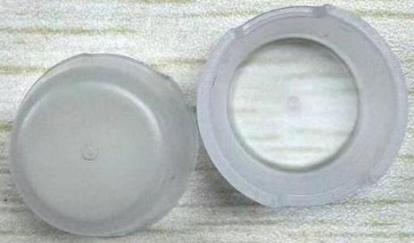
</td>
    <td>

</td>
    <td colspan="2">
要求：保护盖表面无多料、缺料、变形、开裂等不良现象。
风险:产生外观不良。
</td>
  </tr>
  <tr>
    <td rowspan="28">

</td>
    <td rowspan="28">
擦拭整机
</td>
    <td rowspan="28" colspan="3">

</td>
    <td rowspan="28">
将保护盖卡到整机探头上。
</td>
    <td rowspan="28" colspan="2">

要求:保护盖装整机位置正确。
风险:产生外观不良。
</td>
  </tr>
  <tr>
  </tr>
  <tr>
  </tr>
  <tr>
  </tr>
  <tr>
  </tr>
  <tr>
  </tr>
  <tr>
  </tr>
  <tr>
  </tr>
  <tr>
  </tr>
  <tr>
  </tr>
  <tr>
  </tr>
  <tr>
  </tr>
  <tr>
  </tr>
  <tr>
  </tr>
  <tr>
  </tr>
  <tr>
  </tr>
  <tr>
  </tr>
  <tr>
  </tr>
  <tr>
  </tr>
  <tr>
  </tr>
  <tr>
  </tr>
  <tr>
  </tr>
  <tr>
  </tr>
  <tr>
  </tr>
  <tr>
  </tr>
  <tr>
  </tr>
  <tr>
  </tr>
  <tr>
  </tr>
</table>

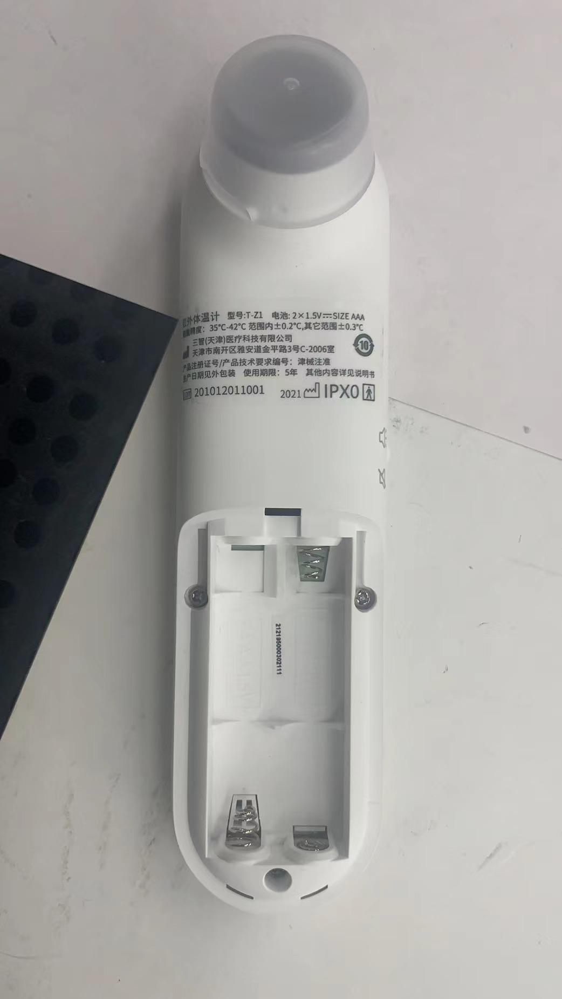

<table>
  <tr>
    <th colspan="10">
PT9L操作作业指导书（标准）
</th>
  </tr>
  <tr>
    <td colspan="10">
编号：WI-PT9L-EF10
</td>
  </tr>
  <tr>
    <td>
Type
</td>
    <td>
Page
</td>
    <td colspan="2">
   Progress Name
</td>
    <td>
Ver.No.
</td>
    <td>
Date
</td>
    <td>
Prepared
</td>
    <td>
Checked
</td>
    <td colspan="2">
Approved
</td>
  </tr>
  <tr>
    <td>
部件名称
</td>
    <td>
 页码   
</td>
    <td colspan="2">
   工序名称  
</td>
    <td>
版本
</td>
    <td>
生效日期
</td>
    <td>
准备
</td>
    <td>
审核
</td>
    <td colspan="2">
批准
</td>
  </tr>
  <tr>
    <td rowspan="2">
成品
</td>
    <td rowspan="2">
1/1
</td>
    <td rowspan="2" colspan="2">
彩包装粘贴标签
</td>
    <td rowspan="2">
1.0
</td>
    <td rowspan="2">
2024-06-20
</td>
    <td rowspan="2">

</td>
    <td rowspan="2">

</td>
    <td rowspan="2" colspan="2">

</td>
  </tr>
  <tr>
  </tr>
  <tr>
    <td>
物料名称及编码
</td>
    <td>
工序      描述
</td>
    <td colspan="3">
图象
</td>
    <td>
操作
</td>
    <td>
设备工具名称
</td>
    <td>
人员装备要求
</td>
    <td colspan="2">
要求
</td>
  </tr>
  <tr>
    <td rowspan="3">
彩包装
(物料信息见订单BOM）
</td>
    <td rowspan="3">

</td>
    <td rowspan="3" colspan="3">
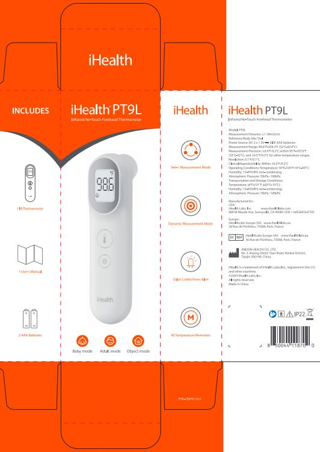
</td>
    <td rowspan="3">

</td>
    <td rowspan="3">

</td>
    <td rowspan="3">

</td>
    <td rowspan="3" colspan="2">
要求:彩包装表面不可有破损、脏污、划伤、咯印、开胶、拔丝、错位、印刷不良及附着毛发等缺陷。
风险:产生外观不良。
</td>
  </tr>
  <tr>
  </tr>
  <tr>
  </tr>
  <tr>
    <td rowspan="5">
标签
(物料信息见订单BOM）
</td>
    <td rowspan="5">

</td>
    <td rowspan="5" colspan="3">

</td>
    <td rowspan="5">
标签（10）信息为变量。对应铭牌LOT信息。
</td>
    <td rowspan="5">

</td>
    <td rowspan="5">
佩戴白手套
</td>
    <td rowspan="5" colspan="2">
要求：标签不可有破损、脏污、印刷不良等缺陷。
风险:产生外观不良。
</td>
  </tr>
  <tr>
  </tr>
  <tr>
  </tr>
  <tr>
  </tr>
  <tr>
  </tr>
  <tr>
    <td rowspan="9">
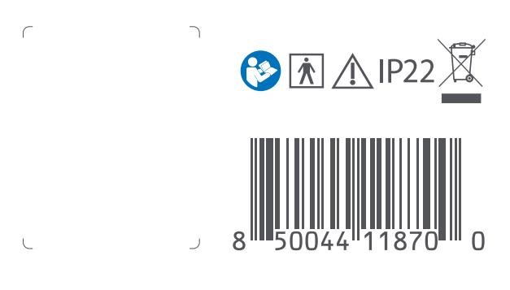
</td>
    <td rowspan="9">
粘贴标签
</td>
    <td rowspan="9" colspan="3">

</td>
    <td rowspan="9">
操作员从离型纸上揭掉二维码标签，将标签按照左图粘贴到彩包装背面条形码旁的空白处方框内。
</td>
    <td rowspan="9">

</td>
    <td rowspan="9">

</td>
    <td rowspan="9" colspan="2">
要求：
1.标签打印内容与图纸要求一致，标签打印内容不可缺墨、少字，打印内容清晰，不模糊，使用扫码枪扫描可识别。标签打印内容与客户要求一致，生产日期内容为有效生产日期。打印内容倾斜水平位置两端差值≤1.5mm，不可以盖住字体，无明显破损、褶皱等现象。
2.标签粘贴到彩包装背面指定位置。
风险:产生外观不良。
</td>
  </tr>
  <tr>
  </tr>
  <tr>
  </tr>
  <tr>
  </tr>
  <tr>
  </tr>
  <tr>
  </tr>
  <tr>
  </tr>
  <tr>
  </tr>
  <tr>
  </tr>
</table>

75000

<table>
  <tr>
    <th colspan="10">
PT9L操作作业指导书（标准）
</th>
  </tr>
  <tr>
    <td colspan="10">
编号：WI-PT9L-EF11
</td>
  </tr>
  <tr>
    <td>
Type
</td>
    <td>
Page
</td>
    <td colspan="2">
   Progress Name
</td>
    <td>
Ver.No.
</td>
    <td>
Date
</td>
    <td>
Prepared
</td>
    <td>
Checked
</td>
    <td colspan="2">
Approved
</td>
  </tr>
  <tr>
    <td>
部件名称
</td>
    <td>
 页码   
</td>
    <td colspan="2">
   工序名称  
</td>
    <td>
版本
</td>
    <td>
生效日期
</td>
    <td>
准备
</td>
    <td>
审核
</td>
    <td colspan="2">
批准
</td>
  </tr>
  <tr>
    <td rowspan="2">
成品
</td>
    <td rowspan="2">
1/1
</td>
    <td rowspan="2" colspan="2">
叠彩包装上盖
</td>
    <td rowspan="2">
1.0
</td>
    <td rowspan="2">
2024-06-20
</td>
    <td rowspan="2">

</td>
    <td rowspan="2">

</td>
    <td rowspan="2" colspan="2">

</td>
  </tr>
  <tr>
  </tr>
  <tr>
    <td>
物料名称及编码
</td>
    <td>
工序      描述
</td>
    <td colspan="3">
图象
</td>
    <td>
操作
</td>
    <td>
设备工具名称
</td>
    <td>
人员装备要求
</td>
    <td colspan="2">
要求
</td>
  </tr>
  <tr>
    <td rowspan="3">
粘贴好标签的彩包装
</td>
    <td rowspan="3">
 
</td>
    <td rowspan="3" colspan="3">

</td>
    <td rowspan="3">

</td>
    <td rowspan="3">

</td>
    <td rowspan="3">

</td>
    <td rowspan="3" colspan="2">
要求:彩包装表面不可有破损、脏污、划伤、咯印、开胶、拔丝、错位、印刷不良及附着毛发等缺陷。
风险:产生外观不良。
</td>
  </tr>
  <tr>
  </tr>
  <tr>
  </tr>
  <tr>
    <td rowspan="5">

</td>
    <td rowspan="5">
叠彩包装上盖
</td>
    <td rowspan="5" colspan="3">

</td>
    <td rowspan="5">
如图示将彩包装上盖折叠插好。
</td>
    <td rowspan="5">

</td>
    <td rowspan="5">
佩戴白手套
</td>
    <td rowspan="5" colspan="2">
要求:彩包装应插合到位，彩包装内不可有毛发破裂褶皱等缺陷。
风险:产生外观不良。
</td>
  </tr>
  <tr>
  </tr>
  <tr>
  </tr>
  <tr>
  </tr>
  <tr>
  </tr>
</table>

<table>
  <tr>
    <th colspan="10">
PT9L操作作业指导书（标准）
</th>
  </tr>
  <tr>
    <td colspan="10">
编号：WI-PT9L-EF12
</td>
  </tr>
  <tr>
    <td>
Type
</td>
    <td>
Page
</td>
    <td colspan="2">
   Progress Name
</td>
    <td>
Ver.No.
</td>
    <td>
Date
</td>
    <td>
Prepared
</td>
    <td>
Checked
</td>
    <td colspan="2">
Approved
</td>
  </tr>
  <tr>
    <td>
部件名称
</td>
    <td>
 页码   
</td>
    <td colspan="2">
   工序名称  
</td>
    <td>
版本
</td>
    <td>
生效日期
</td>
    <td>
准备
</td>
    <td>
审核
</td>
    <td colspan="2">
批准
</td>
  </tr>
  <tr>
    <td rowspan="2">
成品
</td>
    <td rowspan="2">
1/2
</td>
    <td rowspan="2" colspan="2">
整机装纸托
</td>
    <td rowspan="2">
1.0
</td>
    <td rowspan="2">
2024-06-20
</td>
    <td rowspan="2">

</td>
    <td rowspan="2">

</td>
    <td rowspan="2" colspan="2">

</td>
  </tr>
  <tr>
  </tr>
  <tr>
    <td>
物料名称及编码
</td>
    <td>
工序      描述
</td>
    <td colspan="3">
图象
</td>
    <td>
操作
</td>
    <td>
设备工具名称
</td>
    <td>
人员装备要求
</td>
    <td colspan="2">
要求
</td>
  </tr>
  <tr>
    <td rowspan="5">

电池
(物料信息见订单BOM）
</td>
    <td rowspan="5">

</td>
    <td rowspan="5" colspan="3">
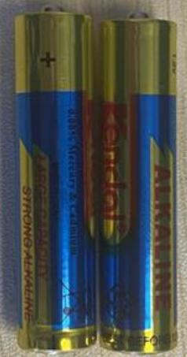
</td>
    <td rowspan="5">
7号碱性，1包2节

</td>
    <td rowspan="5">

</td>
    <td rowspan="5">
佩戴白手套
</td>
    <td rowspan="5" colspan="2">
要求:电池外包装不可有破损，电池表面不可有漏液或破损等缺陷。
风险:产生外观或电性能不良。
</td>
  </tr>
  <tr>
  </tr>
  <tr>
  </tr>
  <tr>
  </tr>
  <tr>
  </tr>
  <tr>
    <td>
擦拭好的整机
</td>
    <td>

</td>
    <td colspan="3">

</td>
    <td>

</td>
    <td>

</td>
    <td>

</td>
    <td colspan="2">
要求：整机表面干净整洁。风险:产生外观不良。
</td>
  </tr>
  <tr>
    <td rowspan="5">
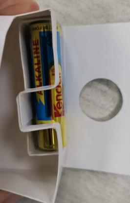
</td>
    <td rowspan="5">
整机装纸托
</td>
    <td rowspan="5" colspan="3">

</td>
    <td rowspan="5">
现将电池装到纸托凹槽内（如图示一），电池固定不晃动，再将纸托折叠成型（如图示二），并将整机装入到纸托内（如图示三），图三红框位置为直角。
</td>
    <td rowspan="5">

</td>
    <td rowspan="5">

</td>
    <td rowspan="5" colspan="2">
要求：电池放置位置正确，纸托折叠方向正确。整机放置纸托位置正确。
风险:产生外观不良。
</td>
  </tr>
  <tr>
  </tr>
  <tr>
  </tr>
  <tr>
  </tr>
  <tr>
  </tr>
</table>

<table>
  <tr>
    <th colspan="10">
PT9L操作作业指导书（标准）
</th>
  </tr>
  <tr>
    <td colspan="10">
编号：WI-PT9L-EF12
</td>
  </tr>
  <tr>
    <td>
Type
</td>
    <td>
Page
</td>
    <td colspan="2">
   Progress Name
</td>
    <td>
Ver.No.
</td>
    <td>
Date
</td>
    <td>
Prepared
</td>
    <td>
Checked
</td>
    <td colspan="2">
Approved
</td>
  </tr>
  <tr>
    <td>
部件名称
</td>
    <td>
 页码   
</td>
    <td colspan="2">
   工序名称  
</td>
    <td>
版本
</td>
    <td>
生效日期
</td>
    <td>
准备
</td>
    <td>
审核
</td>
    <td colspan="2">
批准
</td>
  </tr>
  <tr>
    <td rowspan="2">
成品
</td>
    <td rowspan="2">
2/2
</td>
    <td rowspan="2" colspan="2">
整机装纸托
</td>
    <td rowspan="2">
1.0
</td>
    <td rowspan="2">
2024-06-20
</td>
    <td rowspan="2">

</td>
    <td rowspan="2">

</td>
    <td rowspan="2" colspan="2">

</td>
  </tr>
  <tr>
  </tr>
  <tr>
    <td>
物料名称及编码
</td>
    <td>
工序      描述
</td>
    <td colspan="3">
图象
</td>
    <td>
操作
</td>
    <td>
设备工具名称
</td>
    <td>
人员装备要求
</td>
    <td colspan="2">
要求
</td>
  </tr>
  <tr>
    <td>
说明书
(物料信息见订单BOM）
</td>
    <td>
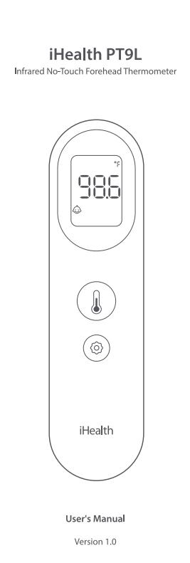
</td>
    <td colspan="3">

</td>
    <td>

</td>
    <td rowspan="13">

</td>
    <td rowspan="13">

</td>
    <td colspan="2">
要求：说明书、无破损褶皱、无脏污、异物、杂质等现象，印刷文字清楚，不模糊，不能有弯折。
风险：产生外观不良。
</td>
  </tr>
  <tr>
    <td rowspan="12">

</td>
    <td rowspan="12">
说明书装纸托
</td>
    <td rowspan="12" colspan="3">

</td>
    <td rowspan="12">
将说明书放在纸托上方。说明书正面封皮在上。
</td>
    <td rowspan="12" colspan="2">
要求：
说明书装到彩包装内位置方向正确。
风险：产生外观不良。                        
</td>
  </tr>
  <tr>
  </tr>
  <tr>
  </tr>
  <tr>
  </tr>
  <tr>
  </tr>
  <tr>
  </tr>
  <tr>
  </tr>
  <tr>
  </tr>
  <tr>
  </tr>
  <tr>
  </tr>
  <tr>
  </tr>
  <tr>
  </tr>
</table>

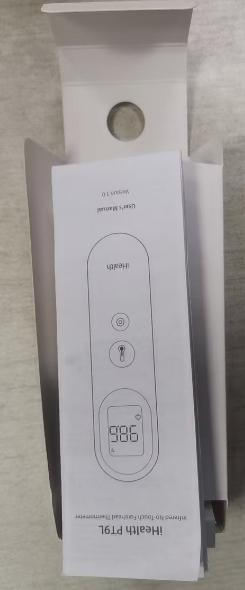

<table>
  <tr>
    <th colspan="10">
PT9L操作作业指导书（标准）
</th>
  </tr>
  <tr>
    <td colspan="10">
编号：WI-PT9L-EF13
</td>
  </tr>
  <tr>
    <td>
Type
</td>
    <td>
Page
</td>
    <td colspan="2">
   Progress Name
</td>
    <td>
Ver.No.
</td>
    <td>
Date
</td>
    <td>
Prepared
</td>
    <td>
Checked
</td>
    <td colspan="2">
Approved
</td>
  </tr>
  <tr>
    <td>
部件名称
</td>
    <td>
 页码   
</td>
    <td colspan="2">
   工序名称  
</td>
    <td>
版本
</td>
    <td>
生效日期
</td>
    <td>
准备
</td>
    <td>
审核
</td>
    <td colspan="2">
批准
</td>
  </tr>
  <tr>
    <td rowspan="2">
成品
</td>
    <td rowspan="2">
1/1
</td>
    <td rowspan="2" colspan="2">
纸托架装彩包装
</td>
    <td rowspan="2">
1.0
</td>
    <td rowspan="2">
2024-06-20
</td>
    <td rowspan="2">

</td>
    <td rowspan="2">

</td>
    <td rowspan="2" colspan="2">

</td>
  </tr>
  <tr>
  </tr>
  <tr>
    <td>
物料名称及编码
</td>
    <td>
工序      描述
</td>
    <td colspan="3">
图象
</td>
    <td>
操作
</td>
    <td>
设备工具名称
</td>
    <td>
人员装备要求
</td>
    <td colspan="2">
要求
</td>
  </tr>
  <tr>
    <td rowspan="5">
组装好的纸托架
</td>
    <td rowspan="5">

</td>
    <td rowspan="5" colspan="3">

</td>
    <td rowspan="5">

</td>
    <td rowspan="17">

</td>
    <td rowspan="17">

佩戴白手套
</td>
    <td rowspan="5" colspan="2">
要求:说明书放置纸托位置正确。
风险:产生外观不良。
</td>
  </tr>
  <tr>
  </tr>
  <tr>
  </tr>
  <tr>
  </tr>
  <tr>
  </tr>
  <tr>
    <td rowspan="12">

</td>
    <td rowspan="12">
纸托架装彩包装
</td>
    <td rowspan="12" colspan="3">

</td>
    <td rowspan="12">
将装好整机的纸托如示图方向装到彩包装内。纸托上有说明书，并将纸托底部折叠好，装到彩包装底部。整机方向与彩包装印刷整机方向一致。
</td>
    <td rowspan="12" colspan="2">
要求：
整机装彩包装内方向位置正确。
风险：产生外观不良。                        
</td>
  </tr>
  <tr>
  </tr>
  <tr>
  </tr>
  <tr>
  </tr>
  <tr>
  </tr>
  <tr>
  </tr>
  <tr>
  </tr>
  <tr>
  </tr>
  <tr>
  </tr>
  <tr>
  </tr>
  <tr>
  </tr>
  <tr>
  </tr>
</table>

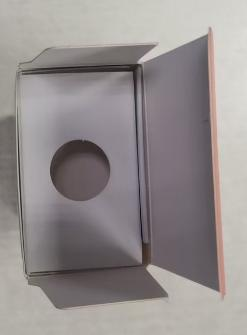

<table>
  <tr>
    <th colspan="10">
PT9L操作作业指导书（标准）
</th>
  </tr>
  <tr>
    <td colspan="10">
编号：WI-PT9L-EF14
</td>
  </tr>
  <tr>
    <td>
Type
</td>
    <td>
Page
</td>
    <td colspan="2">
   Progress Name
</td>
    <td>
Ver.No.
</td>
    <td>
Date
</td>
    <td>
Prepared
</td>
    <td>
Checked
</td>
    <td colspan="2">
Approved
</td>
  </tr>
  <tr>
    <td>
部件名称
</td>
    <td>
 页码   
</td>
    <td colspan="2">
   工序名称  
</td>
    <td>
版本
</td>
    <td>
生效日期
</td>
    <td>
准备
</td>
    <td>
审核
</td>
    <td colspan="2">
批准
</td>
  </tr>
  <tr>
    <td>
成品 
</td>
    <td>
 1/1
</td>
    <td colspan="2">
彩包装扣盖
</td>
    <td>
1
</td>
    <td rowspan="2">
2024-06-20
</td>
    <td rowspan="2">

</td>
    <td rowspan="2">

</td>
    <td rowspan="2" colspan="2">

</td>
  </tr>
  <tr>
    <td>

</td>
    <td>

</td>
    <td>

</td>
    <td>

</td>
    <td>

</td>
  </tr>
  <tr>
    <td>
物料名称及编码
</td>
    <td>
工序      描述
</td>
    <td colspan="3">
图象
</td>
    <td>
操作
</td>
    <td>
设备工具名称及校正要求
</td>
    <td>
人员装备要求
</td>
    <td colspan="2">
要求
</td>
  </tr>
  <tr>
    <td>
装好整机的彩包装
</td>
    <td>

</td>
    <td colspan="3">
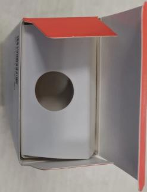
</td>
    <td>

</td>
    <td>

</td>
    <td>

</td>
    <td colspan="2">
要求:彩包装内侧应有电池、说明书、整机。
风险:产生少料。
</td>
  </tr>
  <tr>
    <td>

</td>
    <td>
彩包装扣盖 
</td>
    <td colspan="3">

</td>
    <td>
如图所示将彩包装下盖折叠扣好。
</td>
    <td>

</td>
    <td>
佩戴手套
</td>
    <td colspan="2">
要求:彩包装不可有破损褶皱，撕裂等缺陷，插合应平整到位。
风险:产生外观不良。
</td>
  </tr>
</table>

<table>
  <tr>
    <th colspan="10">
PT9L操作作业指导书（标准）
</th>
  </tr>
  <tr>
    <td colspan="10">
编号：WI-PT9L-EF15
</td>
  </tr>
  <tr>
    <td>
Type
</td>
    <td>
Page
</td>
    <td colspan="2">
   Progress Name
</td>
    <td>
Ver.No.
</td>
    <td>
Date
</td>
    <td>
Prepared
</td>
    <td>
Checked
</td>
    <td colspan="2">
Approved
</td>
  </tr>
  <tr>
    <td>
部件名称
</td>
    <td>
 页码   
</td>
    <td colspan="2">
   工序名称  
</td>
    <td>
版本
</td>
    <td>
生效日期
</td>
    <td>
准备
</td>
    <td>
审核
</td>
    <td colspan="2">
批准
</td>
  </tr>
  <tr>
    <td>
成品
</td>
    <td>
1/1
</td>
    <td colspan="2">
彩包装喷码
</td>
    <td>
1
</td>
    <td>
2024-06-20
</td>
    <td>

</td>
    <td>

</td>
    <td colspan="2">

</td>
  </tr>
  <tr>
    <td>

</td>
    <td>

</td>
    <td>

</td>
    <td>

</td>
    <td>

</td>
    <td>

</td>
    <td>

</td>
    <td>

</td>
    <td colspan="2">

</td>
  </tr>
  <tr>
    <td>
物料名称及编码
</td>
    <td>
工序      描述
</td>
    <td colspan="3">
图象
</td>
    <td>
操作
</td>
    <td>
设备工具名称及校正要求
</td>
    <td>
人员装备要求
</td>
    <td colspan="2">
要求
</td>
  </tr>
  <tr>
    <td>
扣好盖的彩包装
</td>
    <td>

</td>
    <td colspan="3">

</td>
    <td>

</td>
    <td>

</td>
    <td>

</td>
    <td colspan="2">
要求:彩包装不可有破损褶皱，撕裂等缺陷，插合应平整到位。
风险:产生外观不良。
</td>
  </tr>
  <tr>
    <td>

</td>
    <td>

</td>
    <td colspan="3">
LOT 201544011001
MFD：09.28.2020
</td>
    <td>
LOT批号对应铭牌批号，日期格式为月，日，年，日期为当前包装日期。
</td>
    <td>

</td>
    <td>

</td>
    <td colspan="2">

</td>
  </tr>
  <tr>
    <td colspan="10">
组成
</td>
  </tr>
  <tr>
    <td>

</td>
    <td>
彩包装喷码
</td>
    <td colspan="3">
  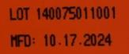
</td>
    <td>
如图所示将要求内容喷至到彩包装下盖图示位置。
</td>
    <td>

</td>
    <td>
佩戴手套
</td>
    <td colspan="2">
要求:喷码字体应清晰正确。
风险:产生外观不良。
</td>
  </tr>
</table>

<table>
  <tr>
    <th colspan="10">
PT9L操作作业指导书（标准）
</th>
  </tr>
  <tr>
    <td colspan="10">
编号：WI-PT9L-EF16
</td>
  </tr>
  <tr>
    <td>
Type
</td>
    <td>
Page
</td>
    <td colspan="2">
   Progress Name
</td>
    <td>
Ver.No.
</td>
    <td>
Date
</td>
    <td>
Prepared
</td>
    <td>
Checked
</td>
    <td>

</td>
    <td>
Approved
</td>
  </tr>
  <tr>
    <td>
部件名称
</td>
    <td>
 页码   
</td>
    <td colspan="2">
   工序名称  
</td>
    <td>
版本
</td>
    <td>
生效日期
</td>
    <td>
准备
</td>
    <td>
审核
</td>
    <td>

</td>
    <td>
批准
</td>
  </tr>
  <tr>
    <td>
成品
</td>
    <td>
 1/1
</td>
    <td colspan="2">
彩包装整机称重
</td>
    <td>
1
</td>
    <td>
2024-06-20
</td>
    <td>

</td>
    <td>

</td>
    <td colspan="2">

</td>
  </tr>
  <tr>
    <td>
物料名称及编码
</td>
    <td>
工序      描述
</td>
    <td colspan="3">
图象
</td>
    <td>
操作
</td>
    <td>

</td>
    <td>

</td>
    <td colspan="2">

</td>
  </tr>
  <tr>
    <td>
喷好码的彩包装
</td>
    <td>

</td>
    <td colspan="3">

</td>
    <td>

</td>
    <td>

</td>
    <td>

</td>
    <td colspan="2">
要求:彩包装应插合到位，彩包装不可出现破裂褶皱等缺陷。
风险:产生外观不良。
</td>
  </tr>
  <tr>
    <td>

</td>
    <td>
彩包装整机称重
</td>
    <td colspan="3">
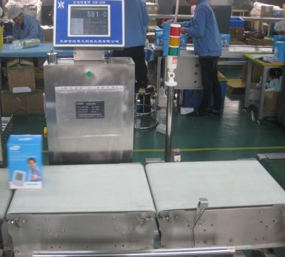 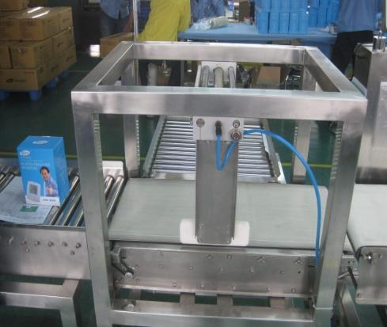
</td>
    <td>
将包装好的整机成品放到流水线上，由在线检重秤称重检查成品包装物料是否齐全，显示称重重量应合格（称重中心值确定：随机准备10盒不缺组份的产品，对成品包装进行称重（连续取10个包装好的彩包装进行称重取中间值，将数值清零后称重，称重误差范围以实际物料最轻的算公差，在此区间内判定为合格），不合格剔除，由班组长确认检查，单一包装原材料重量＜5g的称重设备不能识别，由操作员要求和包装过程抽检控制。
</td>
    <td>
HXW-400B型在线检重秤B05DXXXXXX
</td>
    <td>
佩戴手套
</td>
    <td colspan="2">
要求:HXW-400B型在线检重称显示重量应合格，检重称检重产品时应无连包报警现象。
风险:存有少料或多料现象。
</td>
  </tr>
</table>

<table>
  <tr>
    <th colspan="10">
PT9L操作作业指导书（标准）
</th>
  </tr>
  <tr>
    <td colspan="10">
编号：WI-PT9L-EF17
</td>
  </tr>
  <tr>
    <td>
Type
</td>
    <td>
Page
</td>
    <td colspan="2">
   Progress Name
</td>
    <td>
Ver.No.
</td>
    <td>
Date
</td>
    <td>
Prepared
</td>
    <td>
Checked
</td>
    <td colspan="2">
Approved
</td>
  </tr>
  <tr>
    <td>
部件名称
</td>
    <td>
 页码   
</td>
    <td colspan="2">
   工序名称  
</td>
    <td>
版本
</td>
    <td>
生效日期
</td>
    <td>
准备
</td>
    <td>
审核
</td>
    <td colspan="2">
批准
</td>
  </tr>
  <tr>
    <td rowspan="2">
成品
</td>
    <td rowspan="2">
1/1
</td>
    <td rowspan="2" colspan="2">
彩包装粘贴标签
</td>
    <td rowspan="2">
1.0
</td>
    <td rowspan="2">
2024-06-20
</td>
    <td rowspan="2">

</td>
    <td rowspan="2">

</td>
    <td rowspan="2" colspan="2">

</td>
  </tr>
  <tr>
  </tr>
  <tr>
    <td>
物料名称及编码
</td>
    <td>
工序      描述
</td>
    <td colspan="3">
图象
</td>
    <td>
操作
</td>
    <td>
设备工具名称
</td>
    <td>
人员装备要求
</td>
    <td colspan="2">
要求
</td>
  </tr>
  <tr>
    <td rowspan="7">
防拆签
(物料信息见订单BOM）
</td>
    <td rowspan="7">

</td>
    <td rowspan="7" colspan="3">
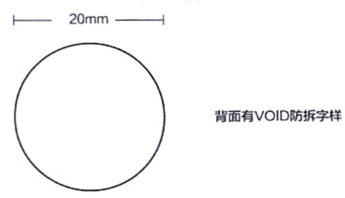
</td>
    <td rowspan="7">

</td>
    <td rowspan="42">

</td>
    <td rowspan="42">

佩戴白手套
</td>
    <td rowspan="7" colspan="2">
要求：标签表面无破损脏污等不良现象。
风险:产生外观不良。
</td>
  </tr>
  <tr>
  </tr>
  <tr>
  </tr>
  <tr>
  </tr>
  <tr>
  </tr>
  <tr>
  </tr>
  <tr>
  </tr>
  <tr>
    <td rowspan="35">

</td>
    <td rowspan="35">
粘贴封口签
</td>
    <td rowspan="35" colspan="3">

</td>
    <td rowspan="35">
1.操作员将防拆签粘贴到彩包装左图的两个红圈位置（上下盖的中间位置）并压平，只可粘贴一层防拆签，粘贴后不可褶皱，无脏污、破损等现象。
</td>
    <td rowspan="35" colspan="2">
要求：
标签粘贴的位置应正确，不可有脏污破损手印以及毛屑毛发等。
风险:产生外观不良。
</td>
  </tr>
  <tr>
  </tr>
  <tr>
  </tr>
  <tr>
  </tr>
  <tr>
  </tr>
  <tr>
  </tr>
  <tr>
  </tr>
  <tr>
  </tr>
  <tr>
  </tr>
  <tr>
  </tr>
  <tr>
  </tr>
  <tr>
  </tr>
  <tr>
  </tr>
  <tr>
  </tr>
  <tr>
  </tr>
  <tr>
  </tr>
  <tr>
  </tr>
  <tr>
  </tr>
  <tr>
  </tr>
  <tr>
  </tr>
  <tr>
  </tr>
  <tr>
  </tr>
  <tr>
  </tr>
  <tr>
  </tr>
  <tr>
  </tr>
  <tr>
  </tr>
  <tr>
  </tr>
  <tr>
  </tr>
  <tr>
  </tr>
  <tr>
  </tr>
  <tr>
  </tr>
  <tr>
  </tr>
  <tr>
  </tr>
  <tr>
  </tr>
  <tr>
  </tr>
</table>

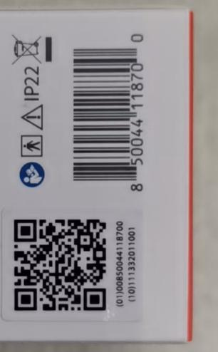

<table>
  <tr>
    <th colspan="10">
PT9L操作作业指导书（标准）
</th>
  </tr>
  <tr>
    <td colspan="10">
编号：WI-PT9L-EF18
</td>
  </tr>
  <tr>
    <td>
Type
</td>
    <td>
Page
</td>
    <td colspan="2">
   Progress Name
</td>
    <td>
Ver.No.
</td>
    <td>
Date
</td>
    <td>
Prepared
</td>
    <td>
Checked
</td>
    <td colspan="2">
Approved
</td>
  </tr>
  <tr>
    <td>
部件名称
</td>
    <td>
 页码   
</td>
    <td colspan="2">
   工序名称  
</td>
    <td>
版本
</td>
    <td>
生效日期
</td>
    <td>
准备
</td>
    <td>
审核
</td>
    <td colspan="2">
批准
</td>
  </tr>
  <tr>
    <td rowspan="2">
成品
</td>
    <td rowspan="2">
1/1
</td>
    <td rowspan="2" colspan="2">
外箱粘贴标签
</td>
    <td rowspan="2">
1.0
</td>
    <td rowspan="2">
2024-06-20
</td>
    <td rowspan="2">

</td>
    <td rowspan="2">

</td>
    <td rowspan="2" colspan="2">

</td>
  </tr>
  <tr>
  </tr>
  <tr>
    <td>
物料名称及编码
</td>
    <td>
工序      描述
</td>
    <td colspan="3">
图象
</td>
    <td>
操作
</td>
    <td>
设备工具名称
</td>
    <td>
人员装备要求
</td>
    <td colspan="2">
要求
</td>
  </tr>
  <tr>
    <td rowspan="5">
外箱
(物料信息见订单BOM）
</td>
    <td rowspan="5">
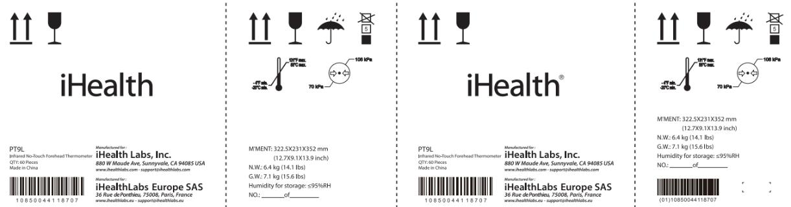
</td>
    <td rowspan="5" colspan="3">

</td>
    <td rowspan="5">

</td>
    <td rowspan="8">

</td>
    <td rowspan="8">

</td>
    <td rowspan="5" colspan="2">
要求：外箱表面无划伤、脏污、多料、少料、破损撕裂等外观不良。
风险：产生外观不良。
</td>
  </tr>
  <tr>
  </tr>
  <tr>
  </tr>
  <tr>
  </tr>
  <tr>
  </tr>
  <tr>
    <td rowspan="3">
条码标签
(物料信息见订单BOM）
</td>
    <td rowspan="3">

</td>
    <td rowspan="3" colspan="3">

</td>
    <td rowspan="3">
标签（10）信息为变量。对应铭牌LOT信息。
</td>
    <td rowspan="3" colspan="2">
要求：标签表面印刷字迹清晰正确。
风险：产生外观不良。
</td>
  </tr>
  <tr>
  </tr>
  <tr>
  </tr>
  <tr>
    <td>
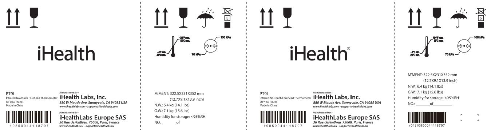
</td>
    <td>
外箱粘贴标签
</td>
    <td colspan="3">

</td>
    <td>
如图将标签粘贴到外箱方框位置。粘贴平整。
</td>
    <td>

</td>
    <td>
佩戴白手套
</td>
    <td colspan="2">
要求:标签粘贴位置正确平整。
风险:产生外观不良。
</td>
  </tr>
</table>

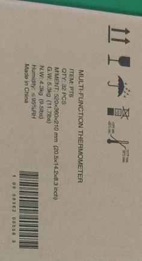

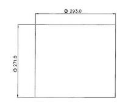

<table>
  <tr>
    <th colspan="10">
PT9L操作作业指导书（标准）
</th>
  </tr>
  <tr>
    <td colspan="10">
编号：WI-PT9L-EF19
</td>
  </tr>
  <tr>
    <td>
Type
</td>
    <td>
Page
</td>
    <td colspan="2">
   Progress Name
</td>
    <td>
Ver.No.
</td>
    <td>
Date
</td>
    <td>
Prepared
</td>
    <td>
Checked
</td>
    <td colspan="2">
Approved
</td>
  </tr>
  <tr>
    <td>
部件名称
</td>
    <td>
 页码   
</td>
    <td colspan="2">
   工序名称  
</td>
    <td>
版本
</td>
    <td>
生效日期
</td>
    <td>
准备
</td>
    <td>
审核
</td>
    <td colspan="2">
批准
</td>
  </tr>
  <tr>
    <td rowspan="2">
成品
</td>
    <td rowspan="2">
1/1
</td>
    <td rowspan="2" colspan="2">
封外箱下盖/写箱号
</td>
    <td rowspan="2">
1.0
</td>
    <td rowspan="2">
2024-06-20
</td>
    <td rowspan="2">

</td>
    <td rowspan="2">

</td>
    <td rowspan="2" colspan="2">

</td>
  </tr>
  <tr>
  </tr>
  <tr>
    <td>
物料名称及编码
</td>
    <td>
工序      描述
</td>
    <td colspan="3">
图象
</td>
    <td>
操作
</td>
    <td>
设备工具名称
</td>
    <td>
人员装备要求
</td>
    <td colspan="2">
要求
</td>
  </tr>
  <tr>
    <td rowspan="5">
粘贴好标签的外箱
</td>
    <td rowspan="5">

</td>
    <td rowspan="5" colspan="3">

</td>
    <td rowspan="5">

</td>
    <td rowspan="11">

</td>
    <td rowspan="11">
佩戴白手套
</td>
    <td rowspan="5" colspan="2">
要求：外箱表面无划伤、脏污、多料、少料、破损撕裂等外观不良。
风险：产生外观不良。
</td>
  </tr>
  <tr>
  </tr>
  <tr>
  </tr>
  <tr>
  </tr>
  <tr>
  </tr>
  <tr>
    <td rowspan="3">
透明胶带
(物料信息见订单BOM）
</td>
    <td rowspan="3">

</td>
    <td rowspan="3" colspan="3">
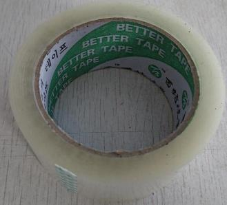
</td>
    <td rowspan="3">

</td>
    <td rowspan="3" colspan="2">
要求:胶带不可有破损，粘贴性应良好。
风险:产生外箱粘贴不牢产生外观不良。
</td>
  </tr>
  <tr>
  </tr>
  <tr>
  </tr>
  <tr>
    <td rowspan="3">

</td>
    <td rowspan="3">
封箱
</td>
    <td rowspan="3" colspan="3">
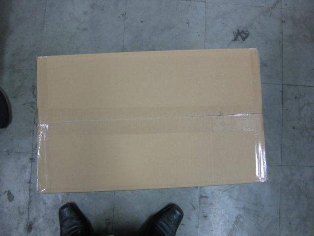
</td>
    <td rowspan="3">
如图所示使用透明胶带粘贴外箱，封箱外观应为工字形，胶带不可翘起。
</td>
    <td rowspan="3" colspan="2">
要求:胶带完全粘贴到外箱上，胶带不可翘起。
风险:产生外观不良。
</td>
  </tr>
  <tr>
  </tr>
  <tr>
  </tr>
  <tr>
    <td>

</td>
    <td>
写箱号 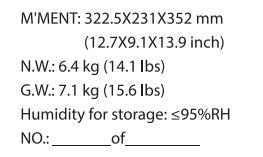
</td>
    <td colspan="3">

</td>
    <td>
如图所示使用黑色油性笔在外箱两侧唛“NO:”后面写箱号of后面写总箱号。（每种外箱的箱号从1开始顺延）。总箱号按实际评审数量计算。
</td>
    <td>

</td>
    <td>

</td>
    <td colspan="2">
要求:箱号字迹应清晰正确，箱号不可重复。
风险:产生外观不良。
</td>
  </tr>
</table>

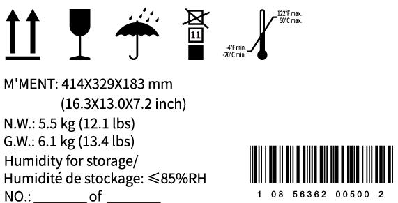

<table>
  <tr>
    <th colspan="10">
PT9L操作作业指导书（标准）
</th>
  </tr>
  <tr>
    <td colspan="10">
编号：WI-PT9L-EF20
</td>
  </tr>
  <tr>
    <td>
Type
</td>
    <td>
Page
</td>
    <td colspan="2">
   Progress Name
</td>
    <td>
Ver.No.
</td>
    <td>
Date
</td>
    <td>
Prepared
</td>
    <td>
Checked
</td>
    <td colspan="2">
Approved
</td>
  </tr>
  <tr>
    <td>
部件名称
</td>
    <td>
 页码   
</td>
    <td colspan="2">
   工序名称  
</td>
    <td>
版本
</td>
    <td>
生效日期
</td>
    <td>
准备
</td>
    <td>
审核
</td>
    <td colspan="2">
批准
</td>
  </tr>
  <tr>
    <td rowspan="2">
成品
</td>
    <td rowspan="2">
1/1
</td>
    <td rowspan="2" colspan="2">
彩包装装外箱
</td>
    <td rowspan="2">
1.0
</td>
    <td rowspan="2">
2024-06-20
</td>
    <td rowspan="2">

</td>
    <td rowspan="2">

</td>
    <td rowspan="2" colspan="2">

</td>
  </tr>
  <tr>
  </tr>
  <tr>
    <td>
物料名称及编码
</td>
    <td>
工序      描述
</td>
    <td colspan="3">
图象
</td>
    <td>
操作
</td>
    <td>
设备工具名称
</td>
    <td>
人员装备要求
</td>
    <td colspan="2">
要求
</td>
  </tr>
  <tr>
    <td>
封好的外箱
</td>
    <td>

</td>
    <td colspan="3">
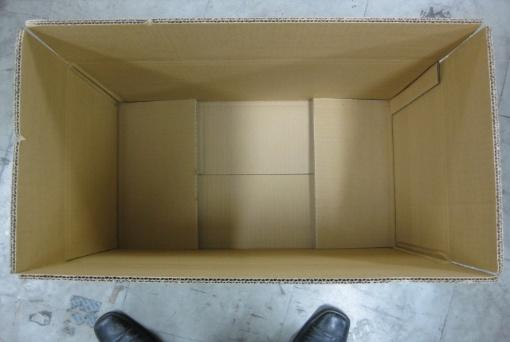
</td>
    <td>

</td>
    <td>

</td>
    <td>

</td>
    <td colspan="2">
要求:外箱内侧不可有毛发，外侧不可有破损撕裂等缺陷。
风险:产生外观不良。
</td>
  </tr>
  <tr>
    <td>
称好重的彩包装
</td>
    <td>

</td>
    <td colspan="3">

</td>
    <td>

</td>
    <td>

</td>
    <td>

</td>
    <td colspan="2">
要求:彩包装不可有破损褶皱，撕裂附着毛发异物等缺陷，插合应平整到位。
风险:产生外观不良。
</td>
  </tr>
  <tr>
    <td>
垫板
(物料信息见订单BOM）
</td>
    <td>

</td>
    <td colspan="3">
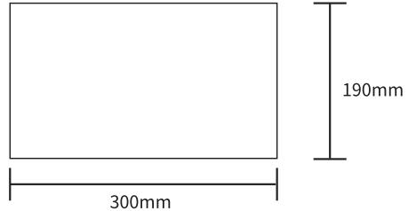
</td>
    <td>
外箱上下放垫板
</td>
    <td>

</td>
    <td>

</td>
    <td colspan="2">
要求：垫板表面无破损脏污等不良现象。
风险:产生外观不良。
</td>
  </tr>
  <tr>
    <td rowspan="2">

</td>
    <td rowspan="2">
彩包装装外箱
</td>
    <td rowspan="2" colspan="3">
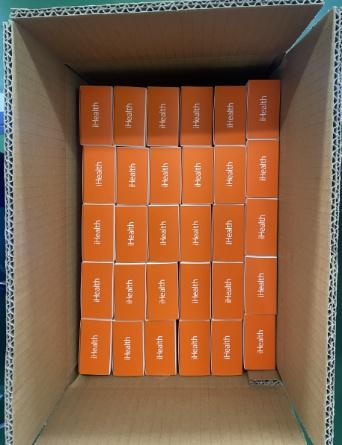
</td>
    <td rowspan="2">
如图示方向将彩包装装入外箱内。彩包装顶层放垫板。彩盒上方logo方向要一致，一层30盒，上下两层，每箱60台盒。每箱垫板上面放一个合格证，合格证需要盖质量管理章和QC章。
</td>
    <td rowspan="2">

</td>
    <td rowspan="2">

</td>
    <td rowspan="2" colspan="2">
要求:彩包装摆放方向数量应正确，同批保持方向统一，外箱内侧不可附着毛发异物等。
风险:产生外观不良。
</td>
  </tr>
  <tr>
  </tr>
</table>

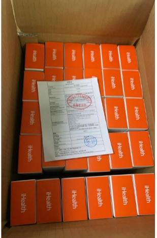

<table>
  <tr>
    <th colspan="10">
PT9L操作作业指导书（标准）
</th>
  </tr>
  <tr>
    <td colspan="10">
编号：WI-PT9L-EF21
</td>
  </tr>
  <tr>
    <td>
Type
</td>
    <td>
Page
</td>
    <td colspan="2">
   Progress Name
</td>
    <td>
Ver.No.
</td>
    <td>
Date
</td>
    <td>
Prepared
</td>
    <td>
Checked
</td>
    <td colspan="2">
Approved
</td>
  </tr>
  <tr>
    <td>
部件名称
</td>
    <td>
 页码   
</td>
    <td colspan="2">
   工序名称  
</td>
    <td>
版本
</td>
    <td>
生效日期
</td>
    <td>
准备
</td>
    <td>
审核
</td>
    <td colspan="2">
批准
</td>
  </tr>
  <tr>
    <td>
成品 
</td>
    <td>
 1/1
</td>
    <td colspan="2">
外箱封上盖
</td>
    <td>
1
</td>
    <td>
2024-06-20
</td>
    <td>

</td>
    <td>

</td>
    <td colspan="2">

</td>
  </tr>
</table>

<table>
  <tr>
    <th>
物料名称及编码
</th>
    <th>
工序      描述
</th>
    <th colspan="3">
图象
</th>
    <th>
操作
</th>
    <th>
设备工具名称及校正要求
</th>
    <th>
人员装备要求
</th>
    <th colspan="2">
要求
</th>
  </tr>
  <tr>
    <td>
装好彩包装的外箱
</td>
    <td>

</td>
    <td colspan="3">
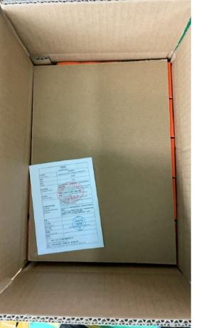
</td>
    <td>

</td>
    <td>

</td>
    <td>

</td>
    <td colspan="2">
要求:彩包装摆放方向数量应正确，外箱内侧不可附着毛发异物等。
风险:产生外观不良。
</td>
  </tr>
  <tr>
    <td>
透明胶带(物料信息见订单BOM）
</td>
    <td>

</td>
    <td colspan="3">
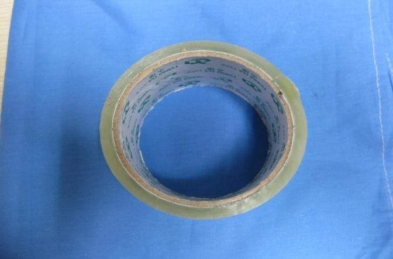
</td>
    <td>

</td>
    <td>

</td>
    <td>

</td>
    <td colspan="2">
要求:胶带不可有破损，粘贴性应良好。
风险:产生外箱粘贴不牢产生外观不良。
</td>
  </tr>
  <tr>
    <td colspan="10">
组成
</td>
  </tr>
  <tr>
    <td>

</td>
    <td>
封箱
</td>
    <td colspan="3">
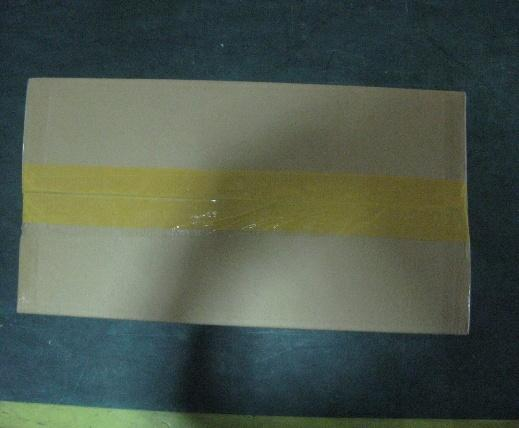 
</td>
    <td>
如图所示整箱成品使用透明胶带粘贴外箱外观应为工字形，尾数箱使用黄色胶带在外箱上盖中间位置的原封箱胶带基础上覆一层,胶带不可翘起。
</td>
    <td>
封箱器
</td>
    <td>
佩戴手套
</td>
    <td colspan="2">
要求:胶带完全粘贴到外箱上，胶带不可翘起。
风险:产生外观不良。
</td>
  </tr>
</table>

<table>
  <tr>
    <th colspan="10">
PT9L操作作业指导书（标准）
</th>
  </tr>
  <tr>
    <td colspan="10">
编号：WI-PT9L-EF22
</td>
  </tr>
  <tr>
    <td>
Type
</td>
    <td>
Page
</td>
    <td colspan="2">
   Progress Name
</td>
    <td>
Ver.No.
</td>
    <td>
Date
</td>
    <td>
Prepared
</td>
    <td>
Checked
</td>
    <td colspan="2">
Approved
</td>
  </tr>
  <tr>
    <td>
部件名称
</td>
    <td>
 页码   
</td>
    <td colspan="2">
   工序名称  
</td>
    <td>
版本
</td>
    <td>
生效日期
</td>
    <td>
准备
</td>
    <td>
审核
</td>
    <td colspan="2">
批准
</td>
  </tr>
  <tr>
    <td rowspan="2">
成品
</td>
    <td rowspan="2">
1/2
</td>
    <td rowspan="2" colspan="2">
外箱摆盘
</td>
    <td rowspan="2">
1.0
</td>
    <td rowspan="2">
2024-06-20
</td>
    <td rowspan="2">

</td>
    <td rowspan="2">

</td>
    <td rowspan="2" colspan="2">

</td>
  </tr>
  <tr>
  </tr>
  <tr>
    <td>
物料名称及编码
</td>
    <td>
工序      描述
</td>
    <td colspan="3">
图象
</td>
    <td>
操作
</td>
    <td>
设备工具名称
</td>
    <td>
人员装备要求
</td>
    <td colspan="2">
要求
</td>
  </tr>
  <tr>
    <td>
封好的外箱
</td>
    <td>

</td>
    <td colspan="3">
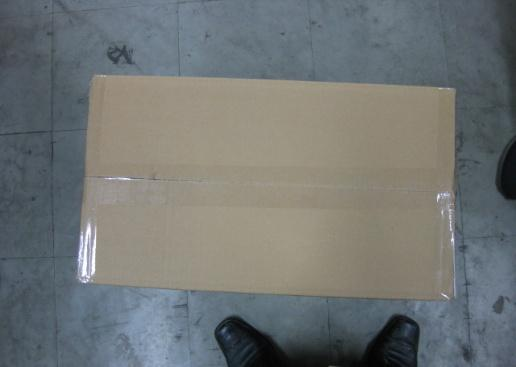
</td>
    <td>

</td>
    <td>

</td>
    <td>

</td>
    <td colspan="2">
要求:封箱胶带完全粘贴到外箱上，胶带不可翘起。
风险:产生外观不良。
</td>
  </tr>
  <tr>
    <td>

</td>
    <td>

</td>
    <td colspan="3">
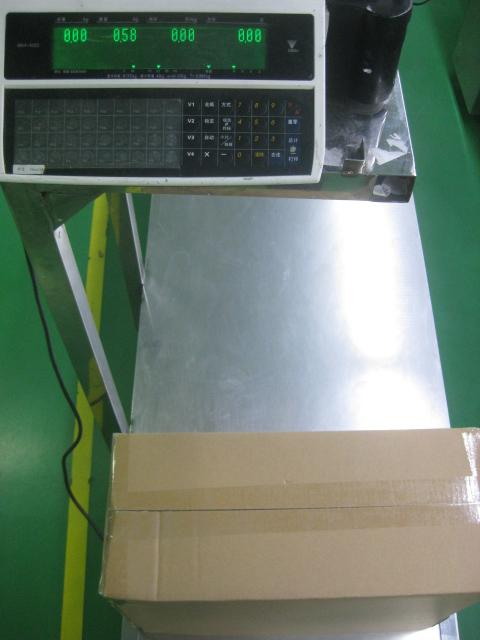 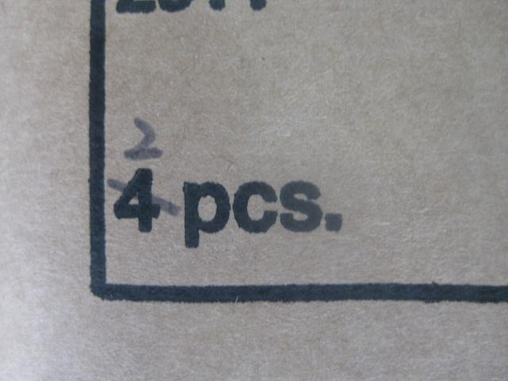
</td>
    <td>
将封好的外箱放在价格标签秤上称重，显示称重重量应合格（合格重量范围：以首件报样的第一箱成品重量为标准，称重重量±0.1Kg为合格（尾数箱以实际重量为准），单一包装成品＜0.1Kg的称重设备不能识别，由操作员要求和包装过程抽检控制）,检验完成由检验员工填写《检测员工作日报》，由专人填写《修理日报表》。尾数箱操作(成品内箱和外箱需要手写箱号或毛净重标识的尾数箱，将按照尾数箱内产品实际数量或毛净重信息填写或修改（填写或修改信息清晰易辨认），保证尾数箱内产品数量或毛净重信息应与内箱和外箱标识信息一致。
</td>
    <td>
SM-90B+价格标签秤B00EXXXXXX
</td>
    <td>
佩戴手套
</td>
    <td colspan="2">
要求:价格标签秤显示重量应合格。
风险:存有少料或多料现象。
</td>
  </tr>
</table>

<table>
  <tr>
    <th colspan="10">
PT9L操作作业指导书（标准）
</th>
  </tr>
  <tr>
    <td colspan="10">
编号：WI-PT9L-EF22
</td>
  </tr>
  <tr>
    <td>
Type
</td>
    <td>
Page
</td>
    <td colspan="2">
   Progress Name
</td>
    <td>
Ver.No.
</td>
    <td>
Date
</td>
    <td>
Prepared
</td>
    <td>
Checked
</td>
    <td colspan="2">
Approved
</td>
  </tr>
  <tr>
    <td>
部件名称
</td>
    <td>
 页码   
</td>
    <td colspan="2">
   工序名称  
</td>
    <td>
版本
</td>
    <td>
生效日期
</td>
    <td>
准备
</td>
    <td>
审核
</td>
    <td colspan="2">
批准
</td>
  </tr>
  <tr>
    <td rowspan="2">
成品
</td>
    <td rowspan="2">
2/2
</td>
    <td rowspan="2" colspan="2">
外箱摆盘
</td>
    <td rowspan="2">
1.0
</td>
    <td rowspan="2">
2024-06-20
</td>
    <td rowspan="2">

</td>
    <td rowspan="2">

</td>
    <td rowspan="2" colspan="2">

</td>
  </tr>
  <tr>
  </tr>
  <tr>
    <td>
物料名称及编码
</td>
    <td>
工序      描述
</td>
    <td colspan="3">
图象
</td>
    <td>
操作
</td>
    <td>
设备工具名称
</td>
    <td>
人员装备要求
</td>
    <td colspan="2">
要求
</td>
  </tr>
  <tr>
    <td rowspan="6">
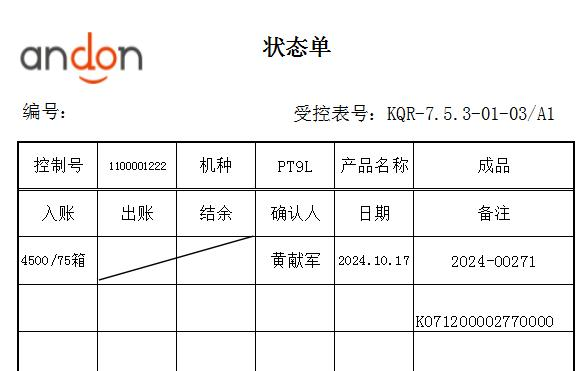
</td>
    <td rowspan="6">
托盘
(物料信息见订单BOM）
</td>
    <td rowspan="6" colspan="3">

</td>
    <td rowspan="6">
如图所示将外箱摆放到木头地盘上，摆放数量应统一，摆放高度不可超出电梯口高度，每完成整盘或尾数盘时，由领班核对成品外箱印刷的唯一性标识与操作作业指导书中外箱图纸印刷内容相同，确认无误后，依据实际生产的评审、机种、控制号等信息与生产计划相对应填写成品状态单标识，确认签字；状态单标识应不少于填写信息内容包括：成品控制号、机种、产品名称、数量、确认人、日期以及备注（评审、类型、其他等），缠绕裹好膜，粘贴好状态单，放置待检区域。木头盘缠绕膜至少三层。
</td>
    <td rowspan="6">

</td>
    <td rowspan="6">

</td>
    <td rowspan="6" colspan="2">
要求:摆放数量应统一，摆放高度不可超出电梯口高度，状态单标识应清晰。
风险:产生数量不准确。
</td>
  </tr>
  <tr>
  </tr>
  <tr>
  </tr>
  <tr>
  </tr>
  <tr>
  </tr>
  <tr>
  </tr>
</table>

33.333333333333336

90一托盘，BOM有问题

