<table>
  <tr>
    <th colspan="9">
PT9L操作作业指导书（标准）
</th>
  </tr>
  <tr>
    <td colspan="9">
编号：WI-PT9L-AQ01
</td>
  </tr>
  <tr>
    <td>
Type
</td>
    <td>
Page
</td>
    <td colspan="2">
   Progress Name
</td>
    <td>
Ver.No
</td>
    <td>
Date
</td>
    <td>
Prepared
</td>
    <td>
Checked
</td>
    <td>
Approved
</td>
  </tr>
  <tr>
    <td>
部件名称
</td>
    <td>
 页码   
</td>
    <td colspan="2">
   工序名称  
</td>
    <td>
版本
</td>
    <td>
生效期
</td>
    <td>
准备
</td>
    <td>
审核
</td>
    <td>
批准
</td>
  </tr>
  <tr>
    <td>
插件机芯
</td>
    <td>
1/1
</td>
    <td colspan="2">
镀锡
</td>
    <td>
1
</td>
    <td>
2024.6.20
</td>
    <td>

</td>
    <td>

</td>
    <td>

</td>
  </tr>
  <tr>
    <td>
物料名称及编码
</td>
    <td>
工序      描述
</td>
    <td colspan="3">
图象
</td>
    <td>
操作
</td>
    <td>
设备工具名称
</td>
    <td>
人员装备要求
</td>
    <td>
要求
</td>
  </tr>
  <tr>
    <td>
基板
</td>
    <td>

</td>
    <td colspan="3">

</td>
    <td>

</td>
    <td>

</td>
    <td>
佩戴静电手腕带
</td>
    <td>
要求：

规格型号符合BOM要求，无破损、无生锈变形。

风险：测试不良品。
</td>
  </tr>
  <tr>
    <td rowspan="9">
基板
</td>
    <td rowspan="9">
镀锡
</td>
    <td rowspan="9" colspan="3">

</td>
    <td rowspan="9">
手持烙铁，如图红框内铜箔进行镀锡，共3个焊点（详细位置：1、2、3）。
</td>
    <td rowspan="9">
电烙铁温度350℃~380℃焊接时间小于3秒（编号H005XXXXXX）
</td>
    <td rowspan="9">
佩戴静电手腕带
</td>
    <td rowspan="9">
要求：

1、焊点饱满；

2、焊点不可出现拉尖、连焊、虚焊、漏焊现象。

风险：测试不良品。
</td>
  </tr>
  <tr>
  </tr>
  <tr>
  </tr>
  <tr>
  </tr>
  <tr>
  </tr>
  <tr>
  </tr>
  <tr>
  </tr>
  <tr>
  </tr>
  <tr>
  </tr>
</table>

<table>
  <tr>
    <th colspan="10">
PT9L操作作业指导书（标准）
</th>
  </tr>
  <tr>
    <td colspan="3">
编号：WI-PT9L-AQ02
</td>
    <td>

</td>
    <td>

</td>
    <td>

</td>
    <td>

</td>
    <td>

</td>
    <td colspan="2">

</td>
  </tr>
  <tr>
    <td>
Type
</td>
    <td>
Page
</td>
    <td colspan="2">
Progress Name
</td>
    <td>
Ver.No
</td>
    <td>
Date
</td>
    <td>
Prepared
</td>
    <td>
Checked
</td>
    <td colspan="2">
Approved
</td>
  </tr>
  <tr>
    <td>
部件名称
</td>
    <td>
 页码   
</td>
    <td colspan="2">
工序名称  
</td>
    <td>
版本
</td>
    <td>
生效期
</td>
    <td>
准备
</td>
    <td>
审核
</td>
    <td colspan="2">
批准
</td>
  </tr>
  <tr>
    <td>
插件小板
</td>
    <td>
1/1
</td>
    <td colspan="2">
正负极弹簧放工装
</td>
    <td>
1
</td>
    <td>
2024.6.20
</td>
    <td>

</td>
    <td>

</td>
    <td>

</td>
    <td>

</td>
  </tr>
  <tr>
    <td>
物料名称
</td>
    <td>
工序      描述
</td>
    <td colspan="3">
图象
</td>
    <td>
操作
</td>
    <td>
设备工具名称
</td>
    <td>
人员装备要求
</td>
    <td colspan="2">
要求
</td>
  </tr>
  <tr>
    <td rowspan="3">
镀好锡的贴片基板

</td>
    <td rowspan="3">

</td>
    <td rowspan="3" colspan="3">

</td>
    <td rowspan="3">

</td>
    <td rowspan="3">

</td>
    <td rowspan="3">

</td>
    <td rowspan="3" colspan="2">

</td>
  </tr>
  <tr>
  </tr>
  <tr>
  </tr>
  <tr>
    <td rowspan="4">
正极弹簧（物料信息见制造令BOM）
</td>
    <td rowspan="4">
正极弹簧
</td>
    <td rowspan="4" colspan="3">
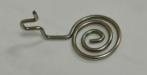
</td>
    <td rowspan="4">

</td>
    <td rowspan="4">

</td>
    <td rowspan="4">

</td>
    <td rowspan="4" colspan="2">
要求：

1、规格型号符合BOM要求，无破损、无生锈变形。

风险：外观不良
</td>
  </tr>
  <tr>
  </tr>
  <tr>
  </tr>
  <tr>
  </tr>
  <tr>
    <td rowspan="6">
负极弹簧（物料信息见制造令BOM）
</td>
    <td rowspan="6">
负极弹簧
</td>
    <td rowspan="6" colspan="3">
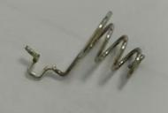
</td>
    <td rowspan="6">

</td>
    <td rowspan="6">

</td>
    <td rowspan="6">

</td>
    <td rowspan="6" colspan="2">
要求：

1、规格型号符合BOM要求，无破损、无生锈变形。

风险：外观不良
</td>
  </tr>
  <tr>
  </tr>
  <tr>
  </tr>
  <tr>
  </tr>
  <tr>
  </tr>
  <tr>
  </tr>
  <tr>
    <td>

</td>
    <td>
正负极弹簧放工装
</td>
    <td colspan="3">
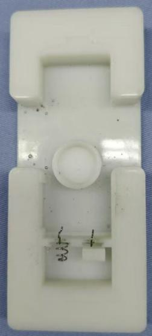
</td>
    <td>
                                                          取弹簧正负极，依次摆放在工装上，注意区分型号。
</td>
    <td>
PT9L 正负极弹簧焊接工装M0MIXXXXXX
</td>
    <td>

</td>
    <td colspan="2">
要求：

1、正负极簧外观，无破损、生锈变形现象；

2、正负极弹簧在工装定位槽内无松动、虚位现象。

风险：外观不良
</td>
  </tr>
</table>

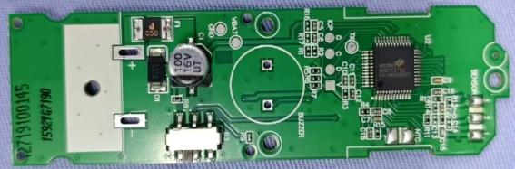

<table>
  <tr>
    <th colspan="10">
PT9L操作作业指导书（标准）
</th>
  </tr>
  <tr>
    <td colspan="3">
编号：WI-PT9L-AQ03
</td>
    <td>

</td>
    <td>

</td>
    <td>

</td>
    <td>

</td>
    <td>

</td>
    <td colspan="2">

</td>
  </tr>
  <tr>
    <td>
Type
</td>
    <td>
Page
</td>
    <td colspan="2">
Progress Name
</td>
    <td>
Ver.No
</td>
    <td>
Date
</td>
    <td>
Prepared
</td>
    <td>
Checked
</td>
    <td colspan="2">
Approved
</td>
  </tr>
  <tr>
    <td>
部件名称
</td>
    <td>
 页码   
</td>
    <td colspan="2">
工序名称  
</td>
    <td>
版本
</td>
    <td>
生效期
</td>
    <td>
准备
</td>
    <td>
审核
</td>
    <td colspan="2">
批准
</td>
  </tr>
  <tr>
    <td>
插件小板
</td>
    <td>
1/1
</td>
    <td colspan="2">
插蜂鸣器放工装
</td>
    <td>
1
</td>
    <td>
2024.6.20
</td>
    <td>

</td>
    <td>

</td>
    <td>

</td>
    <td>

</td>
  </tr>
  <tr>
    <td>
物料名称
</td>
    <td>
工序      描述
</td>
    <td colspan="3">
图象
</td>
    <td>
操作
</td>
    <td>
设备工具名称
</td>
    <td>
人员装备要求
</td>
    <td colspan="2">
要求
</td>
  </tr>
  <tr>
    <td rowspan="3">
装好正负极簧的工装
</td>
    <td rowspan="3">

</td>
    <td rowspan="3" colspan="3">
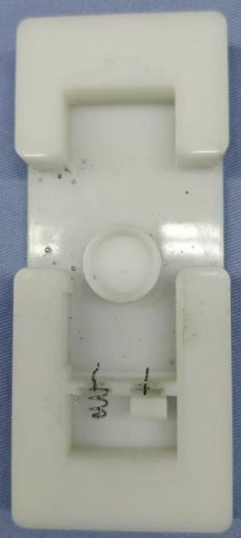
</td>
    <td rowspan="7">

</td>
    <td rowspan="8">

PT9L 正负极弹簧焊接工装M0MIXXXXXX
</td>
    <td rowspan="7">

</td>
    <td rowspan="7" colspan="2">
要求：

1、规格型号符合BOM要求，无破损、无生锈变形。

风险：外观不良
</td>
  </tr>
  <tr>
  </tr>
  <tr>
  </tr>
  <tr>
    <td rowspan="4">
蜂鸣器（物料信息见制造令BOM）
</td>
    <td rowspan="4">

</td>
    <td rowspan="4" colspan="3">
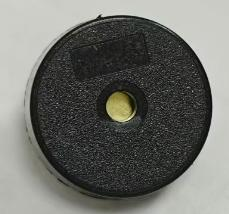
</td>
  </tr>
  <tr>
  </tr>
  <tr>
  </tr>
  <tr>
  </tr>
  <tr>
    <td>

</td>
    <td>
插蜂鸣器放工装
</td>
    <td colspan="3">
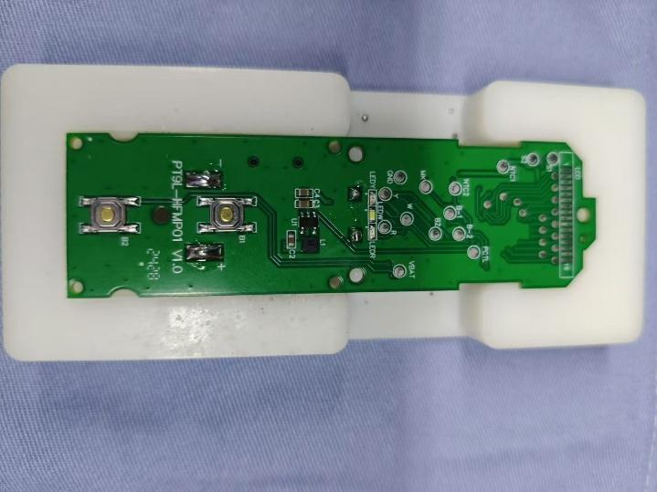
</td>
    <td>
1.把蜂鸣器插在PCB上的蜂鸣器的丝印框里；      2.将插好蜂鸣器的PCB放入工装定位槽内，正负极弹簧穿入PCB对应过孔； 3.下压PCB使正负极簧与PCB上的+、-焊盘处接触。        
</td>
    <td>

</td>
    <td colspan="2">
要求：

1、蜂鸣器有字的那面朝下，如图一红框位置，方向保持统一。  
2、正负极弹簧必须插到底，不可歪斜；
3、正负极弹簧紧贴PCB；

风险：外观不良
</td>
  </tr>
</table>

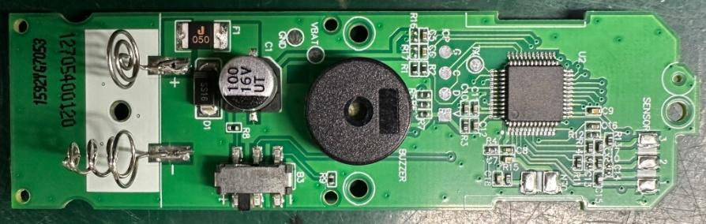

<table>
  <tr>
    <th colspan="9">
PT9L操作作业指导书（标准）
</th>
  </tr>
  <tr>
    <td colspan="9">
编号：WI-PT9L-AQ04
</td>
  </tr>
  <tr>
    <td>
Type
</td>
    <td>
Page
</td>
    <td colspan="2">
   Progress Name
</td>
    <td>
Ver.No
</td>
    <td>
Date
</td>
    <td>
Prepared
</td>
    <td>
Checked
</td>
    <td>
Approved
</td>
  </tr>
  <tr>
    <td>
部件名称
</td>
    <td>
 页码   
</td>
    <td colspan="2">
   工序名称  
</td>
    <td>
版本
</td>
    <td>
生效期
</td>
    <td>
准备
</td>
    <td>
审核
</td>
    <td>
批准
</td>
  </tr>
  <tr>
    <td>
插件机芯
</td>
    <td>
1/1
</td>
    <td colspan="2">
正负极簧焊接
</td>
    <td>
1
</td>
    <td>
2024.6.20
</td>
    <td>

</td>
    <td>

</td>
    <td>

</td>
  </tr>
  <tr>
    <td>
物料名称及编码
</td>
    <td>
工序      描述
</td>
    <td colspan="3">
图象
</td>
    <td>
操作
</td>
    <td>
设备工具名称
</td>
    <td>
人员装备要求
</td>
    <td>
要求
</td>
  </tr>
  <tr>
    <td>

</td>
    <td>
贴片基板放工装
</td>
    <td colspan="3">
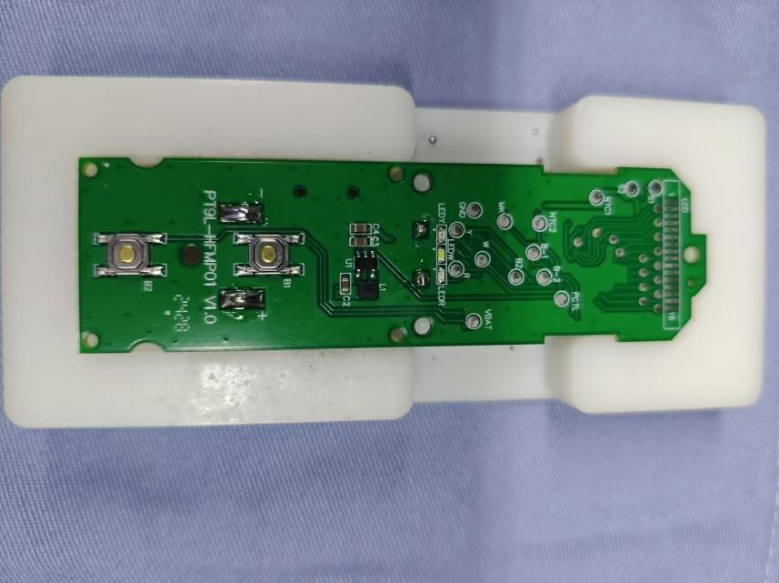
</td>
    <td>
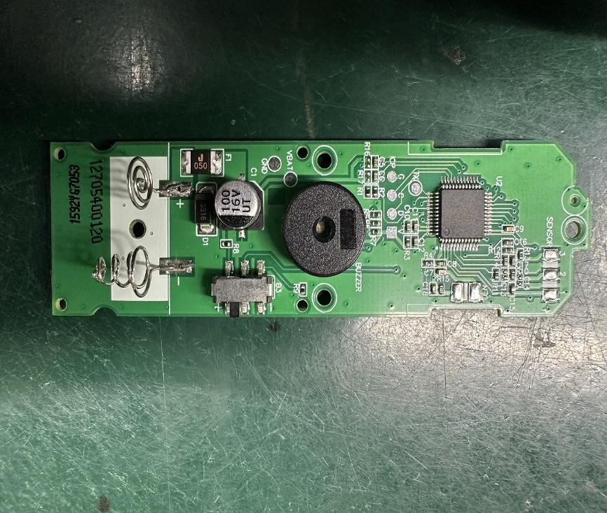
</td>
    <td>

</td>
    <td>

</td>
    <td>

</td>
  </tr>
  <tr>
    <td rowspan="9">

</td>
    <td rowspan="9">
正负极簧焊接
</td>
    <td rowspan="9" colspan="3">
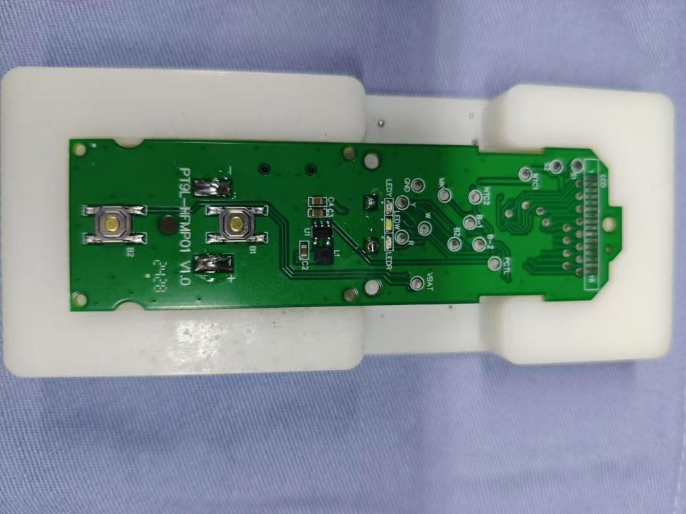
</td>
    <td rowspan="9">
手持烙铁，如图红框内正极弹簧位置进行焊接，
</td>
    <td rowspan="9">
PT9L 正负极弹簧焊接工装M0MIXXXXXX/电烙铁温度350℃~380℃焊接时间小于3秒（编号H005XXXXXX）
</td>
    <td rowspan="9">
佩戴静电手腕带
</td>
    <td rowspan="9">
要求：

1、焊点饱满；

2、焊点不可出现拉尖、连焊、虚焊、漏焊现象。

3、正负极弹簧无变形、焊偏现象；

4、正负极弹簧紧贴PCB。

风险：测试不良品。
</td>
  </tr>
  <tr>
  </tr>
  <tr>
  </tr>
  <tr>
  </tr>
  <tr>
  </tr>
  <tr>
  </tr>
  <tr>
  </tr>
  <tr>
  </tr>
  <tr>
  </tr>
</table>

<table>
  <tr>
    <th colspan="9">
PT9L操作作业指导书（标准）
</th>
  </tr>
  <tr>
    <td colspan="9">
编号：WI-PT9L-AQ05
</td>
  </tr>
  <tr>
    <td>
Type
</td>
    <td>
Page
</td>
    <td colspan="2">
   Progress Name
</td>
    <td>
Ver.No
</td>
    <td>
Date
</td>
    <td>
Prepared
</td>
    <td>
Checked
</td>
    <td>
Approved
</td>
  </tr>
  <tr>
    <td>
部件名称
</td>
    <td>
 页码   
</td>
    <td colspan="2">
   工序名称  
</td>
    <td>
版本
</td>
    <td>
生效期
</td>
    <td>
准备
</td>
    <td>
审核
</td>
    <td>
批准
</td>
  </tr>
  <tr>
    <td>
插件机芯
</td>
    <td>
1/1
</td>
    <td colspan="2">
蜂鸣器焊接
</td>
    <td>
1
</td>
    <td>
2024.6.20
</td>
    <td>

</td>
    <td>

</td>
    <td>

</td>
  </tr>
  <tr>
    <td>
物料名称及编码
</td>
    <td>
工序      描述
</td>
    <td colspan="3">
图象
</td>
    <td>
操作
</td>
    <td>
设备工具名称
</td>
    <td>
人员装备要求
</td>
    <td>
要求
</td>
  </tr>
  <tr>
    <td rowspan="9">

</td>
    <td rowspan="9">
蜂鸣器焊接
</td>
    <td rowspan="9" colspan="3">

</td>
    <td rowspan="9">
1.手持烙铁，如图红框内蜂鸣器进行焊接；

2.焊好后的PCB蜂鸣器腿多余部分需要剪掉。
</td>
    <td rowspan="9">
PT9L 正负极弹簧焊接工装M0MIXXXXXX/电烙铁温度350℃~380℃焊接时间小于3秒（编号H005XXXXXX）
</td>
    <td rowspan="9">
佩戴静电手腕带
</td>
    <td rowspan="9">
要求：

1、焊点饱满；

2、焊点不可出现拉尖、连焊、虚焊、漏焊现象；

3、蜂鸣器紧贴PCB；                                                                                                                                                               

4、蜂鸣器剪腿后的焊点高度不得超过1.5mm   

                                                                                                                                                                  风险：测试不良品。
</td>
  </tr>
  <tr>
  </tr>
  <tr>
  </tr>
  <tr>
  </tr>
  <tr>
  </tr>
  <tr>
  </tr>
  <tr>
  </tr>
  <tr>
  </tr>
  <tr>
  </tr>
</table>

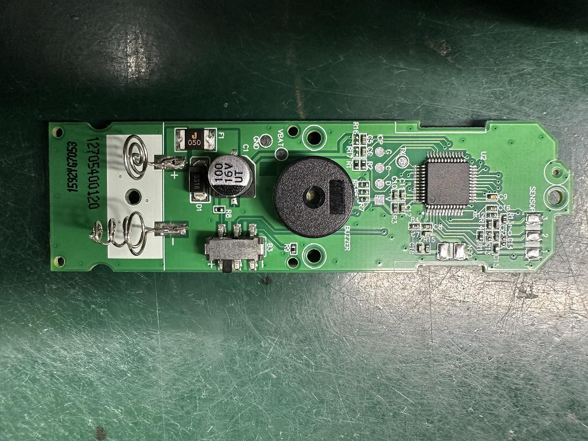

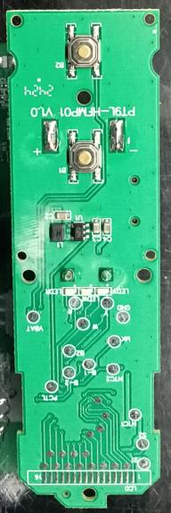

<table>
  <tr>
    <th colspan="10">
PT9L操作作业指导书（标准）
</th>
  </tr>
  <tr>
    <td colspan="3">
编号：WI-PT9L-AQ06
</td>
    <td>

</td>
    <td>

</td>
    <td>

</td>
    <td>

</td>
    <td>

</td>
    <td colspan="2">

</td>
  </tr>
  <tr>
    <td>
Type
</td>
    <td>
Page
</td>
    <td colspan="2">
   Progress Name
</td>
    <td>
Ver.No
</td>
    <td>
Date
</td>
    <td>
Prepared
</td>
    <td>
Checked
</td>
    <td colspan="2">
Approved
</td>
  </tr>
  <tr>
    <td>
部件名称
</td>
    <td>
 页码   
</td>
    <td colspan="2">
工序名称  
</td>
    <td>
版本
</td>
    <td>
生效期
</td>
    <td>
准备
</td>
    <td>
审核
</td>
    <td colspan="2">
批准
</td>
  </tr>
  <tr>
    <td>
插件机芯
</td>
    <td>
1/1
</td>
    <td colspan="2">
焊点检验
</td>
    <td>
1
</td>
    <td>
2024.6.20
</td>
    <td>

</td>
    <td>

</td>
    <td>

</td>
    <td>

</td>
  </tr>
  <tr>
    <td>
物料名称
</td>
    <td>
工序      描述
</td>
    <td colspan="3">
图象
</td>
    <td>
操作
</td>
    <td>
设备工具名称
</td>
    <td>
人员装备要求
</td>
    <td colspan="2">
要求
</td>
  </tr>
  <tr>
    <td rowspan="24">
机芯
</td>
    <td rowspan="24">
检验
</td>
    <td rowspan="14" colspan="3">

</td>
    <td rowspan="24">
1、拿取焊接完的机芯，进行外观检验

2、检验完毕后记录《检测员工作日报》
</td>
    <td rowspan="24">

</td>
    <td rowspan="24">
佩戴静电手腕带
</td>
    <td rowspan="24" colspan="2">
要求

1、焊点饱满，镀锡位置正确；
2、焊点不可出现拉尖、连焊、虚焊、漏焊现象；
3、焊点周边的元器件不可有损伤或缺件，连焊现象；
4、正负极簧、蜂鸣器紧贴PCB，不可歪斜。

风险：测试不良品。
</td>
  </tr>
  <tr>
  </tr>
  <tr>
  </tr>
  <tr>
  </tr>
  <tr>
  </tr>
  <tr>
  </tr>
  <tr>
  </tr>
  <tr>
  </tr>
  <tr>
  </tr>
  <tr>
  </tr>
  <tr>
  </tr>
  <tr>
  </tr>
  <tr>
  </tr>
  <tr>
  </tr>
  <tr>
    <td rowspan="10" colspan="3">
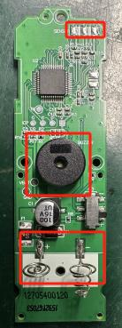
</td>
  </tr>
  <tr>
  </tr>
  <tr>
  </tr>
  <tr>
  </tr>
  <tr>
  </tr>
  <tr>
  </tr>
  <tr>
  </tr>
  <tr>
  </tr>
  <tr>
  </tr>
  <tr>
  </tr>
</table>

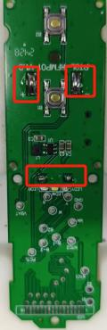

<table>
  <tr>
    <th colspan="10">
PT9L操作作业指导书（标准）
</th>
  </tr>
  <tr>
    <td colspan="3">
编号：WI-PT9L-AQ07
</td>
    <td>

</td>
    <td>

</td>
    <td>

</td>
    <td>

</td>
    <td>

</td>
    <td colspan="2">

</td>
  </tr>
  <tr>
    <td>
Type
</td>
    <td>
Page
</td>
    <td colspan="2">
Progress Name
</td>
    <td>
Ver.No
</td>
    <td>
Date
</td>
    <td>
Prepared
</td>
    <td>
Checked
</td>
    <td colspan="2">
Approved
</td>
  </tr>
  <tr>
    <td>
部件名称
</td>
    <td>
 页码   
</td>
    <td colspan="2">
工序名称  
</td>
    <td>
版本
</td>
    <td>
生效期
</td>
    <td>
准备
</td>
    <td>
审核
</td>
    <td colspan="2">
批准
</td>
  </tr>
  <tr>
    <td>
插件机芯
</td>
    <td>
1/1
</td>
    <td colspan="2">
下盘
</td>
    <td>
1
</td>
    <td>
2024.6.20
</td>
    <td>

</td>
    <td>

</td>
    <td>

</td>
    <td>

</td>
  </tr>
  <tr>
    <td>
物料名称
</td>
    <td>
工序      描述
</td>
    <td colspan="3">
图象
</td>
    <td>

</td>
    <td>
设备工具名称
</td>
    <td>
装备要求
</td>
    <td colspan="2">
要求
</td>
  </tr>
  <tr>
    <td rowspan="19">
基板
(物料信息见制造令BOM）
</td>
    <td rowspan="19">
包装
</td>
    <td rowspan="19" colspan="3">

</td>
    <td rowspan="19">
将焊接完成的基板，整齐的排列于相对应的周转盘内。
</td>
    <td rowspan="19">

</td>
    <td rowspan="19">
佩戴防静电手套或静电手腕带
</td>
    <td rowspan="19" colspan="2">
要求：

1.装周转盘时若无特殊要求同一种机型和制造令不允许有两个以上的零头；　　　
2.包装数量须准确，且不得将不同机种和制造令的基板混包。        
3.焊接完成的机芯下盘前，要先清理一下吸塑盘，保证吸塑盘内干净，无异物。

风险：数量不准确。
</td>
  </tr>
  <tr>
  </tr>
  <tr>
  </tr>
  <tr>
  </tr>
  <tr>
  </tr>
  <tr>
  </tr>
  <tr>
  </tr>
  <tr>
  </tr>
  <tr>
  </tr>
  <tr>
  </tr>
  <tr>
  </tr>
  <tr>
  </tr>
  <tr>
  </tr>
  <tr>
  </tr>
  <tr>
  </tr>
  <tr>
  </tr>
  <tr>
  </tr>
  <tr>
  </tr>
  <tr>
  </tr>
</table>

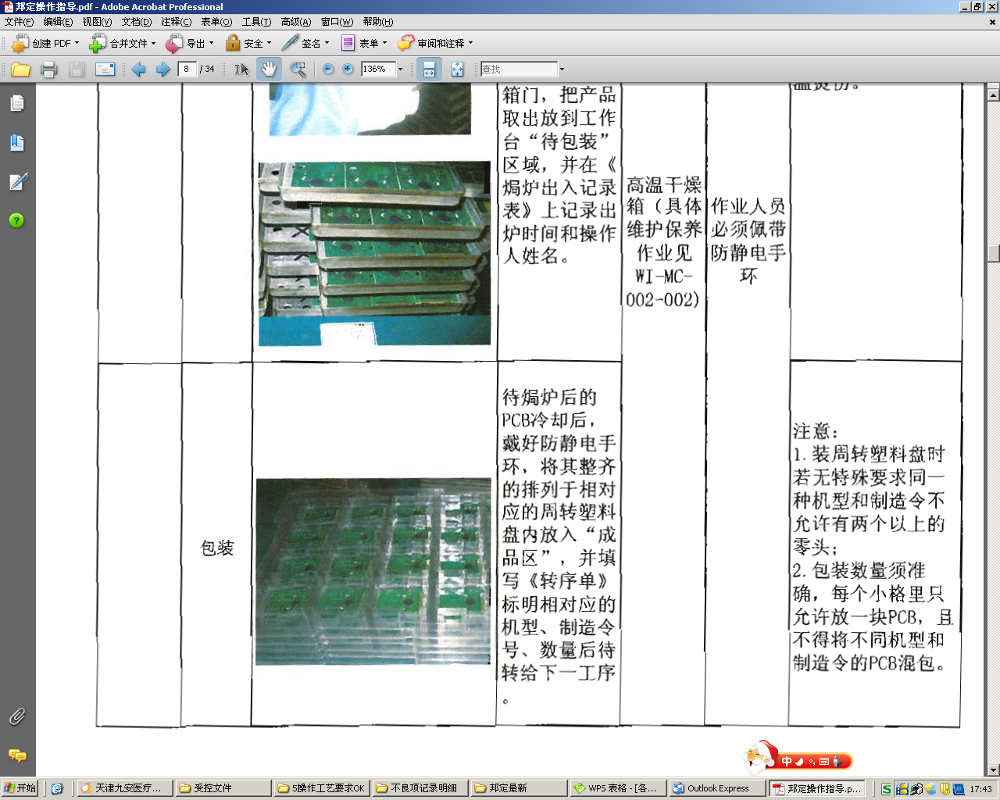