## PT9L操作作业指导书（标准）

编号：WI-PT9L-DY01

Type Page

Progress Name

部件名称 页码

工序名称

Ver.No

版本

Date

Prepared

生效期

准备

Checked

Approved

审核

主机 1/2

组装传感器

1.0 2024.06.20

<table><tr><td rowspan=1 colspan=1>物料名称及编码</td><td rowspan=1 colspan=1>工序描述</td><td rowspan=1 colspan=1>图象</td><td rowspan=1 colspan=1>操作</td><td rowspan=1 colspan=1>设备工具名称</td><td rowspan=1 colspan=1>人员装备要求</td><td rowspan=1 colspan=1>要求</td></tr><tr><td rowspan=1 colspan=1>传感器(物料信息见制造令BOM)</td><td rowspan=3 colspan=3>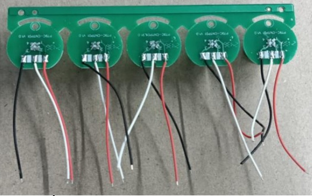传感器(物料信息见制造令BOM)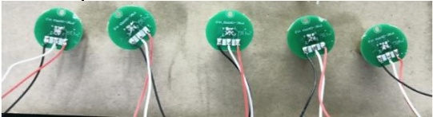支架（物料信                                  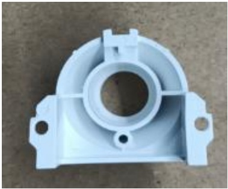传感息见制造器装令BOM）支架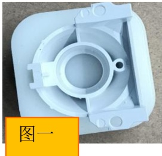传感器装支架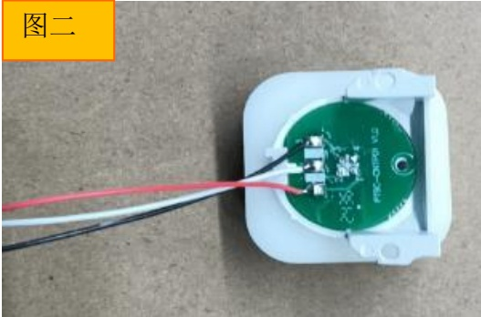</td><td rowspan=1 colspan=1>如图所示将传感器掰成单个</td><td rowspan=3 colspan=1></td><td rowspan=3 colspan=1>佩戴手指套静电环</td></tr><tr><td rowspan=1 colspan=1>支架（物料信息见制造令BOM）</td><td rowspan=1 colspan=1></td><td rowspan=1 colspan=1></td><td></td><td rowspan=1 colspan=1>要求：外观无缺损、脏污等不良风险：性能不良</td></tr><tr><td></td><td rowspan=1 colspan=1>如图所示将支架和传感器放在工装上组合</td><td></td><td rowspan=1 colspan=1>要求：安装到位风险：性能不良不良</td></tr></table>

## PT9L操作作业指导书（标准）

编号：WI-PT9L-DY01

Type Page

部件名称 页码

Progress Name

工序名称

Ver.No

版本

Date

Prepared

生效期

准备

Checked

审核

Approved

批准

主机 2/2

组装传感器

1.0 2024.06.20

<table><tr><td rowspan=1 colspan=1>物料名称及编码</td><td rowspan=1 colspan=1>工序描述</td><td rowspan=1 colspan=1>图象</td><td rowspan=1 colspan=1>操作</td><td rowspan=1 colspan=1>设备工具名称</td><td rowspan=1 colspan=1>人员装备要求</td><td rowspan=1 colspan=1>要求</td></tr><tr><td rowspan=1 colspan=1>传感器和支架组合后</td><td rowspan=3 colspan=2>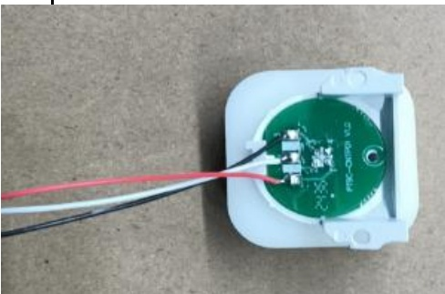传感器装支架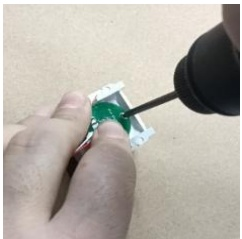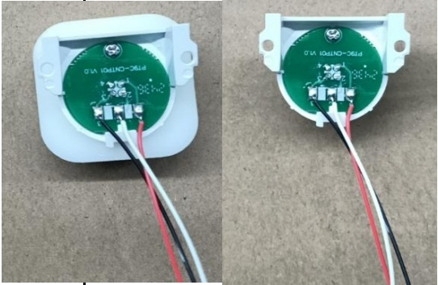</td><td rowspan=1 colspan=1></td><td rowspan=3 colspan=1></td><td rowspan=3 colspan=1>佩戴手指套静电环</td><td rowspan=1 colspan=1>要求：外观无缺损、脏污等不良风险：性能不良</td></tr><tr><td rowspan=1 colspan=1>自攻螺钉(物料信息见制造令BOM)</td><td rowspan=1 colspan=1></td><td rowspan=1 colspan=1>螺钉规格：ST2.0×5.0-F-H电动螺丝刀扭力标准：1.6kgf.cm±0.2</td><td rowspan=1 colspan=1>要求：外观无缺损、脏污等不良风险：性能不良</td></tr><tr><td rowspan=1 colspan=1>传感器装支架</td><td rowspan=1 colspan=1>如图所示左手按着传感器，右手打螺钉，螺丝需紧固传感器支架</td><td rowspan=1 colspan=1>要求：安装到位风险：性能不良不良</td></tr></table>

## PT9L操作作业指导书（标准）

编号：WI-PT9L-DY02

Type Page

部件名称 页码

Progress Name

工序名称

Ver.No

版本

Date

Prepared

生效期

准备

Checked

审核

Approved

批准

主机 1/1

PCB焊接

1.0 2024.06.20

<table><tr><td rowspan=1 colspan=1>物料名称及编码</td><td rowspan=1 colspan=1>工序描述</td><td rowspan=1 colspan=2>图象</td><td rowspan=1 colspan=1>操作</td><td rowspan=1 colspan=1>设备工具名称</td><td rowspan=1 colspan=1>人员装备要求</td><td rowspan=1 colspan=1>要求</td></tr><tr><td rowspan=6 colspan=4>传感器模块和支架组装                                      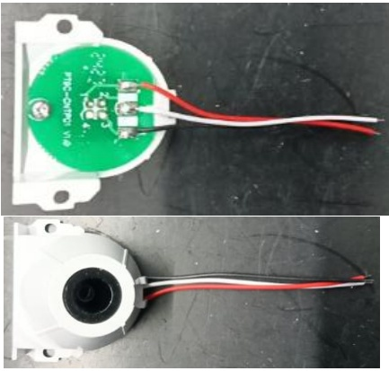（物料信息见制造令BOM)PCB                                               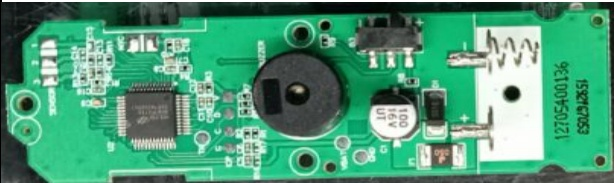（物料信息见制造令BOM)数字1-2-3对应探头三根线数字3焊接黑线数字2焊接白线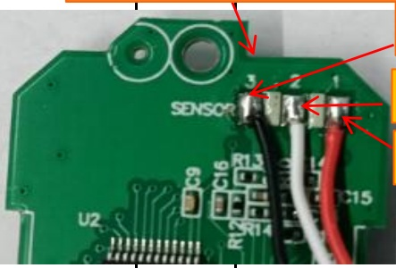数字1焊接红线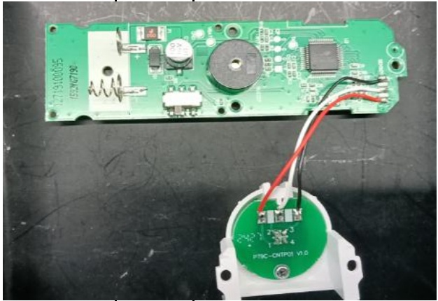</td><td rowspan=1 colspan=1>传感器模块和支架组装（物料信息见制造令BOM)</td><td rowspan=1 colspan=3></td></tr><tr><td rowspan=1 colspan=1>PCB（物料信息见制造令BOM)</td><td rowspan=1 colspan=3></td><td></td><td></td><td rowspan=4 colspan=1>要求：1.PCB组件缺一不可。2.PCB不能有损坏、脏污、变形等风险：性能不良</td></tr><tr><td rowspan=1 colspan=1></td><td rowspan=4 colspan=1>1、如图一所示：将前工序探头焊接在PCB主板上，三根线手工焊接，线焊接牢固，焊点饱满，焊接时间不超过3秒2、下排摆放不可堆叠，连接线不可缠绕</td><td></td><td></td></tr><tr><td rowspan=1 colspan=1>数字3焊接黑线</td><td></td><td></td></tr><tr><td rowspan=1 colspan=1>数字2焊接白线</td><td></td><td></td></tr><tr><td></td><td></td><td rowspan=1 colspan=1>要求：1：线焊接牢固，焊点饱满，焊接时间不超过3秒风险：性能不良</td></tr></table>

## PT9L操作作业指导书（标准）

编号：WI-PT9L-DY03

Type Page

部件名称 页码

Progress Name

工序名称

Ver.No

版本

Date

生效期

Prepared

准备

Checked

审核

主机 1/2

按键组装

1.0 2024.06.20

<table><tr><td rowspan=1 colspan=1>物料名称及编码</td><td rowspan=1 colspan=1>工序描述</td><td rowspan=1 colspan=1>图象</td><td rowspan=1 colspan=1>操作</td><td rowspan=1 colspan=1>设备工具名称</td><td rowspan=1 colspan=1>人员装备要求</td><td rowspan=1 colspan=1>要求</td></tr><tr><td rowspan=1 colspan=1>按键(物料信息见制造令BOM)</td><td rowspan=3 colspan=1>安装缓冲垫</td><td rowspan=1 colspan=1>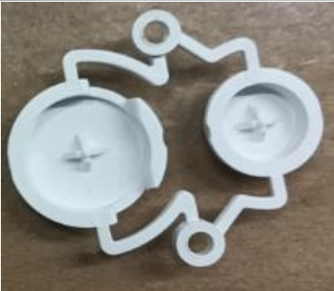</td><td rowspan=1 colspan=1></td><td rowspan=3 colspan=1></td><td rowspan=3 colspan=1>佩戴手指套静电环</td><td rowspan=1 colspan=1>要求：外观无缺损、脏污等不良风险：性能不良</td></tr><tr><td rowspan=1 colspan=1>缓冲垫（物料信息见制造令BOM)</td><td rowspan=1 colspan=1>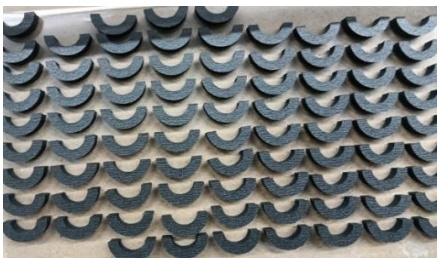</td><td rowspan=1 colspan=1></td><td rowspan=1 colspan=1>要求：外观无缺损、脏污等不良风险：性能不良</td></tr><tr><td rowspan=1 colspan=1>安装缓冲垫</td><td rowspan=1 colspan=1>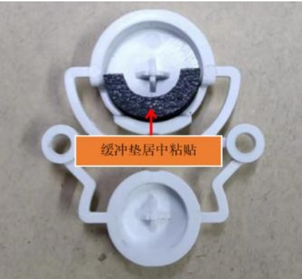</td><td rowspan=1 colspan=1>拿取缓冲垫，带有双面胶一侧粘贴在按键内，缓冲垫居中安装</td><td rowspan=1 colspan=1>要求：安装到位风险：性能不良不良</td></tr></table>

## PT9L操作作业指导书（标准）

编号：WI-PT9L-DY03

Type Page

Progress Name

部件名称 页码

工序名称

Ver.No

版本

Date

Prepared

生效期

准备

Checked

Approved

审核

批准

主机 2/2

按键组装

1.0 2024.06.20

<table><tr><td rowspan=1 colspan=1>物料名称及编码</td><td rowspan=1 colspan=1>工序描述</td><td rowspan=1 colspan=2>图象</td><td rowspan=1 colspan=1>操作</td><td rowspan=1 colspan=1>设备工具名称</td><td rowspan=1 colspan=1>人员装备要求</td><td rowspan=1 colspan=1>要求</td></tr><tr><td rowspan=2 colspan=1>上盖（物料信息见制造令BOM)</td><td rowspan=6 colspan=4>安装按键                                   上盖（物料信息见制造令BOM)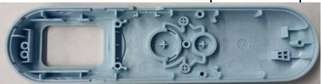贴好缓冲垫                                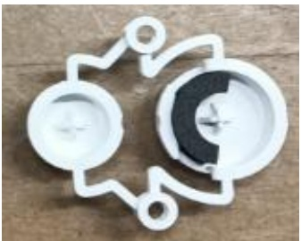的按键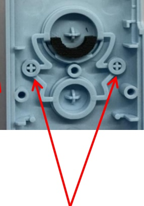上壳安装按键                 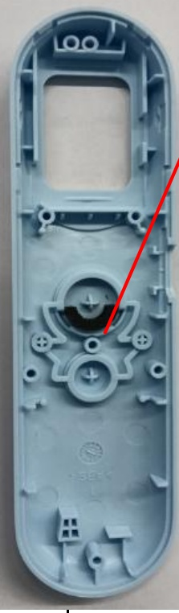对准孔位后放入按键，按压箭头指向处</td><td></td><td></td><td rowspan=2 colspan=1>要求：1、外观无缺损、脏污、变形、划伤等不良现象；风险：性能不良</td></tr><tr><td rowspan=1 colspan=1></td><td></td><td></td></tr><tr><td rowspan=1 colspan=1>贴好缓冲垫的按键</td><td rowspan=1 colspan=2></td><td rowspan=1 colspan=1></td><td></td><td></td><td rowspan=1 colspan=1>要求：1、缓冲垫安装到位。2、外观无缺损、脏污、变形、划伤等不良现象；风险：性能不良</td></tr><tr><td></td><td rowspan=3 colspan=1>将粘贴缓冲垫后的按键安装在前壳上，并按压图示位置至根部</td><td></td><td></td><td rowspan=3 colspan=1>要求：1、按键安装到位。2、外观无缺损、脏污、变形、划伤等不良现象；风险：性能不良</td></tr><tr><td></td><td rowspan=1 colspan=1>对准孔位后放入按键，按压箭头指向处</td><td></td><td></td></tr><tr><td></td><td rowspan=1 colspan=1></td><td></td><td></td></tr></table>

## PT9L操作作业指导书（标准）

编号：WI-PT9L-DY04

Type Page

Progress Name

部件名称 页码

工序名称

Ver.No

版本

Date

Prepared

生效期

准备

Checked

Approved

审核

批准

主机 1/3

前壳组装显示屏

1.0 2024.06.20

<table><tr><td rowspan=1 colspan=1>物料名称及编码</td><td rowspan=1 colspan=1>工序描述</td><td rowspan=1 colspan=1>图象</td><td rowspan=1 colspan=1>操作</td><td rowspan=1 colspan=1>设备工具名称</td><td rowspan=1 colspan=1>人员装备要求</td><td rowspan=1 colspan=1>要求</td></tr><tr><td rowspan=1 colspan=1>液晶（物料信息见制造令BOM)</td><td rowspan=4 colspan=1>安装液晶</td><td rowspan=1 colspan=1>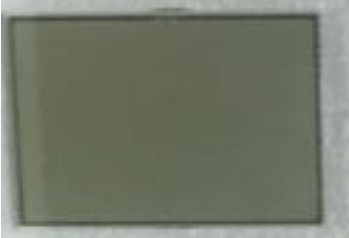</td><td rowspan=1 colspan=1>如图将液晶的保护膜撕下，手指不能触碰液晶屏</td><td rowspan=1 colspan=1></td><td rowspan=4 colspan=1>佩戴手指套静电环</td><td rowspan=1 colspan=1>要求：外观无缺损、脏污、划伤等不良风险：性能不良</td></tr><tr><td rowspan=2 colspan=1>装好按键的上壳</td><td rowspan=2 colspan=2></td><td rowspan=1 colspan=1></td><td rowspan=3 colspan=1></td><td rowspan=2 colspan=1>要求：外观无缺损、脏污、划伤等不良风险：性能不良</td></tr><tr><td rowspan=1 colspan=1></td></tr><tr><td rowspan=1 colspan=1>安装液晶</td><td rowspan=1 colspan=1>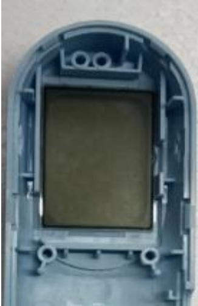</td><td rowspan=1 colspan=1>如图所示撕下保护膜后，确认液晶良好进行安装，方向不可错、不可有杂质、脏污。</td><td rowspan=1 colspan=1>要求：液晶安装方向不可错，不可有杂质、脏污液晶、保护膜需撕下风险：性能不良</td></tr></table>

## PT9L操作作业指导书（标准）

编号：WI-PT9L-DY04

Type Page

Progress Name

工序名称

Ver.No

部件名称 页码

Date

版本

Prepared

生效期

准备

Checked

Approved

审核

批准

主机 2/3

前壳组装显示屏

1.0 2024.06.20

<table><tr><td rowspan=1 colspan=1>物料名称及编码</td><td rowspan=1 colspan=1>工序描述</td><td rowspan=1 colspan=1>图象</td><td rowspan=1 colspan=1>操作</td><td rowspan=1 colspan=1>设备工具名称</td><td rowspan=1 colspan=1>人员装备要求</td><td rowspan=1 colspan=1>要求</td></tr><tr><td rowspan=1 colspan=1>背光（物料信息见制造令BOM)</td><td rowspan=3 colspan=3>背光（物料信息见                                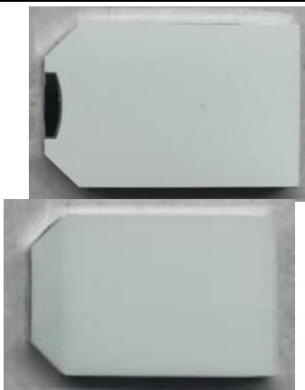制造令BOM)背光揭膜                                   安装背光              确认液晶表面无脏污异物后，撕下背光保护膜安装背光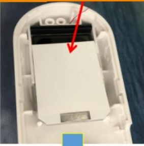安装背光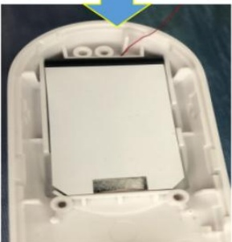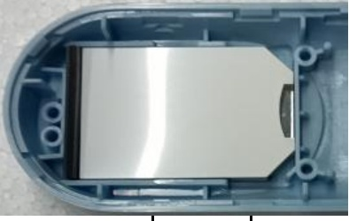</td><td rowspan=1 colspan=3></td></tr><tr><td rowspan=1 colspan=1>背光揭膜</td><td rowspan=1 colspan=1></td><td rowspan=1 colspan=1>如图将背光的保护膜撕下，手指不能触碰背光屏</td><td></td><td></td><td rowspan=1 colspan=1>要求：1、外观无缺损、脏污等不良；2、黄胶包装标识明确（名称、开封后有效期、确认人、复核人）。</td></tr><tr><td></td><td rowspan=1 colspan=1>如图示：用气枪将液晶上的异物吹干净后，再揭背光保护膜进行安装，安装方向不可错。</td><td></td><td></td><td rowspan=1 colspan=1>要求：背光安装方向不可错，不可有杂质、脏污，背光保护膜需撕下风险：性能不良</td></tr></table>

## PT9L操作作业指导书（标准）

编号：WI-PT9L-DY04

Type Page

部件名称 页码

Progress Name

工序名称

Ver.No

版本

Date

生效期

Prepared Checked Approved

准备

审核

批准

<table><tr><td>主机 物料名称</td><td>3/3</td><td>前壳组装显示屏 1.0</td><td>2024.06.20</td><td></td><td></td><td></td></tr><tr><td>及编码</td><td>工序 描述</td><td>图象</td><td>操作</td><td>设备工具 名称</td><td>人员装 备要求</td><td>要求</td></tr><tr><td>斑马条 （物料信 息见制造 令BOM）</td><td></td><td></td><td></td><td></td><td></td><td>要求： 外观无破损、 脏污等 不良风险：性 能不良 要求：</td></tr><tr><td>安装好的 背光</td><td colspan="4">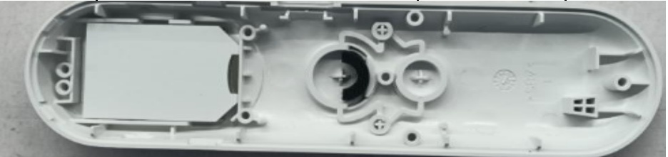</td><td>脏污等 能不良</td><td>外观无破损、 不良风险：性</td></tr><tr><td>安装斑马 条</td><td>安装斑马 条</td><td>确认白色区域无脏污后安 装斑马条，（酒精擦拭干 燥后安装或气枪吹) 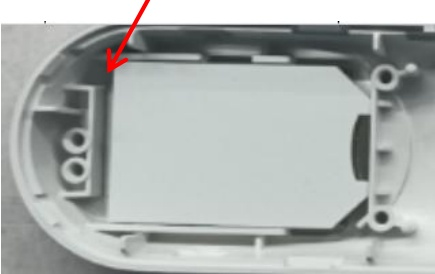 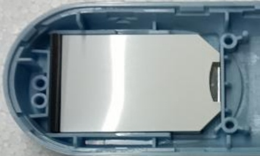</td><td>如图示：将 斑马条安装 到指定位置 安装到位， 不可翘起都 风险。</td><td></td><td>佩戴静 电手腕 带</td><td>要求： 斑马条安装到 位，不可有杂 质、脏污、翘 起等 风险：性能不 良</td></tr></table>

andon

受控表号：KQR-7.5.1-03-37/A0

## PT9L操作作业指导书（标准）

编号：WI-PT9L-DY05

Type Page

部件名称 页码

Progress Name

工序名称

Ver.No

版本

Date

生效期

Prepared

准备

<table><tr><td rowspan=1 colspan=1>物料名称及编码</td><td rowspan=1 colspan=1>工序描述</td><td rowspan=1 colspan=1>图象</td><td rowspan=1 colspan=1>操作</td><td rowspan=1 colspan=1>设备工具名称</td><td rowspan=1 colspan=1>人员装备要求</td><td rowspan=1 colspan=1>要求</td></tr><tr><td rowspan=1 colspan=1>完整的PCB板</td><td rowspan=1 colspan=1></td><td rowspan=1 colspan=1>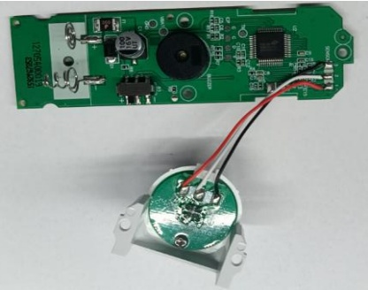</td><td rowspan=1 colspan=1></td><td rowspan=3 colspan=1></td><td rowspan=3 colspan=1>佩戴静电手腕带</td><td rowspan=1 colspan=1>要求：外观无破损、脏污等不良风险：性能不良</td></tr><tr><td rowspan=1 colspan=1>装好的显示屏</td><td rowspan=1 colspan=3>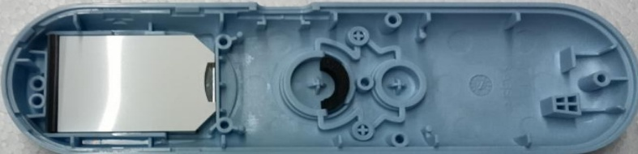</td><td rowspan=1 colspan=1>要求：外观无缺件、无破损、脏污等不良风险：性</td></tr><tr><td rowspan=1 colspan=3>安装PCB板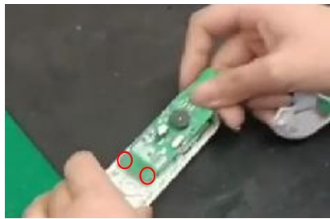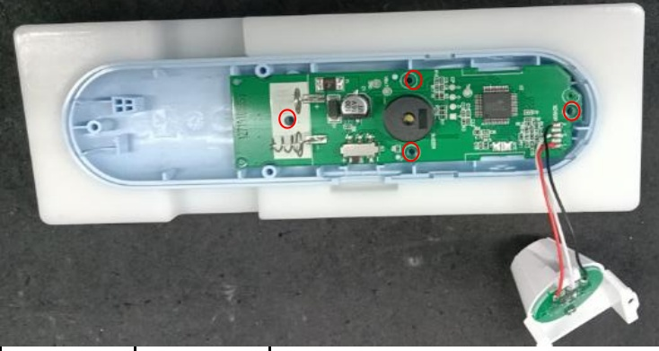</td><td rowspan=1 colspan=1>安装PCB板</td><td rowspan=1 colspan=1></td><td rowspan=1 colspan=1>如图所示：左手拿不缺件的上壳，右手拿PCB板，先对下面的两个孔，然后对上面的两个孔，按压到底。</td><td rowspan=1 colspan=1>要求：PCB板安装到位，不可有杂质、脏污、翘起等风险：性能不良</td></tr></table>

## PT9L操作作业指导书（标准）

编号：WI-PT9L-DY06

Progress Name

工序名称

Ver.No

版本

Date

生效期

Prepared

准备

Checked

审核

<table><tr><td rowspan=1 colspan=1>物料名称</td><td rowspan=1 colspan=1>工序描述</td><td rowspan=1 colspan=1>图象</td><td rowspan=1 colspan=1>操作</td><td rowspan=1 colspan=1>设备工具名称</td><td rowspan=1 colspan=1>人员装备要求</td><td rowspan=1 colspan=1>要求</td></tr><tr><td rowspan=1 colspan=1>自攻螺钉（物料信息见制造令BOM)</td><td rowspan=1 colspan=1></td><td rowspan=1 colspan=1>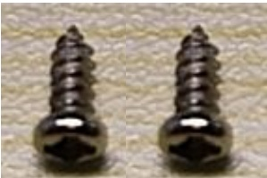</td><td rowspan=1 colspan=1></td><td rowspan=4 colspan=1>打螺钉工装电动螺丝刀、批头静电环</td><td rowspan=4 colspan=1>佩戴白手套、静电手腕带</td><td rowspan=1 colspan=1>要求：外观无缺损、脏污等不良风险：性能不良</td></tr><tr><td rowspan=1 colspan=1>扣到位的PCB板</td><td rowspan=1 colspan=1></td><td rowspan=1 colspan=2>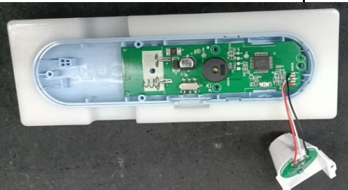</td><td rowspan=1 colspan=1>要求：外观无缺损、脏污等不良风险：性能不良</td></tr><tr><td rowspan=1 colspan=1>打螺钉</td><td rowspan=1 colspan=1></td><td rowspan=1 colspan=1>把上壳放到工装上按顺序打螺钉，螺钉打到位不能歪斜</td><td rowspan=2 colspan=1>螺钉规格：ST2.0×5.0-F-H电动螺丝刀扭力标准：1.6kgf.cm±0.21：各零部件需安装到位2：装配时PCB无损伤3：螺丝需紧固PCB4.：检验按键是否灵敏</td><td rowspan=2 colspan=1>要求：外观螺钉是否打到位、无缺损、脏污等不良风险：性能不良</td></tr><tr><td rowspan=1 colspan=3>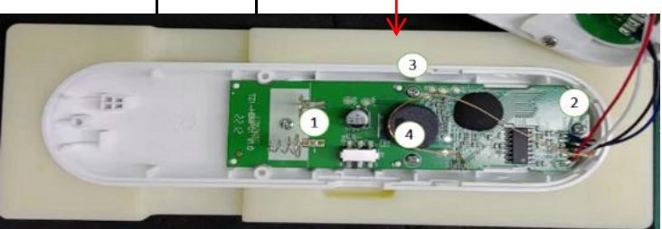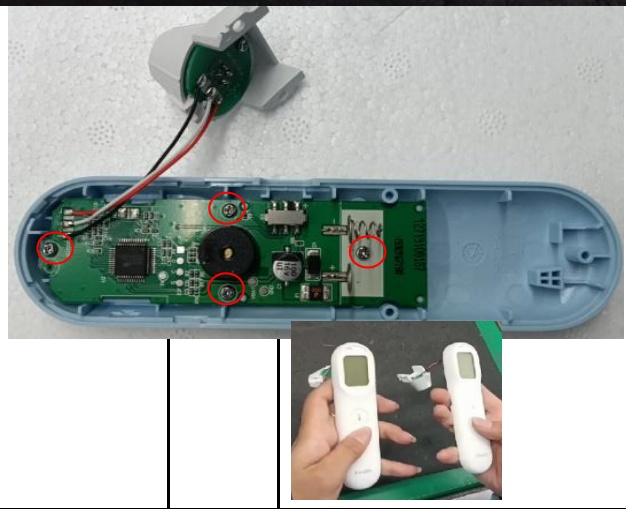</td></tr></table>

## PT9L操作作业指导书（标准）

编号：WI-PT9L-DY07

Type Page

Progress Name

工序名称

Ver.No

版本

Date

生效期

Prepared

准备

Checked

审核

Approved

批准

<table><tr><td rowspan=1 colspan=1>物料名称</td><td rowspan=1 colspan=1>工序描述</td><td rowspan=1 colspan=1>图象</td><td rowspan=1 colspan=1>操作</td><td rowspan=1 colspan=1>设备工具名称</td><td rowspan=1 colspan=1>人员装备要求</td><td rowspan=1 colspan=1>要求</td></tr><tr><td rowspan=1 colspan=1>双联弹簧（物料信息见制造令BOM)</td><td rowspan=1 colspan=1></td><td rowspan=1 colspan=1>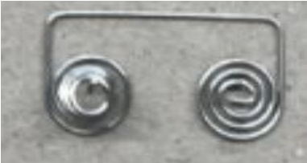</td><td rowspan=1 colspan=1></td><td rowspan=1 colspan=1></td><td rowspan=3 colspan=1>佩戴白手套、防静电手腕带</td><td rowspan=1 colspan=1>要求：外观无缺损、脏污等不良风险：性能不良</td></tr><tr><td rowspan=1 colspan=1>下盖（物料信息见制造令BOM)</td><td rowspan=1 colspan=1></td><td rowspan=1 colspan=2>8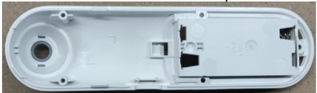</td><td rowspan=1 colspan=1></td><td rowspan=1 colspan=1>要求：外观无缺损、脏污等不良风险：外观不良</td></tr><tr><td rowspan=1 colspan=1></td><td rowspan=1 colspan=3>右手拿取1pcs双联弹簧，将装双                                               弹簧对准下盖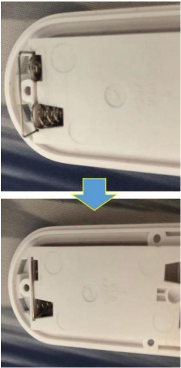电池仓一端联簧                                               的缺口装入，并装入到位，防止联簧脱落</td><td rowspan=1 colspan=1></td><td rowspan=1 colspan=1>要求：双联簧安装到位风险：性能不良</td></tr></table>

## PT9L操作作业指导书（标准）

编号：WI-PT9L-DY08

Type Page

Progress Name

部件名称 页码

工序名称

Ver.No

版本

Date

生效期

Prepared

准备

Checked

Approved

审核

批准

主机 1/1 下盖装传感器模块 1.0 2024.06.20

<table><tr><td rowspan=1 colspan=1>物料名称</td><td rowspan=1 colspan=1>工序描述</td><td rowspan=1 colspan=1>图象</td><td rowspan=1 colspan=1>操作</td><td rowspan=1 colspan=1>设备工具名称</td><td rowspan=1 colspan=1>人员装备要求</td><td rowspan=1 colspan=1>要求</td></tr><tr><td rowspan=1 colspan=1>装好双连簧的下壳</td><td rowspan=1 colspan=1></td><td></td><td></td><td></td><td rowspan=4 colspan=1>佩戴白手套、静电手腕带</td><td rowspan=1 colspan=1>要求：外观无缺损、脏污等不良风险：外观不良</td></tr><tr><td rowspan=1 colspan=1>打好螺钉的上壳</td><td rowspan=1 colspan=1></td><td></td><td></td><td></td><td rowspan=1 colspan=1>要求：外观无缺损、脏污等不良风险：性能不良</td></tr><tr><td rowspan=1 colspan=1>自攻螺钉（物料信息见制造令BOM)</td><td rowspan=1 colspan=1></td><td rowspan=1 colspan=1></td><td rowspan=1 colspan=1></td><td></td><td rowspan=1 colspan=1></td></tr><tr><td rowspan=1 colspan=4>先用气枪给下壳除尘，然后拿取探头安装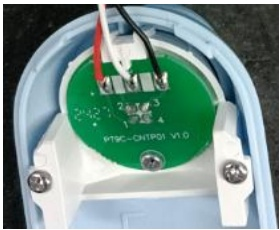               在后壳上，二颗螺钉依数字顺序固定探下盖装传感器                                                         头，螺钉规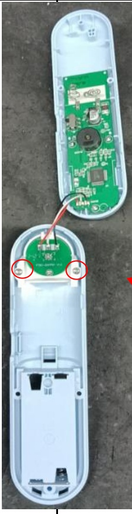模块                                         将下壳固           格：定在工装      ST2.0×5.0-上，使传           F-H感器     电动螺丝刀扭放到最底        力标准：端，不得     1.6kgf.cm±0歪斜，最           .2后用两颗螺钉固定</td><td></td><td rowspan=1 colspan=1>要求：组装到位、外观无缺损、脏污等不良风险：性能不良</td></tr></table>

## PT9L操作作业指导书（标准）

编号：WI-PT9L-DY09

Type Page

Progress Name

工序名称

Ver.No

版本

Date

生效期

Prepared

准备

Checked

审核

Approved

批准

安装档位键

<table><tr><td rowspan=1 colspan=1>物料名称</td><td rowspan=1 colspan=1>工序描述</td><td rowspan=1 colspan=1>图象</td><td rowspan=1 colspan=1>操作</td><td rowspan=1 colspan=1>设备工具名称</td><td rowspan=1 colspan=1>人员装备要求</td><td rowspan=1 colspan=1>要求</td></tr><tr><td rowspan=1 colspan=1>档位键（物料信息见制造令BOM)</td><td rowspan=1 colspan=1></td><td rowspan=1 colspan=1>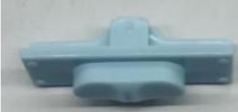</td><td rowspan=1 colspan=1></td><td></td><td></td><td rowspan=1 colspan=1>要求：外观无缺损、脏污等不良风险：外观不良</td></tr><tr><td rowspan=1 colspan=1>完整的上下壳</td><td rowspan=1 colspan=1></td><td rowspan=1 colspan=2>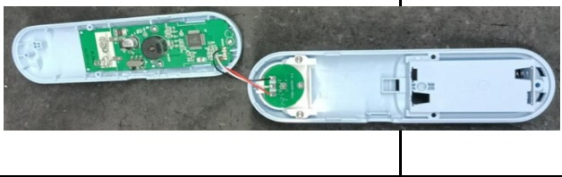</td><td></td><td></td><td rowspan=1 colspan=1>要求：外观无缺损、脏污等不良风险：外观不良</td></tr><tr><td></td><td></td><td></td><td></td><td></td><td></td><td rowspan=2 colspan=1>要求：外观无缺损、脏污等不良风险：性能不良</td></tr><tr><td rowspan=2 colspan=1>安装档位键</td><td></td><td></td><td></td><td></td><td></td></tr><tr><td></td><td></td><td></td><td></td><td></td><td rowspan=1 colspan=1>要求：组装到位、外观无缺损、脏污等不良风险：性能不良</td></tr></table>

## PT9L操作作业指导书（标准）

编号：WI-PT9L-DY10

Type Page

部件名称 页码

Progress Name

工序名称

Ver.No

版本

Date

生效期

Prepared

准备

Checked

审核

主机 1/1

<table><tr><td>物料名称</td><td>工序 描述</td><td>图象</td><td>操作</td><td>设备工具名 称</td><td>人员装备要 求</td><td>要求</td></tr><tr><td>自攻螺钉 (物料信息 见制造令 BOM)</td><td></td><td></td><td></td><td></td><td></td><td></td></tr><tr><td>上下壳零部件 完整</td><td></td><td>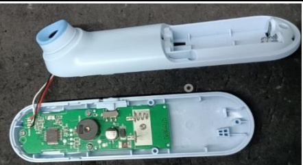</td><td></td><td></td><td></td><td>要求：外观无 缺损、脏污等 不良 风险：外观不 良</td></tr><tr><td></td><td colspan="6"></td></tr><tr><td>倾斜弯曲连接线</td><td></td><td></td><td colspan="2">连接线轻微 弯曲后先合</td><td>线 佩戴白手套、 静电手腕带</td><td>1：各零部件需 安装到位 2：不可折叠压</td></tr><tr><td></td><td colspan="3"></td><td rowspan="5">机头，再依 打螺钉工装 次合后面， 电动螺丝刀、 批头 避免错位，3</td><td rowspan="5"></td><td rowspan="5"></td></tr><tr><td colspan="6"></td></tr><tr><td rowspan="2"></td><td rowspan="2"></td><td>□</td><td rowspan="2">静电环 颗螺钉依数 字顺序固定 后壳，电动 螺丝刀扭力</td><td rowspan="2">要求：外观无 缺损、脏污等 不良，安装到 位</td></tr><tr><td>□ 标准： 迎</td></tr><tr><td></td><td></td><td>日</td><td>1.6kgf.cm± 0.2，检验 按键3次是否 回弹</td><td></td><td></td><td>风险：外观不 良</td></tr></table>

## PT9L操作作业指导书（标准）

编号：WI-PT9L-DY11

Type Page

Progress Name

工序名称

Ver.No

版本

Date

生效期

Prepared

准备

审核

透镜组装

<table><tr><td>物料名称</td><td>工序 描述</td><td>图象</td><td>操作</td><td>设备工具 名称</td><td>人员装备 要求</td><td>要求</td></tr><tr><td>透镜 （物料信息见 制造令BOM)</td><td></td><td>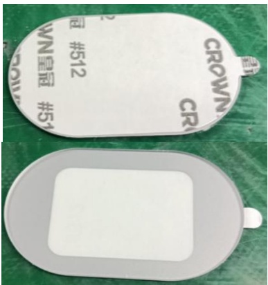 图示1</td><td></td><td rowspan="2">佩戴白手 套、静电 手腕带</td><td rowspan="2"></td><td rowspan="2">要求：外观无 缺损、脏污等 不良</td></tr><tr><td colspan="5">图示1 ? 8 8 日  去除屏幕异物，使用气枪除尘</td></tr><tr><td colspan="5">撕去离型纸 心</td><td colspan="2">要求：1：透镜 安装到位无脏 污 2：不可压膜 良</td></tr><tr><td colspan="5">aeah! N</td><td colspan="2">风险：性能不</td></tr><tr><td colspan="5">将液晶清理干 无异物、脏污后安装透镜 净，无灰尘脏</td><td colspan="3"></td></tr><tr><td colspan="4"></td><td colspan="3">污后撕下透镜 背胶，将透镜 粘贴在图示区 域</td></tr></table>

## PT9L操作作业指导书（标准）

编号：WI-PT9L-DY12

Type Page

部件名称 页码

Progress Name

工序名称

Ver.No

版本

Date

生效期

Prepared Checked Approved

准备

主机 1/1

CB2性能检查

2024.06.20

<table><tr><td rowspan=1 colspan=2>物料名称</td><td rowspan=1 colspan=2>工序描述</td><td rowspan=1 colspan=5>图象</td><td rowspan=1 colspan=1>操作</td><td rowspan=1 colspan=1>设备工具名称</td><td rowspan=1 colspan=1>人员装备要求</td><td rowspan=1 colspan=1>要求</td></tr><tr><td></td><td></td><td rowspan=1 colspan=2></td><td></td><td></td><td></td><td></td><td></td><td rowspan=6 colspan=1>1、（精密智能电源调至3V)上电后显示CB2，2s后进入休眠，此时检测休眠电流，应大于1uA且小于20uA;2、按下测量按键唤醒，屏幕全显，白色背光开启，蜂鸣器响，此时检测工作电流，应大於1mA且小于50mA；3、屏幕停止全显并出现静音符号时，把静音开关拨到静音侧，此时屏幕显示静音符号且蜂鸣器停止发声；把静音开关拨到发音侧，屏幕恢复全显，蜂鸣器响；4、按下测量按键，蜂鸣器响声停止，三色LED灯按照白橙红顺序点亮并循环，屏幕循环出现1，2，3数字；5、操作员观察三色LED灯，没问题的话按下设置按键保存，CB2完成；6、若自检未通过，屏幕显示</td><td rowspan=6 colspan=1>智能电流检测仪B080XXXXXX电池工装P03PXXXXXX</td><td rowspan=6 colspan=1>佩戴白手套</td><td rowspan=6 colspan=1>要求：关机漏电流:0.001mA≤I≤0.20mA工作电流(自检态）：1.000mA≤I≤50.00mA风险：外观不良</td></tr><tr><td></td><td rowspan=1 colspan=7>楼</td><td></td></tr><tr><td></td><td rowspan=1 colspan=5>PT9L</td><td rowspan=1 colspan=2></td><td></td></tr><tr><td></td><td rowspan=1 colspan=2>Step</td><td rowspan=1 colspan=2></td><td rowspan=1 colspan=1>CMin (mA)</td><td rowspan=1 colspan=1>CMax (mA)</td><td rowspan=1 colspan=1>S</td><td></td></tr><tr><td></td><td rowspan=1 colspan=2>KJ</td><td rowspan=1 colspan=2>3.000</td><td rowspan=1 colspan=1>0.001</td><td rowspan=1 colspan=1>0.020</td><td rowspan=1 colspan=1>5.00</td><td></td></tr><tr><td></td><td rowspan=1 colspan=2></td><td rowspan=1 colspan=2>3.000</td><td rowspan=1 colspan=1>1.000</td><td rowspan=1 colspan=1>50.000</td><td rowspan=1 colspan=1>3.00</td><td></td></tr></table>

## PT9L操作作业指导书（标准）

编号：WI-PT9L-DY13

Type Page

工序名称

Date

生效期

Prepared

准备

<table><tr><td rowspan=1 colspan=7>主机     1/1          下排静置          1.0      2024.06.20</td></tr><tr><td rowspan=1 colspan=1>物料名称</td><td rowspan=1 colspan=1>工序描述</td><td rowspan=1 colspan=1>图象</td><td rowspan=1 colspan=1>操作</td><td rowspan=1 colspan=1>设备工具名 人员装备要称</td><td rowspan=1 colspan=1>设备工具名 人员装备要求</td><td rowspan=1 colspan=1>要求</td></tr><tr><td rowspan=1 colspan=3>下排                       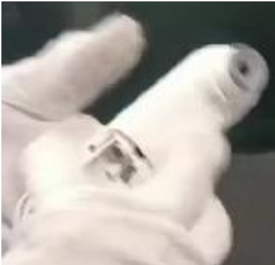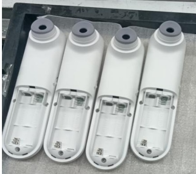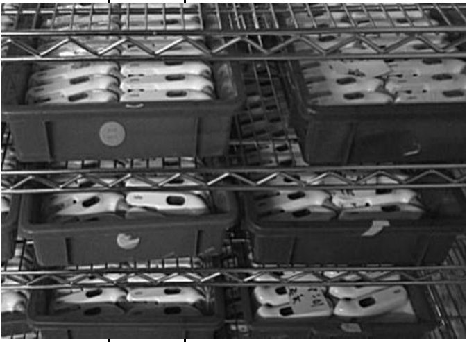</td><td rowspan=1 colspan=1>1.检查镜片是否有划伤、脏污、丝印不清，按键是否有卡死、手感差等不良2.检查产品侧面，是否有断差、批峰、缝隙过大等3.检查下壳是否有划伤，脏污，弹簧是否有漏装、装反装不到位，螺丝是否有漏锁、滑牙、未锁到位等，弹簧装不到位等不良4.检查传感器是否内有物、脏污等，如有脏污需用棉签清洁干净，并将产品放于耳边来回摇动2-3次，检查产品内是否有异物，异响等</td><td rowspan=1 colspan=1>1.酒精2.无尘布3.棉签4.手套</td><td rowspan=1 colspan=1>佩戴白手套</td><td rowspan=1 colspan=1>要求：1、外观无缺损、脏污等不良，摆放整齐；2、物料车顶层不得放置产品；风险：外观不良</td></tr></table>

# PT9L操作作业指导书（标准）

编号：WI-PT9L-DY14

Type

Page

Ver.No.

页码

部件名称

Date

版本

生效日期

Prepared

Checked

准备

Approved

审核

1/1

批准

主机

1.0 2024.06.20

<table><tr><td rowspan=1 colspan=1>检验项目</td><td rowspan=1 colspan=1>检验用具</td><td rowspan=1 colspan=2>检验方法</td><td rowspan=1 colspan=1>合格标准</td></tr><tr><td rowspan=1 colspan=1>常温标定</td><td rowspan=1 colspan=1>恒温室（环境温度23±2℃，湿度30-70%)2节7号电池高精度低温恆温槽（B067XXXXXX）水槽内水位上线不得超过水槽內刻度尺“0”的刻度位，下限不得低于“1”的刻度位）（温度需事先调整到30±0.02℃、45±0.02℃并每两小时校准一次）水银温度计（B04KXXXXXX)</td><td rowspan=1 colspan=1>机器标定前必须在25±1℃恒温室内静置时间≥2小时1、上电后，LCD显示“CB3”后显示全显，然后显示数值，数值标准范围：25±1℃，才可进行后序操作（如超过标准范围，须关机取下电池静置2小时后再次标定）一秒后显示“C30”，然后将体温计对准30度水槽按一下测量键，大约1秒后显示温度（温度值无需关注），校正成功则蜂鸣音响一下，屏幕显示“C45”，此时可进入下一步；若校正不成功则屏幕显示“ER3”；2、屏幕显示“C45”时，将体温计对准45度水槽按一下测量键，大约1秒后显示温度（温度值无需关注），校正成功则蜂鸣音响一下，屏幕显示“C45”；若校正不成功则屏幕显示“ER3”；在屏幕显示“C45”时连续按三次测量键，蜂鸣音响一下，屏幕熄灭，保存成功。</td><td rowspan=1 colspan=2>1.注意观察各过程液晶显示要正确，不许有乱码；也不允许有缺段、重影、显示图1   深浅不一致2.屏幕如检验要求显示且蜂鸣器声音正常图2图3              图4            图5             图6</td></tr></table>

# PT9L操作作业指导书（标准））

编号：WI-PT9L-DY15

Type

Page

页码

Ver.No.

部件名称

Date

版本

Prepared

生效日期

1/1

Checked

准备

主机

审核

<table><tr><td>检验项目</td><td>检验用具</td><td colspan="2">检验方法</td></tr><tr><td>低温标定37度</td><td>恒温室（环境温 度16±1℃,湿度 30-70%) 2节7号电池 高精度低温恆温 （B067XXXXXX) （水槽内水位上 线不得超过水槽 37度水槽按一下测量键，大 内刻度尺“0”的 约1秒后显示温度（温度值无</td><td>机器标定前必须在16±1℃恒 温室内静置时间≥2小时 1.上电后，LED显示“CB5” （图1）后显示数值，数值标 准范围：16±1，才可进行后 序操作（如超过标准范围， 须关机取下电池静置2小时后 再次标定），一秒后显示 C37368 “C37”，然后将体温计对准</td><td>C6S</td></tr></table>

<table><tr><td>合格标准</td></tr><tr><td>屏幕如检验要求显示 且蜂鸣器声音正常</td></tr></table>

# PT9L操作作业指导书（标准））

编号：WI-PT9L-DY16

Type

部件名称

Page

页码

Ver.No.

版本

Date

Prepared

1/1

生效日期

主机

1.0

Checked

准备

2024.06.20

审核

<table><tr><td>检验项目</td><td>检验用具</td><td colspan="2">检验方法</td></tr><tr><td>10℃、33℃、37℃ 、41℃精度测试</td><td>恒温室（环境 温度25±1℃， 内静置时间≥2小时 湿度30-70%) 2节7号电池 高精度低温恒</td><td>机器标定前必须在25±1℃恒温室 1.上电后，LCD显示“CB4”后显 示数值，数值标准范围： 25±1℃，才可进行后序操作（如 超过标准范围，须关机取下电池</td><td></td></tr><tr><td></td><td>温槽 静置2小时后再次标定“”，一秒 （B067XXXXXX ）（水槽内水 位上线不得超 过水槽内刻度 尺“0”的刻度 位，下限不得 低于“1”的刻</td><td>后显示“C10”，然后将体温计对 准10度水槽按一下测量键，大约1 秒后显示温度（温度值无需关 注），每显示一次温度值按一次 按键，屏幕显示“C33”，此时可 进入下一步；若校正不成功则屏</td><td></td></tr><tr><td>度位） 调整到</td><td>（温度需事先</td><td>幕显示“Er4”； 2.显示“C33”时，将体温计对准 33度水槽按一下测量键，大约1秒</td><td></td></tr><tr><td></td><td>33±0.02℃、 37±0.02℃、 41±0.02℃并 每两小时校准</td><td>后显示温度（温度值无需关 注），每显示一次温度值按一次 按键，屏幕显示“C37”，此时可 进入下一步；若校正不成功则屏</td><td>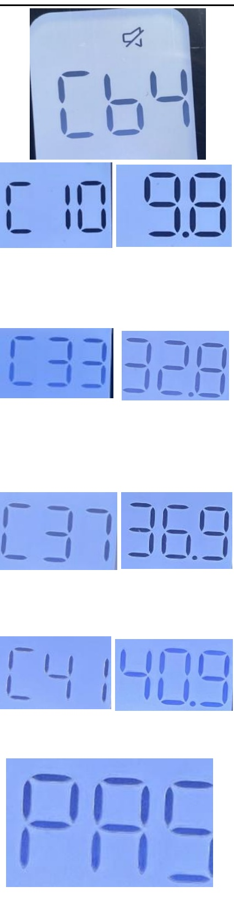</td></tr><tr><td></td><td>一次) 水银温度计</td><td>幕显示“Er4”； 2.显示“C37”时，将体温计对准</td><td></td></tr><tr><td></td><td>（B04KXXXXXX</td><td>37度水槽按一下测量键，大约1秒</td><td></td></tr><tr><td></td><td></td><td>后显示温度（温度值无需关</td><td></td></tr><tr><td></td><td></td><td>注），每显示一次温度值按一次</td><td></td></tr><tr><td></td><td></td><td>按键，屏幕显示“C41”，此时可 幕显示“Er4”；</td><td></td></tr><tr><td></td><td></td><td>进入下一步；若校正不成功则屏 3.显示“C41”时，将体温计对准</td><td></td></tr><tr><td></td><td></td><td>41度水槽按一下测量键，大约1秒</td><td></td></tr><tr><td></td><td></td><td></td><td></td></tr><tr><td></td><td></td><td>后显示温度（温度值无需关</td><td></td></tr><tr><td></td><td></td><td></td><td></td></tr><tr><td></td><td></td><td></td><td></td></tr><tr><td></td><td></td><td></td><td></td></tr><tr><td></td><td></td><td></td><td></td></tr><tr><td></td><td></td><td></td><td></td></tr><tr><td></td><td></td><td>注），每显示一次温度值按一次</td><td></td></tr><tr><td></td><td></td><td></td><td></td></tr><tr><td></td><td></td><td></td><td></td></tr><tr><td></td><td></td><td></td><td></td></tr><tr><td></td><td></td><td>按键，若校正不成功则屏幕显示</td><td></td></tr><tr><td></td><td></td><td></td><td></td></tr><tr><td></td><td></td><td></td><td></td></tr><tr><td></td><td></td><td></td><td></td></tr><tr><td></td><td></td><td></td><td></td></tr><tr><td></td><td></td><td></td><td></td></tr><tr><td></td><td>“Er4”;</td><td></td><td></td></tr><tr><td></td><td></td><td></td><td></td></tr><tr><td></td><td></td><td></td><td></td></tr><tr><td></td><td></td><td></td><td></td></tr><tr><td></td><td></td><td></td><td></td></tr><tr><td></td><td></td><td></td><td></td></tr><tr><td></td><td></td><td></td><td></td></tr><tr><td></td><td></td><td></td><td></td></tr><tr><td></td><td></td><td></td><td></td></tr><tr><td></td><td></td><td></td><td></td></tr><tr><td></td><td></td><td></td><td></td></tr><tr><td></td><td></td><td>4.测试成功41℃后，屏幕显示温</td><td></td></tr><tr><td></td><td></td><td></td><td></td></tr><tr><td></td><td></td><td></td><td></td></tr><tr><td></td><td></td><td></td><td></td></tr><tr><td></td><td></td><td></td><td></td></tr><tr><td></td><td></td><td></td><td></td></tr><tr><td></td><td></td><td></td><td></td></tr><tr><td></td><td></td><td></td><td></td></tr><tr><td></td><td></td><td></td><td></td></tr><tr><td></td><td></td><td></td><td></td></tr><tr><td></td><td></td><td></td><td></td></tr><tr><td></td><td></td><td>度值，每显示一次温度值按一次</td><td></td></tr><tr><td></td><td></td><td></td><td></td></tr><tr><td></td><td></td><td></td><td></td></tr><tr><td></td><td></td><td></td><td></td></tr><tr><td></td><td></td><td></td><td></td></tr><tr><td></td><td></td><td></td><td></td></tr><tr><td></td><td></td><td></td><td></td></tr><tr><td></td><td></td><td></td><td></td></tr><tr><td></td><td></td><td></td><td></td></tr><tr><td></td><td></td><td></td><td></td></tr><tr><td></td><td></td><td></td><td></td></tr><tr><td></td><td></td><td></td><td></td></tr><tr><td></td><td></td><td></td><td></td></tr><tr><td></td><td></td><td></td><td></td></tr><tr><td></td><td></td><td>按键，连续滚动三次，蜂鸣音响 下，屏幕显示“PAS”；</td><td></td></tr></table>

<table><tr><td>合格标准</td><td></td></tr><tr><td>屏幕如检验要求 显示且蜂鸣器声 音正常</td><td rowspan="3"></td></tr><tr><td></td></tr><tr><td></td></tr></table>

## PT9L操作作业指导书（标准）

编号：WI-PT9L-DY17

Ver.No.

Date

生效日期

Prepared

Checked

<table><tr><td rowspan=1 colspan=1>检验项目</td><td rowspan=1 colspan=1>检验用具</td><td rowspan=1 colspan=1>检验方法</td><td rowspan=1 colspan=1>合格标准</td></tr><tr><td rowspan=1 colspan=1>外观检验</td><td rowspan=1 colspan=1>塞尺B03QXXXXXX</td><td rowspan=1 colspan=1>．检查主机各部分丝印内容，丝印效果良好；2.用手指轻按按键检查按键手感；3.检查机器显示窗口部分；4.检查机器上规定的标签；5.检查机器外观配合尺寸OiHealth</td><td rowspan=1 colspan=1>1.整机型号、颜色与图纸和客户信息要求一致，表面外漏件规格、颜色与图纸和客户信息要求一致。2.按键组合后，按压中间部位，有行程，能复位，上电后有功能；按压四周任何部位能回弹，不卡(注：检验按键手感须用指腹，不可用指尖按压）。3.检查透镜和开始键是否有划伤、脏污、丝印不清，按键是否有卡死、手感差等不良4.检查产品侧面，是否有断差、批峰、缝隙过大等5.检查上下壳是否有划伤，脏污，弹簧是否有漏装、装反、装不到位，螺丝是否有漏锁、滑牙、未锁到位等，弹簧装不到位等不良6.检查传感器是否有脏污等，如有脏污需用棉签清洁干净，并将产品放于耳边来回摇动2-3次，检查产品内是否有异物，异响等7.色差要求：整机相同颜色的色差可接受的灰度等级为4级用泡棉或塑料袋把主机套好整齐的排放在</td></tr></table>